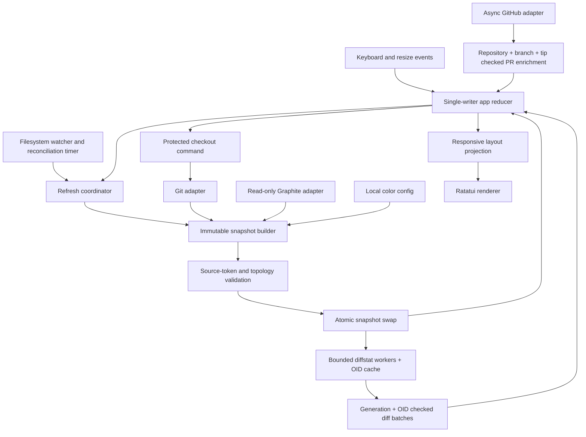
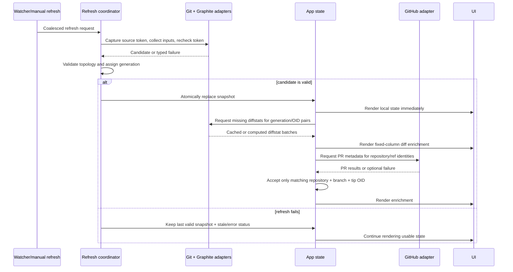
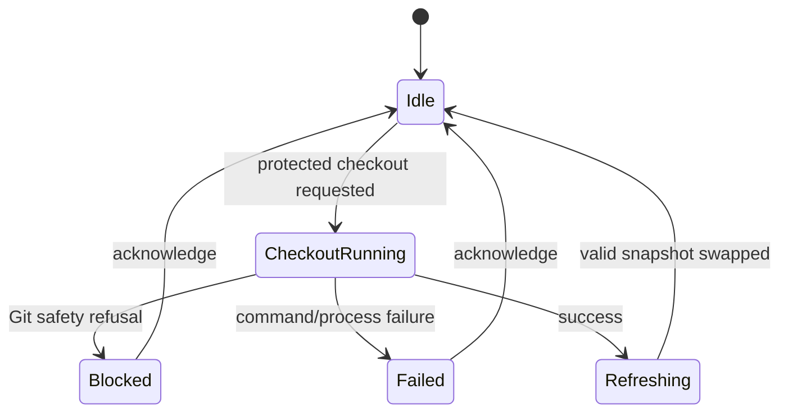
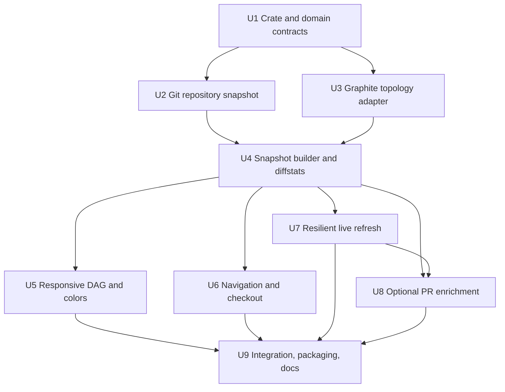
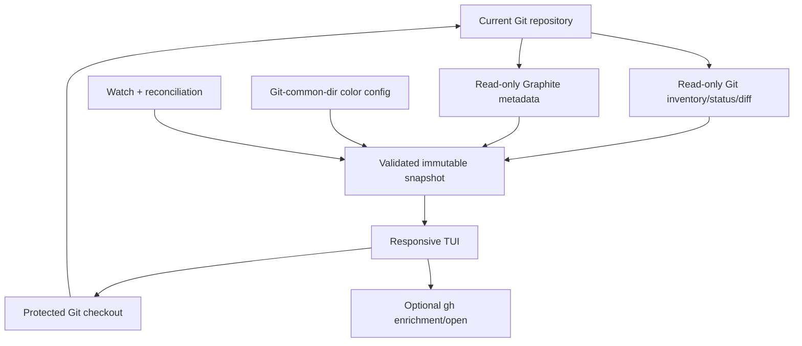

# feat: Add a local Graphite stack map TUI

**Target repo:** `branch-viewer`, a standalone repository under `dev/utils/branch-viewer`. All implementation paths in this plan are relative to that repository root. The provisional executable name remains `stackmap`.

## Overview

Build `stackmap`, a standalone Rust terminal UI that keeps the complete local branch topology visible without a pager. It should feel like Graphite's compact stack view, but remain open beside a terminal, assign a stable color to each top-level stack, show every local branch, and scale from a narrow split pane to a fullscreen terminal.

The first release is a local-first branch navigator. It combines authoritative Git refs and worktree state with Graphite's recorded parent relationships, computes each branch's incremental diff against its immediate parent, enriches branches with optional GitHub PR metadata, and permits only one mutation: a standard protected branch checkout.

---

## Problem Frame

The motivating repositories regularly carry multiple Graphite stacks with tens of local branches. `gt ls` expresses the correct stack abstraction but renders through a pager and is awkward as a persistent overview. General Git clients provide color but emphasize commit history rather than the relationship between pieces of local work. The missing tool is a compact, colorful, keyboard-first map of local Graphite stacks.

The primary user keeps the map open next to a terminal and needs to answer, at a glance:

- Which stacks and branches exist locally?
- How are Graphite-tracked branches related, including side branches?
- Which branch is current, selected, dirty, or occupied by another worktree?
- How large is each incremental branch change relative to its immediate parent?
- Which branch has an open pull request, and what is its title?
- Can the user move through branches and stack starts without losing context?

---

## Requirements Trace

- R1. Render every local branch exactly once in an internally scrollable, searchable Graphite-style DAG; never rely on terminal scrollback or silently omit branches because of viewport size.
- R2. Use validated Graphite parent metadata for tracked topology, including side branches; clearly separate untracked or unknown-parent branches instead of inventing authoritative edges.
- R3. Give each top-level stack a deterministic hue and allow a user override that persists locally without dirtying the repository.
- R4. Reserve a fixed diffstat field on every branch row. Its state is loading, numeric parent-relative insertions/deletions (green/red), or explicitly unavailable; numeric values may arrive after the structural tree without shifting rows.
- R5. Preserve a compact narrow layout and progressively add metadata in medium and fullscreen layouts without changing the selected branch or topology.
- R6. Support row navigation with arrow keys, top-level stack-start navigation with Shift-arrow plus fallback bindings, search, manual refresh, and standard protected branch checkout.
- R7. Refresh automatically after external Git or Graphite changes using atomic immutable snapshots; never expose half-written topology.
- R8. Optionally enrich matching branches with GitHub PR number and title in yellow without delaying or degrading local operation.
- R9. Mark current-worktree dirty state and branches checked out in other worktrees using non-color cues; preserve Git's normal protections and never stash, reset, clean, discard, or force automatically.
- R10. Remain responsive and legible with at least the repository's observed 30-branch stacks and be designed/tested for hundreds of branches.
- R11. Show when each branch was last edited, defined as the committer timestamp of its tip commit. Every row at supported widths has a fixed compact relative-time column; branch names truncate first. The wide detail view also exposes the exact local timestamp with UTC offset.

---

## Scope Boundaries

- No CI, review-decision, comment, merge-queue, or notification dashboard.
- No commit-level history browser or embedded patch/diff viewer.
- No branch creation, deletion, rename, restack, submit, merge, reset, stash, or cleanup actions.
- No worktree creation/removal in the MVP; existing worktree occupancy is visible because it affects checkout safety.
- No remote-only branches in the default model; the first release is explicitly a complete local-branch view.
- No write access to Graphite's private metadata database or cached PR files.
- No coupling to the Solana/Anchor Rust workspace under `packages/contract/`.
- No requirement to reproduce Graphite's proprietary extension UI pixel-for-pixel.

### Deferred to Follow-Up Work

- Temporary worktree creation and safe removal.
- Rich file-level diffstat or patch inspection.
- Remote-only branch toggle.
- Additional Graphite mutations such as restack or submit.
- Cross-repository launcher or native macOS wrapper.

---

## Context & Research

### Relevant Code and Patterns

- The target is a standalone developer-tool repository with its own Cargo root and lockfile; it must not join the FactMachine contract workspace.
- The source workspace currently uses Rust 1.88.0; the standalone repository should pin its own supported stable toolchain rather than inherit another repository's environment.
- `scripts/mobile-parallel-worktree.sh` models conservative Git behavior: inspect state, refuse unsafe changes, keep branches by default, and require explicit force for destructive operations.
- `.git/.graphite_repo_config` is JSON and records trunks. `.git/.graphite_metadata.db` is SQLite and currently exposes `branch_metadata(branch_name, parent_branch_name, ...)`. `.git/.graphite_pr_info` caches PR data. These are useful read-only inputs but are private Graphite formats and must sit behind replaceable adapters.
- Git remains authoritative for the complete branch inventory, current HEAD, branch tips, status, and worktree occupancy. Graphite metadata augments Git refs with parent relationships; it never replaces the Git inventory.

### Institutional Learnings

- `memory.md` records local Graphite stacks as large as 30 branches and multiple parallel worktrees, validating large-stack and worktree-occupancy scenarios.
- `memory.md` also records deliberately preserved empty/bypassed branches, side stacks needing restack, and local-only commits on closed PR branches. The model must not drop empty branches or infer deletion safety from PR state.
- Existing repository practice never auto-stashes or force-switches dirty work. Checkout failure must remain recoverable and leave repository state untouched.
- Repository guidance says installed `gt` help should be inspected rather than assuming flags. The implementation must not parse the human `gt ls` graph as its primary contract.
- No existing Rust TUI pattern exists in this repository; the tool is greenfield and warrants explicit adapter, model, event-loop, and rendering boundaries.

### External References

- Ratatui 0.30 provides responsive terminal layout/rendering and an in-memory `TestBackend` for deterministic renderer tests: <https://ratatui.rs/> and <https://docs.rs/ratatui/latest/ratatui/backend/struct.TestBackend.html>.
- Crossterm is Ratatui's default cross-platform terminal backend and supplies keyboard/modifier events.
- `notify` provides cross-platform filesystem notifications, but the design also requires periodic/manual reconciliation because Git uses packed refs, lock-renames, and worktree-specific Git directories: <https://docs.rs/notify/latest/notify/>.
- Git's structured plumbing provides parseable refs/worktree/status data; notably `git for-each-ref` exposes `worktreepath`, and porcelain status formats are stable for scripts: <https://git-scm.com/docs/git-for-each-ref> and <https://git-scm.com/docs/git-status>.
- GitHub CLI can return `number`, `title`, `url`, and `headRefName` as JSON, allowing optional background enrichment without custom authentication: <https://cli.github.com/manual/gh_pr_list>.

---

## Key Technical Decisions

| Decision | Rationale |
|---|---|
| Build a Rust TUI with Ratatui/Crossterm | The product is keyboard-first, should remain open beside a terminal, needs truecolor and responsive layouts, and benefits from a single distributable binary. C++ adds UI and packaging complexity without a useful performance advantage. |
| Keep `branch-viewer` as an independent Cargo root | Existing FactMachine Rust workspaces are contract-specific. Isolation avoids pulling terminal, SQLite, and watcher dependencies into Solana builds and allows the tool to serve other repositories. |
| Treat Git as authoritative and Graphite as topology enrichment | Git can enumerate every local ref and worktree even when Graphite is absent or broken. Only Graphite knows the intended parent relationships; neither source is sufficient alone. |
| Read Graphite metadata through a read-only, schema-validating adapter | `gt ls` has no structured output and parsing its ANSI graph is brittle. The private SQLite schema is cleaner but unstable, so access must be isolated, read-only, fixture-tested, and replaceable. |
| Do not infer unknown Graphite parents as authoritative | A visually plausible but false stack is worse than an explicit `Untracked / unknown parent` group. Optional inference can be added later with distinct labeling. |
| Build and validate immutable repository snapshots off-screen | Git/Graphite updates touch several files. Atomic snapshot replacement prevents transient half-topologies, selection loss, and renderer races. |
| Verify a source token around snapshot collection | Several Git reads plus SQLite can otherwise mix moments in time. Capture cheap HEAD/ref/Graphite identity before and after collection, discard or retry changed candidates, and retain the last valid snapshot after bounded retries. |
| Keep published state single-writer and refresh single-flight | The app reducer alone owns UI state. Workers emit typed results through bounded channels; one structural refresh runs at a time and coalesces additional triggers into at most one follow-up. “Atomic swap” means one reducer transaction, not lock-free shared memory. |
| Invoke Git/GitHub through argument-array subprocess adapters | This preserves installed-tool behavior, avoids shell interpolation, supports unusual branch names safely, and makes command outputs fixture-testable. Graphite is not required for branch checkout. |
| Persist color overrides under the Git common directory | A local config such as `.git/stackmap/config.toml` follows the repository across its worktrees without dirtying tracked files. Automatic colors derive from stable stack-root identity, not screen index. |
| Keep semantic and topology colors separate | Stack hues color connectors/branch identity; yellow is reserved for PR data; green/red are reserved for insertions/deletions. Selection/current/dirty/worktree states also use glyphs or attributes so meaning survives low-color terminals. |
| Separate structural and diffstat publication | Publish refs/topology/timestamps/worktree state immediately, then progressively fill cached or newly computed diffstats keyed by immutable object-ID pairs. Large cold repositories must not wait on every diff before becoming navigable. |
| Key GitHub enrichment by repository/ref identity | Use explicit remote identity plus branch name and tip OID instead of snapshot generation alone. Status-only refreshes retain valid PR results, while renamed or force-pushed branches reject stale results. |

---

## Open Questions

### Resolved During Planning

- **TUI or GUI:** TUI. The product is a persistent keyboard-first companion to a terminal and its compact graph does not need freeform GUI interaction.
- **Language:** Rust with Ratatui/Crossterm. Performance is not the only reason; ecosystem fit, safety, distribution, and testing are stronger reasons.
- **Repository scope:** One repository per process, launched from that repository.
- **Visible refs:** All local branches by default; remote-only refs are deferred.
- **Stack jump meaning:** Shift-arrow moves to the first visible node of the previous/next top-level stack in rendered order. `J`/`K` (or another documented pair validated during implementation) provide a terminal-compatible fallback.
- **Diff meaning:** A tracked branch compares its tip to its immediate validated Graphite parent tip; a top-level root compares to trunk. Unknown-parent branches show unavailable. Cumulative totals are separately computed base-to-tip, never summed from incremental rows.
- **Checkout safety:** Delegate to standard Git protections, serialize checkout actions, surface stderr, and never auto-stash or force.
- **GitHub scope:** PR number/title/link only. CI and review state are excluded.
- **Worktrees:** Display occupancy now; creation/removal later.
- **Last-edited meaning:** Use the branch tip commit's committer timestamp. Do not imply that this includes uncommitted work; current-worktree changes remain a separate dirty-state signal.

### Deferred to Implementation

- **Exact private Graphite schema compatibility range:** Inspect fixtures and schema metadata while implementing; unsupported schemas must degrade to an explicit topology-unavailable state.
- **Terminal modifier compatibility:** Validate Shift-arrow sequences in common macOS terminals and retain fallback keys regardless.
- **Minimum layout breakpoints:** Final column widths depend on real branch names and terminal rendering; keep the three-mode behavior fixed while tuning exact thresholds with renderer fixtures.
- **Final package/binary name:** `stackmap` is the working name and file-path assumption; rename before implementation if a registry/package collision is discovered.

---

## Output Structure

```text
├── Cargo.toml
├── Cargo.lock
├── rust-toolchain.toml
├── .gitignore
├── README.md
├── src/
│   ├── main.rs                 # process lifecycle and terminal restoration
│   ├── app.rs                  # state machine, commands, and event reduction
│   ├── config.rs               # local color overrides and preferences
│   ├── events.rs               # keyboard, watcher, timer, and async events
│   ├── model/
│   │   ├── mod.rs
│   │   ├── branch.rs           # immutable branch/stack snapshot types
│   │   └── topology.rs         # validation, stack grouping, rendered order
│   ├── adapters/
│   │   ├── mod.rs
│   │   ├── command.rs          # bounded subprocess abstraction
│   │   ├── git.rs              # refs, HEAD, status, worktrees, checkout
│   │   ├── graphite.rs         # read-only topology metadata provider
│   │   ├── github.rs           # optional gh JSON enrichment
│   │   └── platform.rs         # open URL and clipboard side effects
│   ├── refresh/
│   │   ├── mod.rs
│   │   ├── builder.rs          # atomic snapshot construction
│   │   ├── diffstats.rs        # bounded, cached progressive enrichment
│   │   └── watcher.rs          # debounce and reconciliation triggers
│   └── ui/
│       ├── mod.rs
│       ├── layout.rs           # narrow/medium/wide responsive projection
│       ├── tree.rs             # stable lane/connector renderer
│       ├── panels.rs           # headers, status, errors, help, palette
│       └── theme.rs            # stack hues and semantic colors
├── tests/
    ├── fixtures/
    │   ├── git/
    │   ├── graphite/
    │   └── github/
    ├── repository_snapshot.rs
    ├── topology_layout.rs
    ├── navigation_checkout.rs
    ├── refresh_pipeline.rs
    └── tui_rendering.rs
├── benches/
│   ├── fixture_builder.rs
│   └── responsiveness.rs
└── PLAN.md                     # this handoff plan after relocation
```

This tree is a scope declaration, not a rigid implementation specification. The implementing agent may consolidate very small modules while preserving the adapter/domain/event/UI boundaries and test surfaces.

---

## High-Level Technical Design

> *This illustrates the intended approach and is directional guidance for review, not implementation specification. The implementing agent should treat it as context, not code to reproduce.*

### Component architecture



### Refresh and enrichment sequence



The reducer owns separate immutable structural and enrichment state. Diffstat and PR batches never mutate a structural snapshot in place; they produce reducer updates accepted only when their structural generation and immutable branch/OID identities still match.

### Checkout state



### Responsive UI: narrow pane

Colors cannot be represented in Markdown, so labels describe the intended semantic palette. Each connector/node in one top-level stack shares its assigned hue; `+` is green, `−` is red, and PR text is yellow.

The minimum supported width is 40 columns. At and above that width, topology, a truncated branch name, compact last-edited time, and fixed diffstat field remain present on every row; branch names truncate first. Below 40 columns, show a `terminal too narrow (need 40 columns)` state instead of silently dropping required columns.

```text
┌ stackmap · staging ───────────────┐
│ repo: factmachine-monorepo  12/47 │
│                                   │
│ ● staging                         │
│ ├─● mobile/deposit… 18m  +82 −14  │  cyan stack
│ │ ├─● mobile/depos…  7m +191 −32  │
│ │ └─○ mobile/depos…  2h  +12  −4  │  side branch
│ │                                 │
│ ├─○ codex/batch-c…  3h  +64 −109 │  violet stack
│ │ └─▶ codex/batch-… 12m +220 −73  │  selected/current
│ │                                 │
│ └─○ monitor/retry   4d   …loading │  orange stack
│                                   │
│ Untracked / unknown parent        │
│   ○ scratch/experim…  9d      +? −? │
│                                   │
│ ↑↓ branch  ⇧↑⇧↓ stack  / search  │
│ Enter checkout  c color  r refresh│
└───────────────────────────────────┘
```

### Responsive UI: fullscreen

```text
┌ stackmap · factmachine-monorepo · trunk staging ───────────────────────────────┐
│ 47 local branches · 6 stacks · HEAD codex/batch-ui · dirty * · refreshed now │
├───────────────────────────────────────────────┬────────────────────────────────┤
│ STACK MAP                                     │ SELECTED BRANCH                │
│                                               │ codex/batch-ui                 │
│ ● staging                                     │ parent: codex/batch-core       │
│ ├─● mobile/deposit-base  18m  +82  −14  #3740 │ incremental: +220 −73 · 9 files│
│ │ ├─● mobile/deposit-ui   7m +191  −32  #3748 │ cumulative: +284 −182          │
│ │ └─○ mobile/deposit-fix  2h  +12   −4     —  │ worktree: current              │
│ │                                             │                                │
│ ├─○ codex/batch-core      3h  +64 −109  #3812 │ PR #3819                       │
│ │ └─▶ codex/batch-ui     12m +220  −73  #3819 │ Add multi-carousel batch UI    │
│ │                                             │                                │
│ └─○ monitor/retry         4d   +31   −8     —  │ stack color: violet            │
│                                               │ state: Graphite tracked        │
│                                               │ last edited: 2026-07-18 14:32 │
│                                               │              -0400            │
│ Untracked / unknown parent                    │                                │
│   ○ scratch/experiment              +?   −?   │                                │
├───────────────────────────────────────────────┴────────────────────────────────┤
│ ↑↓ navigate  ⇧↑⇧↓ stack  / filter  Enter checkout  o open PR  y copy  ? help │
└────────────────────────────────────────────────────────────────────────────────┘
```

### Navigation semantics

| Input | Behavior |
|---|---|
| `Up` / `Down` | Move through visible rows in deterministic rendered order and keep selection in view. |
| `Shift+Up` / `Shift+Down` | Jump to the first visible node of the previous/next top-level stack; fallback bindings provide equivalent behavior. |
| `/` | Filter by branch name. Keep each matching branch, its ancestor path, and its top-level stack root; dim contextual ancestors and omit nonmatching siblings. If selection is excluded, move to the first match and restore the prior selection when the filter clears if it still exists. |
| `Enter` | Request protected checkout of the selected local branch; disabled for invalid repository states and serialized while running. |
| `c` | Choose or clear the selected stack's local color override. |
| `r` | Force a full snapshot reconciliation. |
| `o` / `y` | Open or copy the selected branch's PR URL when present. |
| `?` | Show contextual help and current degraded-state explanations. |

### Loading, degraded, and command states

| State | Tree treatment | Status/detail treatment | Interaction |
|---|---|---|---|
| Initial structural load | Skeleton/header only until the first valid structural snapshot | `Reading local branches…` | Quit/help remain active |
| Diffstat loading | Fixed-width `…loading` placeholder; no row movement | Optional progress count | Navigation stays active |
| Diffstat unavailable | Fixed-width `+? −?` | Selected detail explains missing parent/object/error | Navigation stays active; refresh available |
| PR loading / none / unavailable | Blank fixed PR column while loading/none; `offline` only in selected detail when provider failed | Non-blocking yellow provider state | All local actions stay active |
| Refreshing | Continue showing last valid tree | Spinner plus last-refresh age | Navigation stays active; duplicate refreshes coalesce |
| Stale snapshot | Continue showing last valid tree | Persistent `stale` label with bounded error and retry hint | Navigation stays active; checkout revalidates live safety |
| Graphite unavailable | All local refs remain; affected branches move to `Untracked / topology unavailable` | Provider/schema capability shown | Git navigation/checkout stays active |
| Checkout running | Tree and selection remain fixed; Enter disabled | `Switching to <branch>…` | Navigation/filtering remain active; second checkout is blocked |
| Checkout blocked/failed | Tree, filter, scroll, and selection remain unchanged | Bounded error panel with exact stderr and acknowledgement key | Acknowledge returns focus to tree; no recovery mutation |

Relative time uses presentation-only clock ticks: `now` for less than one minute, `Xm` below one hour, `Xh` below 48 hours, and `Xd` thereafter. A tip timestamp materially in the future renders `clock?` and the exact detail timestamp. Tests inject a clock and cover bucket boundaries. Relative-time ticks never trigger repository reads or topology work.

---

## Implementation Units



- [x] U1. **Create the standalone crate and domain contracts**

**Goal:** Establish an isolated Rust binary, terminal lifecycle, command abstraction, and immutable domain types that all later adapters and views share.

**Requirements:** R1, R5, R9, R10

**Dependencies:** None

**Files:**
- Create: `Cargo.toml`
- Create: `Cargo.lock`
- Create: `rust-toolchain.toml`
- Create: `.gitignore`
- Create: `src/main.rs`
- Create: `src/app.rs`
- Create: `src/events.rs`
- Create: `src/model/mod.rs`
- Create: `src/model/branch.rs`
- Create: `src/adapters/mod.rs`
- Create: `src/adapters/command.rs`
- Test: `tests/repository_snapshot.rs`

**Approach:**
- Keep the crate independent of `packages/contract/Cargo.toml` and select dependencies narrowly: Ratatui/Crossterm, serialization/config support, SQLite access for the Graphite adapter, and filesystem notification support.
- Define immutable repository, branch, stack, worktree, diffstat, PR, selection, health/degraded-state, and snapshot-generation concepts before binding them to terminal widgets.
- Define typed adapter outcomes that distinguish optional-source absence from corrupted data and fatal Git repository failures.
- Centralize subprocess execution with explicit working directory, argument arrays, bounded output, and typed exit information; never invoke through a shell.
- Make the app reducer the sole owner of published UI state. Background repository, diffstat, and GitHub workers may only emit typed results through bounded delivery paths; renderers never call adapters.
- Guarantee terminal restoration on normal exit, error, panic, and supported termination signals.

**Execution note:** Implement domain validation and command-runner behavior test-first because all later units rely on these contracts.

**Patterns to follow:**
- Independent developer tooling under `tools/`.
- Integration-test organization in `packages/contract/program/tests/`, without inheriting contract-specific dependencies.

**Test scenarios:**
- Happy path: a valid immutable snapshot with multiple stacks and branches passes domain validation and preserves stable branch identities.
- Edge case: duplicate branch identities or a topology cycle is rejected as a typed validation failure rather than reaching the renderer.
- Error path: subprocess output exceeding configured bounds is truncated safely while retaining exit status and an actionable diagnostic.
- Error path: startup outside a Git repository reaches a recoverable explanatory screen and terminal state is restorable.

**Verification:**
- The binary can enter and leave alternate-screen mode without corrupting the calling terminal.
- Domain and adapter contracts compile independently of the contract workspace and make invalid topology unrepresentable or explicitly degraded.

---

- [x] U2. **Build the authoritative Git repository snapshot adapter**

**Goal:** Enumerate every local branch and the current repository/worktree state using stable Git plumbing outputs.

**Requirements:** R1, R6, R9, R10, R11

**Dependencies:** U1

**Files:**
- Create: `src/adapters/git.rs`
- Create: `tests/fixtures/git/README.md`
- Test: `tests/repository_snapshot.rs`

**Approach:**
- Resolve repository root, worktree Git directory, and common Git directory rather than assuming `.git` is a directory.
- Enumerate `refs/heads/*` with machine-readable Git formatting, including tip identity, tip committer timestamp, and worktree path where supported.
- Read current HEAD, detached/unborn state, stable porcelain dirty/conflict state for the current worktree, and all linked worktrees.
- Treat local branches as the complete inventory; later Graphite and GitHub adapters only annotate matching identities.
- Represent merge/rebase/cherry-pick-in-progress and bare/empty repository states explicitly so checkout can be disabled without disabling read-only inventory.

**Patterns to follow:**
- Conservative status/worktree inspection from `scripts/mobile-parallel-worktree.sh`.
- Git-documented porcelain and NUL-safe machine formats rather than localized human output.

**Test scenarios:**
- Happy path: a temporary repository with local branches, detached HEAD, and linked worktrees produces the expected complete inventory and occupancy markers.
- Edge case: branch names containing spaces, Unicode, leading punctuation, and slash-separated paths round-trip without shell interpretation.
- Edge case: branches with identical tip timestamps, old timestamps, and rewritten tips retain deterministic ordering and render the new tip time after refresh.
- Edge case: packed refs, `.git` pointer files, bare repositories, and unborn repositories produce correct typed states.
- Edge case: staged, unstaged, untracked, ignored, and conflicted files affect only the current-worktree dirty state, not committed branch diffstats.
- Error path: a branch disappears during enumeration; the adapter retries or reports a refreshable inconsistency without returning a partial authoritative snapshot.

**Verification:**
- Every local branch appears exactly once across normal checkout, linked worktree, detached, packed-ref, and empty-repository fixtures.
- No read path mutates refs, index, worktrees, or user configuration.

---

- [x] U3. **Add the read-only Graphite topology provider**

**Goal:** Recover intended tracked parent relationships and trunks without parsing `gt ls`, while degrading cleanly when private metadata is unavailable or incompatible.

**Requirements:** R2, R7, R9

**Dependencies:** U1

**Files:**
- Create: `src/adapters/graphite.rs`
- Create: `tests/fixtures/graphite/README.md`
- Create: `tests/fixtures/graphite/supported-schema.sql`
- Create: `tests/fixtures/graphite/invalid-topologies.json`
- Test: `tests/repository_snapshot.rs`

**Approach:**
- Discover Graphite files relative to Git's common directory, not the process working directory.
- Open `.graphite_metadata.db` read-only, validate required tables/columns, and project only branch/parent/state fields needed by the domain.
- Read trunk configuration independently and treat metadata rows as annotations joined onto Git's authoritative local refs.
- Validate missing/deleted parents, self-parenting, cycles, stale/renamed rows, duplicate relationships, and parents that are not local.
- Place unmatched local refs in `Untracked / unknown parent`. Quarantine the entire connected component containing an invalid edge, cycle, or missing local parent while retaining independent validated components; if trunk or schema trust fails, disable all Graphite edges.
- Read SQLite through a short read-only transaction/snapshot without migrations or write pragmas. Treat busy/schema-change results as retryable and account for WAL-backed concurrent Graphite updates.
- Never write, migrate, lock for mutation, or rely on undocumented cached PR data for correctness.

**Execution note:** Use fixture-based characterization for the installed Graphite 1.8.6 schema before generalizing compatibility behavior.

**Compatibility gate:** Treat U3 as a stop/go milestone before U4–U8. Validate the exact installed Graphite version/schema against linear, side, empty, bypassed, and restacked branches; verify read-only concurrent WAL behavior; capture sanitized fixtures and a schema fingerprint. If parent/trunk semantics cannot be proven, stop downstream topology work and revise the provider strategy rather than building the renderer around guesses.

**Patterns to follow:**
- Repository practice of inspecting installed `gt` behavior before assuming contracts.
- Adapter boundary recommended by local research because Graphite's SQLite format is private.

**Test scenarios:**
- Happy path: linear stacks, multiple top-level stacks, and a side branch reproduce exact recorded parentage.
- Edge case: an empty branch with the same tip as its parent remains a distinct visible branch.
- Edge case: stale rows, renamed/deleted parents, parent-only-remote refs, and branches needing restack remain visible without false edges.
- Error path: missing database, locked database, unsupported schema, malformed trunk JSON, and corrupt/cyclic relationships yield explicit degraded states while preserving Git inventory.
- Edge case: one invalid component and one independent valid stack quarantine only the invalid component; an untrusted trunk/schema disables all Graphite edges deterministically.
- Integration: a fixture derived from the installed schema joins Graphite records to local Git refs without exposing remote-only metadata rows as local branches.

**Verification:**
- Supported Graphite metadata renders exact intended parent relationships.
- Unsupported or corrupt metadata cannot crash the process, hide a local branch, or silently create inferred topology.

---

- [x] U4. **Compose validated snapshots and parent-relative diffstats**

**Goal:** Merge Git inventory, Graphite topology, worktree/status data, color identity, and committed diffstats into one deterministic immutable snapshot.

**Requirements:** R1, R2, R3, R4, R7, R9, R10

**Dependencies:** U2, U3

**Files:**
- Create: `src/model/topology.rs`
- Create: `src/config.rs`
- Create: `src/refresh/mod.rs`
- Create: `src/refresh/builder.rs`
- Create: `src/refresh/diffstats.rs`
- Modify: `src/adapters/git.rs`
- Test: `tests/repository_snapshot.rs`
- Test: `tests/topology_layout.rs`

**Approach:**
- Build candidate structural snapshots off-screen. Capture a composite topology/safety token covering HEAD/ref tips, linked-worktree registry, repository-operation state, and Graphite's transaction-derived topology fingerprint before/after collection; publish only if its safety-relevant identities remain coherent. Status remains advisory and Git is re-read at checkout time. Retry changed candidates within a bound; otherwise retain the last valid snapshot and mark it stale.
- Assign a monotonically increasing local snapshot generation and replace published state in one reducer transaction. Keep one structural build in flight and coalesce additional triggers into one pending follow-up.
- Group each validated top-level child of trunk as one stack. Use deterministic sibling/lane ordering based on recorded topology plus a documented stable fallback so unrelated stacks do not jump during refresh.
- Publish the structural tree before uncached diff work completes. Compute incremental two-tip Git diffs through a bounded worker pool and fill a fixed diffstat column with cached values, a loading state, or an unavailable state; never add uncommitted changes.
- Cache and deduplicate incremental results by `(parent_oid, child_oid)` rather than branch name, retain them across snapshot generations with bounded eviction, and invalidate only changed pairs/direct child pairs whose object identities changed.
- Compute optional cumulative stack-tip totals directly from the root base/trunk to the selected tip; never sum incremental rows because overlapping edits would overcount.
- Treat binary changes, renames, merges, missing objects, and shallow clones as partial diffstat states rather than snapshot-wide failures.
- Generate a stable automatic stack hue from repository identity plus stack-root identity. Store validated overrides under the Git common directory so all worktrees share them without creating tracked files.
- Persist color overrides with lock/merge-on-write semantics and atomic temp-file replacement. Preserve the last valid config after parse/truncation failure and safely reconcile concurrent writers from multiple worktrees.

**Test scenarios:**
- Happy path: three stacks with a side branch produce stable stack membership, deterministic order, unique branch rows, and repeatable automatic hues.
- Happy path: each known-parent branch's insertion/deletion count matches its immediate parent-to-child diff, while cumulative total matches direct base-to-tip diff.
- Edge case: overlapping edits across successive branches prove that cumulative totals are not sums of incremental counts.
- Edge case: renames, binary files, merge commits, empty branches, shallow/missing objects, and unknown parents produce documented counts or explicit unavailable markers.
- Edge case: branch insertion/deletion/reparenting preserves unaffected stack order, colors, and branch identity.
- Error path: invalid color values and reserved semantic hues are rejected/remapped without losing the prior valid configuration.
- Integration: the same Git common directory opened from two worktrees yields the same stack color overrides and different current-worktree dirty markers.
- Integration: concurrent processes assign colors to different roots without lost updates; interruption/truncation leaves the last valid config readable.
- Integration: refs mutate during multi-source collection; the mixed candidate is discarded and never reaches the renderer.
- Scale: unchanged object-ID pairs reuse cached diffstats across refresh with no duplicate Git work, while uncached computation never exceeds the configured small worker bound.

**Verification:**
- Snapshot building never publishes partial topology and always retains all Git-local refs.
- Incremental and cumulative values have distinct, documented semantics and match fixture repositories.

---

- [x] U5. **Render the responsive colored DAG**

**Goal:** Produce a stable, attractive Graphite-style branch tree that remains usable in narrow and fullscreen terminals and exposes every branch through its internal viewport.

**Requirements:** R1, R3, R4, R5, R9, R10, R11

**Dependencies:** U4

**Files:**
- Create: `src/ui/mod.rs`
- Create: `src/ui/layout.rs`
- Create: `src/ui/tree.rs`
- Create: `src/ui/panels.rs`
- Create: `src/ui/theme.rs`
- Test: `tests/topology_layout.rs`
- Test: `tests/tui_rendering.rs`

**Approach:**
- Separate deterministic graph-to-row/lane projection from Ratatui drawing so topology and navigation order can be tested without a terminal.
- Precompute rendered order, stack starts, lane assignments, and lookup indexes only when topology changes. Selection, PR enrichment, relative-time ticks, and dirty-state updates must not reconstruct topology.
- Assign stable side lanes and connector glyphs from validated parentage; keep sibling ordering stable across equivalent snapshots.
- Use three responsive projections: narrow retains topology/truncated name/fixed relative-time/fixed diffstat columns; medium adds PR number and files/commit metadata; wide adds a selected-branch detail pane, PR title, cumulative total, and exact last-edited timestamp with UTC offset.
- Keep the complete model regardless of height. Scroll internally, show selected/total position, and keep selection visible after navigation or resize; never auto-collapse or omit branches.
- Render only visible rows plus a small overscan region so frame cost scales with viewport size rather than total branch count.
- Apply stack hue only to topology/identity. Reserve yellow for PR metadata and green/red for diffstats. Use glyphs, bold/reverse attributes, and labels for current, selected, dirty, worktree, and degraded states.
- Detect color capability where practical and provide truecolor, indexed-color, and monochrome-safe rendering; honor `NO_COLOR` semantics for a non-color fallback.
- Define finite automatic truecolor and indexed palettes checked against representative light/dark backgrounds. Adjacent stacks should avoid duplicate automatic hues; manual duplicates remain allowed because connector continuity, labels, and selection glyphs repeat identity without color alone.

**Execution note:** Build renderer snapshots with Ratatui's in-memory backend before tuning against a live terminal.

**Patterns to follow:**
- The narrow and fullscreen sketches in this plan are behavioral references, not pixel specifications.
- Ratatui immediate-mode rendering with pure layout projection and `TestBackend` assertions.

**Test scenarios:**
- Happy path: linear, multi-stack, and side-branch graphs render the expected connector relationships and semantic text fields.
- Happy path: resizing narrow → medium → wide keeps the same branch selected and progressively reveals metadata.
- Edge case: very long/Unicode branch names, terminal widths below the normal breakpoint, zero-height content, and hundreds of branches remain navigable without panic.
- Edge case: relative times cross minute/hour/day boundaries on timer ticks without rebuilding repository topology or moving selection.
- Edge case: exact relative-time buckets, future clock skew, and exact timestamp timezone formatting remain deterministic under an injected clock.
- Scale: navigation-only rendering with hundreds of modeled branches remains bounded by visible rows, and relative-time ticks perform no Git/Graphite reads or layout reconstruction.
- Edge case: 16-color, 256-color, truecolor, `NO_COLOR`, duplicate user hues, and light/dark terminal assumptions preserve non-color state cues.
- Edge case: inserting an unrelated branch does not reorder or recolor unaffected stacks.
- Edge case: truecolor/indexed palettes remain distinguishable on representative light/dark backgrounds, while manual adjacent duplicate hues preserve identity through non-color cues.
- Edge case: cold diffstat and each loading/degraded/checkout state use the fixed placeholders and interaction behavior defined in the state matrix.
- Error path: stale/degraded Graphite or GitHub states render concise non-blocking indicators while the last valid tree remains usable.

**Verification:**
- Golden buffers match the documented narrow/fullscreen information hierarchy.
- Every modeled branch is reachable through scrolling/search even when only a small subset fits onscreen.

---

- [x] U6. **Implement navigation, filtering, color assignment, and protected checkout**

**Goal:** Make the map an efficient keyboard navigator while strictly preserving standard Git safety behavior.

**Requirements:** R3, R6, R9

**Dependencies:** U4

**Files:**
- Modify: `src/app.rs`
- Modify: `src/events.rs`
- Modify: `src/config.rs`
- Modify: `src/adapters/git.rs`
- Test: `tests/navigation_checkout.rs`

**Approach:**
- Define navigation against deterministic rendered row order: arrows move one visible branch; Shift-arrows move to the first visible node of adjacent top-level stacks; fallback bindings cover terminals that do not report modifiers reliably.
- Preserve selection by stable branch identity across filtering, resize, and refresh. Filtering retains matching rows plus dimmed ancestor/root context; if the selected branch is excluded, move to the first match and restore the prior selection when the filter clears if it still exists. If a selected branch disappears, choose the nearest surviving visible neighbor deterministically.
- Provide incremental branch-name search while retaining the full underlying snapshot, omitting nonmatching siblings, preserving trustworthy connectors, and showing a clear zero-results state.
- Offer a constrained color palette with reset-to-automatic behavior; reject semantic green/red/yellow collisions or ensure topology tint cannot obscure reserved text colors.
- Implement checkout as an explicit serialized state machine. Use exact branch args and repository working directory, delegate safety to Git, retain selection/current snapshot until success, show actionable stderr, and force a reconciliation after success.
- Keep navigation/filtering active during checkout but disable further checkout requests. Running, blocked, and failed states use the status/detail behavior in the UI state matrix and preserve filter, scroll, and selection context.
- Re-read live Git safety state immediately before invoking checkout; cached dirty/worktree indicators are advisory and never replace Git's final protection.
- Disable checkout for the current branch, a branch occupied by another worktree, detached/unsafe repository operation states, or while another checkout is running; explanations must be visible rather than silent.

**Test scenarios:**
- Happy path: arrows traverse rendered rows and Shift-arrows/fallback keys traverse top-level stack starts in both directions.
- Edge case: branched stacks, first/last boundaries, active filters, branch deletion, and resize preserve deterministic selection behavior.
- Edge case: child-only and side-branch filters retain dimmed ancestor paths, exclude unrelated siblings, define stack jumps over visible roots, restore prior selection on clear, and show an explicit zero-match state.
- Happy path: a safe checkout succeeds, HEAD/current indicator updates after refresh, and selection remains on the checked-out branch.
- Happy path: a dirty worktree whose changes do not conflict with the target may switch if Git permits it; the tool does not add stricter invented policy.
- Error path: overwrite-blocked dirty checkout, target checked out elsewhere, vanished target, Git failure, and repeated Enter input perform no stash/reset/force and leave the original branch current.
- Edge case: navigation, filtering, and resize during a running checkout remain responsive; acknowledgement of a blocked/failed result returns to the unchanged tree context.
- Happy path: assigning, changing, and clearing a stack hue persists by stack-root identity and does not affect semantic PR/diff colors.

**Verification:**
- Keyboard navigation remains predictable across topology, filtering, and resize fixtures.
- Checkout behavior is observationally equivalent to protected Git switching and cannot initiate destructive cleanup.

---

- [x] U7. **Add resilient live Git and Graphite refresh**

**Goal:** Keep the local map current while external Git/Graphite commands run, without watcher storms or mixed snapshots disrupting input.

**Requirements:** R7, R10

**Dependencies:** U4

**Files:**
- Create: `src/refresh/watcher.rs`
- Modify: `src/refresh/mod.rs`
- Modify: `src/app.rs`
- Modify: `src/events.rs`
- Test: `tests/refresh_pipeline.rs`

**Approach:**
- Resolve and watch both worktree-specific and common Git paths, including HEAD, refs/packed refs, worktree metadata, status-relevant files, and Graphite metadata/config. Coalesce lock/rename bursts with a debounce.
- Include Graphite database replacement and WAL-related paths in watch/reconciliation coverage.
- Add manual refresh and low-frequency reconciliation because filesystem events can be dropped and packed refs may bypass naïve directory watches.
- Build complete candidates asynchronously and atomically swap only validated snapshots. Keep the last valid snapshot plus a visible stale/error state on refresh failure.
- Use latest-state-wins orchestration: at most one structural refresh, one pending follow-up flag, bounded/coalesced refresh/redraw/timer queues, and protected delivery for user input and checkout completion.

**Test scenarios:**
- Integration: external branch create, delete, rename, checkout, and Graphite restack bursts coalesce into one valid refresh without half-topology or selection loss.
- Edge case: packed-ref changes and dropped watcher events are repaired by manual/periodic reconciliation.
- Error path: candidate build fails midway; the last valid snapshot remains visible with a stale indicator.
- Scale: a watcher storm cannot create more than one active structural refresh and one pending follow-up; bounded queues do not starve user input or checkout completion.

**Verification:**
- Graphite/Git changes appear without restart and never expose an invalid intermediate graph.
- Local startup, rendering, navigation, and checkout remain responsive during refresh work.

---

- [x] U8. **Add optional GitHub PR enrichment and platform actions**

**Goal:** Attach PR number/title/link in yellow and support open/copy actions without making local startup, refresh, or shutdown depend on GitHub.

**Requirements:** R8, R10

**Dependencies:** U4, U7

**Files:**
- Create: `src/adapters/github.rs`
- Create: `src/adapters/platform.rs`
- Modify: `src/app.rs`
- Modify: `src/events.rs`
- Create: `tests/fixtures/github/pr-list.json`
- Test: `tests/github_enrichment.rs`

**Approach:**
- Capture a local request token containing normalized target remote identity plus each candidate branch name and tip OID before invoking GitHub.
- Run one repository-wide `gh` query with an explicit limit sized above the supported local-branch fixture and structured fields for PR number/title/URL/state, head ref/OID, and head repository owner/repository identity. If `gh pr list` cannot prove those identities for the supported hosting mode, use a bounded `gh api graphql` provider behind the same adapter.
- Parse results by GitHub head repository/ref identity and attach only when returned head identity/OID and the captured local token still match current state. Ambiguous fork/head-name matches degrade to no PR rather than guessing.
- Make missing/unauthenticated `gh`, offline/rate-limited responses, timeout, malformed JSON, and no match optional provider states. Use one in-flight request, bounded output, TTL cache, and batch reducer delivery.
- Route `o`/`y` through a platform adapter for open-URL and clipboard operations. Unsupported/headless/failure outcomes are nonfatal messages and are testable without launching external applications.

**Test scenarios:**
- Happy path: delayed GitHub results add yellow PR number/title to matching branches without blocking navigation or local rendering.
- Edge case: a dirty-status-only refresh retains a valid result, while a force-pushed tip, renamed/deleted branch, same-named fork PR, ambiguous remote, or stale response is rejected.
- Edge case: the adapter retrieves beyond GitHub CLI's default result cap or reports an explicit bounded-provider limitation; matching PRs are not silently lost at the default page size.
- Error path: missing/unauthenticated `gh`, offline host, timeout, rate limit, malformed JSON, multiple PRs, and no match leave local behavior intact.
- Integration: PR results for many branches apply in one batch; `o`/`y` enable only for a valid URL, and fake platform actions receive the exact URL/text without opening real applications.

**Verification:**
- PR enrichment is identity-safe for force pushes and forks and remains strictly optional.
- Browser/clipboard failures cannot affect branch inventory, navigation, or terminal restoration.

---

- [x] U9. **Integrate, package, document, and exercise scale scenarios**

**Goal:** Deliver a reproducible repository tool with clear setup, keybindings, degraded-state behavior, and end-to-end confidence at realistic branch counts.

**Requirements:** R1–R11

**Dependencies:** U5, U6, U7, U8

**Files:**
- Create: `README.md`
- Modify: `Cargo.toml`
- Create: `benches/fixture_builder.rs`
- Create: `benches/responsiveness.rs`
- Test: `tests/tui_rendering.rs`
- Test: `tests/refresh_pipeline.rs`
- Test: `tests/navigation_checkout.rs`
- Test: `tests/github_enrichment.rs`

**Approach:**
- Document supported Git/Graphite assumptions, private-metadata fallback behavior, local config location, keybindings, color semantics, and narrow/fullscreen modes.
- Keep `cargo run`/the built binary as the initial entry point; packaging beyond a release binary is follow-up work.
- Verify formatting, linting, unit/integration behavior, and release-mode build through the pinned standalone Rust toolchain.
- Exercise deterministic synthetic repositories covering 30-branch linear stacks, multiple side stacks, empty/bypassed branches, worktree occupancy, corrupt Graphite metadata, dirty checkout refusal, and hundreds of local branches.
- Record performance budgets as observable UX outcomes: prompt initial local render, responsive key handling, bounded refresh work, and no unbounded process output or event queues.
- Separate deterministic queue/concurrency/identity assertions into integration tests from opt-in release-mode benchmarks/soak checks for p95 latency, startup/shutdown, and memory behavior.

**Test scenarios:**
- End-to-end: launch in a three-stack repository with a side branch; all local branches appear once with correct parentage, colors, parent-relative diffstats, and current/selected markers.
- End-to-end: at the minimum supported width and above, every branch row shows a fixed relative last-edited value derived from its tip commit; the selected branch's wide detail pane shows the exact local timestamp and UTC offset; below minimum width the explicit too-narrow state appears.
- End-to-end: resize between narrow and fullscreen while navigating, filtering, recoloring, and receiving PR enrichment; selection and topology remain stable.
- End-to-end: create/restack branches externally, then attempt successful and blocked checkouts; refresh and error recovery match the documented state machine.
- Scale: a 30-branch linear stack and a repository with hundreds of branches remain internally scrollable/searchable with responsive input and no pager/scrollback dependency.
- Degraded integration: remove/corrupt Graphite metadata and disable GitHub access; every local branch remains visible and usable with clear unavailable annotations.

**Verification:**
- A fresh developer environment can build and launch `stackmap` through documented repository tooling.
- All feature-bearing units have automated coverage and the README matches actual keys, colors, fallbacks, and limitations.

---

## System-Wide Impact



- **Interaction graph:** The binary reads Git plumbing, private Graphite metadata, and a local color config; optional `gh` enrichment updates presentation; only protected checkout mutates Git state and always triggers a new snapshot.
- **Error propagation:** Adapter failures become typed degraded states. Fatal Git discovery errors show a repository lifecycle screen; optional Graphite/GitHub failures preserve the last valid/local-only view. Checkout errors surface bounded stderr and never trigger recovery mutations.
- **State lifecycle risks:** Watchers can observe lock-renames and intermediate states, and async PR results can arrive stale. Debounce, complete candidate builds, generation checks, and atomic swaps prevent partial or cross-generation state.
- **Resource lifecycle:** Every subprocess, watcher, timer, cache, and worker pool has bounded concurrency/queues and explicit shutdown ownership. Terminal exit never waits indefinitely for obsolete diffstat or GitHub work.
- **Invalidation graph:** Ref/topology identity drives structural projection; parent/child OIDs drive diffstat cache entries; selection drives only viewport/detail state; relative-time ticks drive presentation only; PR completion drives metadata only.
- **Backpressure:** Refresh, redraw, resize, and timer events coalesce. User input and checkout completion remain deliverable under watcher storms and slow background work.
- **Performance isolation:** Rendering and keyboard handling never execute Git, SQLite, Graphite, or GitHub work synchronously.
- **API surface parity:** This is a standalone developer tool and does not change application APIs. Its external contracts are its CLI launch behavior, keybindings, local config format, and supported Git/Graphite adapter behavior.
- **Integration coverage:** Temp-repository tests must cross Git refs, Graphite fixtures, snapshot construction, UI projection, refresh, and checkout; pure mocks alone cannot prove branch/worktree safety.
- **Unchanged invariants:** Existing Graphite/Git commands remain the source of truth for creating/restacking/submitting work. The tool never writes Graphite metadata, never deletes local work, never adds product dependencies, and never changes repository branch conventions.

---

## Risks & Dependencies

| Risk | Likelihood | Impact | Mitigation |
|---|---:|---:|---|
| Graphite changes its private SQLite schema | High over the tool's lifetime | High | Isolate a read-only provider, validate schema, maintain fixtures, fail visibly to untracked topology, and never hide Git refs. |
| Watcher sees intermediate or misses final Git state | Medium | High | Debounce/coalesce, rebuild complete candidates, atomically swap, keep last valid state, and provide periodic/manual reconciliation. |
| Parent-relative diffstats become expensive across many branches | Medium | Medium | Bound concurrency, cache by parent/child object IDs, invalidate by tip identity, avoid recomputation for unchanged pairs, and measure large fixtures. |
| Cold startup waits for hundreds of diff subprocesses | Medium | High | Publish the structural tree first, progressively enrich fixed diff columns, deduplicate pairs, and cap workers independently of branch count. |
| Terminal colors or Shift-arrow events vary | Medium | Medium | Provide indexed/monochrome cues and fallback stack-jump keys; keep semantic meaning out of color alone. |
| Checkout accidentally becomes more destructive than Git | Low | High | Expose only exact-branch protected switch, serialize it, never shell-interpolate, and never invoke stash/reset/clean/force paths. |
| GitHub calls hang, rate-limit, or return ambiguous PR matches | Medium | Low | Make enrichment optional/background, bound process lifetime/output, cache, prefer open exact-head matches, and discard stale generations. |
| Immediate-mode rendering or event storms scale with all branches | Medium | Medium | Precompute topology/indexes, virtualize visible rows, batch enrichment, and coalesce bounded latest-state event signals. |
| Long-lived refresh cycles grow queues or caches | Low | Medium | Use one active/one pending refresh, bounded LRU caches, generation cancellation/discard, and explicit worker shutdown. |
| Persistent colors become stale after rename/restack | Medium | Low | Key by repository + root identity, tolerate orphaned entries, offer reset/reassignment, and never let stale config affect topology correctness. |
| Tool is accidentally coupled into contract CI/workspaces | Low | Medium | Keep a standalone crate/lockfile under `tools/`, add only narrow developer-tool entry points, and document independent verification. |

### Dependencies / Prerequisites

- A stable Rust toolchain pinned by the standalone repository's `rust-toolchain.toml`.
- Git with structured ref/status/worktree plumbing used by the adapter.
- Graphite metadata is optional for exact stack topology; unsupported/missing metadata yields a complete but untracked local-branch view.
- GitHub CLI is optional for PR metadata and browser links.
- Terminal support for Unicode box drawing improves presentation; an ASCII-safe glyph set should remain possible if compatibility testing requires it.

---

## Alternative Approaches Considered

| Approach | Why not selected |
|---|---|
| Native macOS application | Better freeform graphics, but worse fit for a persistent pane beside the terminal, more packaging work, and unnecessary mouse/window complexity for a keyboard-first tree. |
| Cursor/VS Code extension | Convenient inside an editor but not editor-independent, harder to keep beside arbitrary terminals, and less natural as a single repo-scoped CLI companion. |
| C++ TUI | No useful performance advantage for Git-bound work and a much weaker high-level TUI/testing ecosystem than Rust/Ratatui. |
| Parse `gt ls` output | It has the desired shape but no documented structured format; ANSI/pager/human layout changes would create a brittle core contract. |
| Infer all stacks from Git ancestry | Git ancestry cannot represent Graphite's intended parent metadata reliably, especially for empty, rebased, or bypassed branches. Unknown relationships should be explicit. |
| Use libgit2 for all operations | It would diverge from installed Git behavior and increase the chance that checkout/status semantics differ from the user's normal workflow. Git subprocess plumbing is the safer first implementation. |

---

## Success Metrics

- All local refs in the authoritative Git inventory are reachable in the TUI, including repositories with hundreds of branches.
- A branch's displayed incremental diffstat matches its immediate validated parent-to-child Git diff; unknown-parent rows never show misleading values.
- Every committed branch row at supported widths exposes a last-edited value matching its tip commit's committer timestamp, with uncommitted state represented separately and exact time available in wide details.
- External Graphite branch creation/restacking becomes visible without restart and without invalid intermediate frames.
- Navigation and selection remain stable across refresh, resize, and delayed GitHub enrichment.
- Protected checkout never auto-stashes, forces, discards, or deletes work and accurately surfaces Git safety failures.
- The same tool remains useful with Graphite metadata missing and with `gh` unavailable.

### Performance Acceptance Criteria

- In a deterministic 500-local-branch fixture with at least 50 top-level stacks and side branches, the structural tree becomes visible and keyboard-navigable within 1 second on the supported development Mac without waiting for GitHub or all diffstats.
- Uncached diffstat concurrency never exceeds four workers (or a lower configured platform limit), and unchanged object-ID pairs require zero new diff subprocesses across refresh.
- Navigation and search handling remain below 50 ms p95 while uncached diffstats and a slow GitHub request are active.
- Navigation-only frames remain below 16 ms p95 at typical pane sizes and scale with visible rows, not total modeled branches.
- A burst of 1,000 filesystem events produces at most one active refresh and one pending follow-up; internal queues remain bounded.
- Only one repository-wide `gh` process is active, it times out within 3 seconds, and timeout does not delay input, local rendering, or shutdown.
- PR metadata for many branches applies in one batched state update and one coalesced redraw.
- Obsolete worker results never update current state, and memory does not grow continuously across 100 branch create/delete refresh generations.
- Shutdown restores the terminal within 1 second even while watcher debounce, diffstat workers, or GitHub enrichment are active.

---

## Phased Delivery

### Phase 1: Trustworthy local model

- U1–U4 establish the isolated crate, authoritative Git inventory, read-only Graphite topology, immutable snapshot, stable colors, and correct diff semantics.

### Phase 2: Usable persistent interface

- U5–U6 add the responsive DAG, internal viewport, navigation, filtering, color assignment, and protected checkout.

### Phase 3: Live and distributable tool

- U7 adds resilient local refresh; U8 adds independently degradable PR enrichment/platform actions; U9 integrates, benchmarks, packages, and documents the result.

---

## Documentation / Operational Notes

- `README.md` should include installation/launch, a screenshot or text capture of narrow and fullscreen layouts, every keybinding, color semantics, local config location, and degraded behavior when Graphite/`gh` is unavailable.
- Clearly state that Graphite metadata access is private/read-only and compatibility is best-effort; Git local refs always remain authoritative.
- Include a troubleshooting table for unsupported schema, missing GitHub auth, branch occupied by another worktree, blocked dirty checkout, and terminals that do not report Shift-arrow.
- Do not add telemetry, network calls beyond explicit `gh` usage, or background daemons.

---

## Sources & References

- Source-workspace observations used during planning: Rust 1.88.0, stacks of roughly 30 branches, parallel worktrees, and conservative Git operations that never auto-stash or force-switch. These are context, not dependencies of the standalone repository.
- Installed Graphite runtime inputs observed during planning: `.git/.graphite_repo_config`, `.git/.graphite_metadata.db`, and `.git/.graphite_pr_info`. Treat them as private, read-only, optional inputs rather than implementation files or stable APIs.
- Ratatui: <https://ratatui.rs/>
- Ratatui TestBackend: <https://docs.rs/ratatui/latest/ratatui/backend/struct.TestBackend.html>
- notify: <https://docs.rs/notify/latest/notify/>
- Git ref plumbing: <https://git-scm.com/docs/git-for-each-ref>
- Git stable status: <https://git-scm.com/docs/git-status>
- Git worktrees: <https://git-scm.com/docs/git-worktree>
- GitHub CLI PR JSON: <https://cli.github.com/manual/gh_pr_list>
