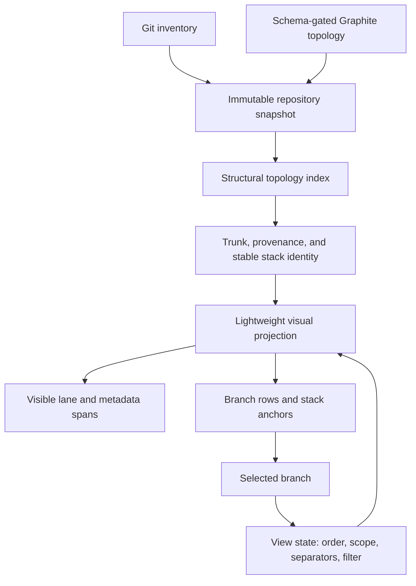
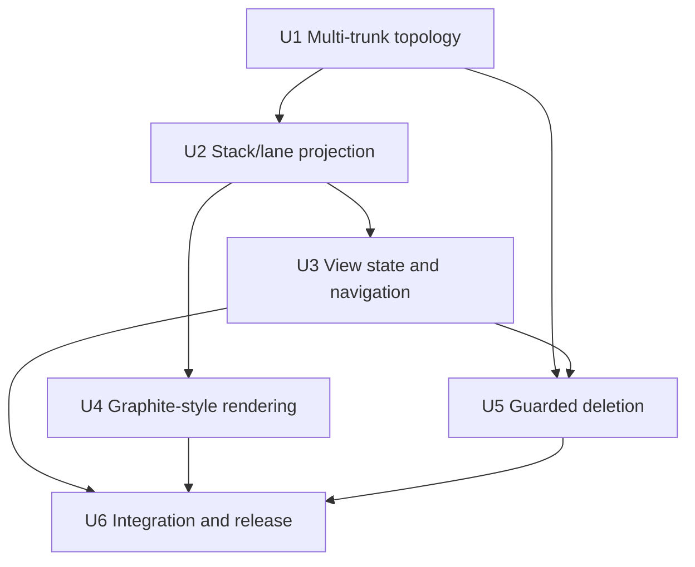
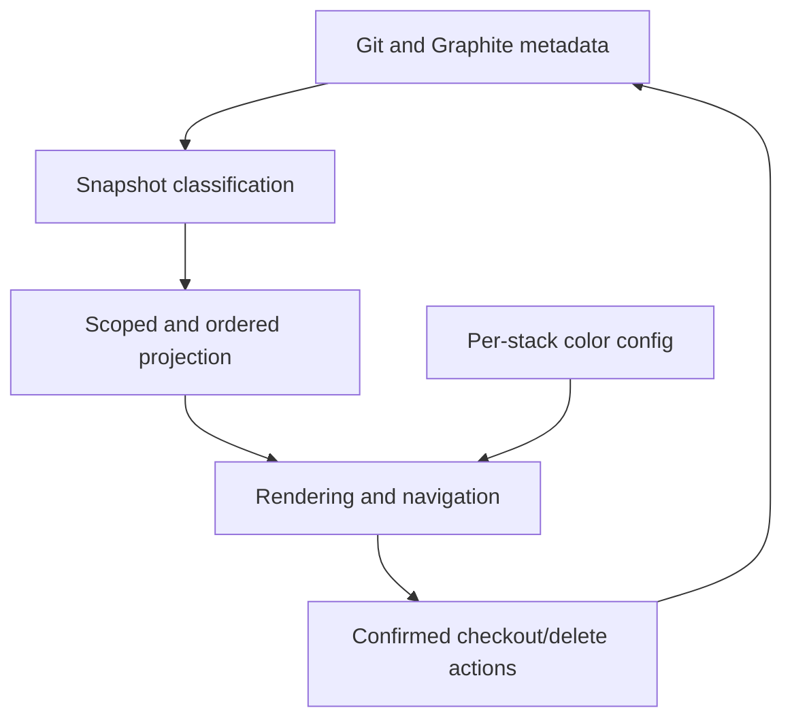

# feat: Add Graphite-style trunk and stack views

## Overview

Replace the prototype's depth-indented forest with a Graphite-style, trunk-aware stack map. Every configured trunk backed by a local ref receives its own bottom-up graph section, each linear stack keeps one fixed colored lane, and local branches whose ancestry reaches no configured local trunk remain visible in a final Untrunked section.

The TUI gains live view controls instead of startup-only flags: `t` toggles chronological stack ordering, `h` isolates the selected stack, `H` isolates the selected trunk, `s` toggles stack separators, and `c` changes only the selected stack's color. Shift-arrow and `J/K` navigation target visible stack heads. The pass also fixes deletion diff coloring, moves worktree occupancy to a fixed right-side indicator, and adds guarded local branch deletion behind an explicit `x` then `y/n` confirmation flow.

### View controls

| Key | Default state | Result |
|---|---|---|
| `t` | Graphite order | Toggle oldest-to-newest stack-group ordering, with the newest group closest to its trunk |
| `h` | All branches | Toggle the selected branch's complete stack plus its trunk |
| `H` | All trunks | Toggle every stack belonging to the selected branch's trunk |
| `s` | Separators on | Toggle one blank divider row between adjacent stack groups |
| `c` | Automatic color | Cycle only the selected stack lane's persistent color override |
| `x` | No confirmation | Enter guarded deletion confirmation for the selected branch |

---

## Problem Frame

The current renderer exposes topology but presents every dependency level as another indentation step. Long stacks therefore become a staircase, names drift across the screen, trunks are detached from their stacks, and the singular-trunk adapter silently drops topology that belongs to additional configured Graphite trunks. Stack navigation is based on parentless DFS roots rather than the visible Graphite stack groups a user recognizes.

The desired model follows Graphite's short log: open circles for ordinary branches, a filled circle for the checked-out branch, fixed graph lanes, and a trunk row beneath its stacks. A first/downstack branch sits immediately above its trunk and each successive upstack branch appears above it. Multiple trunk graphs are separated, while untrunked local branches remain available at the bottom rather than being hidden or assigned invented ancestry.

---

## Requirements Trace

- R1. Read every configured local Graphite trunk, preserve configuration order, validate each recorded parent chain against any configured trunk, and degrade incompatible metadata without hiding local Git refs.
- R2. Render a separate bottom-up section for each configured local trunk: upstack tip highest, first/downstack branch directly above the trunk, and trunk at the section bottom. Missing configured trunk refs produce diagnostics but no empty selectable section.
- R3. Render one fixed graph lane per projected stack, with aligned branch labels, `○` ordinary nodes, `●`/`◉` current node, colored rails/connectors, and stable handling of forks.
- R4. Put invalid, unknown-parent, and otherwise untrunked local branches in an explicit final Untrunked section; every local branch must appear exactly once in the unfiltered All view.
- R5. Use Graphite's recorded child order by default when schema support is available, with a deterministic lexical fallback.
- R6. `t` toggles chronological stack-group ordering without violating any within- or cross-group dependency. Activity is the newest branch timestamp in the stack; among independent/sibling groups, oldest renders highest and most recently active renders closest to its trunk.
- R7. `h` toggles the selected branch's stable linear stack plus its complete ancestor path to the trunk, excluding sibling and alternate descendant lanes. `H` toggles every stack in the selected branch's trunk and hides other trunk sections and Untrunked. View scopes are projection-only and compose with filtering, refresh, ordering, and separators.
- R8. Stack separators are enabled at startup. `s` removes or restores exactly one blank visual row between adjacent stack groups without changing selection or navigation anchors.
- R9. Shift+Up/`K` selects the nearest visible stack head geometrically above the current visual position; Shift+Down/`J` selects the nearest head below. They skip trunks, headers, and separators and no-op at outer boundaries.
- R10. `c` persists an override under only the selected stable stack ID, including side stacks under the same trunk; a finite palette cycle returns to `Auto`.
- R11. Render diff additions in green and deletions in red as independent spans; loading and unavailable states remain neutral.
- R12. Render `WT` in a fixed right-side column for every branch checked out in a worktree. Keep current state on the graph node and expose the exact worktree path in wide detail.
- R13. `x` enters an exact-target deletion confirmation. Only `y` confirms, `n` or `Esc` cancels, and Ctrl-C still quits. Deletion must revalidate live state, never delete a current branch, configured trunk, worktree-owned branch, stale target, unsafe repository state, or use a force/cascade path.
- R14. Preserve 40-column support, non-wrapping rows, complete search behavior, immutable snapshots, bounded queues/caches/processes, responsive refresh, and the established memory/performance baseline.

---

## Scope Boundaries

- Do not add `--recent` or `--current` in this pass; `t`, `h`, and `H` provide faster contextual control inside the persistent TUI.
- Do not infer a trunk or parent edge when Graphite metadata is missing, invalid, or incompatible.
- Do not hide untrunked local branches from the All view.
- Do not delete configured trunks, the current branch, worktree-owned branches, remote branches, or pull requests.
- Do not add force deletion, cascading upstack/downstack deletion, automatic PR closure, remote deletion, stash, reset, clean, or restack controls. Graphite-tracked deletion is limited to a freshly revalidated leaf branch so it cannot intentionally restack children.
- Do not write Graphite's private SQLite/config formats directly. A tracked deletion may use a characterized Graphite CLI contract; topology discovery remains schema-gated and read-only.
- Do not reproduce every Graphite animation or exact ANSI glyph choice; preserve the information architecture and lane semantics within Stackmap's responsive layout.

---

## Context & Research

### Relevant Code and Patterns

- `src/adapters/graphite.rs` currently reads the first singular trunk and validates every chain only against it. The real configuration supports ordered `trunks` entries, while `branch_metadata.children` supplies optional Graphite ordering.
- `src/refresh/builder.rs` strips trunk edges from visual parents and retains them only as diff parents, which causes detached tree roots.
- `src/model/topology.rs` emits alphabetical parent-first DFS rows with dependency depth; the projection contract must grow beyond a connector-string adjustment.
- `src/app.rs` keeps reducer-owned selection/filter/viewport state and already preserves immutable snapshots across structural and enriched refresh events. New modes belong in this reducer and must explicitly trigger reprojection.
- `src/events.rs` maps shifted arrows when Crossterm reports modifier state; direct key-event characterization is missing.
- `src/ui/tree.rs` currently applies one green style to a combined addition/deletion string and uses depth to move branch names right.
- `src/adapters/git.rs` revalidates live state immediately before checkout; deletion should follow the same exact-ref, exact-state safety pattern.
- `src/config.rs` already provides bounded locking and atomic persistence for stack colors.

### Institutional Learnings

- Git remains authoritative for local refs, OIDs, timestamps, and worktree ownership. Graphite is a replaceable topology provider and must degrade without suppressing Git-local truth.
- View modes filter an immutable snapshot; they do not remove data from refresh state.
- Queues, caches, worker counts, subprocess output, and subprocess lifetime are bounded. Projection/lane changes must not introduce rows-times-lanes storage or unbounded redraw work.
- The prototype currently passes 40 tests on pinned Rust 1.88.0, measures about 8.6 MB idle RSS, and projects 500 branches in about 0.24 ms per iteration. These are regression baselines, not absolute guarantees.
- The repository has no initial commit and all existing source files are untracked; execution must preserve them and avoid destructive Git cleanup.

### External References

- User-supplied Graphite reference output and a local read-only `gt log short --all` characterization establish lane, circle, trunk, and multi-trunk behavior.
- Local `gt delete --help` establishes that Graphite can delete one local branch and its metadata, restacks children by default, and has separate force/cascade flags. This plan therefore blocks non-leaf tracked deletion and never uses force/upstack/downstack/close flags.

---

## Key Technical Decisions

| Decision | Rationale |
|---|---|
| Model ordered trunks explicitly | A singular optional trunk cannot represent real `trunks[]` configuration or classify branch membership honestly. |
| Keep trunk membership, Graphite provenance, stable stack identity, and render-lane identity separate | Trunk sections, safe mutations, per-stack colors, and lane placement are different concepts and should not overload `stack_root`; ordering/filtering must never change a stack's persisted identity. |
| Split structural indexing from view projection | A snapshot-derived topology index is rebuilt only for structural input changes; `t/h/H/s` and search project in memory without reparsing Git/Graphite or cloning full topology maps. |
| Treat view controls as reducer-owned projection state | `t/h/H/s` should respond immediately without filesystem reads, subprocesses, or snapshot mutation. Scope is anchored to the branch that activated it and does not silently retarget when selection moves. |
| Use Graphite child order by default and dependency-constrained activity order for chronological mode | This provides a faithful default and a deterministic recency lens without placing a dependent group below the group it depends on. |
| Make visual entries distinct from selectable branch rows | Headers and divider rows must not corrupt scroll, selection, or stack-jump math. |
| Keep lane metadata linear in branches plus edges | A cloned full-lane vector per row would become quadratic for hundreds of stacks. |
| Key colors by stable stack ID | Side stacks under one trunk remain independently identifiable and configurable across filtering, reordering, refresh, and restart. |
| Use one repository-mutation state machine | Checkout, confirmation, and deletion must be mutually exclusive, and every attempted mutation ends with authoritative reconciliation before the slot is released. |
| Use guarded, non-force provider-specific deletion | Definitely untracked branches use a conservative merged-to-HEAD check plus atomic expected-OID ref deletion; freshly revalidated tracked leaves use only a characterized noninteractive Graphite command with no force/upstack/downstack/close flags. Unknown provenance and tracked non-leaves fail closed. |

---

## Open Questions

### Resolved During Planning

- Default versus chronological order: default follows Graphite; `t` enables chronological order and a second press restores the exact default order.
- Chronological direction: oldest stack groups are highest; the newest group is closest to the trunk.
- Stack direction: tips appear above roots; roots appear immediately above their trunk.
- Scope target: `h` and `H` derive from the selected branch. Pressing an already-active scope key restores All.
- Fork scope: `h` includes the selected stable linear stack and the unique ancestor path required to reach its trunk, but no sibling or alternate descendant lanes.
- `h` on a trunk: behave like `H`. `h` on Untrunked: isolate that connected untrunked component/singleton. `H` on Untrunked: leave the view unchanged with an explanation.
- Separator behavior: one blank label row only between adjacent stack groups, enabled by default; section boundaries remain visible.
- Worktree cue: `WT` appears for current and linked-worktree branches; the filled node distinguishes the current branch.
- Search precedence: while search is active, printable shortcut letters edit the query rather than trigger actions.
- Confirmation precedence: while deletion confirmation is active, only `y`, `n`, `Esc`, and Ctrl-C are actionable.
- Narrow lane overflow: use a width-capped deterministic lane window that always contains the selected branch's lane, with stable left/right overflow cues; preserve branch text and fixed metadata columns before offscreen rails.
- Mutation completion: command success/failure alone is not authoritative. Every started deletion triggers Git/Graphite rereads and is classified by observed postconditions before normal interaction resumes.
- Missing configured trunks: only trunks backed by local refs receive sections. A missing configured trunk is diagnosed; branches recorded toward it are Graphite-tracked-but-degraded and appear in Untrunked.
- Tracked deletion atomicity: Graphite's CLI has no expected-OID argument. Stackmap performs exact-name/OID/worktree/leaf preflight immediately before invocation and verifies afterward, but documents that this provider path cannot offer the untracked path's atomic old-OID guarantee.

### Resolved During Implementation

- Graphite CLI 1.8.6 was characterized in a disposable repository. Its noninteractive single-leaf delete removed the exact local ref and matching metadata while retaining the trunk; Stackmap still gates the command by help contract, performs a final live preflight, and blocks on unreadable or partial postconditions.

---

## High-Level Technical Design

> *This illustrates the intended approach and is directional guidance for review, not implementation specification. The implementing agent should treat it as context, not code to reproduce.*

The structural index contains validated parent/child edges, ordered trunks/children, Graphite provenance, stable stack IDs, branch indexes, and topology/activity inputs. It is replaced on structural snapshots and reused by enriched snapshots. The lightweight projection contains semantic branch entries plus nonselectable section/divider entries. It precomputes branch-to-visual-row and branch-to-selectable-index lookups, selectable-index-to-visual-row lookup, visible stack-head anchors, render-lane identity, trunk membership, and connector intervals. Rendering materializes spans only for visible rows.

---

## Implementation Units

- [x] U1. **Represent and validate all configured trunks**

**Goal:** Carry ordered multi-trunk topology and explicit branch-to-trunk classification from the Graphite adapter into immutable repository snapshots.

**Requirements:** R1, R4, R5, R14

**Dependencies:** None

**Files:**
- Modify: `src/adapters/graphite.rs`
- Modify: `src/model/branch.rs`
- Modify: `src/refresh/builder.rs`
- Modify: `tests/repository_snapshot.rs`
- Modify: `tests/common/mod.rs`

**Approach:**
- Parse and deduplicate ordered configured trunks, retaining the default trunk designation separately.
- Parse only characterized top-level configuration paths; do not recursively accept unrelated nested `trunk` keys. Stop ancestry traversal at the nearest configured trunk and retain the first occurrence of duplicate configured trunks.
- Capability-gate optional `children` ordering behind schema checks and tolerate malformed or absent ordering with a stable lexical fallback.
- Validate each complete parent chain against the set of configured local trunks; record the reached trunk on every validated branch.
- Preserve provider provenance independently from validated ancestry: definitely untracked, Graphite-tracked-and-valid, and Graphite-tracked-but-degraded/unknown.
- Keep invalid, cyclic, missing-parent, and missing-local-trunk components explicit as untrunked/degraded while retaining every Git-local branch.
- Preserve double-read consistency so Git and Graphite changes cannot publish a mixed snapshot.

**Execution note:** Extend fixtures first so singular-trunk behavior is characterized before changing the domain contract.

**Patterns to follow:**
- Read-only SQLite flags and schema checks in `src/adapters/graphite.rs`.
- Immutable snapshot construction and validation in `src/refresh/builder.rs` and `src/model/branch.rs`.

**Test scenarios:**
- Happy path: configuration with `staging` and `preview` produces two ordered local trunks and validates chains reaching either one.
- Happy path: default trunk is included and deduplicated when it also appears in `trunks[]`.
- Edge case: optional Graphite child order is retained when valid and lexical fallback is deterministic when missing or malformed.
- Error path: one configured trunk missing locally is diagnosed without hiding branches belonging to the remaining valid trunk.
- Error path: a missing configured trunk emits no empty/selectable section; branches recorded toward it retain degraded Graphite provenance and appear in Untrunked.
- Error path: cycle, missing parent, and chain reaching no configured trunk are classified Untrunked and remain present exactly once.
- Safety: quarantined Graphite-tracked branches remain distinguishable from definitely untracked branches for deletion eligibility.
- Integration: a metadata change between the two reads causes retry rather than publishing mixed trunk membership.

**Verification:**
- A snapshot can represent every configured trunk and classify every local branch as belonging to one trunk or Untrunked without invented edges.

- [x] U2. **Build compact bottom-up stack and lane projections**

**Goal:** Build a reusable structural topology index and replace depth-based preorder rows with lightweight deterministic trunk sections, fixed stack lanes, bottom-up branch order, and explicit visual entry types.

**Requirements:** R2, R3, R4, R5, R6, R8, R14

**Dependencies:** U1

**Files:**
- Modify: `src/model/topology.rs`
- Modify: `tests/topology_layout.rs`
- Modify: `benches/responsiveness.rs`

**Approach:**
- Build a structural index only when structural topology/order/activity inputs change; enriched diff/PR snapshots reuse it. Structural invalidation includes trunk order/membership, Graphite child order, parent edges, stable stack IDs, and timestamps used by chronological mode.
- Introduce semantic section, branch, and divider entries while keeping branch navigation indexes separate from visual row indexes.
- Define stable stack IDs during structural indexing, independent of filtering/order/lane column. A branch inherits its parent's stack through a linear chain; children at a fork receive deterministic new stack IDs. Render-lane columns remain projection-local.
- Store direct snapshot branch indexes plus branch-to-visual-row, branch-to-selectable-index, selectable-index-to-visual-row, and stack-ID-to-head-anchor lookups so navigation, footer position, and visible branch lookup do not scan the whole projection.
- Emit each stack child-before-parent so the tip is high and its root is nearest the trunk; emit each trunk as the bottom row of its section.
- Append Untrunked as the final section and ensure every visible local branch is emitted once.
- Use Graphite child order in default mode. In chronological mode preserve the stack-group dependency DAG first, then use each stack's maximum `committed_at` to order independent/sibling groups oldest-to-newest top-to-bottom, with default order and ID tie-breakers.
- Bound structural/projection storage to `O(B + E + S + T)`: one stable stack/lane identity per stack, connector events/intervals proportional to edges, at most one branch lookup entry per visible branch, at most `S - section_count` dividers, and no lane vector/bitset cloned per visual row.
- Apply scope membership before text filtering; filtering may retain required parent/trunk context but must not reintroduce hidden sections.

**Execution note:** Implement projection behavior test-first because every downstream renderer and navigation invariant depends on its ordering contract.

**Patterns to follow:**
- Deterministic ordering and context-only filtering in the existing `src/model/topology.rs`.
- Scale fixture and benchmark structure in `tests/topology_layout.rs` and `benches/responsiveness.rs`.

**Test scenarios:**
- Happy path: a linear stack renders tip, intermediate branches, root, then trunk from top to bottom.
- Happy path: two configured trunks produce two ordered sections and Untrunked is always last.
- Happy path: default Graphite child order is reversible after toggling chronological mode twice.
- Happy path: chronological mode places the oldest group highest and newest group closest to the trunk while preserving internal dependency order.
- Edge case: chronological ordering at a fork preserves every child-group-before-parent-group constraint and uses activity only among groups whose dependencies permit reordering.
- Edge case: a fork creates stable independent lane identities without duplicating the parent or moving branch labels.
- Edge case: exactly one divider entry exists between adjacent stacks when enabled and none exists inside a stack or between its root and trunk.
- Edge case: view scope plus a text filter retains only allowed matching branches and required context.
- Scale: 500- and 5,000-branch deep, wide-fork, multi-trunk, Untrunked, and lane-overflow fixtures demonstrate linear metadata growth without a rows-by-lanes allocation.

**Verification:**
- Projection invariants directly express screen order, stack anchors, sections, and lanes without renderer-specific topology reconstruction; measured entry/lookup/connector counts stay within the documented linear bounds.

- [x] U3. **Add live view modes, stack navigation, and per-stack color identity**

**Goal:** Make `t`, `h`, `H`, `s`, Shift-arrow, `J/K`, and `c` operate on the new semantic projection while preserving selection and viewport context.

**Requirements:** R6, R7, R8, R9, R10, R14

**Dependencies:** U2

**Files:**
- Modify: `src/events.rs`
- Modify: `src/app.rs`
- Modify: `src/config.rs`
- Modify: `tests/navigation_checkout.rs`
- Modify: `tests/refresh_pipeline.rs`

**Approach:**
- Add reducer-owned ordering, scope, and separator state; separators default on and other modes default to All/Graphite order.
- Anchor active stack/trunk scope to the branch that activated it, not subsequent selection. Re-resolve that anchor after every structural refresh so restacks follow the branch; if the anchor disappears, reset to All, show a notice, and prefer the current branch, then the nearest visible branch.
- Expose the persistent scope anchor in status text (`STACK: <id>` or `TRUNK: <id>`) so moving selection does not imply that the scope retargeted.
- Reproject on mode changes without filesystem reads or subprocesses. Preserve selection by branch ID when visible and use deterministic trunk/nearest-visible fallbacks otherwise.
- Jump through precomputed visible stack-head anchors, never raw visual row positions.
- Apply geometric jump semantics: Up/`K` chooses the nearest head above (including the current stack head when starting below it), Down/`J` chooses the nearest head below, and section boundaries are no-ops when no head exists in that direction.
- Convert shifted Crossterm arrow events explicitly and retain `J/K` as terminal-independent fallbacks.
- Apply color changes in memory immediately and persist under the selected stable stack ID through a bounded, coalesced one-flight background write; the finite palette ends in `Auto`. Show a transient stack/color result, distinguish persistence failure, and explain under `NO_COLOR` that the saved color is not currently visible. Explain no-op attempts on a trunk.
- Keep search and deletion-confirmation input precedence above normal shortcuts.
- Have reducer handling report whether state changed so boundary no-ops and unknown keys do not trigger redraw; each successful toggle causes one projection update and one draw.

**Execution note:** Start with key-event, mode-transition, and selection-preservation tests before replacing stack navigation.

**Patterns to follow:**
- Reducer-style `handle_key` and selection reconciliation in `src/app.rs`.
- Atomic color persistence in `src/config.rs`.

**Test scenarios:**
- Happy path: `t` reorders stack groups, preserves selected branch, and restores exact default order on the second press.
- Happy path: `h` isolates the selected stack plus trunk and toggles back to All; on a trunk it behaves like `H`.
- Edge case: `h` above or below a fork includes the selected linear stack plus its ancestor path to the trunk and excludes sibling/alternate descendant lanes.
- Happy path: `H` isolates every stack in the selected trunk and toggles back to All.
- Edge case: `h` isolates an Untrunked component; `H` on Untrunked leaves the view unchanged with an explanation.
- Happy path: `s` removes and restores divider rows without changing order, selection, or stack anchors.
- Happy path: Shift+Up/Down key events and `K/J` land on identical previous/next visible stack heads.
- Happy path: the footer names the active stack/trunk anchor and announces a reset to All if refresh removes it.
- Edge case: jumps from tip, middle, root, and trunk rows skip section/divider rows and no-op at boundaries.
- Edge case: filtering, chronological mode, separators, and either scope do not invalidate stack anchors.
- Integration: an external restack moves the scoped selected branch to its new stack/trunk after refresh; external deletion chooses the documented deterministic fallback.
- Happy path: `c` changes only the selected lane and persists across reorder, scope, refresh, and restart.

**Verification:**
- Every view key is instantaneous, deterministic, and selection-safe across refreshes and filters.

- [x] U4. **Render Graphite lanes, correct diff colors, and worktree metadata**

**Goal:** Match the reference Graphite information hierarchy while preserving responsive widths and Stackmap's metadata columns.

**Requirements:** R2, R3, R8, R11, R12, R14

**Dependencies:** U2, U3

**Files:**
- Modify: `src/ui/tree.rs`
- Modify: `src/ui/panels.rs`
- Modify: `src/ui/layout.rs`
- Modify: `src/ui/theme.rs`
- Modify: `tests/tui_rendering.rs`

**Approach:**
- Draw colored fixed lanes/connectors in a graph gutter, open branch circles, and a filled current node while keeping all branch labels on one shared text column.
- Render section identity and divider entries without making them selectable. A divider is a spacer row: label/metadata cells are empty, while only topology rails that genuinely cross the boundary continue through the gutter.
- Split ready diffstats into separately styled green insertion and red deletion spans.
- Replace the left-side other-worktree diamond with a fixed right-side `WT` field for any branch with a worktree path; retain exact path in wide detail.
- Show active order/scope-anchor/separator state in footer text and retain a compact `? help` affordance at narrow widths. The existing `?` overlay lists lowercase/uppercase bindings, defaults, and active state; while open, normal shortcuts are suppressed except close/navigation.
- Use a width-capped deterministic lane window that always includes the selected lane and exposes stable left/right overflow cues. Responsive priority is: selected node/lane and `WT`, a useful minimum truncated branch name, then progressively compact time/diff forms; optional rails/metadata yield before branch identity. The selected branch's full name remains available in detail/status. Rows must not wrap at 40 columns.
- Render only viewport entries. Compute gutter width/text column once per frame and materialize no connector strings, lines, or colored-cell vectors for offscreen rows; work is bounded by visible rows times the width-capped gutter rather than total branch count.

**Execution note:** Add TestBackend glyph, column, and cell-style assertions before changing the renderer.

**Patterns to follow:**
- Width modes and fixed semantic columns in `src/ui/layout.rs` and `src/ui/tree.rs`.
- Deterministic stack hues in `src/ui/theme.rs`.

**Test scenarios:**
- Happy path: every ordinary branch has an open circle and the current branch has a filled circle in its assigned lane.
- Happy path: every branch label across deep and forked stacks begins at the same text column.
- Happy path: additions have green foreground cells and deletions have red foreground cells; loading/unavailable remain gray.
- Happy path: current and linked-worktree branches show `WT`; the current branch simultaneously retains its filled node.
- Happy path: wide detail displays the exact linked worktree path.
- Edge case: stack dividers, section boundaries, and mode indicators remain understandable with and without color.
- Edge case: a 40-column terminal windows overflowing lanes around the selected lane, shows stable overflow cues, preserves `WT`, time, and diff semantics, and never wraps a row.
- Edge case: width pressure preserves a useful branch-name budget and selected identity while time/diff fields compact deterministically; full selected name remains discoverable.
- Integration: scrolling across visual divider rows keeps the selected branch visible and branch position reporting correct.

**Verification:**
- The rendered output has stable Graphite lanes, aligned names, correct semantic colors, and legible worktree state at every supported width.

- [x] U5. **Add guarded local branch deletion**

**Goal:** Let the user delete an eligible selected local branch with an explicit `x` then `y/n` confirmation while preserving Git, Graphite, and worktree safety.

**Requirements:** R13, R14

**Dependencies:** U1, U3

**Files:**
- Modify: `src/adapters/git.rs`
- Modify: `src/adapters/command.rs`
- Modify: `src/app.rs`
- Modify: `src/main.rs`
- Modify: `src/ui/panels.rs`
- Modify: `tests/navigation_checkout.rs`
- Modify: `tests/repository_snapshot.rs`

**Approach:**
- Replace independent checkout/delete booleans with one repository-mutation state: idle, checkout running, deletion confirming with repository/branch/OID/provider/PR identity, or deletion running. Claim it before worker spawn and release it only after postcondition reconciliation.
- Capture the exact selected repository, branch ID, OID, provider provenance, leaf status, and optional PR number in confirmation; state that deletion is local-only and leaves any remote branch/PR open. Present it in a blocking wrapping panel that keeps the full target and `[y/n]` choices readable at 40 columns; preserve the target highlight behind it and refuse confirmation if the terminal is too short for the safety text. Ignore unrelated keys until `y`, `n`, `Esc`, or Ctrl-C resolves it.
- Refuse current branches, configured trunks, any worktree-owned branch, stale/replaced refs, unsafe repository states, and concurrent mutations before spawning work.
- Re-read authoritative live Git and Graphite state immediately before deletion and compare the captured OID, tracking provenance, trunk/child membership, worktree ownership, and repository operation state. Structural refresh cancels pending confirmation when any captured eligibility input changes.
- For definitely untracked branches, require the captured commit to be merged into current `HEAD`, then delete the full local ref through an atomic expected-old-OID ref transaction. If the ref advances/reappears, the transaction fails and preserves the new value. Never use force.
- For Graphite-tracked branches, require a freshly revalidated leaf and gate support on a disposable-repository characterization of the installed CLI version. Allowlist only an explicit working directory, noninteractive exact branch deletion, null stdin, and default hooks; prohibit force, upstack, downstack, and PR-close flags. An unmerged/open branch may be refused by Graphite without prompting. This provider path is exact by branch name but cannot be old-OID atomic; surface that limitation in safety documentation and rely on immediate preflight plus post-read detection.
- Fail closed for Graphite-tracked-but-degraded or unknown provenance and when the characterized CLI contract is unavailable; never silently fall back to raw Git.
- Extend the bounded command runner so one wall-clock deadline covers child execution, stdin, pipe draining, descendant cleanup, and post-exit readers.
- After every started deletion, regardless of exit/timeout/truncation status, request authoritative Git/Graphite reconciliation and classify observed postconditions as unchanged, fully deleted, or inconsistent/unknown. Never retry automatically; block further deletion and show recovery guidance for an inconsistent provider/ref state.

**Execution note:** Build the confirmation reducer and refusal tests before connecting any subprocess mutation.

**Patterns to follow:**
- Live checkout revalidation and exact branch arguments in `src/adapters/git.rs`.
- Bounded subprocess/process-group behavior in `src/adapters/command.rs`.
- One-flight checkout coordination in `src/main.rs` and `src/app.rs`.

**Test scenarios:**
- Happy path: `x` shows the exact target, `n` and `Esc` cancel without spawning a command, and `y` invokes one eligible deletion.
- Edge case: `y` PR-copy never fires during confirmation; Ctrl-C still quits.
- Safety: current branch, every configured trunk, every worktree-owned branch, unsafe repository state, tracked non-leaf, stale OID/provenance, missing ref, and already-running checkout/deletion are refused.
- Safety: command argument capture proves no force, upstack/downstack, remote, or PR-close flags can be emitted.
- Safety: merge, rebase, sequencer/cherry-pick, revert, bisect, detached, unborn, current/linked-worktree, and interrupted provider states fail conservatively according to the documented provider eligibility contract.
- Race: a synchronization barrier advances the target after preflight and proves atomic expected-OID deletion preserves the new ref; two concurrent claimants cannot both succeed.
- Happy path: a merged definitely-untracked branch passes the ancestry check, uses atomic expected-OID ref deletion, and refreshes afterward.
- Error path: an unmerged Git branch and an unknown/degraded Graphite branch are retained with an actionable safety error.
- Happy path: an eligible tracked leaf uses only the characterized safe Graphite command; its prompt discloses local-only/remote PR behavior and post-read confirms coherent metadata plus refs.
- Error path: missing/incompatible Graphite CLI disables tracked deletion without changing Git or metadata.
- Error path: a direct child exits while a descendant retains output pipes; the command deadline still returns and terminates the process group.
- Integration: success selects a deterministic nearby visible branch; ordinary refusal retains selection; ambiguous/partial failure refreshes and blocks further deletion with bounded recovery context.

**Verification:**
- No branch can disappear without exact-name confirmation and live safety revalidation; untracked deletion is expected-OID atomic, tracked leaf deletion uses only the characterized Graphite contract with its documented non-atomic provider limitation, and no path can force, delete up/downstack, close PRs, or touch remotes.

- [x] U6. **Integrate, document, benchmark, and reinstall the prototype**

**Goal:** Verify the complete interaction system against regression, scale, memory, and real-terminal behavior, then replace the installed binary.

**Requirements:** R1-R14

**Dependencies:** U3, U4, U5

**Files:**
- Modify: `README.md`
- Modify: `memory.md`
- Modify: `changelog.md`
- Modify: `benches/responsiveness.rs`
- Modify: `tests/topology_layout.rs`
- Modify: `tests/navigation_checkout.rs`
- Modify: `tests/tui_rendering.rs`

**Approach:**
- Document trunk sections, Untrunked behavior, bottom-up reading, every view key, color behavior, `WT`, and deletion protections.
- Verify all mode combinations against representative deep-linear, wide-fork, lane-overflow, multi-trunk, and Untrunked fixtures plus a live Graphite repository.
- Re-run formatting, strict linting, all tests/doctests, release build, separate structural-index/default/chronological/scope/separator/render benchmarks at 500 and 5,000 branches, idle RSS observation, and PTY terminal restoration/input smoke tests on pinned Rust 1.88.0.
- Confirm rapid refresh still publishes structure before enrichment and mode changes trigger no Git/SQLite/provider work.
- Complete and verify U1-U4 as a non-destructive milestone before connecting U5, so deletion-provider uncertainty cannot destabilize the visual/navigation implementation.
- Install the verified release over the existing `stackmap 0.0.0` binary and smoke-test the installed executable outside the source repository.
- Record new test counts and performance/memory measurements without claiming leak impossibility.
- Exercise thousands of view toggles, searches, resizes, and refreshes after warm-up; assert documented projection/index capacity bounds, prove replaced indexes/projections release old ownership, verify no toggle spawns workers/subprocesses, and use RSS plateau only as a secondary allocator-aware observation.
- Treat all in-memory 500-branch toggles completing comfortably inside one 16 ms frame on the test machine as a measured release budget rather than a timing-sensitive unit assertion.

**Patterns to follow:**
- Existing verification and operational documentation in `README.md`, `memory.md`, and `changelog.md`.
- Existing 500-branch benchmark and bounded-generation tests.

**Test scenarios:**
- Integration: a real two-trunk repository displays each trunk section, bottom-up stacks, and Untrunked exactly once.
- Integration: repeated `t/h/H/s/c`, filtering, navigation, refresh, and cancellation preserve selection and do not grow retained projection generations.
- Integration: actual shifted arrow escape sequences and `J/K` navigate the same stack anchors in a PTY.
- Integration: confirmed/cancelled deletion restores normal key handling and terminal state.
- Scale: 500 branches across many lanes and trunks keep every in-memory toggle within the measured interaction budget; 5,000 versus 500 growth exposes accidental quadratic behavior.
- Operational: the installed release starts from another Git worktree, responds to keys, refreshes, quits, and restores the terminal.

**Verification:**
- The pinned-toolchain release is clean, installed on `PATH`, and ready for hands-on testing with updated measurable baselines.

## Completion Record

- Completed all R1-R14 implementation units and the Tier 2 autofix review on 2026-07-19.
- Verification passed on Rust 1.88.0: formatting, strict all-target/all-feature Clippy, 78 tests plus doctests, offline release build, and responsiveness benchmark.
- Measured structural/projection work at about 0.15-0.19 ms per iteration for 500 branches and 1.41-1.93 ms for 5,000 branches, with approximately linear growth.
- The optimized binary is 3.3 MB; a representative large multi-trunk repository measured about 11.8 MB resident after startup.
- PTY smoke tests exercised `t`, `h`, `H`, `s`, `J/K`, help, color persistence, deletion cancellation, clean quit, and terminal restoration. The installed `/Users/matt/.cargo/bin/stackmap` passed a separate startup/quit smoke test.
- Graphite 1.8.6 leaf deletion was characterized only in a disposable `/tmp` repository; no user branch was deleted during validation.

---

## System-Wide Impact

- **Interaction graph:** Graphite parsing affects structural index invalidation and snapshot validation, which affect lane projection, selection/navigation, rendering, color identity, and guarded deletion eligibility.
- **Error propagation:** Provider/schema failures remain explicit degraded topology states; rendering continues from Git-local branches. Mutation errors remain bounded messages and never mutate view state as if successful.
- **State lifecycle risks:** Mode state must survive enriched snapshots; every structural snapshot must invalidate/rebuild all topology/order/activity inputs; structural refresh must re-resolve scope membership; visual rows and selectable branch rows must not drift; confirmation captures must be invalidated by OID/ref/provenance/worktree changes; checkout and deletion share one mutation slot until postcondition reconciliation.
- **API surface parity:** Help/footer, event conversion, reducer state, projection, renderer, config keys, deletion adapters, tests, benchmark fixtures, and installed documentation all change together.
- **Integration coverage:** Unit tests cannot prove terminal modifier decoding, live Graphite metadata consistency, subprocess safety, or installed-binary terminal restoration; U6 includes those cross-layer checks.
- **Unchanged invariants:** Git remains authoritative, all local refs remain in snapshots, checkout stays protected, Graphite discovery stays read-only, enrichment remains asynchronous, and resource bounds remain enforced.

---

## Risks & Dependencies

| Risk | Mitigation |
|---|---|
| Private Graphite config/SQLite formats change | Capability-gate trunks and child ordering, fixture-test the schema, and degrade to Untrunked/lexical behavior without hiding refs. |
| Fixed lanes consume narrow-terminal width | Use compact/capped gutter representation and preserve fixed semantic columns before optional decoration. |
| Visual divider/header rows break selection and scrolling | Keep semantic branch/navigation indexes separate from visual entry indexes and test every mode combination. |
| Lane representation becomes quadratic | Store compact lane identities and connector intervals; render only visible rows; benchmark multi-trunk 500-branch fixtures. |
| Structural invalidation omits a new topology/order input | Rebuild the topology index on every structural snapshot (or one explicit complete structural revision) while enriched snapshots remain projection-neutral. |
| Scope captures become stale after restack/refresh | Store branch-centered intent and re-resolve current membership on every structural snapshot. |
| Shift modifiers are intercepted or encoded differently by terminals | Test Crossterm key conversion and PTY escape sequences; retain `J/K` fallbacks prominently. |
| Tracked deletion races after preflight or would restack children | Refuse non-leaves, characterize/version-gate the noninteractive leaf command in a disposable repository, disclose that the provider lacks atomic old-OID deletion, prohibit force/upstack/downstack/close flags, and verify postconditions after every attempt. |
| A command reports failure after refs/metadata already changed | Always reconcile Git and Graphite after a started mutation, classify postconditions, never auto-retry, and block further deletion on inconsistent state. |
| Color persistence blocks the TUI on lock contention or disk sync | Apply in memory immediately and coalesce bounded background persistence; report failures without freezing navigation. |
| Unicode graph glyph widths differ by terminal/font | Use Ratatui cell widths and characterized single-cell glyphs, with a plain compact fallback when alignment cannot be preserved. |
| Confirmation conflicts with existing `y` copy action | Give confirmation state input precedence and test command non-emission on cancel. |
| New spans/projection metadata regress memory or redraw cost | Preserve bounded ownership, rerun generation-retention tests, benchmark projection modes, and remeasure idle RSS. |

---

## Documentation / Operational Notes

- Update the key table and in-app help for `t`, `h`, `H`, `s`, `c`, and `x`/`y`/`n`.
- Explain bottom-up stack reading, trunk-section order, Untrunked behavior, default versus chronological order, and view-toggle restoration.
- Explain that `WT` includes the current worktree and linked worktrees, with exact paths in wide detail.
- Document deletion as local-only, confirmed, non-force, and provider-dependent; Graphite-tracked deletion is leaf-only, cannot provide atomic old-OID deletion through the CLI, and may never delete up/downstack branches or touch remote branches/PRs.
- Healthy behavior: stable RSS during repeated toggles/refresh, unchanged worker/process bounds, immediate view changes, structure visible before diff enrichment, and normal terminal restoration.
- Failure signals: duplicated/missing branches, stale captured scope after restack, wrapped rows, growing retained generations/RSS, a lingering subprocess, or deletion without exact confirmation.

---

## Sources & References

- Existing prototype plan: `PLAN.md`
- Project state and constraints: `memory.md`
- Current behavior and controls: `README.md`
- Graphite adapter: `src/adapters/graphite.rs`
- Snapshot builder: `src/refresh/builder.rs`
- Projection model: `src/model/topology.rs`
- Reducer/navigation: `src/app.rs`
- Renderer: `src/ui/tree.rs`
- Repository tests: `tests/repository_snapshot.rs`
- Projection tests: `tests/topology_layout.rs`
- Interaction tests: `tests/navigation_checkout.rs`
- Rendering tests: `tests/tui_rendering.rs`
- Scale benchmark: `benches/responsiveness.rs`
