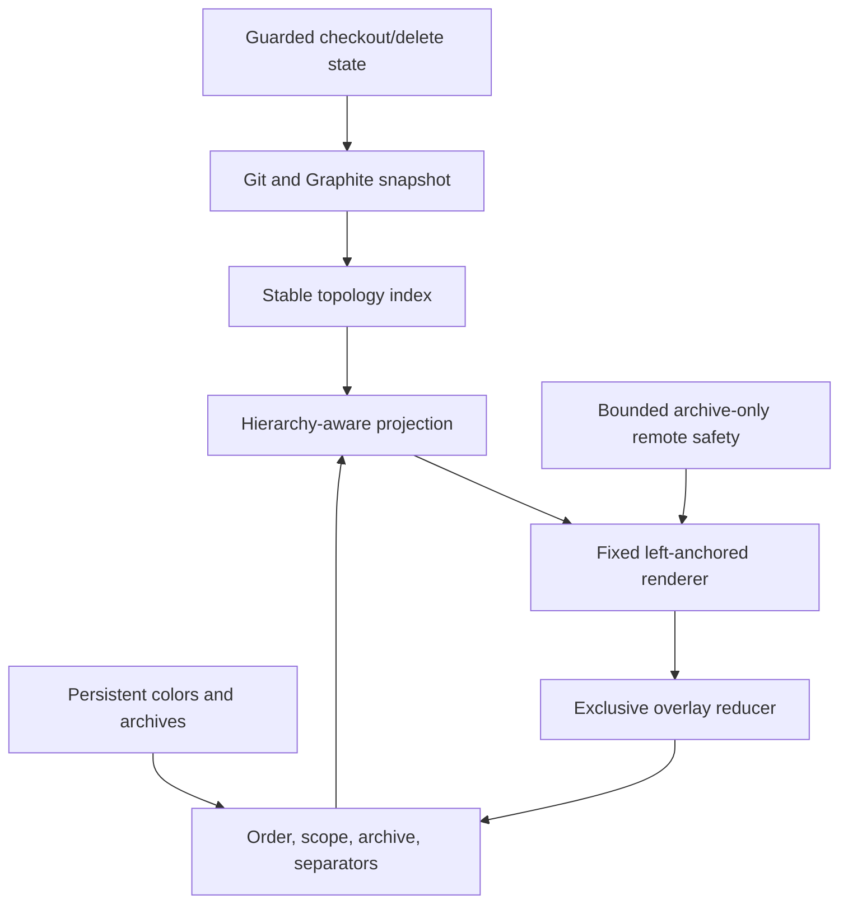
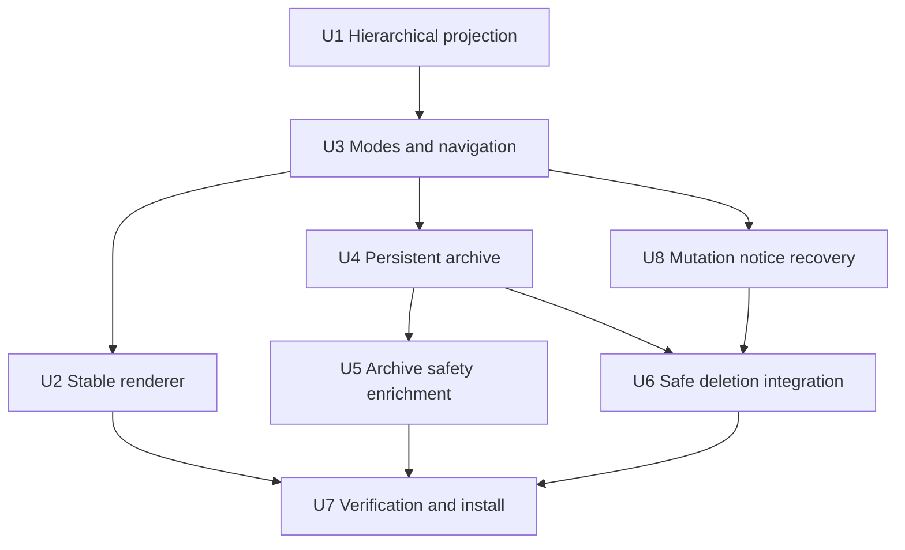
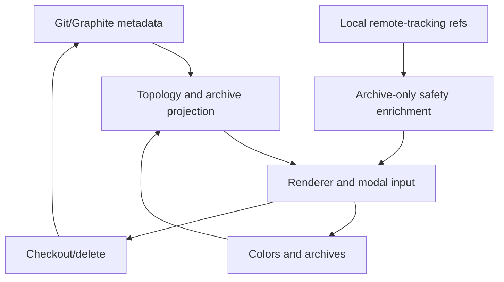

# feat: Stabilize Stackmap's visual hierarchy and cleanup workflow

## Overview

Evolve the installed v0.0 prototype from globally enumerated lanes into a stable, fork-aware, bottom-up stack map. Trunks become unmistakable anchors, stack names align within their own lane, selection no longer moves the graph, and focus/order/width controls operate without reparsing repository data.

Add a persistent, non-destructive branch archive for cleaning up large repositories before making any deletion decision. Archive status remains repository-local, while the Archive view lazily reports whether each hidden branch tip appears in locally cached remote-tracking refs. Existing guarded local deletion remains intact but moves to uppercase `X`.

The interaction modes are:

| Surface | Controls | Contract |
|---|---|---|
| Order | `t`, `T` | Recent is the startup default; `t` toggles Recent/Graphite; `T` opens Recent/Alphabetical/Graphite picker |
| Scope | `h`, `H`, `--current` | Focus one stack or one trunk/Untrunked section and keep a sticky bottom anchor |
| Layout | `s`, `+`, `-`, `0` | Toggle spacer rows and globally adjust/reset lane spacing without selection-centered movement |
| Color | `c`, `C` | Cycle immediately or choose from a modal picker; persist per repository |
| Cleanup | `x`, `X`, `a`, `v` | Archive/restore, guarded delete, Archive view, and contiguous bulk archive |
| Navigation | arrows, `J/K`, `g/G` | Row, adjacent-stack, ten-row, and section-edge movement with terminal-safe fallbacks |

---

## Problem Frame

The first Graphite child already inherits its parent's stable stack and later children already form child stacks. The current projection discards that hierarchy when assigning visual lanes: it flattens every stack group, globally enumerates lanes, places the trunk in the last lane, and recenters the visible gutter around selection. This produces the shifting, excessively wide graph seen during testing and cannot express a horizontal fork connector to the actual parent.

The current renderer also conflates the checked-out branch with its topology circle, highlights only the branch-name span, gives trunks ordinary stack colors, and offsets spacer rows by one column. The reducer has no modal picker or archive state, and a successful checkout leaves a message that permanently replaces the regular footer controls even after causal reconciliation succeeds.

The redesigned system must remain local-first, read-only except for existing guarded Git actions and repository-local configuration, bounded in memory/process use, and quick to reproject after branch changes.

---

## Requirements Trace

- R1. Preserve Graphite's first recorded child as the straight stack continuation. Every additional child branches from the same actual parent into a lane exactly one nesting level to the right; sibling lanes may be reused when their vertical ranges do not overlap.
- R2. Reserve column 0 as the checkout/trunk-anchor column: non-trunk rows use it only for checked-out status, trunk rows use it for the trunk topology node, and a checked-out trunk renders `◉` there. Stack topology begins to its right. Every trunk has a deterministic reserved color not used by stacks in its section and bold text; root connectors visibly touch its circle.
- R3. Render dependency order bottom-to-top in every mode. In Recent mode, the most recently active complete stack is closest to the trunk and older/one-off branches are farther upward. Multiple configured trunks remain navigable sections; Untrunked remains a final focusable section.
- R4. A checked-out non-trunk branch gets a filled circle in column 0 plus its ordinary topology circle. Selected rows use a strong edge-to-edge accent, while checked-out nonselected rows use a subtle edge-to-edge tint.
- R5. Keep names vertically aligned within a stable stack and offset each child stack by one lane. Graph geometry is fixed and left-anchored; moving selection must never move lanes.
- R6. `+`/`-` adjust the global lane pitch/gutter density for every section, and `0` restores responsive Auto mode. Manual width is session-only and clamps to preserve a useful branch-name and safety-badge budget.
- R7. Recent ordering is enabled at startup. `t` toggles Recent/Graphite, while `T` opens a modal picker for Recent, Alphabetical, and Graphite. A stable stack is the projection/color identity; a complete stack reaches a validated trunk; a true stack for navigation has at least two visible selectable branch rows; a one-off has exactly one. Dependency constraints are applied first, then complete-stack/one-off tier among independent groups, then the active mode comparator and stable-ID tie-break.
- R8. `h` keeps the focused stack and all ancestors through its trunk at full strength, dims sibling/descendant stacks, and hides unrelated topology. `H` focuses the selected trunk or Untrunked section. Focused views initially bottom-align and reserve a sticky final body row for their trunk/section bottom; long branch content scrolls in the remaining rows with a continuation cue, so selection and the bottom anchor stay visible together. Toggling off restores All-view navigation. `stackmap [--current] [REPOSITORY]` starts in the corresponding focus mode.
- R9. `s` toggles one nonselectable spacer row between adjacent stacks. Branch text and metadata are empty on that row, but genuine topology rails continue; semantic connector rows are never removed.
- R10. `c` cycles the selected stack through the finite palette and Auto. `C` opens a live-preview picker with Enter-to-save and Esc-to-rollback. Trunk colors are reserved and unavailable to stacks.
- R11. `x` archives the selected branch in Active view and restores it in Archive view. `a` toggles Archive view. Archive view always carries a non-color-dependent `ARCHIVE · local refs only · no fetch` identity and contextual `x restore` guidance. Hidden state persists per repository and never changes Git, Graphite, remotes, or pull requests.
- R12. `v` begins an inclusive contiguous preview for archive in Active view or restore in Archive view; Up/Down and shifted arrows extend or shrink it, Enter atomically applies the captured eligible branch IDs, and Esc cancels. A distinct non-color range treatment shows anchor, endpoint, count, and `Enter apply · Esc cancel`. The range skips nonselectable rows, cannot cross a section boundary, and never includes a trunk or the checked-out branch.
- R13. `X` always opens the existing exact-target guarded local-deletion confirmation in either Active or Archive view. All current safety checks, `y/n` confirmation, live revalidation, non-force behavior, and postcondition reconciliation remain unchanged.
- R14. Archive view reports evidence from local refs without claiming fresh remote truth: `remote-ref ✓`, `local only`, configured-upstream ahead/behind/diverged/gone states, and `checking…`/`remote ?`, always under the persistent no-fetch label. `remote-ref ✓` means the tip is reachable from at least one local remote-tracking ref. Worktree rows use `⎇ <directory-basename>` and retain the full path in detail.
- R15. Shift+Up/Down and `K/J` jump to the top branch of the adjacent visible stack when starting in a true stack; from a trunk or one-off they move ten selectable branches. Alt/Option+Up/Down and `g/G` jump to the top/bottom of the current section. No navigation wraps.
- R16. Successful checkout/deletion progress yields back to the ordinary controls after a matching causal structural refresh, with bounded transient notices and timeout recovery. Additions remain green and deletions remain red under all row backgrounds.
- R17. Preserve 40-column non-wrapping behavior, bounded queues/workers/caches/subprocess output, immutable snapshot replacement, linear topology metadata, viewport-bounded rendering, and the established memory/performance baseline. Do not claim that Rust alone makes leaks impossible; verify ownership release and RSS plateau behavior.

---

## Scope Boundaries

- Do not fetch, push, delete remote branches, close pull requests, or create backups automatically. Archive safety reflects local remote-tracking refs as last fetched by Git.
- Do not add force deletion, cascading deletion, bulk deletion, or restacking behavior. Bulk selection is archive-only.
- Do not replace the existing Git/Graphite deletion adapter or weaken its exact-target, worktree, provenance, leaf, OID, and reconciliation checks.
- Do not require Nerd Fonts or emoji-width assumptions. Use single-cell Unicode glyphs with the existing compact fallback strategy.
- Do not persist temporary range selections, modal state, viewport position, or manual lane width.
- Do not add `--recent`; Recent is already the startup default.
- CLI grammar is `stackmap [--current] [REPOSITORY]`. `--current` may appear before or after the single repository argument; `--` ends option parsing; duplicate/unknown options and extra positional arguments fail with usage, while `--help`/`--version` retain their existing behavior.
- Do not introduce rows-by-lanes matrices, unbounded archived-branch workers, or remote-reachability work during normal redraw/structural inventory.
- Name-keyed archive entries are acceptable for v0.0 because archiving is reversible. Entries absent from a successful authoritative local-ref snapshot are pruned through the coalesced config writer, so a later recreated same-name branch starts Active. Stronger persistent identity is deferred.

---

## Context & Research

### Relevant Code and Patterns

- `src/model/topology.rs` already models first-child continuation correctly in stack assignment, but `project()` globally enumerates emitted groups and lacks semantic connector entries or full/dim/hidden emphasis roles.
- `src/ui/tree.rs` contains the selection-centered `lane_window()`, branch-name-only reverse styling, a combined topology/current node, global text column, and the one-column spacer mismatch. It already renders additions and deletions as independent green/red spans.
- `src/app.rs` owns selection, projection, scope, mutation, and color state. Its overlapping search/help/deletion booleans should become a single exclusive overlay state rather than accumulating more precedence checks.
- `src/config.rs` provides repository-local TOML, a bounded cross-process lock, latest-on-disk merge, synced temporary file, atomic rename, and coalesced color writes. Archive persistence should extend this mechanism.
- `src/adapters/git.rs` already inventories worktree paths and safely revalidates checkout/deletion. Configured upstream atoms can join the bounded inventory, while expensive any-remote containment belongs in lazy Archive-only enrichment.
- `src/refresh/mod.rs` and `src/refresh/diffstats.rs` establish bounded latest-state coordination, generation rejection, and immutable enrichment patterns.
- `src/ui/panels.rs` already provides centered, cleared, bordered modal panels and is the pattern for order/color pickers and range/delete status.
- `tests/topology_layout.rs`, `tests/navigation_checkout.rs`, `tests/tui_rendering.rs`, `tests/repository_snapshot.rs`, and `tests/refresh_pipeline.rs` provide deterministic topology, reducer, TestBackend, real-Git, and ownership-release coverage.

### Institutional Learnings

- Git remains authoritative. Graphite supplies optional validated topology and ordering but must never hide Git-local truth when unavailable.
- View and archive modes project immutable snapshots; they do not mutate snapshot ownership or Graphite metadata.
- Structural and enriched snapshots are generation/epoch checked, and every background coordinator is bounded.
- The current verified baseline is 78 tests, a 3.3 MB release binary, roughly 11.8 MB startup RSS, and approximately linear 500/5,000-branch projection benchmarks on Rust 1.88.0.
- The repository has no initial commit and every file is untracked; destructive Git cleanup is prohibited.

### External References

- User-supplied Graphite and Figma screenshots define the visual hierarchy, sibling-fork geometry, trunk anchoring, current marker, and bottom-up reading model.
- No external framework research is needed; Ratatui/Crossterm and the repository's reducer/render/test patterns are already established locally.

---

## Key Technical Decisions

| Decision | Rationale |
|---|---|
| Separate stable stack identity, hierarchical lane depth, and rendered column | Color persistence, topology truth, and responsive positioning must not change together. |
| Add semantic connector and spacer entries | Fork joins are required topology; optional visual spacing must never carry topology meaning. |
| Reserve a far-left status/trunk column | Checkout identity and trunk anchoring remain visible without replacing or shifting topology nodes. |
| Assign lanes by fork depth with interval reuse | Width describes nesting, not the number of historical stacks, while metadata remains linear. |
| Model visibility and emphasis separately | `h` needs full, dimmed, and hidden topology; a membership-only scope cannot represent it. |
| Use one exclusive overlay enum | Search, help, pickers, range preview, and confirmation cannot consume the same key simultaneously. |
| Keep repository mutation state independent from overlays/view state | Archiving and view changes are reversible config operations; checkout/deletion retain causal reconciliation and mutual exclusion. |
| Persist archive and colors through one coalesced config writer | Concurrent worktrees and rapid cleanup cannot overwrite unrelated fields or replay stale state. |
| Make remote safety lazy, local, and archive-only | Reachability is valuable during cleanup but too expensive and unnecessary during every normal refresh/redraw. |
| Use background fills instead of `REVERSED` for row accents | Selection/current highlighting must not invert green deletion/addition or other semantic foregrounds. |

---

## Open Questions

### Resolved During Planning

- `t` from Alphabetical switches to Recent; a following `t` switches to Graphite.
- Recent compares independent groups by maximum activity, then default order and stable ID; Alphabetical compares stable stack/root labels, then stable ID; Graphite uses recorded child/root order with lexical and stable-ID fallback. Dependency and complete/one-off tiers precede each mode comparator.
- `h`/`H` pressed while the same scope is active exits to All; switching keys replaces the scope using the currently selected branch.
- `H` on Untrunked focuses all Untrunked branches and pins its final selectable row.
- Trunks and the checked-out branch cannot be archived. Other worktree-owned branches may be archived because archive is non-destructive and exposes their `⎇` status.
- Active and Archive views retain a nonselectable topology-only `⋯`/continuation row wherever suppressing an archived internal branch would otherwise invent a false direct edge. Archive retains section identity and minimal trunk/gap context; ordinary non-hidden branch names are not shown.
- Range selection may reverse direction around its anchor; captured branch IDs, not visual indexes, are persisted on Enter.
- Color picker previews in memory, persists once on Enter, and restores the original value on Esc.
- Badge precedence is display order, not mutual exclusion: worktree, configured-upstream divergence, then local remote-ref evidence may coexist. Narrow layouts keep a useful branch name and primary safety state, compact counts, truncate worktree basenames, and move overflow facts to detail/footer. Unknown/loading states never claim `local only`.
- Focused views render their trunk/section bottom as a sticky row outside the scrollable branch sub-viewport. A continuation cue replaces any offscreen connection; resize, ordering, spacing, color, and navigation preserve the sticky row, and leaving focus restores the prior All-view selection/scroll when possible.
- `--current` maps an ordinary tracked branch to stack focus, a checked-out trunk to section focus, and an Untrunked branch to its component focus. Detached, unborn, or missing-current repositories fall back to All with a bounded explanation.
- A preexisting stack override that conflicts with its section's trunk hue stays unchanged on disk but resolves to the next allowed effective palette color; pickers show both saved/effective state when they differ.

### Deferred to Implementation

- Exact causal-reconciliation notice duration: choose a short injected/testable deadline after observing the existing refresh cadence; the contract is that controls remain visible and mutation locks cannot remain indefinitely.
- Exact bounded batching for remote containment: choose the smallest visible/archive working set that meets responsiveness benchmarks while retaining latest-state cancellation and bounded subprocess output.
- Terminal-specific Shift/Option escape sequences: characterize the actual PTY during execution and retain `J/K`, `g/G`, and plain-arrow range fallbacks regardless of modifier reporting.

---

## High-Level Technical Design

> *This illustrates the intended approach and is directional guidance for review, not implementation specification. The implementing agent should treat it as context, not code to reproduce.*

Projection rows carry semantic role, branch identity when selectable, lane depth, connector events, and emphasis. Rendering derives fixed columns once per frame and visits only visible rows. Archive filtering is applied after the full topology index is built so hidden internal nodes cannot fabricate parentage.

---

## Phased Delivery

- **Phase 1 — visual/navigation milestone:** Complete U1, U3, U2, and U8; run their focused suites, release/PTY checks, and install a testable build with stable hierarchy, key handling, and footer recovery before Archive enrichment can block feedback.
- **Phase 2 — reversible cleanup milestone:** Complete U4 and U6; verify and install archive/restore, range cleanup, persistence, and uppercase guarded deletion while all remote-safety rows still truthfully show checking/unavailable.
- **Phase 3 — safety evidence and final release:** Complete U5 and U7; add bounded local remote-ref evidence, run full regression/scale/RSS/PTY verification, update operational docs, and install the final v0.0 build.

Each phase is independently runnable and installable. Later phases may extend state and help text but may not regress the prior phase's topology, navigation, mutation, or resource invariants.

---

## Implementation Units

- [x] U1. **Build a hierarchy-aware bottom-up projection**

**Goal:** Replace global lane enumeration with compact fork-depth placement and a renderer-independent semantic projection.

**Requirements:** R1, R2, R3, R5, R7, R8, R9, R17

**Dependencies:** None

**Files:**
- Modify: `src/model/topology.rs`
- Test: `tests/topology_layout.rs`
- Modify: `benches/responsiveness.rs`

**Approach:**
- Deliver this unit through two explicit internal gates: (A) fork-depth geometry/connectors/section indexes, then (B) ordering/emphasis/archive projection policy. Each gate must pass its focused topology suite before the next begins.
  - [x] Gate A: fork-depth geometry, semantic connectors/spacers, exclusive trunk lane, reusable sibling lanes, and section indexes; verified by the focused topology suite and all-target regression suite on 2026-07-19.
  - [x] Gate B: ordering, emphasis, archive continuation placeholders, and projection-local stack classification; verified by focused tests, strict Clippy, and the all-target regression/benchmark suite on 2026-07-19.
  - [x] Linearization follow-up: replaced repeated ancestry/subtree scans and recursive index construction with cycle-safe linear work, isolated Untrunked focus components, and restored Graphite-position recency ties. A 5,000-deep projection improved from roughly 9.55 seconds to 9 milliseconds in the debug benchmark on 2026-07-19.
- Preserve the existing first-child stack continuation and stable stack IDs.
- Assign root stacks one lane right of the exclusive trunk anchor. Place additional child stacks one depth right of their actual parent and reuse non-overlapping sibling intervals.
- Represent required horizontal/vertical joins separately from optional spacer rows; maintain compact connector events/intervals proportional to branches and edges.
- Add explicit section identities/ranges and bottom-row indexes for configured trunks and Untrunked.
- Add Recent, Alphabetical, and Graphite dependency-safe whole-group ordering using the defined dependency → completeness → mode comparator → stable-ID precedence.
- Add full/dim/hidden emphasis roles for `h`, while `H`/Archive filtering retains required topology context without reintroducing unrelated names.
- When an archived internal node sits between visible relatives, retain a nonselectable topology-only continuation placeholder in Active and Archive projections rather than fabricating a direct edge.

**Execution note:** Add fork, connector, and scale characterization tests before changing lane assignment.

**Patterns to follow:**
- Stable stack construction and compact lane intervals in `src/model/topology.rs`.
- Linear metadata assertions and large fixtures in `tests/topology_layout.rs`.

**Test scenarios:**
- Happy path: `3` has first child `4` and additional child `3b`, with `3b -> 3c`; `4` stays straight and `3b` joins exactly at `3` one lane right.
- Happy path: every root connector touches its trunk anchor and no stack node occupies the trunk lane.
- Edge case: two non-overlapping sibling stacks reuse a lane without overlapping connector intervals.
- Happy path: Recent default, Alphabetical, and Graphite reorder whole groups while preserving every parent/child constraint; one-offs remain above complete stacks.
- Happy path: `h` marks focused/dependency rows full, sibling/descendant rows dim, and unrelated sections hidden.
- Edge case: Untrunked focus, multiple trunks, filters, archived internal branches, and optional spacers emit each visible branch exactly once without false edges.
- Edge case: filtering or archiving reduces a two-branch stable stack to one visible selectable row; navigation classifies it as a one-off for the current projection without changing stable stack identity.
- Scale: 500- and 5,000-branch deep/wide/multi-trunk/archive projections keep entries, maps, and connector data linear.

**Verification:**
- Screen-order, lane-depth, connector-parent, section-bottom, and emphasis invariants are renderer-independent and benchmark growth remains approximately linear.

- [x] U2. **Render fixed geometry and layered visual identity**

**Goal:** Render the agreed trunk/current/selection grammar, stack-local labels, reducer-provided width state, worktree badge, and edge-to-edge styling without sacrificing semantic colors.

**Requirements:** R2, R4, R5, R6, R9, R10, R14, R16, R17

**Dependencies:** U1, U3

**Files:**
- Modify: `src/ui/tree.rs`
- Modify: `src/ui/layout.rs`
- Modify: `src/ui/theme.rs`
- Modify: `src/config.rs`
- Test: `tests/tui_rendering.rs`

**Approach:**
- Apply the explicit column contract: column 0 is checkout status on non-trunks and the trunk node on trunks, the cursor/range marker has its own following column, and stack topology begins after both.
- Render root connector rows into the trunk circle, ordinary topology circles independently from the checkout marker, and `◉` for the checked-out trunk.
- Consume reducer-owned Auto/manual lane pitch and replace selection-centered lane windows with a fixed left origin. Keep stable right-overflow cues and a minimum label/safety budget.
- Start each stack's labels immediately after its node/rightmost active topology, preserving vertical alignment within that stack and one-lane child offsets.
- Fill every body cell with strong selection or subtle current backgrounds while preserving explicit diff/PR/worktree foregrounds; selection wins when both apply.
- Give trunks a deterministic reserved hue and bold text. Exclude that hue from automatic/cycled/picker stack colors; preserve a conflicting saved override but resolve and disclose a non-conflicting effective hue.
- Render `⎇ <basename>` in the right metadata area with the exact path in detail and keep spacer prefixes aligned with branch rows.

**Execution note:** Establish exact TestBackend cell/glyph/style assertions before renderer changes.

**Patterns to follow:**
- Width modes and metadata compaction in `src/ui/layout.rs` and `src/ui/tree.rs`.
- Deterministic theme lookup in `src/ui/theme.rs`.

**Test scenarios:**
- Happy path: checked-out non-trunk row has a far-left filled dot and a separate topology `○`; checked-out trunk is `◉`.
- Happy path: selected background reaches the first and final body cells; current-only tint is weaker; selected-current retains the dot and strong accent.
- Happy path: trunk text is bold and its resolved hue is not used by any stack in its section, including saved overrides.
- Happy path: names align within a stack and child-stack names offset by exactly one effective lane pitch.
- Edge case: selection movement across distant lanes changes no graph columns; renderer output follows each reducer-provided Auto/manual pitch and clamps responsively.
- Edge case: 40-column rows do not wrap, show stable right overflow, preserve useful branch identity, and make full selected detail discoverable.
- Regression: additions stay green and deletions stay red on selected/current backgrounds.
- Integration: `⎇ basename` aligns in the safety area and detail retains the full path, including duplicate/non-UTF-8 basenames via lossy display.

**Verification:**
- The visual hierarchy remains stationary during navigation and matches the agreed trunk/fork/current/selection diagrams at narrow and wide sizes.

- [x] U3. **Unify interaction modes, ordering, focus, and navigation**

**Goal:** Add deterministic modal input, reducer-owned layout state, ordering/focus controls, sticky section anchoring, and terminal-safe navigation.

**Requirements:** R6, R7, R8, R10, R12, R15, R17

**Dependencies:** U1

**Files:**
- Modify: `src/events.rs`
- Modify: `src/app.rs`
- Modify: `src/main.rs`
- Modify: `src/ui/panels.rs`
- Modify: `src/ui/mod.rs`
- Test: `tests/navigation_checkout.rs`
- Test: `tests/tui_rendering.rs`
- Create: `tests/terminal_interaction.rs`

**Approach:**
- Deliver through three explicit gates: (A) key decoding/Press-versus-Repeat and exclusive overlays, (B) ordering/color/layout controls and picker rollback, then (C) focus/sticky viewport/navigation/CLI startup. Each gate must pass its reducer tests before the next begins.
  - [x] Gate A: normalized modifier/phase input, navigation-only repeats, exclusive overlay ownership, keyboard-enhancement cleanup, and portable fallbacks.
  - [x] Gate B: Recent/order picker, live-preview color picker, and reducer-owned Auto/manual lane pitch.
  - [x] Gate C: focus/sticky viewport, section-edge and stack-aware navigation, and `--current` startup; parent-verified with strict Clippy and the all-target suite on 2026-07-19.
- Replace overlapping search/help booleans with one exclusive overlay state for search, help, pickers, and archive-range preview. Deletion confirmation remains the immutable payload-owning `MutationState` variant; its modal is presentation derived from that state.
- Enforce input precedence: quit, deletion confirmation, archive range, pickers, search, help, then normal commands. Gate repeated key events to navigation/range movement only.
- Make Recent the startup order. Implement `t` and a small `T` picker with pending choice, Enter apply, and Esc rollback.
- Add reducer-owned Auto/manual lane pitch: `+/-` change the global value, `0` returns to Auto, resizes clamp only the effective value, and successful/no-op changes report the active state without redraw loops.
- Implement `h/H` scope replacement/toggle semantics, Untrunked section focus, sticky bottom-row sub-viewport, and prior All-view selection/scroll restoration. Parse `stackmap [--current] [REPOSITORY]` and apply the defined current-branch/trunk/Untrunked/fallback mapping after the first structural snapshot.
- Implement `c` cycling and `C` live preview with one persistence action on Enter and rollback on Esc.
- Implement adjacent-stack versus ten-row Shift/J/K behavior and Alt/g/G section-edge navigation; skip all nonselectable rows and never wrap.
- Make footer navigation hints contextual (`J/K stack` versus `J/K ±10`), name the focus anchor, and provide non-color rail/glyph cues for full versus dim focus. Picker choices have textual names/indexes and report saved/effective color under `NO_COLOR`.
- Add `Ignored` key handling rather than synthesizing a NUL character, and characterize real PTY Shift/Option sequences while retaining portable fallbacks.

**Execution note:** Write reducer transition and PTY characterization coverage first because the current synthetic modifier tests did not reproduce the reported terminal failure.

**Patterns to follow:**
- Reducer-owned reprojection/selection reconciliation in `src/app.rs`.
- Centered modal panels in `src/ui/panels.rs`.

**Test scenarios:**
- Happy path: `t` and `T` produce the agreed order transitions; picker Esc restores the original mode.
- Happy path: `h/H` focus, replace, toggle off, pin bottom, survive resize/reprojection, and restore All-view position.
- Happy path: a focused section taller than the terminal scrolls branches above a persistent sticky trunk/bottom row and continuation cue while keeping selection visible.
- Edge case: disappearing scope anchors or stack/color picker targets safely close/reset with a bounded explanation.
- Happy path: `c` persists one cycle; `C` previews, cancels without persistence, or commits exactly once.
- Happy path: `+/-/0` change/reset session-global lane pitch, preserve the requested value across clamping resize, and suppress repeated boundary redraw/messages.
- Happy path: shifted arrows and `K/J` choose the same adjacent stack head; trunk/one-off origins move ten selectable rows.
- Happy path: Alt arrows and `g/G` reach section edges; Untrunked bottom means its final selectable row.
- Integration: actual PTY input covers uppercase chars, shifted/Option arrows, repeat gating, modal suppression, clean quit, and terminal restoration.
- Integration: CLI parsing accepts `--current` before/after one repository and `--` termination, and rejects duplicates, unknown options, and extra paths with usage.

**Verification:**
- Every key has one owner in every state, view transitions do no provider work, and modifier fallbacks work in the user's terminal.

- [x] U8. **Repair causal mutation notices and footer recovery**

**Goal:** Fix the reported checkout footer bug independently of Archive work and retain enough mutation identity to verify causal results.

**Requirements:** R16, R17

**Dependencies:** U3

**Files:**
- Modify: `src/app.rs`
- Modify: `src/main.rs`
- Modify: `src/ui/panels.rs`
- Test: `tests/navigation_checkout.rs`
- Test: `tests/tui_rendering.rs`

**Approach:**
- Retain operation kind, target branch, expected OID where applicable, causal request epoch, and deadline throughout reconciliation rather than reducing state to an epoch alone.
- Track mutation-owned progress separately from ordinary/transient notices. Once mutation returns Idle, ordinary controls remain visible and a bounded toast may coexist instead of replacing them.
- On matching causal refresh, verify checkout target/current state and clear reconciliation progress. On deadline, unlock with actionable refresh guidance; persistent stale/inconsistent errors remain separate.
- Apply the same lifecycle to deletion later through U6 without changing adapter safety.

**Execution note:** Add the reported stuck-footer regression before changing notice state.

**Patterns to follow:**
- Causal request epochs and authoritative snapshot reconciliation in `src/app.rs`.

**Test scenarios:**
- Regression: successful checkout, stale epoch, then matching epoch returns mutation to Idle and renders normal controls without the reconciliation message.
- Error path: a causal snapshot reports a different current branch or the deadline expires; mutation unlocks with bounded actionable status.
- Edge case: an ordinary toast, stale repository error, and mutation progress do not clear or mask one another incorrectly.

**Verification:**
- Checkout progress cannot permanently replace controls, and verification always refers to the captured target rather than current selection.

- [x] U4. **Persist reversible branch archives and bulk cleanup**

**Goal:** Add repository-local hidden state, Active/Archive projections, single-row and contiguous-range cleanup, and concurrency-safe config persistence.

**Requirements:** R11, R12, R13, R17

**Dependencies:** U3

**Files:**
- Modify: `src/config.rs`
- Modify: `src/app.rs`
- Modify: `src/main.rs`
- Modify: `src/model/topology.rs`
- Modify: `src/ui/panels.rs`
- Test: `src/config.rs`
- Test: `tests/navigation_checkout.rs`
- Test: `tests/refresh_pipeline.rs`
- Test: `tests/tui_rendering.rs`

**Approach:**
- Extend the backward-compatible repository config with archived branch names and generalize color persistence into one coalesced config-mutation queue.
- Apply archive/color changes immediately in memory, overlay pending changes on structural reload, merge with latest disk state under the existing bounded lock, and prevent stale completions from erasing newer fields.
- Map `x` to archive/restore, `a` to Active/Archive-only toggle, and retain prior Active selection/viewport when returning.
- Add `v` preview state containing section, anchor, endpoint, and captured branch IDs. Plain and shifted arrows share range semantics; Enter archives in Active or restores in Archive; Esc/structural invalidation cancels.
- Render a dedicated non-color range mark/background with anchor, endpoint, exact count, contextual action, and boundary no-op feedback. Keep the persistent `ARCHIVE · local refs only · no fetch` badge, Archive framing, `x restore` hint, and guided empty state visible without color.
- Refuse trunks and the checked-out branch and skip them in ranges. Immediately before a single or range commit, revalidate every captured ID against the latest authoritative snapshot; abort the whole batch if any target became current, a trunk, missing, or crossed section identity.
- Prune name-keyed archive entries absent from each successful authoritative local-ref snapshot through the same coalesced writer; merge pruning with concurrent worktree changes instead of overwriting them.
- Remove archive/color entries for a successfully deleted branch only after authoritative deletion reconciliation.

**Execution note:** Extend concurrent-config tests before generalizing the writer.

**Patterns to follow:**
- Cross-process lock, latest-file merge, pending in-memory overlay, and atomic rename in `src/config.rs`.

**Test scenarios:**
- Happy path: `x` hides Active rows and restores Archive rows immediately; restart/config reload preserves hidden state.
- Happy path: `v` selects inclusively in either direction, stops at section/trunk boundaries, skips nonselectable rows, and archives/restores exact captured IDs on Enter.
- Error path: `v` on a trunk and `x` on trunk/current explain refusal without writing; a target becoming current/trunk before Enter aborts the entire batch.
- Integration: separate worktrees concurrently change colors and archive entries without overwriting either field.
- Race: older write completion and structural config reload cannot resurrect restored branches or discard newer archives.
- Edge case: empty Archive state, stale-name pruning, filtering, scope changes, and refresh retain deterministic selection and config growth proportional only to existing explicitly archived branches.
- Integration: the persistent Archive framing, contextual action/count, range endpoints, and empty-state return guidance remain unambiguous with color disabled.

**Verification:**
- Archive is fully reversible, survives reboot, performs no Git mutation, and remains safe under rapid ranges and concurrent worktrees.

- [x] U5. **Add lazy Archive remote-ref and upstream evidence**

**Goal:** Report local remote-ref/upstream evidence for hidden branches without presenting it as fresh network truth, slowing the normal viewer, or performing network operations.

**Requirements:** R14, R17

**Dependencies:** U4

**Files:**
- Modify: `src/adapters/git.rs`
- Modify: `src/model/branch.rs`
- Modify: `src/refresh/builder.rs`
- Create: `src/refresh/upstream.rs`
- Modify: `src/refresh/mod.rs`
- Modify: `src/main.rs`
- Modify: `src/app.rs`
- Modify: `src/ui/tree.rs`
- Test: `tests/repository_snapshot.rs`
- Test: `tests/refresh_pipeline.rs`
- Test: `tests/tui_rendering.rs`
- Modify: `tests/common/mod.rs`

**Approach:**
- Add cheap configured-upstream identity/tracking atoms to the bounded Git inventory.
- Entering Archive emits a typed request containing repository generation and archived branch ID/OID pairs. A bounded latest-state coordinator checks the visible archive working set plus a small bounded prefetch window, returns results keyed by generation/OID/remote-ref token, treats Archive exit as superseding pending work, and shuts down with the existing refresh handle.
- Cache containment against local remote-tracking refs by local OID plus a remote-ref source token and reject stale results in `App`.
- Model checking, contained-in-local-remote-ref, local-only, ahead, behind, diverged, gone, and unavailable states explicitly; never translate an error/loading state into `local only`.
- Preserve one-flight/latest-pending behavior, bounded output/deadlines/concurrency, and immutable snapshot/enrichment ownership.
- Render `remote-ref ✓` and other compact evidence badges under a persistent no-fetch label, with full upstream/ref detail in the footer/detail panel. Preserve a useful branch-name width and primary safety state first; compact counts, truncate worktree basename, then move secondary facts to detail. Never run containment work during normal redraw or fetch from a remote.
- Detail/footer include the local remote-ref source token/time so users can distinguish evidence from a freshly fetched remote guarantee.

**Execution note:** Start with disposable local/bare-remote integration fixtures for the safety classifications.

**Patterns to follow:**
- Latest-state diff enrichment and cache invalidation in `src/refresh/diffstats.rs`.
- Typed bounded command behavior in `src/adapters/command.rs` and `src/adapters/git.rs`.

**Test scenarios:**
- Happy path: pushed/equal, ahead, behind, diverged, upstream-gone, and no-upstream branches produce the correct states.
- Happy path: a tip contained by a nonconfigured remote-tracking branch reports `remote-ref ✓`.
- Error path: containment timeout/truncation/ref change reports `remote ?`, never `local only`, and leaves navigation responsive.
- Race: branch OID or remote-ref token changes while work is active; stale results are discarded and one latest request runs.
- Edge case: worktree plus diverged upstream plus containment evidence composes correctly at wide widths and collapses deterministically at 40 columns.
- Performance: normal Active redraw/toggles spawn zero safety checks; Archive cache hits avoid subprocesses; large hidden sets remain bounded.

**Verification:**
- Archive badges truthfully describe local remote-tracking state without network access or unbounded work.

- [x] U6. **Integrate guarded deletion with Archive state**

**Goal:** Preserve guarded deletion behind uppercase `X`, integrate it with Archive state, and clean persistent identity only after authoritative postconditions.

**Requirements:** R13, R16, R17

**Dependencies:** U4, U8

**Files:**
- Modify: `src/app.rs`
- Modify: `src/main.rs`
- Modify: `src/ui/panels.rs`
- Test: `tests/navigation_checkout.rs`
- Test: `tests/tui_rendering.rs`
- Test: `tests/repository_snapshot.rs`

**Approach:**
- Route `X` in both Active and Archive views to the existing exact-target confirmation; keep `x` purely reversible.
- Preserve all deletion adapter checks and confirmation precedence. Require Press rather than key-repeat for archive/delete/checkout actions.
- Carry the deletion branch ID, expected OID, outcome, and causal epoch through reconciliation. Clear archive/color state only from that retained identity after a matching snapshot proves the branch absent; never infer cleanup from current selection.
- Before emitting cleanup, revalidate that the same branch name has not reappeared with a different OID. Preserve inconsistent/degraded errors and do not auto-retry.
- Reuse U8's bounded progress/toast lifecycle so ordinary controls return after deletion verification.

**Execution note:** Keep every existing adapter safety test unchanged while remapping only reducer entry and postcondition cleanup.

**Patterns to follow:**
- Causal target-bearing mutation state from U8.
- Existing live deletion revalidation in `src/adapters/git.rs`.

**Test scenarios:**
- Happy path: `X` requires exact `y/n` confirmation in Active and Archive; `x` never enters deletion.
- Safety: current/trunk/worktree/degraded/non-leaf/stale refusals and expected-OID/provider postconditions remain unchanged.
- Integration: successful deletion removes only the deleted branch's archive/color state after authoritative reconciliation and selects a deterministic nearby row.

**Verification:**
- Destructive behavior is never reachable from lowercase cleanup keys, and mutation status cannot permanently replace ordinary controls.

- [x] U7. **Integrate, document, benchmark, and reinstall v0.0**

**Goal:** Verify the complete redesigned workflow under real topology, terminal, refresh, memory, and installed-binary conditions.

**Requirements:** R1-R17

**Dependencies:** U2, U5, U6

**Files:**
- Modify: `README.md`
- Modify: `memory.md`
- Modify: `changelog.md`
- Modify: `benches/responsiveness.rs`
- Modify: `tests/topology_layout.rs`
- Modify: `tests/navigation_checkout.rs`
- Modify: `tests/tui_rendering.rs`
- Modify: `tests/refresh_pipeline.rs`
- Modify: `tests/terminal_interaction.rs`

**Approach:**
- Update the complete key table, modal help, visual marker legend, archive/upstream safety semantics, `--current`, and bottom-up/focus behavior.
- Verify formatting, strict linting, all tests/doctests, release build, projection/render/enrichment benchmarks, ownership-release tests, allocator-aware RSS soak, and real PTY input/terminal restoration.
- Eliminate or explicitly bound the remaining recursive side-stack emission path with a deep-comb fixture before release; the primary-chain index/projection path is already iterative and verified at 5,000 branches.
- Exercise deep linear stacks, multiple sibling forks, many reusable lanes, multiple trunks, Untrunked, archived internal nodes, narrow/wide resize, and rapid refresh/config writes.
- Install the verified release over the existing `stackmap 0.0.0` binary and smoke-test it from a separate worktree/repository.
- Record measured results without claiming memory-leak impossibility; require stable ownership bounds and no monotonic retained-generation/RSS growth after warm-up.

**Test scenarios:**
- Integration: a real Graphite repository reproduces the `3 -> {4, 3b}` fork, root-to-trunk contact, fixed graph columns, reserved trunk style, and bottom anchoring.
- Integration: repeated `t/T/h/H/s/c/C/x/a/v/+/-/0`, filtering, resizing, and refresh preserve valid selection and bounded state.
- Integration: quarantine a range, inspect no-fetch remote-ref evidence, bulk-restore uncertain branches, optionally delete one exact eligible branch with `X`, then return to Active with a summary of which reversible/config and destructive/Git changes occurred.
- Integration: real PTY Shift/Option input, fallbacks, picker/range overlays, checkout reconciliation, clean quit, and terminal restoration work in the target terminal.
- Scale: 500 and 5,000 branches demonstrate approximately linear projection metadata, viewport-bounded rendering, bounded archive checks, and no toggle-spawned provider work.
- Operational: installed `stackmap --current` and normal startup work outside the source repository and the terminal is restored after quit/error.

**Verification:**
- The release is fully tested, built, installed on `PATH`, documented, and ready for hands-on terminal cleanup testing.

---

## System-Wide Impact

- **Interaction graph:** Topology determines lane/emphasis/section indexes; view and archive state reproject them; rendering/navigation consume semantic entries; archive safety enriches hidden rows; guarded mutations trigger causal structural refresh.
- **Error propagation:** Graphite/upstream/config failures remain typed and non-destructive. Loading/unavailable evidence never appears as `remote-ref ✓` or `local only`. Inconsistent deletion remains blocking.
- **State lifecycle risks:** Structural refresh can invalidate scope, picker targets, range captures, archive badges, and mutation confirmations. Each state has an explicit revalidation/cancellation rule.
- **API surface parity:** CLI help, in-app help/footer, key conversion, reducer state, projection, renderer, config schema, Git inventory, refresh workers, tests, benchmarks, and installed documentation change together.
- **Integration coverage:** Unit tests cannot prove actual modifier escape sequences, Unicode cell widths, local-remote containment, allocator behavior, or installed terminal restoration; U7 covers those boundaries.
- **Unchanged invariants:** Git remains authoritative, all local refs remain in structural snapshots, Graphite discovery stays read-only, deletion remains guarded/non-force/local-only, and every queue/cache/subprocess remains bounded.

---

## Risks & Dependencies

| Risk | Mitigation |
|---|---|
| Hierarchical connectors regress to rows-times-lanes storage | Store connector events/intervals proportional to topology and render only the width-capped visible gutter. |
| Stack-local labels collide with active child rails | Emit child blocks and connector-only rows so no right-side live rail crosses a parent label; assert exact columns. |
| Full-row styling destroys semantic foregrounds | Use background fills with explicit foreground precedence; test green/red/PR/worktree cells under both accents. |
| Bottom pin conflicts with multi-section scrolling | Pin only focused `h/H/--current` sections; All view retains normal cross-section scrolling and restores saved context. |
| Modal keys trigger normal commands or repeat destructive actions | Use one overlay owner, strict precedence, and Press-only mutation/toggle gating. |
| Config writes from multiple worktrees lose archives/colors | Merge latest disk state under the existing bounded lock and coalesce field-aware pending mutations. |
| Remote containment creates subprocess/RAM pressure | Run only in Archive, bound/cache/cancel by OID+remote token, and render explicit checking/unavailable states. |
| Unicode glyph widths vary | Characterize `◉`, `⎇`, circles, and box drawing in the target PTY; preserve compact ASCII/text fallbacks. |
| Shift/Option modifiers are consumed by terminal settings | Test actual PTY input and keep `J/K`, `g/G`, and plain-arrow range behavior first-class. |
| Checkout/delete notices remain stale | Tie progress to causal mutation state and a deadline; render ordinary controls independently from transient toasts. |
| Archive by branch name affects a recreated same-name branch | Archive is reversible and Archive view exposes the row; document the v0 behavior and defer stronger identity. |

---

## Documentation / Operational Notes

- Explain that “current” means Git checked out, while “selected” means the cursor row.
- Document bottom-up stack reading, first-child continuation, sibling fork connectors, reserved trunk styling, and stack-local labels.
- Document Active versus Archive, local-only remote safety (no fetch), lowercase reversible cleanup, uppercase guarded deletion, and range behavior.
- Document all modal/fallback keys and that manual lane width is session-only.
- Preserve troubleshooting guidance for modifier-key terminals and add normal-footer recovery after checkout.
- Update measured tests, binary size, projection/enrichment timing, RSS observations, and installation path after verification.

---

## Sources & References

- Completed prior implementation plan: `docs/plans/2026-07-18-001-feat-graphite-stack-lanes-plan.md`
- Original prototype plan: `PLAN.md`
- Project state: `memory.md`
- Current user documentation: `README.md`
- Topology/projection: `src/model/topology.rs`
- Reducer/input state: `src/app.rs`, `src/events.rs`, `src/main.rs`
- Rendering: `src/ui/tree.rs`, `src/ui/panels.rs`, `src/ui/layout.rs`, `src/ui/theme.rs`
- Persistent config: `src/config.rs`
- Git inventory/mutations: `src/adapters/git.rs`
- Refresh coordination: `src/refresh/mod.rs`, `src/refresh/diffstats.rs`
- Tests: `tests/topology_layout.rs`, `tests/navigation_checkout.rs`, `tests/tui_rendering.rs`, `tests/repository_snapshot.rs`, `tests/refresh_pipeline.rs`
