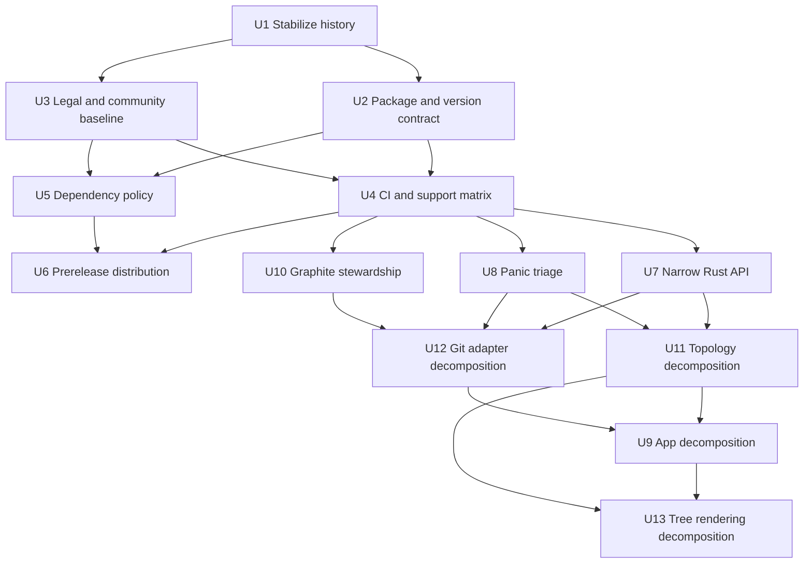
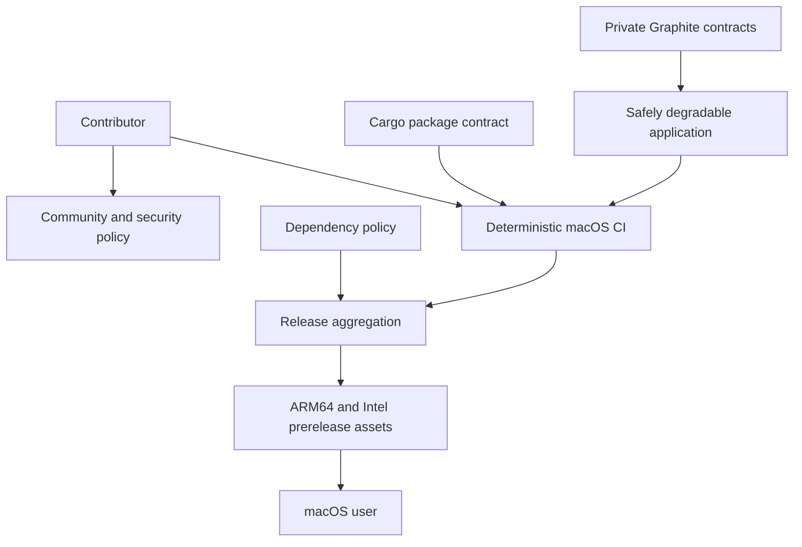

# feat: Harden stackmap for an open-source prerelease

## Overview

Prepare `stackmap` for a credible `0.1.0-alpha.1` open-source release without changing its product behavior or weakening its Git safety guarantees. The work has two gates:

| Gate | Outcome | Blocking the alpha? |
|---|---|---|
| Release-critical hardening | Reviewable history, legal/community files, an explicit package boundary, macOS CI, dependency policy, and repeatable pinned ARM64/Intel GitHub prereleases | Yes |
| Maintainability hardening | A deliberately narrow Rust API, fewer runtime-reachable panics, smaller core modules, and an explicit Graphite compatibility process | No; complete before presenting the project as a polished stable release |

The alpha is a binary-first GitHub prerelease. Crates.io publication is intentionally disabled until the project has an intentional library API and a separate publication decision. The public compatibility contract is the CLI, configuration, documented keybindings, safety behavior, and release artifacts—not the current `src/lib.rs` module graph.

---

## Problem Frame

The application is substantially more mature than its `0.0.0` label: the pinned Rust 1.88.0 toolchain passes formatting, strict Clippy, 174 tests across all targets/features, and a release build. Its defensive Git, subprocess, refresh, cache, and rendering design is already suitable for technical testers.

The repository around that application is not yet a dependable open-source product. It has no license file, CI, contribution/security policy, dependency audit, or release path; Cargo packages internal memory and planning artifacts; its version and help text disagree with the intended prerelease posture; and nearly all current work sits uncommitted on top of a single initial commit. Separately, broad Rust visibility, invariant `expect` calls, four large core modules, and Graphite's private contracts raise long-term maintenance costs.

This plan hardens the release boundary first, freezes the verified behavior as a traceable baseline, and then improves maintainability behind the same characterization coverage.

---

## Requirements Trace

### Baseline Preservation

- R1. Preserve all documented application behavior and safety invariants while establishing a clean, reviewable baseline from the current dirty worktree.

### Open-Source Alpha Gate

- R2. Add an actual MIT license and the minimum repository-specific contribution, conduct, issue, pull-request, and private security-reporting guidance needed for outside participation.
- R3. Publish one consistent prerelease identity: manifest version, CLI help/version output, Git tag, release title, asset names, and documentation must agree on `0.1.0-alpha.1`.
- R4. Make the Cargo package boundary intentional and reproducible, including the source, tests, benchmarks, lockfile, README, and license while excluding internal memory/planning artifacts.
- R5. Establish deterministic CI on explicit macOS 15 ARM64 and Intel runners with Rust 1.88.0, plus a forward-compatibility lane on current stable Rust.
- R6. Automate advisory, license, source, and dependency-update checks without conflating advisory-service availability with the deterministic correctness suite.
- R7. Produce complete, uniquely named ARM64 and Intel GitHub prerelease assets with checksums, provenance, native smoke verification, and fail-closed publication behavior.
- R8. State a precise support contract: macOS 15+ on Apple Silicon and Intel; Terminal.app on macOS 15 as the reference terminal; documented portable key fallbacks; other terminals remain best-effort until manually recorded.

### Maintainability Gate

- R9. Reduce the accidental public Rust API to an intentional executable facade or equivalent binary-only boundary, without sacrificing integration and benchmark coverage.
- R10. Replace runtime-reachable invariant panics with recoverable typed outcomes while retaining only documented programmer-error assertions.
- R11. Decompose the largest core modules along existing architectural seams without changing behavior, performance bounds, or safety policy.
- R12. Treat Graphite 1.8.6 behavior and the current private schema as characterized—not guaranteed—and document a repeatable compatibility/fallback maintenance process.

---

## Scope Boundaries

- No new TUI features, keybindings, Git mutations, telemetry, background service, or network requirement.
- No rewrite of the existing initial commit solely to manufacture history. The current worktree and new hardening work will become reviewable forward history.
- No crates.io publication for the alpha; `publish = false` prevents accidental irreversible publication.
- No Homebrew formula/tap in the alpha gate. GitHub assets and source installation are the supported initial distribution paths.
- No claim that CI proves every terminal emulator. Automated PTY coverage and a named reference terminal are distinct from manual compatibility evidence.
- No promise of general Graphite schema or CLI compatibility. Missing, changed, busy, or corrupt Graphite state must continue to degrade visibly while preserving all Git-local branches.
- No blanket ban on `expect`; impossible programmer-state assertions may remain when the invariant and failure boundary are documented.
- No module split before the release baseline is protected by CI; large-scale file movement is maintainability work, not a legal/package prerequisite.

### Deferred to Follow-Up Work

- Developer ID signing and notarization: required before presenting direct-download binaries as a polished stable macOS distribution; the alpha must clearly disclose unsigned/not-notarized artifacts unless credentials are supplied.
- Homebrew distribution: evaluate after the asset names, supported macOS floor, and upgrade policy have survived alpha testing.
- Stable `0.1.0`: requires closure of alpha feedback, a signing/notarization decision, and completion or explicit acceptance of the maintainability gate.

---

## Context & Research

### Relevant Code and Patterns

- `README.md` is the authoritative behavior and safety description. It already documents macOS scope, bounded work, Graphite/GitHub degradation, destructive-operation safeguards, and the full local verification suite.
- `rust-toolchain.toml` pins Rust 1.88.0 with `rustfmt` and `clippy`; `Cargo.lock` is committed and should remain part of the binary application's reproducibility contract.
- `src/main.rs` obtains `--version` from Cargo metadata but hardcodes `stackmap 0.0.0` in help text, so version identity currently has two sources.
- `src/lib.rs` publicly exports all seven internal modules. Integration tests and benchmarks use that visibility as a test seam, while `PLAN.md` explicitly defines the external contracts as CLI/config/adapter behavior rather than a Rust library.
- `tests/repository_snapshot.rs`, `tests/navigation_checkout.rs`, `tests/archive_workflow.rs`, `tests/refresh_pipeline.rs`, `tests/topology_layout.rs`, `tests/tui_rendering.rs`, `tests/terminal_interaction.rs`, and `tests/github_enrichment.rs` provide the characterization coverage needed for behavior-preserving refactors.
- `tests/fixtures/graphite/` and the adapter fallback behavior are the existing compatibility pattern for Graphite's private schema.
- `cargo package --list --allow-dirty` currently includes `PLAN.md`, `memory.md`, `changelog.md`, and `docs/plans/`, and warns that repository/homepage/documentation metadata is absent.

### Institutional Learnings

- No `docs/solutions/` directory exists. Durable project knowledge is in `memory.md`, `changelog.md`, `PLAN.md`, and the completed plans under `docs/plans/`.
- The current release baseline includes 174 tests, real Git/Graphite integration, PTY smoke coverage, bounded resource/performance evidence, and a 3,713,072-byte installed binary. Release hardening must preserve those invariants rather than reinterpret them.
- Graphite CLI 1.8.6 deletion behavior was characterized in a disposable repository, but expected-OID atomicity remains unavailable. The provider must continue to fail closed and re-read postconditions.
- The current branch has one commit and a large unstaged feature set, including `src/refresh/upstream.rs` and `tests/archive_workflow.rs`. Stabilization must precede release-policy changes so review and regression tracing remain possible.

### External References

- Cargo manifest metadata and package inclusion policy: [Cargo manifest reference](https://doc.rust-lang.org/cargo/reference/manifest.html), [Cargo publishing guidance](https://doc.rust-lang.org/cargo/reference/publishing.html)
- Rust/Cargo prerelease compatibility: [Cargo dependency prereleases](https://doc.rust-lang.org/cargo/reference/specifying-dependencies.html#pre-releases), [Semantic Versioning 2.0.0](https://semver.org/spec/v2.0.0.html)
- Explicit macOS runner labels and architectures: [GitHub-hosted runners reference](https://docs.github.com/en/actions/reference/runners/github-hosted-runners)
- Rust macOS deployment targets: [Rust Apple platform support](https://doc.rust-lang.org/rustc/platform-support/apple-darwin.html)
- Community and security files: [GitHub community health files](https://docs.github.com/en/communities/setting-up-your-project-for-healthy-contributions/creating-a-default-community-health-file), [GitHub security policy guidance](https://docs.github.com/en/code-security/how-tos/report-and-fix-vulnerabilities/configure-vulnerability-reporting/add-security-policy)
- Dependency policy: [RustSec](https://rustsec.org/), [cargo-deny](https://github.com/EmbarkStudios/cargo-deny), [GitHub supply-chain security](https://docs.github.com/en/code-security/concepts/supply-chain-security/supply-chain-security)
- Release artifacts and provenance: [GitHub Releases](https://docs.github.com/en/repositories/releasing-projects-on-github/about-releases), [GitHub artifact attestations](https://docs.github.com/en/actions/how-tos/secure-your-work/use-artifact-attestations/use-artifact-attestations)
- Stable-distribution follow-up: [Apple notarization guidance](https://developer.apple.com/documentation/security/notarizing-macos-software-before-distribution)

---

## Key Technical Decisions

| Decision | Rationale |
|---|---|
| Release `0.1.0-alpha.1` through GitHub and set `publish = false` | The product is a binary-first preview, crates.io publication is irreversible, and the existing Rust API is an internal test seam rather than a supported library contract. |
| Add `repository` and `readme` metadata, but omit fake `homepage`/`documentation` URLs | Cargo recommends a homepage only for a dedicated site. The repository and README are the real alpha documentation destinations. |
| Use an explicit Cargo `include` allowlist | A denylist can regress when new internal artifacts appear. The allowlist makes packaged source a reviewed contract. |
| Run the complete pinned-toolchain suite natively on `macos-15` and `macos-15-intel` | Explicit labels establish both supported architectures and avoid a moving `macos-latest` contract. A smaller stable-Rust lane catches forward incompatibility. |
| Keep deterministic CI and network-backed policy checks separate | Formatting/build/tests should not become ambiguous when an advisory database or external service is unavailable; both checks remain visible release gates. |
| Use a small hand-maintained release workflow for the two macOS targets | Two native archives, checksums, and attestations do not yet justify generated release infrastructure. This keeps permissions and artifact aggregation reviewable. |
| Publish only after one aggregation job verifies all assets | Matrix workers must not race to mutate a release. A failed architecture or checksum/attestation step leaves no partial public prerelease. |
| Treat unsigned alpha assets as explicitly provisional | Provenance is not Apple signing. Source installation remains available; Developer ID signing/notarization becomes a stable-release prerequisite. |
| Narrow API before splitting modules | Moving tests behind a crate-internal seam first prevents a refactor from accidentally cementing or expanding public types. |
| Triage panics before broad file movement | Recoverable error paths are easier to review against current modules; module extraction can then preserve the chosen failure policy. |

---

## Open Questions

### Resolved During Planning

- **Distribution channel:** GitHub prerelease assets plus source installation; no crates.io or Homebrew alpha publication.
- **Version:** `0.1.0-alpha.1`, with one Cargo-derived version source used by help/version output and release automation.
- **Supported CI architectures:** native Apple Silicon and Intel on explicit macOS 15 runner labels.
- **Terminal contract:** Terminal.app on macOS 15 is the reference environment; PTY tests prove protocol handling, while other branded terminals remain recorded manual evidence rather than a blanket support claim.
- **Dependency audit:** `cargo-deny` is the unified advisory/license/source/bans policy; Dependabot covers Cargo and GitHub Actions updates.
- **Release automation:** a hand-maintained workflow, not `cargo-dist`, is sufficient for the alpha's two targets.

### Required Owner Inputs Before Affected Units Complete

- **Canonical public repository identity:** U1 can proceed without it; U2/U3 cannot be finalized and U6 cannot operate until the owner/repository URL is supplied. That one identity must drive Cargo metadata, community links, workflow release targets, badges, and attestation verification.
- **Legal and reporting identities:** the MIT holder/year, contribution legal posture, Code of Conduct enforcement contact, and private security-reporting route are owner decisions that gate U3, not technical design questions.

### Deferred to Implementation

- **Production panic disposition:** U8 must classify every production panic site by reachability and owner before changing it. This cannot alter the fixed policy that recoverable runtime state becomes typed/degraded behavior and only proven programmer invariants may assert.
- **Action revision selection:** U4/U5/U6 select then-current upstream full commit SHAs, annotate the reviewed upstream release/tag, and place Actions updates under Dependabot. Mutable action tags are not acceptable.
- **Physical extracted filenames:** the ownership and dependency boundaries in U9/U11/U12/U13 are acceptance criteria; exact filenames may adjust when a smaller coherent extraction is discovered.

No unresolved product or architecture question blocks execution once the owner-supplied identities are available for their affected units.

---

## Output Structure

The following illustrates the expected new release/governance files and likely maintainability seams. It is a scope declaration; the per-unit file lists and preserved behavior are authoritative.

```text
.github/
├── ISSUE_TEMPLATE/
│   ├── bug.yml
│   ├── feature.yml
│   └── config.yml
├── dependabot.yml
├── pull_request_template.md
└── workflows/
    ├── ci.yml
    ├── dependency-policy.yml
    └── release.yml
docs/
├── graphite-compatibility.md
├── releasing.md
└── support.md
scripts/
├── check-package-contents.sh
└── verify-release-artifact.sh
src/
├── adapters/git/
├── app/
├── model/topology/
└── ui/tree/
CODE_OF_CONDUCT.md
CONTRIBUTING.md
LICENSE
SECURITY.md
deny.toml
```

---

## Implementation Units



- [ ] U1. **Stabilize the verified prototype into reviewable history**

**Goal:** Turn the current large dirty worktree into a clean, traceable baseline before adding release policy or broad refactors.

**Requirements:** R1

**Dependencies:** None

**Files:**
- Review and organize: `src/`, `tests/`, `benches/`
- Review and organize: `README.md`, `memory.md`, `changelog.md`
- Review and organize: `docs/plans/2026-07-19-001-feat-stable-stackmap-workflow-plan.md`

**Approach:**
- Preserve the existing initial commit. Do not rewrite it merely to create artificial archaeology.
- Review the current diff against the completed stable-workflow plan and separate it into dependency-ordered, understandable history slices: core archive/upstream model and persistence, reducer/navigation/mutation behavior, rendering/terminal interaction, and documentation/benchmark baselines.
- Keep untracked source and test pairs together, especially `src/refresh/upstream.rs` with `tests/archive_workflow.rs` and their callers.
- Re-run the established verification contract after each meaningful slice so a later failure can be attributed to a small boundary.
- Record generated or environment-specific artifacts as exclusions; never stage secrets, local repositories, Graphite databases, or `.context` data.

**Patterns to follow:**
- Completed U-IDs and invariant descriptions in `docs/plans/2026-07-19-001-feat-stable-stackmap-workflow-plan.md`.
- Verified baselines in `memory.md` and `changelog.md`.

**Test scenarios:**
- Integration: each history slice preserves the complete existing format, strict lint, 174-test baseline plus newly added coverage, all-target/all-feature, and release-build outcomes before the next slice is introduced.
- Edge case: newly tracked `src/refresh/upstream.rs` is never separated from the archive/upstream tests and module declarations required to compile it.
- Error path: any verification regression stops stabilization at the responsible slice rather than being hidden inside later release work.

**Verification:**
- The worktree is clean, the existing product work is represented by reviewable thematic history, and the recorded verification baseline still holds.

---

- [ ] U2. **Define the prerelease, package, and install contract**

**Goal:** Make Cargo metadata, packaged contents, displayed version, and alpha installation guidance consistent and intentional.

**Requirements:** R3, R4

**Dependencies:** U1; canonical GitHub repository URL available before metadata is finalized

**Files:**
- Modify: `Cargo.toml`
- Modify: `Cargo.lock`
- Modify: `src/main.rs`
- Modify: `README.md`
- Create: `scripts/check-package-contents.sh`
- Test: `src/main.rs`

**Approach:**
- Set version `0.1.0-alpha.1`, add the real repository/readme/keywords/categories metadata, retain `license = "MIT"` and `rust-version = "1.88"`, and set `publish = false`.
- Do not add homepage or documentation metadata unless those destinations actually exist and are maintained.
- Replace the hardcoded help banner version with the Cargo package version so CLI help, `--version`, tags, and assets have one source of truth.
- Define an explicit package allowlist for manifests/lockfile/toolchain, `src/`, `tests/`, `benches/`, README, and LICENSE. Exclude memory, changelog, product/planning documents, workflows, local context, and build output from the crate archive.
- Make the package-content checker reusable locally and in CI. It should assert required paths and reject known internal path classes, not merely report a list.
- Explain that alpha users install a GitHub asset or build from a tagged/source checkout; `cargo install stackmap` from crates.io is not supported.

**Patterns to follow:**
- Existing Cargo package/release profile in `Cargo.toml`.
- Existing CLI parsing tests in `src/main.rs`.
- Behavioral and safety prose in `README.md`.

**Test scenarios:**
- Happy path: help output and `--version` both report `0.1.0-alpha.1` from Cargo metadata.
- Integration: the packaged archive contains LICENSE, README, source, nested test fixtures, benchmark helpers, Cargo manifests/lockfile, and toolchain metadata, then compiles/tests all packaged targets/features and exercises benchmarks from outside the checkout.
- Edge case: normalized package-content assertions are independent of host ordering; a new nested fixture/benchmark helper under an allowed tree is included while `PLAN.md`, `memory.md`, `changelog.md`, `docs/plans/`, `.context`, `target`, and unrelated future root notes are absent.
- Error path: removing or emptying a build/test-required fixture or benchmark helper makes package verification fail before release.

**Verification:**
- Cargo no longer emits the missing repository metadata warning, package contents match the reviewed allowlist, and every visible prerelease identity agrees.

---

- [ ] U3. **Add the legal, contribution, and security baseline**

**Goal:** Give users and contributors explicit legal rights, contribution expectations, structured report paths, and a private security channel.

**Requirements:** R2

**Dependencies:** U1; confirmed copyright holder/year and public repository location

**Files:**
- Create: `LICENSE`
- Create: `CONTRIBUTING.md`
- Create: `CODE_OF_CONDUCT.md`
- Create: `SECURITY.md`
- Create: `.github/ISSUE_TEMPLATE/bug.yml`
- Create: `.github/ISSUE_TEMPLATE/feature.yml`
- Create: `.github/ISSUE_TEMPLATE/config.yml`
- Create: `.github/pull_request_template.md`
- Modify: `README.md`

**Approach:**
- Add the canonical MIT text matching `Cargo.toml`, using the maintainer-confirmed legal holder/year.
- Keep contribution setup aligned with the pinned toolchain and locked verification suite. State the project's contribution legal policy explicitly rather than silently implying a CLA or DCO.
- Make bug reports request sanitized stackmap/macOS/architecture/terminal/Git/Graphite/`gh` versions and repository shape. Warn against uploading credentials, private branch/PR names, Git configuration, or Graphite databases.
- Make the PR template ask about safety invariants, public-contract changes, fixtures, and verification outcomes.
- Define supported prerelease versions and route vulnerabilities through GitHub private vulnerability reporting. Enable the repository setting as an operational prerequisite; do not direct security reports into public issues.
- Use a standard code of conduct appropriate for accepting outside participation and identify an enforceable contact path.

**Patterns to follow:**
- `README.md` safety and degraded-provider language.
- GitHub's recognized community-health file locations and issue-form schema.

**Test scenarios:**
- Automated application test expectation: none—these files define legal and contributor policy rather than application behavior.
- Repository integration check: when present on the default branch, issue forms and the PR template render with working links, and the security policy points to an enabled private reporting path.
- Manual failure-path check: form validation prevents an empty bug report but does not require users to disclose private repository data.

**Verification:**
- GitHub's community profile recognizes the files, a contributor can follow the full local workflow, and a security reporter has a verified private route.

---

- [ ] U4. **Establish CI and the macOS support contract**

**Goal:** Make every change prove the existing quality bar on the supported OS/architectures and document exactly what that evidence does and does not cover.

**Requirements:** R1, R4, R5, R8

**Dependencies:** U2, U3

**Files:**
- Create: `.github/workflows/ci.yml`
- Create: `docs/support.md`
- Modify: `README.md`
- Test: `tests/repository_snapshot.rs`
- Test: `tests/navigation_checkout.rs`
- Test: `tests/archive_workflow.rs`
- Test: `tests/refresh_pipeline.rs`
- Test: `tests/topology_layout.rs`
- Test: `tests/tui_rendering.rs`
- Test: `tests/terminal_interaction.rs`
- Test: `tests/github_enrichment.rs`

**Approach:**
- Run the complete locked Rust 1.88.0 verification suite on explicit `macos-15` ARM64 and `macos-15-intel` runners. Record toolchain, target, architecture, and OS details in job output.
- Add a smaller current-stable compatibility lane so the documented “1.88 or newer” claim cannot silently rot.
- Preserve formatting, strict all-target/all-feature Clippy, all-target/all-feature tests, release build, and package-contract verification as visible checks.
- Fetch/cache dependencies explicitly on clean runners; do not copy local `--offline` assumptions into an empty CI cache.
- Use concurrency cancellation for superseded branch runs, read-only default permissions, immutable action revisions, and cache keys scoped by OS/architecture/toolchain/lockfile.
- Run fork code only on `pull_request`, never `pull_request_target`. Fork jobs receive `contents: read`, no release/attestation identity permissions or secrets, cannot reach release jobs, and cannot publish a privileged cache entry.
- Declare macOS 15+ on ARM64 and Intel as the alpha support floor. Treat Terminal.app on macOS 15 and the portable fallback keys as the reference interactive contract. Explain that PTY tests do not certify every terminal brand.

**Patterns to follow:**
- The verification contract in `README.md`.
- PTY/key normalization coverage in `tests/terminal_interaction.rs` and deterministic render coverage in `tests/tui_rendering.rs`.

**Test scenarios:**
- Happy path: fresh ARM64 and Intel runners complete the full locked suite on Rust 1.88.0.
- Integration: a fork pull request receives formatting, lint, tests, release build, and package checks with read-only permissions and no release secrets.
- Error path: an untrusted fork that changes workflow/package scripts still runs only in the read-only context and cannot publish a release, request an attestation identity, or poison a privileged cache.
- Edge case: current stable compiles/tests the compatibility lane without changing the release toolchain or lockfile.
- Error path: an architecture-specific failure blocks the combined CI result and is not masked by the other architecture.
- Integration: PTY/key tests prove documented Shift/Command/Option decoding and portable `J/K` and `g/G` fallbacks, while `docs/support.md` keeps other terminal claims explicitly best-effort.

**Verification:**
- Branch protection can require deterministic CI, both supported architectures are represented by explicit runner labels, and support prose matches the evidence.

---

- [ ] U5. **Automate dependency, license, and advisory policy**

**Goal:** Continuously detect vulnerable, disallowed, or drifting dependencies and GitHub Actions without hiding policy exceptions.

**Requirements:** R6

**Dependencies:** U2, U3

**Files:**
- Create: `deny.toml`
- Create: `.github/dependabot.yml`
- Create: `.github/workflows/dependency-policy.yml`
- Modify: `SECURITY.md`
- Modify: `CONTRIBUTING.md`

**Approach:**
- Configure `cargo-deny` as the unified RustSec advisory, license, source, and bans gate. Derive the allowed-license set from the actual locked dependency graph, including bundled SQLite, rather than copying a generic list.
- Document every advisory/license/source exception with its reason, scope, owner, and revisit condition. Do not allow silent wildcard ignores.
- Run policy checks on dependency-changing pull requests, the default branch, and a schedule so new advisories are detected without a code change.
- Configure Dependabot for Cargo and GitHub Actions, grouping compatible routine updates while preserving Rust 1.88 support and human review.
- Keep the network-backed policy workflow distinct from deterministic application CI, but require a clean policy result before publishing a release.
- Pin third-party actions to immutable revisions and grant policy jobs only the permissions they need.

**Patterns to follow:**
- Locked dependency policy in `Cargo.lock` and the existing no-unsafe/bounded-resource posture.
- `SECURITY.md` as the explanation of vulnerability handling rather than CI configuration comments alone.

**Test scenarios:**
- Happy path: the current locked graph passes advisory, license, source, and bans policy with no unexplained exceptions.
- Edge case: bundled SQLite and transitive dual-license expressions are evaluated according to the documented allow policy.
- Error path: a synthetic disallowed license/source or known advisory fails the policy check and identifies the dependency path.
- Integration: Dependabot-created Cargo and Actions pull requests trigger read-only CI/policy checks and retain Rust 1.88 compatibility.
- Error path: advisory database unavailability is reported as policy infrastructure failure, not as a false application test regression.

**Verification:**
- Dependency policy is reproducible locally and scheduled remotely, all exceptions are reviewable, and release publication depends on a current clean result.

---

- [ ] U6. **Publish complete two-architecture GitHub prereleases**

**Goal:** Turn an approved prerelease tag into native, verifiable macOS artifacts without exposing a partial or mismatched release.

**Requirements:** R3, R4, R5, R7, R8

**Dependencies:** U2, U4, U5; public GitHub repository; release ruleset/environment configured

**Files:**
- Create: `.github/workflows/release.yml`
- Create: `scripts/verify-release-artifact.sh`
- Create: `docs/releasing.md`
- Modify: `README.md`
- Modify: `changelog.md`
- Test: `src/main.rs`
- Test: `tests/repository_snapshot.rs`
- Test: `tests/terminal_interaction.rs`

**Approach:**
- Trigger from a protected prerelease tag, verify exact tag/manifest/version parity, and reject stable-version tags in the alpha workflow. The tagged SHA must be reachable from the protected default release line and have successful U4/U5 checks for that exact SHA, rerun by the release workflow when prior evidence is stale.
- Build natively on `macos-15` for `aarch64-apple-darwin` and `macos-15-intel` for `x86_64-apple-darwin` using the pinned toolchain and lockfile.
- Give each architecture a unique archive containing the executable, README, and LICENSE. Smoke-check version output and startup/quit in a disposable Git repository on the native runner.
- Aggregate both archives in one privileged job; reject stale, duplicate, missing, or unexpected artifacts; verify archive membership, executable mode, CPU type, encoded deployment target, embedded/displayed version, and smoke evidence; generate one SHA-256 manifest; and attest the two archives plus the manifest.
- Validate the complete local aggregation set before mutating Releases. If a private draft is needed, reread its exact asset names/digests immediately before the protected-environment approval publishes it. Matrix jobs never mutate releases directly.
- Use least-privilege permissions: ordinary build jobs are read-only; only aggregation receives contents/attestation identity permissions.
- Document prepublication cleanup/retention for workflow artifacts and private drafts. Once published, never replace assets or reuse/move the tag; defects use the next prerelease version, while compromised releases follow a withdrawal/advisory path without version reuse.
- Add a manual consumer-acceptance record from the actual draft/download path on one clean host per architecture: archive extraction, executable mode, version, startup/quit, checksum, attestation, and observed quarantine/Gatekeeper behavior. Explicitly distinguish provenance from Apple signing, disclose unsigned/not-notarized status, and never instruct users to broadly disable platform protections.

**Patterns to follow:**
- CLI version parsing in `src/main.rs`.
- Disposable-repository and terminal-restoration coverage in `tests/repository_snapshot.rs` and `tests/terminal_interaction.rs`.

**Test scenarios:**
- Happy path: matching `v0.1.0-alpha.1` produces two native archives, one checksum manifest, attestations, release notes, and a GitHub prerelease.
- Edge case: a tag/version mismatch, stable version, rerun against an existing published release, missing asset, or duplicate asset name fails before publication.
- Edge case: a stale artifact, wrong-architecture binary under a correct filename, non-executable entry, extra uploaded asset, duplicate/missing checksum entry, or cancellation after draft creation fails closed.
- Error path: either architecture's build or smoke test fails and no partial public release is created.
- Integration: each native binary reports the expected version, starts/quits in a temporary repository, and matches its checksum entry.
- Integration: attestation verification succeeds for every distributed archive, and a renamed or omitted asset fails closed.
- Degraded integration: a release build still starts with Graphite absent and `gh` unauthenticated, preserving optional-provider behavior.

**Verification:**
- A maintainer can follow `docs/releasing.md` from a clean baseline to a complete prerelease, and consumers can verify architecture, checksum, provenance, version, and provisional signing status.

---

- [ ] U7. **Narrow the Rust API to the executable contract**

**Goal:** Stop exposing internal modules as an accidental supported library while keeping the binary, integration tests, and benchmarks maintainable.

**Requirements:** R1, R9

**Dependencies:** U4; land after the alpha release gate unless required to prevent publication confusion

**Files:**
- Modify: `src/lib.rs`
- Modify: `src/main.rs`
- Modify: `src/model/mod.rs`
- Modify: `src/adapters/mod.rs`
- Modify: `src/refresh/mod.rs`
- Modify: `src/ui/mod.rs`
- Move or modify: `tests/`
- Modify: `benches/fixture_builder.rs`
- Modify: `benches/responsiveness.rs`
- Test: all files under `tests/`

**Approach:**
- Replace seven wholesale `pub mod` exports with a minimal documented executable facade or an equivalent binary-only module boundary. Do not use hidden documentation as a substitute for visibility control.
- Move runtime orchestration behind the facade so the small binary target no longer requires every internal type to be public.
- Move white-box coverage into colocated `#[cfg(test)]` modules with access to private internals; retain only true process/package black-box tests under `tests/`. Inventory before/after scenarios so real-repository coverage is not silently weakened into mocks.
- Give external benchmark targets a deliberately tiny documented benchmark facade (or deliberately replace them with an internal harness); do not pretend `pub(crate)` is visible to Cargo's external bench crates and do not re-export the application model wholesale.
- Add missing-doc enforcement only for the intentionally supported facade. Internal modules may use private-item documentation without becoming public API.
- Keep `publish = false` until a future plan deliberately defines a crates.io library contract.

**Execution note:** Preserve the complete characterization suite before changing visibility; this is an API/test-organization refactor, not a behavior rewrite.

**Patterns to follow:**
- External contract statement in `PLAN.md` and current process-level CLI tests in `src/main.rs`.
- Existing real-repository integration behavior in `tests/`.

**Test scenarios:**
- Happy path: the binary exposes the same CLI, UI, config, and Git behavior through a deliberately small documented facade.
- Integration: all real Git/Graphite, refresh, rendering, archive, deletion, and terminal tests still run despite private internals.
- Edge case: benchmarks still exercise 500/5,000-branch and deep-stack projections without reopening unrelated modules.
- Error path: documentation/API checks fail when a new unsupported public item leaks from an internal module.
- Integration: a downstream compile check cannot import former internal module paths, while black-box CLI/package tests and the named benchmark seam remain usable; all-feature documentation does not expose test/benchmark-only internals.

**Verification:**
- Generated public documentation contains only the intentional facade, tests/benchmarks retain their coverage, and application behavior is unchanged.

---

- [ ] U8. **Triage runtime-reachable invariant panics**

**Goal:** Keep programmer invariants visible while preventing recoverable interactive, coordinator, or subprocess states from terminating the TUI.

**Requirements:** R1, R10

**Dependencies:** U4; land after the alpha release gate unless a reachable panic is found during alpha testing

**Files:**
- Modify: `src/app.rs`
- Modify: `src/main.rs`
- Modify: `src/model/topology.rs`
- Modify: `src/adapters/command.rs`
- Modify: `src/refresh/mod.rs`
- Modify: `src/refresh/diffstats.rs`
- Modify: `src/refresh/upstream.rs`
- Create: `docs/invariants.md`
- Test: `tests/navigation_checkout.rs`
- Test: `tests/archive_workflow.rs`
- Test: `tests/refresh_pipeline.rs`
- Test: `tests/topology_layout.rs`
- Test: `tests/terminal_interaction.rs`

**Approach:**
- Inventory every production panic site—not only `expect`, but relevant `unwrap`, indexing, assertions/unreachable paths, poisoned locks, worker joins/channels, and callbacks. Record location/owner, trigger class, chosen outcome, and evidence in `docs/invariants.md`; finish with zero unclassified entries.
- Convert recoverable UI state mismatches into cancellation/no-op plus visible notice; convert worker/subprocess/coordinator failures into typed failed or stale events that preserve the last valid snapshot.
- Treat lock poisoning deliberately. Recover only when state can be reconstructed safely; otherwise stop the affected coordinator and surface a bounded failure instead of continuing with questionable shared state.
- Retain algorithm assertions only when violating them means memory-safe logic is already internally inconsistent. Add a concise invariant explanation and focused test around the surrounding state machine.
- Avoid a global panic lint until the classified policy is complete; test code may continue to use `expect` for fixture clarity.

**Execution note:** Add failure-path characterization before replacing each runtime-reachable panic.

**Patterns to follow:**
- Typed `GitHubError`, stale refresh health, mutation notices, and optional-provider degradation already used throughout `src/app.rs` and `src/refresh/`.

**Test scenarios:**
- Edge case: an overlay/range/name/color action whose snapshot becomes stale cancels safely, leaves selection/model valid, and shows a bounded notice.
- Error path: a refresh or upstream worker cannot spawn/continue and produces a typed degraded state while the last valid structural snapshot remains usable.
- Error path: a worker panic or channel disconnect stops the affected capability without a retry loop or continued mutation from questionable state, while preserving the last valid snapshot and an actionable failed/stale status.
- Error path: missing subprocess pipes or failed shutdown persistence return a fatal startup/shutdown error through the existing top-level boundary rather than panicking mid-terminal session.
- Edge case: poisoned coordinator state does not silently resume with potentially invalid data.
- Integration: topology emission for deep and broad graphs still satisfies all frame invariants and remains iterative after retained assertions are documented.

**Verification:**
- The production panic inventory has no unclassified entries; recoverable paths have typed/no-op/degraded/fatal-boundary outcomes, and every retained runtime-adjacent assertion category has an owner, invariant rationale, and nearby coverage.

---

- [ ] U10. **Formalize Graphite compatibility stewardship**

**Goal:** Make the private-schema/CLI maintenance risk explicit, testable, and repeatable without overstating compatibility.

**Requirements:** R1, R12

**Dependencies:** U3, U4; can proceed in parallel with U7 and U8

**Files:**
- Create: `docs/graphite-compatibility.md`
- Modify: `README.md`
- Modify: `src/adapters/graphite.rs`
- Modify: `src/adapters/git.rs`
- Modify: `tests/fixtures/graphite/README.md`
- Modify or add fixtures: `tests/fixtures/graphite/`
- Modify: `.github/ISSUE_TEMPLATE/bug.yml`
- Test: `tests/repository_snapshot.rs`
- Test: `tests/navigation_checkout.rs`

**Approach:**
- Publish separate read-schema and mutation-CLI compatibility matrices. Name Graphite CLI 1.8.6 as characterized behavior, required/optional schema capabilities, characterized date/platform, and the exact fallback guarantee when capabilities cannot be proven.
- Document a maintainer procedure for characterizing a new Graphite version in a disposable repository, sanitizing fixtures, comparing schema/CLI contracts, and updating the compatibility statement.
- Extend fixtures only for observed/sanitized schema variants. Do not infer support for untested versions from column-name similarity.
- Keep metadata access read-only and preserve complete Git-local inventory under missing, busy, corrupt, changed, or unsupported schemas.
- Keep destructive behavior separately gated by an exact characterized CLI version/fingerprint, allowlisted help/options, and postcondition reads. Read compatibility must never authorize mutation compatibility.
- Define review triggers and ownership: Graphite update reports, relevant issues, and a periodic maintainer review. Fixture sanitization must replace branch/OID/path data deterministically and pass human privacy review.
- Make issue forms capture Graphite version and sanitized failure shape without requesting private database uploads.

**Patterns to follow:**
- `src/adapters/graphite.rs` schema validation and `tests/fixtures/graphite/supported-schema.sql`.
- Graphite deletion contract checks and postconditions in `src/adapters/git.rs`.

**Test scenarios:**
- Happy path: the characterized 1.8.6 schema produces exact intended topology and deletion eligibility only for the proven leaf contract.
- Edge case: required columns missing, optional `children` absent, unknown extra columns present, busy/corrupt data, invalid chains, and schema replacement all degrade deterministically without losing Git-local branches.
- Error path: a changed CLI help/option contract blocks Graphite deletion while read-only topology and Git-only behavior remain available.
- Edge case: a newer/unknown CLI with identical help stays mutation-disabled; a supported schema without the CLI remains readable; a supported CLI with unknown schema cannot raw-Git-delete tracked branches.
- Integration: metadata changing between compatibility reads never publishes a mixed snapshot or broadens deletion eligibility.
- Integration: a newly characterized sanitized fixture must pass both topology and guarded-deletion postcondition scenarios before the compatibility statement expands.

**Verification:**
- Maintainers can evaluate a new Graphite release without production repository data, users can see the exact tested compatibility claim, and unsupported providers remain safely degradable.

---

- [ ] U11. **Separate topology indexing, projection policy, and iterative emission**

**Goal:** Make topology ownership understandable without reintroducing recursion, scans, or duplicate ordering policy.

**Requirements:** R1, R11

**Dependencies:** U7, U8

**Files:**
- Modify: `src/model/topology.rs`
- Create as warranted: `src/model/topology/index.rs`, `src/model/topology/projection.rs`, `src/model/topology/emission.rs`
- Modify: `benches/fixture_builder.rs`, `benches/responsiveness.rs`
- Test: `tests/topology_layout.rs`

**Approach:**
- Keep one canonical topology data model. Indexing feeds projection, and projection feeds iterative emission; emission neither owns ordering policy nor rescans the repository.
- Keep extracted children private behind U7's narrow facade. Separate mechanical relocation from behavior edits so review remains attributable.

**Execution note:** Preserve output/scale characterization before moving each responsibility.

**Patterns to follow:**
- Existing `TopologyIndex`, projection records, iterative emission frames, and benchmark fixtures.

**Test scenarios:**
- Integration: multi-trunk/untrunked ordering, archive ancestry context, malformed provider relationships, and projection output remain unchanged.
- Scale: 5,000-level deep stacks remain iterative/stack-safe and broad attach-parent lookup remains indexed.
- Performance: the same 500/5,000/deep fixtures on the same environment remain within the reviewed baseline budget; any variance outside it requires explicit evidence rather than “materially unchanged” judgment.

**Verification:**
- Topology dependencies are acyclic and one-directional, the baseline plus new coverage passes, and recorded asymptotic/performance properties remain intact.

---

- [ ] U12. **Separate Git reads and worktrees from guarded mutations**

**Goal:** Make side-effect-free discovery and destructive mutation boundaries independently auditable.

**Requirements:** R1, R11, R12

**Dependencies:** U7, U8, U10

**Files:**
- Modify: `src/adapters/git.rs`
- Create as warranted: `src/adapters/git/inventory.rs`, `src/adapters/git/worktrees.rs`, `src/adapters/git/mutation.rs`
- Test: `tests/repository_snapshot.rs`
- Test: `tests/navigation_checkout.rs`
- Test: `tests/archive_workflow.rs`

**Approach:**
- Keep discovery/inventory/worktree reads side-effect free. Keep exact checkout/deletion preflight, expected-OID checks, Graphite CLI allowlist, and postconditions in one obvious mutation cluster.
- Preserve typed errors and internal command/output/path-cache helpers; new children remain private and do not recreate the broad API.
- Settle U10's read-versus-mutation compatibility policy first so extraction cannot duplicate or blur the Graphite contract.

**Execution note:** Separate mechanical extraction from failure-policy changes.

**Patterns to follow:**
- Existing bounded command adapter and exact Git/Graphite mutation safeguards.

**Test scenarios:**
- Integration: linked worktrees, whitespace paths, truncated/malformed output rejection, and cached repository identity remain unchanged.
- Safety: stale expected OIDs, Graphite non-leaves, changed CLI contracts, and inconsistent post-state block mutation while inventory remains usable.
- Error path: typed failures cross the new boundaries without strings/panics, and no force/remote mutation path appears.

**Verification:**
- Destructive safeguards are reviewable from one private module cluster and all read paths remain side-effect free.

---

- [ ] U9. **Extract App reducer and state responsibilities**

**Goal:** Turn `src/app.rs` into a clear reducer/orchestration entry without creating competing owners for interactive state.

**Requirements:** R1, R11

**Dependencies:** U7, U8, U11, U12

**Files:**
- Modify: `src/app.rs`
- Create as warranted: `src/app/overlays.rs`, `src/app/navigation.rs`, `src/app/archive.rs`, `src/app/mutation.rs`, `src/app/persistence.rs`
- Test: `tests/navigation_checkout.rs`
- Test: `tests/archive_workflow.rs`
- Test: `tests/refresh_pipeline.rs`
- Test: `tests/terminal_interaction.rs`

**Approach:**
- Keep `App` as the sole reducer/state owner. Extract overlay/editors, navigation/projection, archive, mutation reconciliation, and persistence decisions without creating second owners for snapshots, selection, mutation epochs, or config-write sequencing.
- Keep children private and dependency direction acyclic. Use `git mv` only for whole-file moves; for block extraction, separate mechanical relocation from behavior changes so similarity/history remains reviewable.
- Do not impose arbitrary line-count goals; optimize for singular ownership and narrow collaboration seams.

**Execution note:** Verify each ownership extraction before starting the next.

**Patterns to follow:**
- Reducer-owned projections and monotonic/stale-event protections in `src/app.rs`.

**Test scenarios:**
- Edge case: stale overlays/ranges cancel without invalid selection or model state.
- Integration: pre-mutation snapshots cannot release reconciliation; archive/name/color persistence retains one-active/latest-pending and quit-drain semantics.
- Error path: typed provider/mutation notices survive the new seams without new panic or retry loops.

**Verification:**
- `App` remains the one state owner, `src/app.rs` reads as orchestration rather than a grab bag, and the baseline plus new causal/persistence coverage passes.

---

- [ ] U13. **Separate tree composition, connector painting, and details**

**Goal:** Make rendering responsibilities approachable while keeping geometry, theme, and viewport bounds authoritative.

**Requirements:** R1, R11

**Dependencies:** U7, U9, U11

**Files:**
- Modify: `src/ui/tree.rs`
- Create as warranted: `src/ui/tree/rows.rs`, `src/ui/tree/connectors.rs`, `src/ui/tree/details.rs`
- Modify: `benches/responsiveness.rs`
- Test: `tests/tui_rendering.rs`
- Test: `tests/terminal_interaction.rs`

**Approach:**
- Rendering consumes settled read-only App/projection facades. Helpers cannot query repositories or mutate App state; geometry/theme remain the single authorities.
- Keep children private, separate relocation from behavior edits, and retain direct visible-row/lane indexes.

**Execution note:** Preserve deterministic render snapshots and counters before extraction.

**Patterns to follow:**
- `src/ui/layout.rs`, `src/ui/theme.rs`, and viewport-only rendering in `src/ui/tree.rs`.

**Test scenarios:**
- Rendering: 40-column no-wrap, narrow/wide details, connector parent-to-child color handoff, full-row selection/current tints, fixed `WT`, and exact/relative detail formatting remain unchanged.
- Scale: deep visible-stack rendering remains viewport-bounded and never regresses to whole-repository scans.
- Error path: unavailable diff/provider evidence retains its existing concise fallback rendering.

**Verification:**
- Snapshot/render output is equivalent, viewport work remains bounded, and the baseline plus new rendering-seam coverage passes.

---

## System-Wide Impact



- **Interaction graph:** Contributor changes enter through community templates, deterministic CI, and separate dependency policy; only a protected, aggregated release job can create public assets. Application refactors remain behind the same tests and release gates.
- **Error propagation:** CI failures block merges/releases; advisory infrastructure failures remain distinct from application regressions; release aggregation fails closed; runtime provider failures remain typed/degraded and preserve the last valid local model.
- **State lifecycle risks:** The main repository risk is mixing the current dirty baseline with release policy. U1 freezes history first. Release jobs avoid partial state by aggregating before a draft/prerelease is published.
- **API surface parity:** CLI, config format, keybindings, Git safeguards, optional-provider behavior, asset/version naming, and supported OS/architectures are public contracts. Internal Rust modules are not.
- **Integration coverage:** Native ARM/Intel jobs, package extraction, disposable repositories, PTY behavior, optional-provider degradation, checksum verification, and attestation verification cross boundaries that unit tests alone cannot prove.
- **Unchanged invariants:** Git refs remain authoritative; Graphite reads remain optional/read-only; archive remains the normal cleanup; deletion remains uppercase, exact, local-only, guarded, and non-force; all queues/caches/subprocesses remain bounded; the UI remains usable when Graphite or GitHub is unavailable.

---

## Phased Delivery

### Phase 0: Stabilize the application baseline

- U1 makes the existing verified application work reviewable before release hardening begins.

### Phase 1: Reach the open-source alpha gate

- U2 and U3 establish package/legal/community contracts in parallel after U1.
- U4 and U5 make correctness and supply-chain policy repeatable.
- U6 publishes the first complete GitHub prerelease only after both gates pass.

### Phase 2: Raise long-term maintainability

- U7 narrows the API/test boundary while U8 defines the panic policy and U10 formalizes Graphite compatibility in parallel.
- U11 settles topology seams; U12 follows U10 to settle the Git/Graphite mutation boundary.
- U9 extracts the central App reducer against those settled leaf APIs, then U13 extracts rendering against the settled App/projection facades.

---

## Success Metrics

- A clean checkout on both supported macOS architectures proves the pinned verification suite and package contract.
- Cargo package output contains no internal memory/planning artifacts and produces no missing repository metadata warning.
- GitHub recognizes the license/community/security files, and private vulnerability reporting is enabled.
- A reviewed tagged SHA produces exactly three uploaded assets—two native archives plus one checksum manifest—along with attestations, while GitHub-generated source links remain outside that uploaded-asset invariant.
- README/support/release docs distinguish supported OS/architecture, CI evidence, terminal evidence, Graphite compatibility, crates.io posture, and signing status.
- The generated Rust API no longer exposes seven implementation modules as a supported library contract.
- No known runtime/user-reachable invariant panic remains; retained assertions document programmer invariants.
- App has one state owner and preserves causal/persistence behavior; topology remains iterative/indexed at scale; Git mutation remains one auditable fail-closed boundary; tree rendering remains viewport-bounded and snapshot-equivalent. The 174-test baseline plus new coverage and reviewed performance/resource budgets continue to pass.
- A maintainer can characterize a new Graphite release with sanitized disposable fixtures and a documented fail-closed decision.

---

## Dependencies / Prerequisites

- The repository owner must choose the canonical public GitHub owner/repository name.
- The copyright holder/year and contribution legal policy must be confirmed by the repository owner.
- GitHub Actions, actual ARM64/Intel runner availability/billing, default-branch and tag rulesets, required checks, protected release-environment approval, Dependabot/security alerts, private vulnerability reporting, artifact-attestation eligibility, and release settings require repository-admin configuration outside the worktree.
- Artifact attestations require the documented GitHub token permissions; Apple signing/notarization credentials are intentionally not required for the alpha gate.

---

## Risk Analysis & Mitigation

| Risk | Likelihood | Impact | Mitigation |
|---|---|---|---|
| Release work is mixed into the current uncommitted feature set | High | High | U1 freezes the verified product baseline first; each later concern is a separate review unit. |
| Package allowlist omits a build/test asset | Medium | High | Verify required/forbidden paths and build the extracted package on CI. |
| CI label drift changes the supported platform silently | Medium | Medium | Use explicit macOS 15 ARM64/Intel labels and record runner/toolchain identity. |
| A configured macOS runner label is unavailable or unaffordable in the public repository | Low | High | Rehearse both native jobs before branch protection/release and record owner/admin evidence in the launch checklist. |
| A tag points to unreviewed or stale code | Low | High | Require reachability from the protected release line and rerun deterministic/package/policy gates for the exact tagged SHA. |
| Workflow/action supply-chain compromise | Low | High | Minimal permissions, immutable action revisions, Dependabot Actions updates, no secrets in fork CI. |
| Advisory service outage blocks normal development | Medium | Medium | Keep network-backed policy separate from deterministic CI while requiring it for release publication. |
| Unsigned alpha binaries create Gatekeeper friction | High | Medium | Disclose signing status, retain source install, and make Developer ID signing/notarization a stable-release prerequisite. |
| Accidental Rust visibility creates semver expectations | Medium | Medium | Set `publish = false`, document binary-first posture, then complete U7 before stable publication. |
| Broad refactor changes safety/performance | Medium | High | Land after CI, extract one seam at a time, preserve characterization and benchmark/resource baselines. |
| Graphite private schema/CLI changes | High | High | Named characterized version, sanitized fixtures, read/mutation capability separation, and fail-closed degradation. |
| Public issue reports leak repository metadata | Medium | High | Structured sanitized fields and explicit warnings against DB/config/credential uploads. |

---

## Alternative Approaches Considered

| Approach | Why not selected now |
|---|---|
| Publish the alpha to crates.io | Publication is irreversible, prerelease install behavior is surprising, and the existing library surface is not intentional. |
| Use `cargo-dist` immediately | It is capable and may be valuable later, but a generated workflow/dependency is unnecessary for two native macOS archives at alpha scope. |
| Use only `macos-latest` | It is movable and currently proves only ARM64, leaving Intel support ambiguous. |
| Claim broad terminal support from PTY tests | Protocol tests do not reproduce every terminal's modifier interception/encoding behavior. |
| Remove every `expect` mechanically | It would hide true programmer invariants and turn a focused reliability pass into an unbounded rewrite. |
| Split large modules before release policy | That increases review noise and regression risk before a reproducible CI baseline exists. |

---

## Documentation / Operational Notes

- `README.md` remains the user-facing overview and must link to support, contribution, security, Graphite compatibility, and release/install details without duplicating them excessively.
- `docs/support.md` owns supported macOS versions/architectures, reference terminal evidence, portable fallbacks, and best-effort boundaries.
- `docs/releasing.md` owns the maintainer checklist, exact-SHA/ruleset evidence, version/tag parity, asset matrix, deployment-target/CPU inspection, checksum/attestation checks, private-draft cleanup, signing status, manual clean-host acceptance, and new-version/withdrawal policy.
- Consumer instructions must cover architecture selection, checksum verification, attestation verification against the canonical repository/tag/commit, and binary-reported version; they must distinguish all of these from Apple notarization.
- `docs/graphite-compatibility.md` owns characterized versions/schema capabilities and the disposable-repository update procedure.
- Historical mentions of `0.0.0` in memory/changelog/plans may remain as history; current install/help/release prose must not.
- Release automation must never receive Apple credentials during the unsigned alpha phase. If signing is added later, use a separate reviewed secret-handling plan.

---

## Sources & References

- Related product plan: `PLAN.md`
- Completed behavior plan: `docs/plans/2026-07-19-001-feat-stable-stackmap-workflow-plan.md`
- Public behavior/safety contract: `README.md`
- Package and toolchain: `Cargo.toml`, `Cargo.lock`, `rust-toolchain.toml`
- Public API boundary: `src/lib.rs`, `src/main.rs`
- Graphite boundary: `src/adapters/graphite.rs`, `src/adapters/git.rs`, `tests/fixtures/graphite/`
- Cargo: [Manifest format](https://doc.rust-lang.org/cargo/reference/manifest.html), [Publishing](https://doc.rust-lang.org/cargo/reference/publishing.html)
- GitHub: [Hosted runners](https://docs.github.com/en/actions/reference/runners/github-hosted-runners), [Supply-chain security](https://docs.github.com/en/code-security/concepts/supply-chain-security/supply-chain-security), [Artifact attestations](https://docs.github.com/en/actions/how-tos/secure-your-work/use-artifact-attestations/use-artifact-attestations)
- RustSec: [Advisory database and tooling](https://rustsec.org/)
- Apple: [Notarizing macOS software](https://developer.apple.com/documentation/security/notarizing-macos-software-before-distribution)
