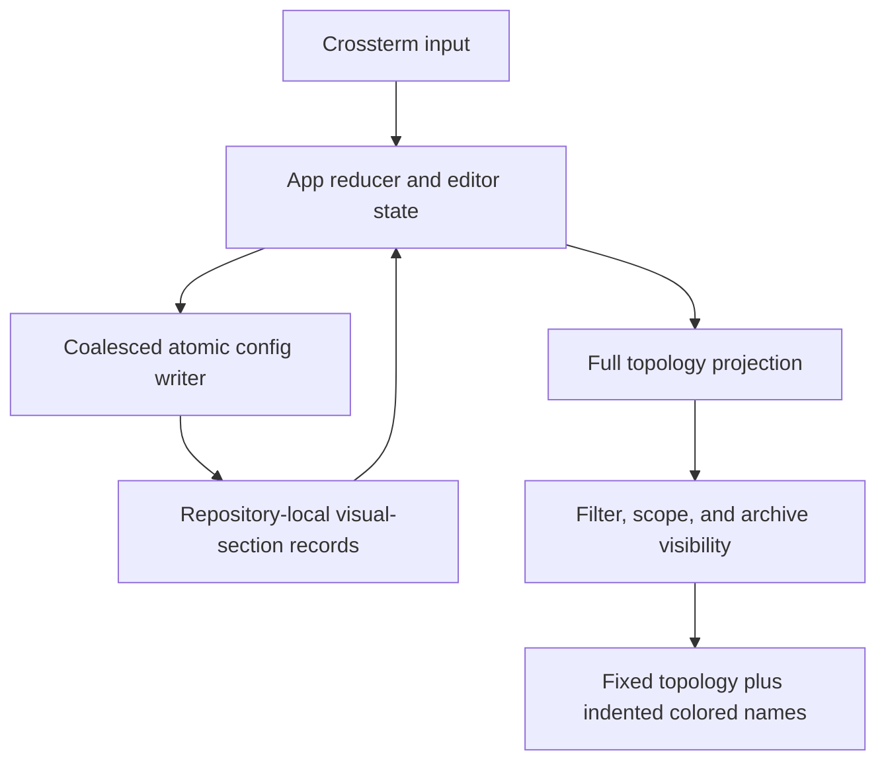
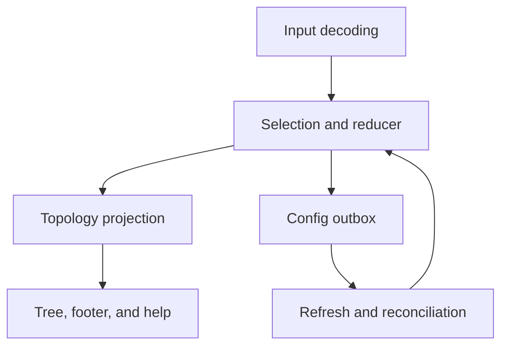

# feat: Add visual feature sections

## Overview

Add repository-local visual sections inside real Git stacks. A user can press `i` on a branch to start or remove a section, giving that branch and all branches above it a cumulative name-only indent and a distinct color. Sections may be named and recolored, but never alter Git, Graphite metadata, real topology lanes, or connector geometry. The same work upgrades existing stack-name rows into selectable, inline-editable rows and fixes printable navigation letters being lost during name editing.

---

## Problem Frame

One real branch stack often contains several dependent product features. The current map truthfully shows Git ancestry but cannot visually group those feature ranges. Users need persistent, purely visual boundaries that communicate where one feature ends and the next begins without fabricating Git forks. Existing stack naming also edits in the footer, cannot accept several navigation letters, and produces a label that cannot be selected for later editing.

---

## Requirements Trace

- R1. `i` toggles a persistent visual boundary anchored to the selected non-trunk branch without changing Git or Graphite state.
- R2. A boundary covers its anchor and every branch above it until the next boundary or real stack end; successive boundaries add cumulative name-only indentation while topology circles/connectors stay fixed.
- R3. Each visual section resolves to a deterministic concrete palette color different from the effective colors of the immediately adjacent ranges, including the unsectioned base range; `c`/`C` recolor a section only from its boundary branch or label and prevent adjacent duplicates in UI-created mutations.
- R4. Removing a boundary atomically removes its name/color and merges its branches into the section below, including that lower section's color treatment.
- R5. `n` on an unnamed section boundary or unnamed stack creates an inline label row at the visual top of its owned range, jumps selection there, and starts editing; an existing name must be selected and opened with Enter.
- R6. Stack and visual-section labels are ordinary selectable rows. Enter edits; an empty confirmed draft removes only the label and returns selection to its anchor/head; Escape restores the prior value.
- R7. Name editing renders the live draft in the tree, reserves the footer for instructions, accepts all printable characters (including `j/k/g/G/J/K`), treats Shift+Backspace as Backspace, and disables all unrelated bindings.
- R8. Boundaries, names, and colors survive restart, concurrent/coalesced config writes, refresh, filtering, focus, and archive projection. A boundary follows its branch if that branch moves to another real stack; absent, trunk, or unmapped anchors are pruned after authoritative refresh.
- R9. The feature preserves 40-column rendering, viewport-bounded work, linear projection metadata, `NO_COLOR` readability, existing real-stack colors, and branch-only action safety.

---

## Scope Boundaries

- No Git commits, refs, parents, Graphite metadata, restacking, checkout behavior, or remote state is changed.
- Visual sections are flat contiguous ranges within one real stack; their displayed indentation accumulates, but sections do not become a second topology graph.
- Branch-name anchoring follows the existing reversible local-config identity model; stronger rename-stable identity is deferred.
- Manual section colors affect the divider, label, and branch-name text only. Real topology glyphs, rails, connectors, and their stack colors remain authoritative.
- The unsectioned/base range uses the effective real-stack color for its branch-name text and participates as the lower neighbor of the first manual section.
- This work does not change Dependabot or release automation.

---

## Context & Research

### Relevant Code and Patterns

- `src/config.rs` provides backward-compatible TOML loading, validation, bounded cross-process locking, atomic replacement, and field-aware mutation merging.
- `src/app.rs` overlays pending config changes across refreshes and owns keyboard reducer, editor, color picker, selection, and stale-identity cleanup behavior.
- `src/model/topology.rs` and `src/model/topology/projection.rs` build linear projection metadata before `src/ui/tree.rs` renders only visible rows.
- `StackLabelRow` already emits immediately above a real stack head, but selection maps currently contain branches only.
- `src/events.rs` currently converts `j/k/g/G/J/K` into navigation before the active editor sees them; ordinary character interpretation belongs in normal-mode reduction instead.

### Institutional Learnings

- `memory.md` and `changelog.md` require fixed truthful topology, stack-local alignment, reversible repository-local configuration, sequence-safe coalesced writes, 40-column behavior, and all-target verification.
- `docs/solutions/` has no available local artifacts. The existing completed plans establish that projection/index data must remain linear and mutation cleanup must use retained identities rather than current selection.

### External References

- None. This feature is fully covered by established Crossterm, Ratatui, reducer, projection, and config patterns in this repository.

---

## Key Technical Decisions

| Decision | Rationale |
|---|---|
| Persist one visual-section record keyed by anchor branch | Boundary, optional name, and concrete palette color can be created/removed atomically without orphan fields and can follow the branch across topology changes. |
| Use tagged selection targets for branches, stack labels, and section labels | Labels become first-class rows without inventing fake branch IDs or allowing branch-only actions accidentally. |
| Compute section membership/depth from the complete real stack before visibility filters | Search, archive, and focused views cannot make indentation jump or reinterpret membership. |
| Store manual text indentation separately from topology lane/depth | Branch circles and connectors remain truthful and unchanged. |
| Decode ordinary character keys as characters, then interpret navigation in normal mode | Editors receive all printable letters while normal `j/k/g/G/J/K` navigation remains intact. |
| Reuse the existing palette and semantic-color exclusions | Section colors remain consistent with current color accessibility and `NO_COLOR` behavior. |

Externally edited legacy/conflicting colors are not rewritten merely by viewing the map. Projection resolves them deterministically to a non-conflicting effective color, and the picker displays saved versus effective state using the existing conflict pattern; the next explicit recolor persists a valid concrete choice.

---

## Open Questions

### Resolved During Planning

- Boundary direction: the anchor and branches above it form the new section.
- Visual treatment: names and labels shift; topology glyphs do not.
- Naming: `n` creates only missing labels; existing labels are selected and edited with Enter.
- Boundary removal: name/color are removed and the range merges downward.
- Color conflicts: adjacent sections may not share a color; non-adjacent reuse is allowed.
- Creation flow: `i` does not force immediate naming.
- Coincident headers: when a stack label and the highest section label share a head, the stack label renders first, followed by the indented section label, then the branch.

### Deferred to Implementation

- Exact internal type/helper names may change to avoid confusion with existing trunk-level `ProjectedSection` types.
- The renderer may choose the narrowest legible divider glyph consistent with 40-column and `NO_COLOR` tests.

---

## High-Level Technical Design

> *This illustrates the intended approach and is directional guidance for review, not implementation specification. The implementing agent should treat it as context, not code to reproduce.*

The projection assigns each real branch its visual-section anchor and accumulated text-indent level from the complete stack ordering. Visibility then decides which rows emit without recomputing those values. Selection identifies either a branch or a label target. Branch-only actions explicitly reject label targets, while label Enter and contextual `c`/`C` dispatch through the label target.

---

## Implementation Units

- [x] U1. **Persist atomic visual-section records**

**Goal:** Extend repository-local configuration and the coalesced mutation path with boundary records that own optional names and explicit palette colors.

**Requirements:** R1, R3, R4, R8

**Dependencies:** None

**Files:**
- Modify: `src/config.rs`
- Modify: `src/app/state.rs`
- Test: `src/config.rs`

**Approach:**
- Add a backward-compatible defaulted map keyed by boundary anchor branch, with validation for bounded single-line names and allowed colors.
- Add field-aware visual-section mutations that merge with unrelated archive, stack color, and stack-name writes under the existing lock/atomic-save contract.
- Define the typed section mutation payload needed for App-owned pending overlays, pruning, and deletion reconciliation in U3.

**Patterns to follow:**
- `ConfigMutation` merge/apply and `App::pending_config_mutation`.
- Existing archive pruning and deleted-identity cleanup.

**Test scenarios:**
- Happy path: legacy TOML without visual sections loads unchanged; a boundary with color/name round-trips.
- Happy path: one mutation creates a section and another removes its complete record atomically.
- Integration: concurrent config mutations changing archives, stack names, stack colors, and visual sections preserve every unrelated field.
- Error path: invalid colors, multiline names, and overlong names fail without changing the last valid config; an empty editor commit becomes `None` and is never persisted as an invalid empty string.

**Verification:**
- Visual-section persistence is backward compatible, atomic, sequence-safe, and bounded like existing config features.

- [x] U2. **Project sections and selectable labels without changing topology**

**Goal:** Add complete-stack section membership, cumulative manual indentation, boundary/label rows, and tagged selectable targets while preserving real lanes and connectors.

**Requirements:** R2, R5, R6, R8, R9

**Dependencies:** U1

**Files:**
- Modify: `src/model/topology.rs`
- Modify: `src/model/topology/projection.rs`
- Test: `src/integration_tests/topology_layout.rs`
- Test: `src/integration_tests/archive_workflow.rs`

**Approach:**
- Represent branch and label selection with distinct semantic identities; never overload `BranchId` for labels.
- Precompute each valid boundary's segment and cumulative text depth from the authoritative real-stack order before applying filter/archive/scope visibility. Accept an optional ephemeral label/draft projection input so U2 can model its row and selection identity before U3 wires live editor state into it.
- Carry text-indent and section identity on projected branch/label rows separately from topology lane/depth.
- Emit the boundary divider immediately below its anchor. Emit a selectable section label above the first emitted selectable named-visible branch owned by that section for named or actively edited sections; `n` may therefore jump from the anchor to this deliberately floating visible-range header. Context-only rows do not keep a label alive. Do not emit a stored label when its range has no selectable named-visible branch, and repair a disappearing label selection to its anchor/head or nearest visible selectable row without deleting metadata. Existing stack labels remain above the true stack head and become selectable through the same target abstraction. When both headers share the head, emit stack label, section label, then branch.
- Keep projection entries/maps linear and retain branch-only maps where checkout, archive, focus, and details require them.

**Execution note:** Add characterization coverage for existing stack emission and navigation maps before replacing branch-only selection.

**Patterns to follow:**
- Iterative stack emission and projection-local indexes in `src/model/topology.rs`.
- Existing stack-label placement immediately above the true head.

**Test scenarios:**
- Happy path: one boundary indents its anchor and every branch above it exactly once; two boundaries produce cumulative depths.
- Happy path: a named boundary emits its selectable label above the highest branch in its owned range, its divider is immediately below the anchor, and a stack label remains above the real head.
- Happy path: a three-branch fixture spells out exact top-to-bottom entries for one and two boundaries so root-to-head storage cannot invert the screen contract.
- Edge case: side stacks compute independent sections and do not inherit boundaries from a parent stack.
- Edge case: filtering, stack/trunk focus, Active view, and Archive view preserve depths computed from hidden anchors and branches.
- Edge case: unnamed boundaries emit a divider but no empty selectable label; an active empty draft temporarily emits a selectable label.
- Invariant: every real branch retains the same topology lane/connectors with and without visual sections.
- Scale: deep and broad 5,000-branch fixtures keep projection metadata linear.

**Verification:**
- Section metadata changes only text layout and label selection; topology truth, uniqueness, and scale remain intact.

- [x] U3. **Implement boundary, color, selection, and inline-editor interactions**

**Goal:** Make `i`, contextual `n/c/C`, label navigation, Enter editing, and raw-character editor ownership behave exactly as specified.

**Requirements:** R1, R3, R4, R5, R6, R7, R8, R9

**Dependencies:** U1, U2

**Files:**
- Modify: `src/events.rs`
- Modify: `src/app.rs`
- Modify: `src/app/state.rs`
- Test: `src/integration_tests/navigation_checkout.rs`
- Test: `src/integration_tests/terminal_interaction.rs`
- Test: `src/integration_tests/archive_workflow.rs`
- Test: `src/integration_tests/refresh_pipeline.rs`

**Approach:**
- Interpret ordinary character navigation only in normal mode so name editing receives raw printable characters first.
- Dispatch the name editor before global quit and repeat filtering. Give it exclusive input ownership over quit/navigation/action shortcuts; printable characters and Backspace repeat as editing input, Enter commits, and Escape rolls back.
- Make Up/Down navigation include label targets. Enter edits labels and only checks out branch targets.
- Dispatch `n` deterministically: a boundary branch with a named section reports that the label must be selected and edited with Enter; a boundary with no name creates/selects its section label; a non-boundary branch in an unnamed stack creates/selects its stack label; and a branch in a named stack reports the same navigate-and-Enter guidance. A boundary never falls through to stack naming.
- `i` creates a boundary with a deterministic allowed color or removes the entire record. Trunks, label rows, and invalid targets produce bounded feedback without mutation.
- Generalize color targeting so `c`/`C` act on a selected section label or exact boundary branch and otherwise preserve stack behavior, including ordinary member branches whose displayed names use a section color. Cycle/picker choices exclude Auto and skip the effective colors of the base/section ranges immediately below and above. Base-stack recoloring also avoids the first section color.
- Revalidate picker adjacency at preview/commit time; if external refresh leaves no valid preview, roll back and report it. Under `NO_COLOR`, unavailable choices remain textually marked.
- Reconcile label selection across save, deletion, refresh, filter, and anchor loss: section labels fall back to their anchor, stack labels to the true head, then both fall back to the nearest visible selectable target. Branch-only actions provide short non-destructive feedback on labels.
- Centralize compatibility around tagged selection: expose explicit selected-branch extraction for branch-only operations and explicit label-owner/visual-row lookup for details, footer status, saved All-view restoration, search restoration, archive range state, deletion recovery, `--current`, stack/section jumps, sticky scrolling, and refresh reconciliation. Labels show owner context without masquerading as the selected branch.
- Track pending section mutations by anchor and sequence; overlay them across config reloads, prune absent/trunk/unmapped anchors through persisted mutations, and include complete section cleanup in successful branch-deletion reconciliation.

**Patterns to follow:**
- Existing overlay reducers, live color preview/rollback, config registration, selection repair, and mutation refusal messages.

**Test scenarios:**
- Happy path: `i` creates a distinct-colored boundary and a second `i` removes its boundary/name/color and merges downward.
- Happy path: `n` on an unnamed target creates and selects an inline row; typing then Enter persists it; existing names edit only through label Enter.
- Happy path: `n` on a branch whose relevant section/stack name already exists leaves selection/editor state unchanged and reports that the label must be selected.
- Happy path: empty Enter removes a label and returns selection to its section anchor or stack head; Escape restores the prior text and selection.
- Happy path: `c` and `C` target sections contextually and never choose either adjacent segment's color.
- Edge case: section insertion between two differently colored neighbors chooses a third available color deterministically.
- Edge case: Up/Down visits labels, while stack/section jumps and focus restoration remain deterministic.
- Edge case: label selection preserves or repairs search restore, archive range, deletion recovery, `--current`, focused/sticky scrolling, details, and stack/section jumps.
- Safety: checkout, archive, delete, URL, scope, and other branch-only actions never operate on label targets.
- Input: `j`, `k`, `g`, `G`, `J`, `K`, punctuation, spaces, Backspace, and Shift+Backspace edit text; all normal bindings are disabled until Enter/Escape.
- Input: character and Backspace repeats edit the draft; Ctrl-C is inert while editing rather than quitting.
- Regression: outside the editor, existing character and modified-arrow navigation remains unchanged.
- Integration: pending create/recolor/rename/remove operations survive structural refresh and coalesce without replaying stale state.
- Integration: an older writer completion cannot restore a removed boundary, while only a successful authoritative refresh prunes anchors that are absent, trunks, or mapped to no real stack; stack roots remain valid and failed/partial refreshes never prune.

**Verification:**
- Every agreed interaction is reducer-owned, deterministic, reversible, and safe on label versus branch targets.

- [x] U4. **Render inline labels, colored sections, and narrow layouts**

**Goal:** Render section boundaries, cumulative name indentation, selectable labels, and live editor drafts without moving topology or sacrificing narrow-terminal behavior.

**Requirements:** R2, R3, R5, R6, R7, R9

**Dependencies:** U2, U3

**Files:**
- Modify: `src/ui/tree.rs`
- Modify: `src/ui/layout.rs`
- Modify: `src/ui/panels.rs`
- Modify: `src/ui/theme.rs`
- Test: `src/integration_tests/tui_rendering.rs`

**Approach:**
- Offset only the branch-name/label text origin by the projected manual indent; leave rail and node coordinates driven solely by real lane geometry.
- Render boundary divider, label, and branch-name text with the resolved visual-section color. Preserve semantic diff colors and existing real-stack glyph colors.
- Substitute the editor draft and cursor treatment into the matching label row. Show instructions, not draft content, in the footer.
- Give selected label rows an accessible selection treatment and retain textual structure under `NO_COLOR`.
- Clamp/truncate manual indentation so 40-column rows never wrap and retain useful branch identity. If distinct depths compress to one text column, retain a compact non-color depth/continuation cue so adjacent ranges remain distinguishable.
- Preserve the existing append-and-Backspace editor model, count the established Unicode character limit consistently, keep the end cursor visible under truncation, and report validation failure without losing the draft.

**Patterns to follow:**
- Cell-based row painting, `RenderGeometry`, overflow cues, semantic diff spans, and edge-to-edge selection styles.

**Test scenarios:**
- Happy path: branch names and labels shift cumulatively while captured node/connector columns remain byte-for-byte aligned.
- Happy path: section divider, label, and name text use the section color; topology glyphs retain the real stack color.
- Happy path: editor keystrokes update the tree row live and the footer contains instructions without duplicating the draft.
- Edge case: unnamed boundaries, removed labels, selected labels, and adjacent sections render unambiguously.
- Edge case: 40-column output does not wrap and preserves a useful truncated branch name at deep manual indentation.
- Edge case: deep indentation that must compress still distinguishes adjacent section depths without relying on color.
- Accessibility: `NO_COLOR` output retains divider/indent/selection meaning and semantic additions/deletions remain distinguishable.

**Verification:**
- Rendered output communicates visual grouping while preserving truthful topology and all width/accessibility contracts.

- [x] U5. **Document, regress, and prepare a local test build**

**Goal:** Update user-facing controls, prove the complete behavior, and produce an installable release binary for hands-on testing.

**Requirements:** R1-R9

**Dependencies:** U1, U2, U3, U4

**Files:**
- Modify: `README.md`
- Modify: `docs/features.md`
- Modify: `memory.md`
- Modify: `changelog.md`
- Test: `src/integration_tests/tui_rendering.rs`
- Test: `src/integration_tests/navigation_checkout.rs`
- Test: `src/integration_tests/terminal_interaction.rs`

**Approach:**
- Update help/footer documentation for `i`, selectable labels, contextual `n/c/C`, inline editing, and the purely visual/no-Git guarantee.
- Run formatting, strict offline Clippy, all-target/all-feature tests, doctests, and offline release build on pinned Rust 1.88.0.
- Install the verified release binary to `/Users/matt/.cargo/bin/stackmap`, verify its digest matches `target/release/stackmap`, and use a PTY interaction harness in a disposable repository to drive section creation, editor character entry, persistence across restart, and clean quit against the installed artifact.

**Test scenarios:**
- Integration: create, name, recolor, restart, edit via label Enter, remove the label, remove the boundary, and confirm Git refs/OIDs remain unchanged.
- Integration: exercise multiple adjacent sections plus a real side-stack split and confirm only names receive manual indentation.
- Operational: installed `stackmap` reports the expected version, starts outside the source repository, and restores the terminal after quit.
- Operational: the installed artifact matches the verified release build, doctests pass explicitly, and Ctrl-C during name editing does not exit the PTY session.

**Verification:**
- Documentation matches the executable, the full established suite passes, and the installed binary is ready for user testing.

---

## System-Wide Impact

- **Interaction graph:** Input decoding, selection identity, reducer overlays, projection emission, config persistence/reload, tree rendering, footer/help, and branch mutation guards all change together.
- **Error propagation:** Invalid names/colors or stale anchors produce bounded reducer messages; persistence failures retain the established last-valid config and quit-drain behavior.
- **State lifecycle risks:** Pending writes must not resurrect removed boundaries; ephemeral label rows must disappear on cancel and reconcile safely if their target vanishes.
- **API surface parity:** Runtime facade types should remain private unless existing integration/benchmark seams require exposure; CLI grammar and version stay unchanged.
- **Integration coverage:** Cross-layer tests must prove config reload/persistence, projection membership, navigation/editor state, and rendering together.
- **Unchanged invariants:** Git/Graphite state, real topology lanes/connectors, archive/delete safety, bounded workers, and viewport-linear rendering remain unchanged.

---

## Risks & Dependencies

| Risk | Mitigation |
|---|---|
| Branch-only selection assumptions are widespread | Introduce one tagged target abstraction and centralize branch extraction/guards rather than patching fake IDs. |
| Hidden boundaries alter visible indentation unexpectedly | Compute depth before filter/archive/scope visibility and test each projection mode. |
| Adjacent colors conflict after external config edits | Resolve effective colors deterministically at projection time and persist only through validated UI mutations. |
| Manual indentation consumes narrow layouts | Keep it independent from lane pitch, saturate offsets, and add explicit 40-column fixtures. |
| Editor loses keys or triggers actions | Preserve raw character events and dispatch the editor before all global bindings. |
| Config cleanup removes unrelated stack metadata | Use distinct stack and section target identities in mutations and deletion reconciliation. |

---

## Documentation / Operational Notes

- The installed test build should be treated as local evaluation only; no PR, push, release, or tag is part of this plan.
- Document that sections are repository-local visual metadata stored under the Git common directory and do not affect collaborators unless they share that local config.

---

## Sources & References

- Related code: `src/config.rs`, `src/app.rs`, `src/events.rs`, `src/model/topology.rs`, `src/model/topology/projection.rs`, `src/ui/tree.rs`
- Related plans: `docs/plans/2026-07-19-001-feat-stable-stackmap-workflow-plan.md`, `docs/plans/2026-07-18-001-feat-graphite-stack-lanes-plan.md`
- Project context: `memory.md`, `changelog.md`
