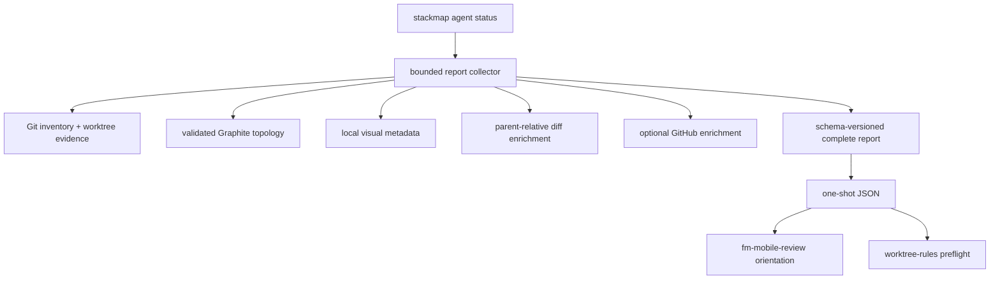
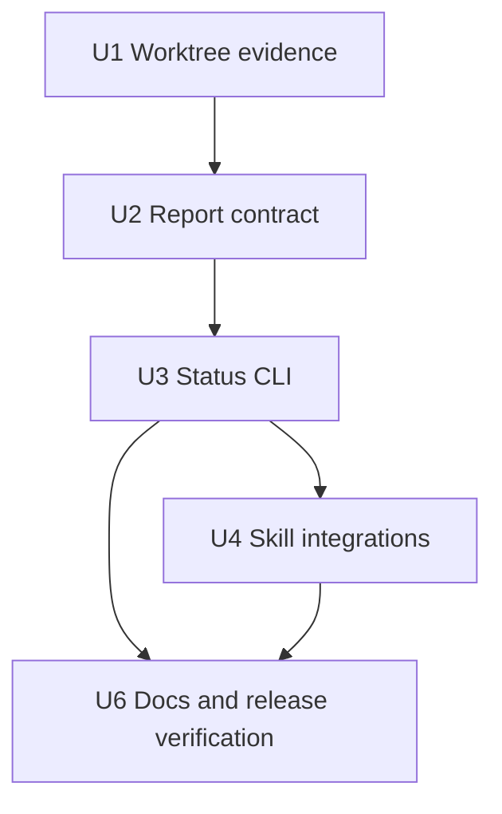
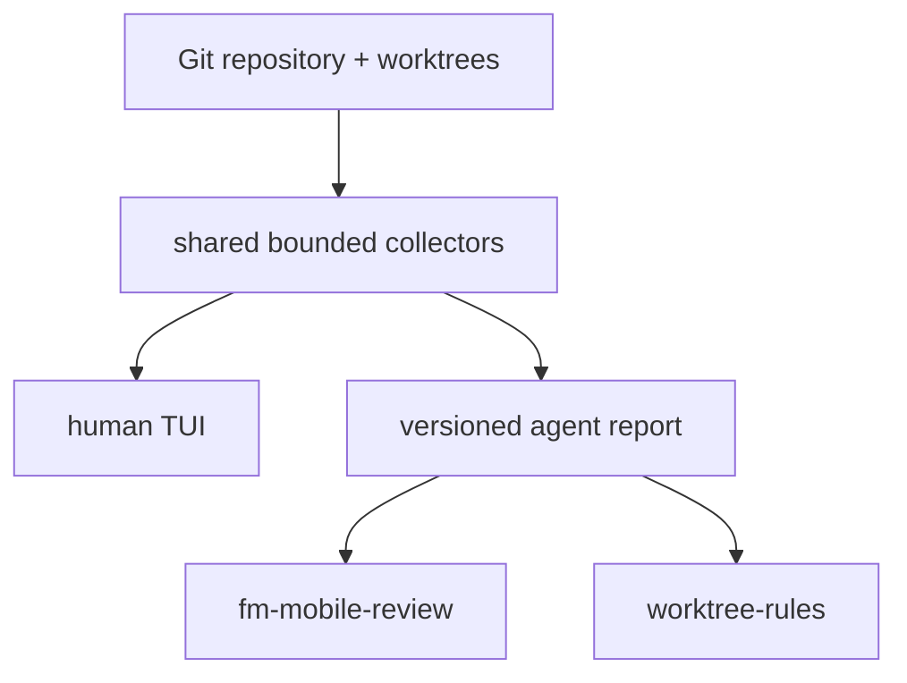

# feat: Add an agent-facing repository status CLI

## Overview

Give coding agents a stable, read-only view of the same repository and stack state that Stackmap presents to a person. The first delivery adds a namespaced one-shot JSON status command, trustworthy per-worktree cleanliness, a clearer TUI dirty indicator, and thin integrations for `fm-mobile-review` and `worktree-rules`. A resilient JSONL watch stream is deferred until one-shot usage demonstrates a concrete continuous-observation need.

The API is a purpose-built, versioned machine contract. It does not serialize TUI state, scrape rendered output, or grant agents new Git mutation authority.

| Surface | First delivery | Second delivery | Deferred |
|---|---|---|---|
| CLI | `stackmap agent status` | `stackmap agent watch` | Mutation commands |
| Repository state | Git/Graphite topology, OIDs, worktrees, cleanliness, diffs, local visual metadata | Complete replaceable snapshots after changes | Commit/file-detail API |
| Optional providers | Typed config/Graphite health; opt-in bounded GitHub enrichment | Provider transitions without stale claims | Remote fetch or server-truth claims |
| Agent workflow | Review/worktree discovery and preflight | Long-running observation | Agent progress annotations and MCP wrapper |

---

## Problem Frame

Agents currently rediscover branch relationships, worktree ownership, dirty state, diff summaries, PR state, and Stackmap's visual organization through several commands. That duplicates work and makes it easy to conflate committed parent-relative diffs with uncommitted changes. Stackmap already gathers most of this context, but its TUI and private runtime types are not safe machine contracts, and linked worktree cleanliness is not currently measured.

The desired result is a fast orientation layer for agent loops. `fm-mobile-review` should spend less time reconstructing the stack before reviewing it, and `worktree-rules` should get a trustworthy preflight snapshot without altering the primary checkout. The separate TUI dirty marker also fulfills the user's explicit request to distinguish uncommitted work from committed diff information. Git, Graphite, and each skill's existing mutation checks remain authoritative at the moment an action is taken.

---

## Requirements Trace

- R1. Preserve the existing `stackmap [--current] [REPOSITORY]` TUI grammar while adding the unambiguous `stackmap agent status [OPTIONS] [REPOSITORY]` command.
- R2. Emit a documented, versioned, deterministic DTO rather than exposing `App`, `RepositorySnapshot`, or rendered terminal text.
- R3. Report every local branch with exact OID, current/parent/stack/trunk identity, Graphite provenance, parent-relative diff state, worktree ownership, optional PR data, and optional visual stack/section/archive metadata.
- R4. Represent every occupied worktree independently, including primary/linked identity, branch or detached HEAD, exact OID, operation state, and `clean | dirty | unavailable` evidence. Unavailable must never be interpreted as clean.
- R5. Keep one-shot local status bounded and deterministic. Optional GitHub enrichment is opt-in and cannot prevent a usable local snapshot.
- R6. Keep stdout machine-clean, put diagnostics on stderr, and document exit semantics for usable degraded output, invocation/discovery failure, and exhausted consistency retries.
- R8. Update `fm-mobile-review` to use Stackmap status as an orientation accelerator while retaining `gt ls`, actual diff inspection, and immediate OID/Graphite revalidation before mutations.
- R9. Update `worktree-rules` to fail closed on primary cleanliness `dirty` or `unavailable`, detect existing worktree ownership, and revalidate the primary tuple and parent OID before creating a worktree.
- R10. Keep v1 read-only. Local agent progress annotations, MCP packaging, checkout/restack/rename/push operations, and generic shell execution are separate follow-up work.
- R11. Preserve Stackmap's passive-read contract: bounded subprocesses/output/queues, `GIT_OPTIONAL_LOCKS=0`, no fetch, no index refresh, no lock files, and explicit provider degradation.
- R12. Surface uncommitted work separately from committed `+/-` diff information in both the contract and TUI.

---

## Scope Boundaries

- No Git, Graphite, GitHub, worktree, PR, or remote mutation is added.
- No implicit fetch and no claim that local remote-tracking evidence is server truth.
- No generic agent runtime or embedded language model is added to Stackmap.
- No commit list, changed-file list, cumulative diff, or review verdict is included in the initial status schema.
- Visual section names/colors are presentation metadata, never evidence of actual branch ancestry or review category.
- The machine contract supports valid UTF-8 branch names; filesystem paths need an explicit lossless representation or a marked lossy representation before schema v1 is frozen.

### Deferred to Follow-Up Work

- Repository-local agent annotations (`implementing`, `testing`, `reviewing`, `blocked`, `ready`) with agent ID, note, expected OID, timestamp, TTL, atomic writes, and TUI display.
- `stackmap agent watch`, after representative status consumers demonstrate a workflow that cannot be served by repeated bounded one-shot reads and establish the required observation latency. Its follow-up design must resolve interruptible stdout, backpressure, resynchronization, and working-tree observation before implementation.
- A thin MCP adapter over the stable CLI/service contract after real skill usage demonstrates which primitives are valuable.
- Any mutation surface, with a separate plan for dry-run output, exact repository/OID preconditions, approval gates, and postcondition verification.

---

## Context & Research

### Relevant Code and Patterns

- `src/main.rs` owns a hand-rolled `OsString` parser and preserves option-shaped paths through `--`; the agent namespace must extend this without stealing repository names such as `status` or `watch`.
- `src/lib.rs` deliberately keeps implementation modules private and exports only narrow executable seams. The machine schema needs its own private module and explicit DTO boundary.
- `src/adapters/git.rs`, `src/adapters/command.rs`, and `src/refresh/builder.rs` provide bounded passive reads and before/after consistency checks.
- `src/refresh/diffstats.rs` and `src/adapters/github.rs` already establish bounded enrichment and branch-name-plus-OID attachment patterns.
- `src/config.rs` stores validated visual metadata under the common Git directory using locking and atomic replacement.
- `src/integration_tests/repository_snapshot.rs`, `src/integration_tests/refresh_pipeline.rs`, and `src/integration_tests/tui_rendering.rs` provide real-Git, race, boundedness, and rendering test patterns.

### Institutional Learnings

- Git-local inventory remains authoritative; Graphite adds validated topology and must degrade without hiding local branches.
- Structural snapshots and asynchronous enrichments carry generations and OIDs so stale work cannot attach to a newer branch tip.
- The current `dirty: bool` only measures the adapter's active checkout. Linked worktrees are unmeasured, so trustworthy agent preflight requires a tri-state per-worktree model.
- Resource bounds, process-group termination, no index locks, and truthful unknown/unavailable states are public reliability behavior.
- There are no `docs/solutions/` entries for this repository; `memory.md`, `changelog.md`, and the existing plans are the available institutional record.

### External References

- No external research is needed for implementation. Local patterns cover Git, Graphite, GitHub, refresh, serialization dependencies, and safety behavior. Agent-native architecture guidance contributes the parity, primitive-tool, dynamic-context, and approval-boundary principles reflected here.

---

## Key Technical Decisions

| Decision | Rationale |
|---|---|
| Namespace commands under `stackmap agent` | Preserves legacy positional repository paths and leaves room for later agent-specific primitives. |
| Define a schema-versioned report DTO | Prevents private UI/domain types from becoming accidental compatibility promises. |
| Make local status the default; gate GitHub behind `--github` | Keeps startup bounded and deterministic when network/authentication is unavailable. |
| Model cleanliness on worktrees, not branches | Dirty files belong to checked-out working directories; `unavailable` must fail closed. |
| Keep skills authoritative for mutations | Status improves context, but cannot prove a later mutation remains safe after concurrent repository changes. |
| Delay MCP until the CLI contract is exercised | A CLI is universally composable today; observed usage can determine whether MCP needs `status`, `branch_detail`, `watch`, or other primitives. |

---

## Open Questions

### Resolved During Planning

- Command naming: use `stackmap agent status`, not a top-level subcommand; reserve `stackmap agent watch` for the separately justified follow-up.
- GitHub behavior: local-only by default; `--github` requests bounded optional enrichment.
- Watch payloads: emit complete replaceable snapshots first; do not expose internal refresh deltas.
- Dirty semantics: `clean`, `dirty`, and `unavailable` per worktree, separate from committed diffstats.
- Failure semantics: provider degradation remains exit 0 when a coherent Git snapshot exists; invocation/discovery failure exits 2; exhausted consistency attempts exit 3.
- Mutation authority: none in this plan.

### Deferred to Implementation

- Exact DTO field names and path encoding after representative fixtures validate readability and losslessness.
- Whether worktree dirtiness includes only tri-state evidence in schema v1 or also staged/unstaged/untracked counts; implement counts only if the existing porcelain parser can provide them without weakening bounds.

---

## Output Structure

Target repo: Stackmap

```text
src/
  agent/
    mod.rs
    report.rs
src/integration_tests/
  agent_status.rs
tests/fixtures/agent/
  schema-v1.json
docs/
  agent-integration.md
```

Companion skill workspace changes remain in their existing packages:

```text
fm-mobile-review/
  SKILL.md
worktree-rules/
  SKILL.md
```

This tree is a scope guide; per-unit file lists govern the final layout.

---

## High-Level Technical Design

> *This illustrates the intended approach and is directional guidance for review, not implementation specification. The implementing agent should treat it as context, not code to reproduce.*



The agent receives the user's current repository vocabulary and state through the report. It composes that context with existing Git/Graphite primitives; Stackmap does not encode review or worktree-creation judgment in a workflow-shaped command.

---

## Implementation Units



- [ ] U1. **Model trustworthy per-worktree cleanliness**

**Goal:** Replace the active-checkout-only dirty assumption with bounded evidence for every occupied worktree and show it independently from committed diffstats.

**Requirements:** R4, R11, R12

**Dependencies:** None

**Files:**
- Modify: `src/adapters/git.rs`
- Modify: `src/adapters/git/inventory.rs`
- Modify: `src/adapters/command.rs`
- Modify: `src/model/branch.rs`
- Modify: `src/refresh/builder.rs`
- Modify: `src/ui/tree.rs`
- Test: `src/integration_tests/repository_snapshot.rs`
- Test: `src/integration_tests/tui_rendering.rs`

**Approach:**
- Inventory primary and linked worktrees with stable identity, checked-out branch or detached OID, and primary/linked classification.
- Run the existing bounded passive status command in each distinct accessible worktree. Preserve `unavailable` with a typed reason when a path vanishes, cannot be read, or times out.
- Associate branches with worktree records rather than treating false as both clean and unmeasured.
- Render an explicit dirty marker/badge independently from parent-relative additions/deletions; keep branch topology and colors unchanged.

**Execution note:** Add characterization coverage for today's primary-checkout dirty behavior before replacing the boolean model.

**Patterns to follow:**
- Passive command bounds and `GIT_OPTIONAL_LOCKS=0` in `src/adapters/command.rs`.
- Exact worktree ownership refusal in `src/adapters/git.rs`.

**Test scenarios:**
- Happy path: clean primary plus clean linked worktree reports both clean and renders no dirty marker.
- Happy path: dirty primary and dirty linked worktree each report dirty on the correct worktree/branch while committed `+/-` remains unchanged.
- Edge case: detached and unborn worktrees remain representable without inventing branch ownership.
- Error path: a linked path disappears or becomes unreadable during inspection and reports unavailable, never clean.
- Safety: status commands create no index lock, honor time/output bounds, and terminate descendants on timeout.
- Rendering: selected/current row styling keeps the separate dirty marker legible.

**Verification:**
- Every occupied worktree has explicit cleanliness evidence and the TUI can distinguish uncommitted changes from committed diffstats.

- [ ] U2. **Define the versioned agent report contract**

**Goal:** Create a deterministic public data contract and a bounded synchronous collector without exposing Stackmap internals.

**Requirements:** R2, R3, R4, R5, R6, R11

**Dependencies:** U1

**Files:**
- Create: `src/agent/mod.rs`
- Create: `src/agent/report.rs`
- Modify: `src/lib.rs`
- Modify: `src/refresh/builder.rs`
- Modify: `src/refresh/diffstats.rs`
- Modify: `src/adapters/github.rs`
- Modify: `src/config.rs`
- Test: `src/integration_tests/agent_status.rs`
- Create: `tests/fixtures/agent/schema-v1.json`

**Approach:**
- Define explicit serializable DTOs with `schema_version`, stable repository identity/root, capture time, source fingerprint, process generation, typed repository/provider/freshness states, deterministic branch/worktree ordering, and optional visual metadata.
- Build a one-shot collector from the same Git/Graphite/config/diff/GitHub primitives as the TUI, with an overall deadline and bounded consistency retries.
- Make absence distinguishable from not requested, pending, unavailable, timed out, stale, or confirmed none. A successful one-shot should not leave required local fields in loading state.
- Treat config and Graphite problems as typed degradation while retaining coherent Git inventory. Attach PRs only when branch name and exact tip OID still match.
- Review the candidate schema against a fixture matrix covering clean, dirty, detached, degraded, unavailable, and path-encoding cases before declaring schema v1 stable.

**Patterns to follow:**
- Before/after source-token validation in `src/refresh/builder.rs`.
- OID-keyed enrichment and stale-result rejection in `src/refresh/diffstats.rs` and `src/adapters/github.rs`.
- Private-module/public-contract boundary in `src/lib.rs`.

**Test scenarios:**
- Happy path: a multi-stack fixture produces deterministic schema-v1 JSON containing exact OIDs, parents, stacks, worktrees, diffs, and visual metadata.
- Edge case: archived/deleted visual-section anchors are pruned or omitted without corrupting branch truth.
- Edge case: non-UTF-8 worktree paths follow the chosen documented representation and round-trip or carry an explicit lossy marker.
- Degradation: missing/malformed/changing Graphite metadata preserves all local branches and reports typed provider state.
- Degradation: config parse failure and GitHub unavailable/timed out are explicit and do not fail the local report.
- Race: branch OID or Graphite source changes during collection triggers bounded retry; exhausted retries return no incoherent report.
- Contract: the golden fixture is stable, ordered, and contains no private Rust debug representation.

**Verification:**
- An independent consumer can validate schema version and reliably distinguish trustworthy values from unavailable or stale evidence.

- [ ] U3. **Add the one-shot agent status CLI**

**Goal:** Expose the report as a stable, composable command without changing normal TUI invocation.

**Requirements:** R1, R5, R6, R10

**Dependencies:** U2

**Files:**
- Modify: `src/main.rs`
- Test: `src/main.rs`
- Test: `src/integration_tests/agent_status.rs`

**Approach:**
- Extend the parser with `stackmap agent status [--github] [REPOSITORY]`, retaining `--current`, legacy positional paths, help/version behavior, and `--` handling for option-shaped paths.
- Print exactly one JSON document plus newline to stdout. Send human diagnostics only to stderr.
- Return exit 0 for a coherent local snapshot even when Graphite, config, or optional providers degrade, 2 for CLI invocation or repository-discovery failure before output, and 3 when consistency retries cannot produce a coherent snapshot.
- Keep GitHub opt-in with a bounded deadline; do not fetch remotes.

**Patterns to follow:**
- Existing `CliAction` parser tests and thin process shell in `src/main.rs`.

**Test scenarios:**
- Happy path: status from repository argument and current directory produces one parseable JSON document and exit 0.
- Compatibility: legacy TUI invocations and a repository path literally named `agent`, `status`, or `watch` remain addressable, including through `--`.
- Option behavior: `--github`, help, version, duplicate/unknown flags, and option-shaped paths parse deterministically.
- Degradation: GitHub/Graphite/config failures remain structured output with exit 0 when Git inventory is coherent.
- Error path: non-repository input emits no JSON, a concise stderr diagnostic, and exit 2; exhausted consistency retries emit no partial document and exit 3.
- Output hygiene: stdout contains no progress, tracing, ANSI control, or provider diagnostic text.

**Verification:**
- Shell and agent consumers can parse stdout without terminal emulation or log filtering, while all existing TUI CLI tests remain green.

- [ ] U4. **Integrate status into review and worktree skills**

**Goal:** Use one coherent snapshot to reduce repeated discovery while preserving each skill's established safety and review authority.

**Requirements:** R8, R9, R10

**Dependencies:** U3

**Files:**
- Modify in Codex skills workspace: `fm-mobile-review/SKILL.md`
- Modify in Codex skills workspace: `worktree-rules/SKILL.md`
- Test expectation: none in the Stackmap repository; validate both skills with representative dry-run transcripts and their own package checks.

**Approach:**
- Teach both skills to discover `stackmap`, require a supported schema version, and fall back to their existing Git/Graphite discovery when unavailable or incompatible.
- For `fm-mobile-review`, consume current branch, parents, stack bounds, OIDs, worktree state, diff summaries, PR/provider health, and optional section labels only for orientation. Continue `gt ls`, actual parent-relative/cumulative diff inspection, tests, and immediate expected-OID validation before amendments, moves, renames, restacks, or submits.
- For `worktree-rules`, capture repository identity plus primary path/branch/OID/cleanliness, fail closed on dirty or unavailable primary evidence, detect existing branch ownership, and revalidate the primary tuple and chosen parent OID immediately before worktree creation and after work.
- At the mutation boundary, bracket a fresh bounded primary-cleanliness read with repository/branch/OID checks so the cleanliness evidence describes the same state; abort as a changed precondition if it is dirty/unavailable or either identity check changes.
- Treat concurrent precondition changes as a distinct stale-snapshot failure with a refresh/retry path.

**Patterns to follow:**
- Existing authority and fresh-agent constraints in both skill files.

**Test scenarios:**
- Review: coherent status shortens discovery but real diffs determine Storybook/frontend/backend/tests classification.
- Review fallback: missing binary, unsupported schema, degraded Graphite, or changed OID returns to existing discovery without weakening checks.
- Worktree preflight: dirty or unavailable primary state refuses before filesystem/Git mutation.
- Worktree ownership: an already checked-out branch resolves to its owning path instead of creating a duplicate worktree.
- Race: parent or primary OID changes after snapshot and immediate revalidation aborts with a specific precondition-changed result.
- Invariant: neither skill treats visual names/colors, PR absence, or agent metadata as mutation authorization.

**Verification:**
- Both skills save discovery work when Stackmap is available and behave at least as safely when it is missing, stale, or degraded.

- [ ] U6. **Document and release the agent contract**

**Goal:** Make the CLI usable without reading source and lock its compatibility/safety promises into release verification.

**Requirements:** R1-R6, R8-R12

**Dependencies:** U3, U4

**Files:**
- Create: `docs/agent-integration.md`
- Modify: `README.md`
- Modify: `docs/features.md`
- Modify: `docs/support.md`
- Modify: `docs/releasing.md`
- Test: `src/integration_tests/agent_status.rs`

**Approach:**
- Document command grammar, schema/versioning policy, field trust/freshness semantics, stdout/stderr contract, exit codes, GitHub opt-in behavior, path encoding, and examples for both skills before the first status release.
- Publish a capability map: TUI/status parity for read operations, skill-owned composition, and explicitly unavailable mutation capabilities.
- Add release checks for golden schema output, packaged docs/fixtures, passive no-lock behavior, large-repository bounds, and clean install smoke tests.

**Patterns to follow:**
- Public behavior and troubleshooting structure in `README.md`, `docs/features.md`, `docs/support.md`, and `docs/releasing.md`.

**Test scenarios:**
- Documentation examples validate as schema-v1 output and use only released commands.
- Packaged source contains the contract documentation and fixtures.
- Installed binary produces machine-clean one-shot output from a clean fixture and a degraded-provider fixture.
- Passive smoke test shows no index lock, orphan process, unexpected fetch, or material settled CPU use.

**Verification:**
- An agent author can integrate Stackmap from the public docs alone and knows which facts are authoritative, stale, optional, or advisory.

---

## System-Wide Impact



- **Interaction graph:** Git/worktree/Graphite/config/GitHub readers feed a shared collector; the TUI retains private state while agent CLI serialization maps into a separate DTO; two external skills consume the DTO and continue using their existing mutation primitives.
- **Error propagation:** Core Git discovery failure prevents output. Optional provider/config/worktree evidence failures remain typed data in an otherwise coherent report.
- **State lifecycle risks:** A report can become stale immediately after emission; exact OIDs, fresh cleanliness evidence, and repository identity exist for mutation-boundary revalidation.
- **API surface parity:** Read-only TUI facts become agent-readable. TUI mutations intentionally have no agent parity in v1 because their stakes require a separately designed approval boundary.
- **Integration coverage:** Real repositories with linked worktrees, concurrent ref/metadata changes, degraded optional providers, non-UTF-8 paths, and broken stdout require cross-layer tests.
- **Unchanged invariants:** Git remains authoritative; Graphite discovery remains read-only and optional; GitHub is optional; no fetch occurs; checkout still requires double Enter in the TUI; deletion remains exact/local/non-force; visual config remains outside Git history.

---

## Agent-Native Architecture Checklist

- **Parity:** Read-only state visible in the TUI is available to agents; withheld mutation parity is explicit and separately planned.
- **Granularity:** Status exposes repository facts, not workflow-shaped `review_stack` or `create_worktree` decisions.
- **Composability:** Skills can combine the report with Git, Graphite, test, and filesystem primitives for new workflows without changing Stackmap.
- **Emergent capability:** Exact topology, worktree, freshness, provider, and presentation data supports questions and coordination beyond the two initial skills.
- **Dynamic vs static:** The CLI returns live discovered capabilities/provider states; a later MCP wrapper should remain thin.
- **CRUD completeness:** Not applicable to read-only repository truth. Future annotation entities require separate create/read/update/delete/clear semantics.
- **Shared workspace:** Agents observe the same repository/common-dir state as the user and TUI.
- **Accumulated context:** Deferred annotations may add repository-local context; schema-v1 does not create agent memory implicitly.
- **Completion signals:** Owned by invoking agent workflows, not by a status provider.
- **Partial completion/context limits:** Reports are bounded; skills retain their own checkpoints and completion protocol.
- **Context injection:** Every report declares available providers, health, exact identities, and current repository vocabulary.
- **Agent to UI:** Read-only observations need no UI event. Deferred annotations must update through shared storage and watcher notification.
- **Capability discovery:** Schema version, provider states, docs, and the capability map tell agents what is available.
- **Approval matching:** Read-only observation needs no confirmation; all future mutations require a separate expected-state/approval design.
- **Mobile:** Not applicable to this local developer CLI.

---

## Risks & Dependencies

| Risk | Mitigation |
|---|---|
| Freezing an internal or ambiguous schema | Purpose-built DTO, schema version, golden fixtures, explicit trust/freshness states. |
| Linked worktree reads add latency | Deduplicate paths, bound concurrency/time/output, and record unavailable rather than waiting indefinitely. |
| Optional GitHub makes status nondeterministic | Local-only default and explicit bounded `--github`. |
| A snapshot is used as mutation authorization after repo changes | Include repository/OID identities and require immediate consumer-side revalidation. |
| Cross-repository skill rollout drifts from the CLI schema | Require supported schema versions and retain existing fallback discovery paths. |
| Agent-facing reads accidentally mutate Git state | Reuse passive runners and release-test no locks, no fetch, and process cleanup. |

---

## Phased Delivery

### Phase 1: Trustworthy one-shot status

- U1-U4 and U6: per-worktree evidence, schema/collector, `agent status`, skill consumers, public contract documentation, and release checks.
- This is the first useful release and should land independently of watch.

### Later plans

- JSONL watch only after one-shot usage establishes a concrete continuous-observation need and acceptable latency.
- Agent annotations, thin MCP packaging, and mutation primitives only after status usage reveals concrete demand.

---

## Documentation / Operational Notes

- Treat schema-v1 compatibility like a public CLI contract: additive fields are allowed; semantic changes require a new schema version.
- Document that exact OIDs are observation tokens, not locks. Consumers must revalidate before any repository mutation.
- Measure one-shot latency and settled CPU on a large real repository with several linked worktrees.
- Skills should log when they used Stackmap versus fallback discovery so the efficiency gain can be evaluated.

---

## Success Metrics

- `fm-mobile-review` and `worktree-rules` can establish branch topology, worktree ownership, dirty evidence, and provider health with one initial command.
- No supported workflow treats `unavailable`, stale, visual, or optional-provider data as authoritative mutation evidence.
- One-shot output is deterministic, machine-clean, bounded, and useful when Graphite/GitHub/config degrade.
- Existing TUI invocation and repository safety behavior remain unchanged.

---

## Sources & References

- Related code: `src/main.rs`, `src/lib.rs`, `src/adapters/command.rs`, `src/adapters/git.rs`, `src/adapters/graphite.rs`, `src/adapters/github.rs`, `src/refresh/builder.rs`, `src/config.rs`
- Related tests: `src/integration_tests/repository_snapshot.rs`, `src/integration_tests/refresh_pipeline.rs`, `src/integration_tests/tui_rendering.rs`
- Related project record: `memory.md`, `changelog.md`, `docs/graphite-compatibility.md`, `docs/plans/2026-07-19-001-feat-stable-stackmap-workflow-plan.md`, `docs/plans/2026-07-19-002-feat-open-source-release-hardening-plan.md`
- Consumer inputs: `fm-mobile-review/SKILL.md`, `worktree-rules/SKILL.md`
