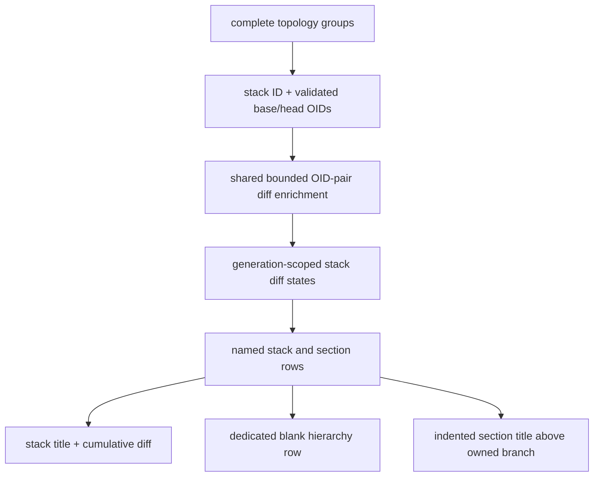

# feat: Clarify stack summaries and section hierarchy

## Overview

Make named stacks easier to scan by showing the net diff for the complete displayed stack on its title row, separating that title from its contents, placing every named visual section directly above the branches it owns, and adding a blank gutter between deletion and worktree metadata.

Branch rows keep their existing parent-relative diffs. The title summary is a separate base-to-tip comparison for the complete structural stack, so filtering, focus, archive visibility, or intermediate reversions cannot distort it.

---

## Problem Frame

The current stack title and first section title can appear as consecutive peer-looking rows. That makes the overall stack name hard to distinguish from its feature sections. Dense metadata has a similar issue: the deletion value and worktree marker can touch visually.

The stack title also provides no quick measure of total change. Reading or mentally combining every branch diff is slow and can be incorrect because additions and deletions may be modified or reverted later in the stack. The title needs a true net comparison from the displayed stack's validated base to its structural tip.

---

## Requirements Trace

- R1. A named stack title shows a cumulative `DiffState` for the complete real displayed stack while each branch retains its parent-relative diff.
- R2. Cumulative diff compares the validated parent OID of the displayed stack group's bottom branch directly to that group's primary-chain head OID. It never sums branch stats or uses the broader `Branch.stack_root` identity.
- R3. Forked/side stacks receive independent summaries from their own attachment parent to their own tip; sibling and parent-stack changes are excluded.
- R4. Summary endpoints and values are invariant under filter, focus, archive mode, context rows, ordering, and scroll position.
- R5. Stack summaries reuse the existing bounded OID-pair cache, task deduplication, four-worker cap, generation cancellation, and Loading/Ready/Unavailable lifecycle.
- R6. A named stack projects as `StackLabel → exactly one dedicated blank spacer → first visible section title or branch`. The dedicated title spacer is independent from the user's general stack-separator toggle.
- R7. A named visual section title is emitted exactly once and sits immediately above the first visible selectable branch it owns, with cumulative manual indentation derived from the complete stack. Hidden anchors do not suppress a title when an owned descendant remains visible; context-only ancestry alone does not create a title.
- R8. Unnamed stacks do not gain a synthetic summary row or title spacer. Creating an inline stack name preview creates both; canceling or confirming empty removes both when no saved name exists.
- R9. Stack-label summary metadata uses the normal diff styling and selected-row contrast, but title rows show no timestamp, worktree, or PR values.
- R10. When the worktree range is present, a one-cell blank gutter separates it from the full diff range at every supported width, while preserving the existing time-to-diff and PR-edge gutters when their corresponding columns exist.
- R11. Added rows/gutters do not move topology circles, become selectable/sticky, wrap 40-column rows, or break the minimum branch-name width.

---

## Scope Boundaries

- No Git refs, commits, Graphite metadata, worktrees, or remotes are changed.
- No cumulative diff is shown for unnamed stacks; naming remains the explicit way to create a summary/header surface.
- No section-level cumulative diff is added in this iteration.
- No branch diff semantics change: branch rows remain validated parent-to-branch comparisons.
- No timestamp, worktree, or PR metadata is added to stack titles.
- No color-palette expansion is included in this plan.

---

## Context & Research

### Relevant Code and Patterns

- `src/model/topology.rs` owns real stack-group formation and bottom-up projection. Its group identity and complete branch list are authoritative; visible stack heads alone are not.
- `src/model/topology/projection.rs` defines distinct selectable stack/section labels and nonselectable divider rows.
- `src/refresh/diffstats.rs` already schedules arbitrary OID-pair diffstats through a bounded cache and worker pool with generation cancellation.
- `src/adapters/git.rs` computes a net `git diff --numstat` for arbitrary base/head OIDs and already handles binary-file counts.
- `src/ui/tree.rs` has shared diff painting plus separate stack-label, section-label, divider, and branch renderers.
- `src/ui/layout.rs` already reserves time-to-diff and PR-edge gutters; worktree currently begins immediately after the diff range.

### Institutional Learnings

- Visual section ownership/manual depth is computed from the complete real stack before visibility filtering; preserve that invariant when repositioning labels.
- Stack and section labels are semantic selectable targets, not fake branches. Branch-only Git/config actions must remain unable to operate through them.
- Selected metadata becomes black over the identity-color background; normal additions/deletions remain green/red.
- Projection/rendering must stay iterative, indexed, viewport-bounded, and safe at the 40-column minimum.
- No `docs/solutions/` entries exist; `memory.md`, `changelog.md`, prior plans, and characterization tests provide the local record.

### External References

- None. The repository already contains direct patterns for topology identity, arbitrary endpoint diffstats, asynchronous enrichment, label projection, metadata geometry, and narrow rendering.

---

## Key Technical Decisions

| Decision | Rationale |
|---|---|
| Compare stack base directly to stack tip | Produces the true net stack change even when intermediate branches rewrite or revert files. |
| Key summaries by displayed topology-group ID | Keeps side-stack summaries independent; `Branch.stack_root` can span multiple displayed groups. |
| Extend the existing diff enrichment pipeline | Shares cache entries, worker bounds, cancellation, and failure handling instead of adding another coordinator. |
| Store summary state in the generation-scoped snapshot | Structural and enriched snapshots remain immutable and stale results cannot attach to newer topology. |
| Show summaries only on named stack labels | Avoids inventing new rows/navigation targets for every unnamed stack. |
| Prefer eager all-group enrichment only behind a characterization gate | It keeps inline naming previews immediately useful without coupling refresh workers to mutable config, but must not consume unacceptable repository-wide work. If it misses the existing responsiveness budget, switch to saved-name targets plus on-demand preview enrichment. |
| Use a dedicated projection spacer after stack titles | Establishes hierarchy without coupling it to optional inter-stack spacing or renderer-only row insertion. |
| Keep section labels adjacent to owned branches | Makes the label's scope legible and preserves existing editing/selection semantics. |

---

## Open Questions

### Resolved During Planning

- Cumulative meaning: direct validated base-to-tip diff, not sum of branch rows.
- Fork behavior: every displayed topology group has independent endpoints.
- Visibility behavior: aggregate scope is structural and does not shrink with the viewport/filter/archive.
- Unnamed stacks: no summary/header row until a name is created.
- Missing base/head: show Unavailable rather than zero or guessed Git ancestry.
- Spacer behavior: exactly one stack-title spacer, independent from `s`; no extra spacer after section titles.

### Deferred to Implementation

- The internal snapshot field/helper names and whether stack endpoint discovery is materialized in the topology index or returned through a narrow query.
- Exact helper/type names after implementation reveals the cleanest private boundary.
- Eager versus targeted scheduling after measuring branch-only and branch-plus-stack enrichment on representative 500- and 5,000-stack fixtures. Eager scheduling is acceptable only if structural publication remains immediate, cancellation remains bounded, and the existing responsiveness suite passes without a material regression; otherwise saved names are scheduled eagerly and a newly created preview begins Loading while an on-demand endpoint task runs.

---

## High-Level Technical Design

> *This illustrates the intended approach and is directional guidance for review, not implementation specification. The implementing agent should treat it as context, not code to reproduce.*

For a linear stack `A → B → C`, the title compares `parent(A)` to `C`; branch rows continue to compare `parent(A) → A`, `A → B`, and `B → C`. For a child stack `D → E` attached to `B`, its title compares `B → E` and excludes changes unique to the parent stack's later branches.

---

## Implementation Units

- [x] U1. **Add whole-stack diff state and enrichment**

**Goal:** Produce correct, bounded cumulative diff state for every real displayed stack group.

**Requirements:** R1-R5

**Dependencies:** None

**Files:**
- Modify: `src/model/branch.rs`
- Modify: `src/model/topology.rs`
- Modify: `src/refresh/builder.rs`
- Modify: `src/refresh/diffstats.rs`
- Modify: `src/integration_tests/common.rs`
- Test: `src/refresh/diffstats.rs`
- Test: `src/integration_tests/refresh_pipeline.rs`
- Test: `src/integration_tests/repository_snapshot.rs`

**Approach:**
- Expose a narrow topology-group endpoint query keyed by the real displayed stack ID: bottom branch, validated diff parent, and primary-chain head.
- Initialize every emitted stack summary as Loading in structural snapshots. During enrichment, resolve missing validated parents/endpoints to Unavailable and valid endpoints to Ready or a typed Git failure.
- Extend diff tasks so one OID pair may update branch indexes, stack IDs, or both. Schedule branch targets before aggregate-only targets, then preserve pair deduplication, the shared cache, four-worker cap, bounded channel, spawn-failure completion, and obsolete-generation cancellation.
- Publish branch and stack diff states together in the same immutable enriched snapshot.

**Execution note:** Start with endpoint/fork correctness tests and the eager-scheduling characterization gate. An incorrect identity choice can produce plausible totals, while an unmeasured eager policy can consume refresh capacity for invisible rows.

**Patterns to follow:**
- `src/refresh/diffstats.rs` OID-pair cache/task model.
- `src/model/topology.rs` real group formation and primary-chain ordering.

**Test scenarios:**
- Happy path: linear `A → B → C` summary equals a direct `parent(A) → C` diff while branch stats remain parent-relative.
- Correctness: an intermediate addition later reverted produces a zero/net endpoint result rather than the sum of branch stats.
- Fork: a child `D → E` attached to `B` reports `B → E`, excluding parent/sibling changes.
- Edge case: Untrunked/degraded stack without a validated base reports Unavailable, not zero.
- Efficiency: identical branch/stack endpoint pairs share one task and cache entry.
- Scale: total scheduled work is bounded by unique branch pairs plus real stack groups, and branch diff tasks are not queued behind aggregate-only work.
- Performance decision: 500- and 5,000-stack characterization either validates eager scheduling against the existing responsiveness suite or exercises the targeted/on-demand fallback, including a preview that transitions Loading → Ready.
- Lifecycle: structural snapshot shows Loading; same-generation enrichment publishes Ready/Unavailable; an obsolete generation publishes nothing.
- Failure: worker spawn or Git diff failure completes every pending branch and stack target as Unavailable.

**Verification:**
- Every named stack can resolve a generation-correct summary from its true displayed-group endpoints without adding unbounded work.

- [x] U2. **Separate stack titles from section-owned branches**

**Goal:** Make the visual hierarchy unambiguous while preserving semantic selection and full-stack ownership.

**Requirements:** R4, R6-R8, R11

**Dependencies:** U1

**Files:**
- Modify: `src/model/topology.rs`
- Modify: `src/model/topology/projection.rs`
- Modify: `src/app.rs`
- Test: `src/integration_tests/topology_layout.rs`
- Test: `src/integration_tests/navigation_checkout.rs`
- Test: `src/integration_tests/archive_workflow.rs`

**Approach:**
- Keep `StackLabelRow` identity-only and do not convert it into a branch row. The renderer resolves the latest summary from the active snapshot by `stack_id`, matching how branch rows receive enriched state without rebuilding projection/navigation.
- Emit exactly one nonselectable dedicated spacer after every emitted stack label, including inline editor previews, before any section title or branch.
- Keep named section labels immediately above the first visible selectable branch owned by that section. Determine ownership/manual depth from the complete stack; context-only ancestry does not create an orphan label.
- Preserve navigation order and selection repair: Up/Down moves from stack label over the spacer to a section label or branch; the spacer is never selected or sticky.
- Preserve empty/cancel editor behavior so a transient unnamed-stack label and its spacer disappear together.

**Patterns to follow:**
- Existing `SelectionTarget` separation and visibility-derived navigation maps in `src/model/topology/projection.rs`.
- Existing floating section-label behavior under filtering/archive.

**Test scenarios:**
- Ordering: named stack plus named first section emits `StackLabel → Spacer → VisualSectionLabel → Branch`.
- Ordering: named stack plus unnamed first section emits `StackLabel → Spacer → Branch`; a later named section remains directly above its first branch.
- Unnamed stack: no synthetic stack label, summary, or title spacer.
- Filter: hidden section anchor plus visible owned descendant floats the title directly above that descendant; no visible owned branch means no title.
- Archive: context-only ancestry does not create a section title and remains nonselectable.
- Navigation: label → section/branch skips the spacer; sticky bottom/trunk row behavior remains unchanged.
- Editing: `n` on an unnamed stack creates label + spacer preview; Escape or empty confirmation removes both; editing an existing name preserves ordering.
- Fork: parent and child stack labels retain separate identities/summaries.

**Verification:**
- The projection alone encodes the intended hierarchy and all navigation/sticky maps remain correct after the extra row.

- [x] U3. **Render stack summaries and metadata gutters**

**Goal:** Present cumulative totals clearly and add breathing room between deletion and worktree columns without breaking narrow layouts.

**Requirements:** R1, R9-R11

**Dependencies:** U1, U2

**Files:**
- Modify: `src/ui/layout.rs`
- Modify: `src/ui/tree.rs`
- Test: `src/integration_tests/tui_rendering.rs`

**Approach:**
- Resolve a stack label's latest cumulative state from the active snapshot by `stack_id`, then paint Loading/Ready/Unavailable through the shared diff-column renderer. Reuse the existing right-aligned muted `+? -?` unavailable representation at every width. Leave title timestamp, worktree, and PR ranges blank.
- Apply label emphasis and selected-row black foreground to every summary glyph/cell exactly as for branch metadata.
- Reserve one additional cell in metadata width and advance the worktree range so it begins one column after the complete diff range. Preserve the existing time-to-diff and PR-edge cells.
- Keep graph coordinates fixed, names truncated before metadata, the minimum name width intact, and blank gutters blank even on selected rows.

**Patterns to follow:**
- Shared `paint_diff` semantics and selected-row foreground normalization in `src/ui/tree.rs`.
- Existing geometry breakpoint and gutter tests in `src/integration_tests/tui_rendering.rs`.

**Test scenarios:**
- Ready title shows cumulative green additions/red deletions in the fixed diff column; branch rows retain their own values.
- Loading and Unavailable titles use existing loading/muted semantics without fake zeros.
- Selected stack title renders name and summary black over its selected background; dim emphasis remains consistent.
- Geometry at widths 40, 55/56, 71/72, medium, and wide keeps a blank time→diff, diff→worktree, and PR→edge cell whenever those columns exist.
- Worktree absent/present leaves the new gutter blank and starts `⎇`/basename after it.
- Long/indented names truncate without overwriting rails, summary metadata, or wrapping.
- Visual hierarchy renders a visibly blank row below the stack title and no blank row between section title and owned branch.

**Verification:**
- The screenshot's dense metadata and ambiguous title hierarchy are visibly resolved at representative widths without changing topology geometry.

- [x] U4. **Document and verify the completed interaction**

**Goal:** Record the new semantics and validate them across real and degraded repositories before installation.

**Requirements:** R1-R11

**Dependencies:** U1-U3

**Files:**
- Modify: `README.md`
- Modify: `docs/features.md`
- Modify: `memory.md`
- Modify: `changelog.md`
- Test: `src/integration_tests/refresh_pipeline.rs`
- Test: `src/integration_tests/topology_layout.rs`
- Test: `src/integration_tests/archive_workflow.rs`
- Test: `src/integration_tests/tui_rendering.rs`

**Approach:**
- Document cumulative base-to-tip versus branch parent-relative diff semantics and the named-stack-only summary surface.
- Document stack-title/section-title hierarchy and the three metadata gutters.
- Verify the complete formatting, strict lint, all-target/all-feature test, benchmark, doctest, release-build, diff-hygiene, install-hash, and disposable-repository smoke contracts already used by the project.

**Patterns to follow:**
- Existing feature descriptions and verification record in `README.md`, `docs/features.md`, `memory.md`, and `changelog.md`.

**Test scenarios:**
- Integration: a real linear Git/Graphite fixture displays direct net stack totals and parent-relative branch totals simultaneously.
- Integration: a real fork produces independent parent/child stack summaries.
- Degradation: missing Graphite parentage leaves the stack title summary unavailable while the repository remains navigable.
- Regression: filter/archive/focus/name editing, 40-column rendering, selected/current styling, checkout confirmation, and terminal restoration remain intact.

**Verification:**
- The behavior is documented, fully verified, and the installed binary exactly matches the tested release artifact.

---

## System-Wide Impact

- **Interaction graph:** Structural Git/Graphite inventory builds topology groups; shared diff enrichment resolves branch and stack targets; projection attaches stack state to title rows; renderer paints the same semantic diff columns for titles and branches.
- **Error propagation:** Missing/invalid endpoints and Git diff failures become stack-level Unavailable without hiding branches or failing structural refresh.
- **State lifecycle risks:** Stack summaries must be generation/OID scoped; visibility-only reprojection must not invent endpoints or retain results from obsolete structural snapshots.
- **API surface parity:** The private snapshot gains aggregate state, but CLI/config/public runtime behavior remains unchanged.
- **Integration coverage:** Real endpoint diffs, forks, filters, archive context, editor previews, sticky rows, selected styles, and width breakpoints require cross-layer tests.
- **Unchanged invariants:** Git and Graphite remain read-only during refresh; all local branches remain visible; work stays bounded; topology circles/rails do not move; branch diff semantics and Git mutation safety do not change.

---

## Risks & Dependencies

| Risk | Mitigation |
|---|---|
| Summed or wrong-root totals look plausible | Derive direct endpoints from real topology groups and test reversions plus side-stack forks. |
| Invisible aggregate work delays useful branch diffs | Prioritize branch tasks, characterize eager scheduling at 500/5,000 stacks, and fall back to saved-name targets plus on-demand preview enrichment if responsiveness regresses materially. |
| Added snapshot field causes fixture churn | Centralize default stack-summary construction in shared fixtures/builders. |
| Spacer shifts visual indexes/navigation | Build maps from emitted entries and test navigation, focus bounds, sticky rows, and selection repair. |
| Filter/archive changes aggregate meaning | Resolve endpoints from complete topology before projection visibility decisions. |
| New gutter steals narrow name space | Include it in geometry accounting and test every metadata breakpoint plus the 40-column floor. |

---

## Documentation / Operational Notes

- Describe the stack title total as “net diff from stack base to tip,” never “sum of branches.”
- Loading/unavailable title summaries are normal enrichment states and must not block navigation.
- A stack must be named before its cumulative total gets a persistent row; this keeps unnamed-stack density unchanged.

---

## Sources & References

- Related code: `src/model/topology.rs`, `src/model/topology/projection.rs`, `src/refresh/diffstats.rs`, `src/adapters/git.rs`, `src/ui/layout.rs`, `src/ui/tree.rs`
- Related tests: `src/integration_tests/refresh_pipeline.rs`, `src/integration_tests/repository_snapshot.rs`, `src/integration_tests/topology_layout.rs`, `src/integration_tests/navigation_checkout.rs`, `src/integration_tests/archive_workflow.rs`, `src/integration_tests/tui_rendering.rs`
- Related project record: `memory.md`, `changelog.md`, `docs/plans/2026-07-21-001-feat-visual-feature-sections-plan.md`
