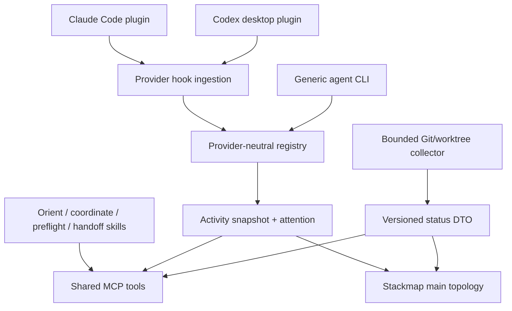
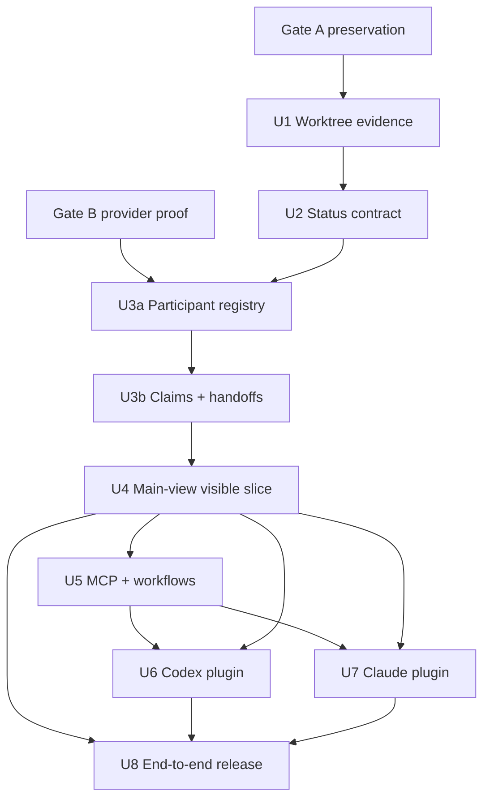
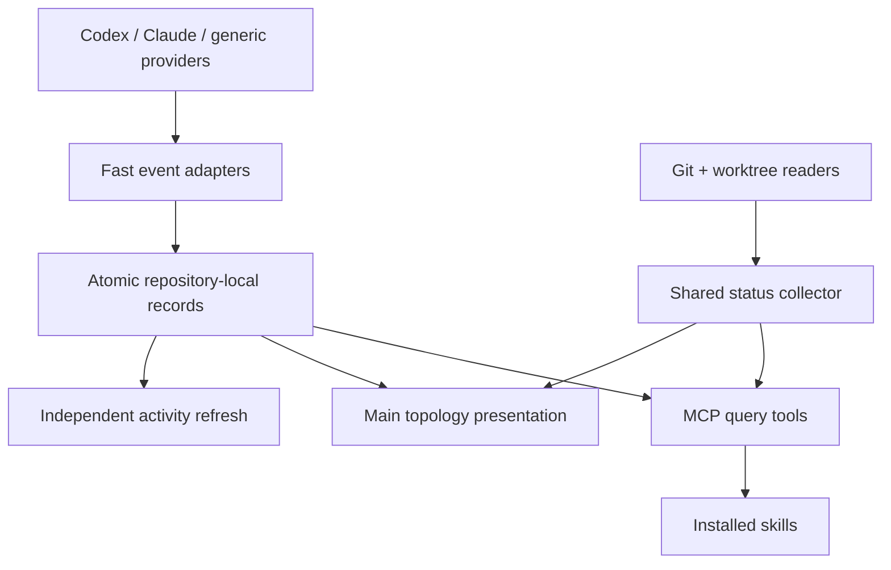

# feat: Show Codex, Claude, and other agents in Stackmap

## Overview

Add a trustworthy local coordination layer to Stackmap so its ordinary branch topology shows which Codex, Claude, and generic coding agents are present, what they have cooperatively claimed, what phase and intent they explicitly reported, and whether Git independently shows change in the same worktree.

The complete delivery has four required surfaces, but execution uses explicit completion tiers so visible local value is not held hostage by release packaging:

| Surface | First delivery |
|---|---|
| Repository truth | Versioned one-shot status with exact OIDs, topology, worktrees, and independent `clean | dirty | unavailable` evidence |
| Coordination truth | Provider-neutral, expiring soft claims and lifecycle records with explicit provenance |
| Agent integrations | Installable Codex desktop and Claude Code plugins plus a generic CLI/MCP adapter |
| Human view | Responsive activity cues and detail inside the existing topology view |

Codex and Claude are hard acceptance targets. “Other agents” are visible after they use the documented generic contract; Stackmap does not claim to discover arbitrary runtimes automatically.

Completion tiers:

1. **Foundation:** trustworthy worktree/status and provider-neutral presence.
2. **First visible slice:** a generic participant appears and transitions in the real main view.
3. **Morning-test critical:** local development installs make real Codex and Claude sessions, subagents, intent, collisions, and Git evidence visible.
4. **Release critical:** public packaging, marketplace manifests, multi-architecture artifacts, CI, documentation, and real operator acceptance.

The plan is not complete until all four tiers land, but each earlier tier is independently testable and demonstrable.

---

## Problem Frame

Stackmap already makes branch topology, worktree ownership, committed diffs, pull requests, and cleanup safety legible. It currently cannot answer:

- Which agent sessions are operating in each worktree?
- Are multiple agents claiming the same branch?
- What did each agent explicitly say it is doing?
- Is a session active, waiting, idle, stale, or handed off?
- Did Git actually change while that activity was present?
- Can a new agent orient itself without reconstructing the repository through several commands?

Git cannot answer the lifecycle or intent questions, while an agent hook cannot prove authorship, progress, or success. The implementation must preserve those two evidence classes separately. A live lifecycle plus a dirty worktree means “an agent is present and Git has changes,” not “this agent authored these files.”

---

## Requirements Trace

This plan preserves the actor, flow, requirement, and acceptance-example IDs from the origin document.

| Origin requirement | Planned realization |
|---|---|
| R1-R2 | U1-U2: first-class per-worktree evidence and versioned repository status |
| R3-R7 | U3: provider-neutral registry, lifecycle, claims, handoffs, provenance, and expiry |
| R8-R9 | U6: installable Codex desktop plugin and lifecycle adapter |
| R10 | U7: installable Claude Code plugin covering sessions, subagents/teams, tasks, and worktrees |
| R11 | U3 and U5: generic CLI writes/queries and shared MCP tools |
| R12-R13 | U4: responsive main-view integration and safe degradation |
| R14-R16 | U3 and U5-U7: workflows, advisory-only writes, strict privacy allowlists |
| R17-R18 | Every unit, with cross-surface verification concentrated in U8 |

Key flows:

- F1 is established by U3 and completed for Codex/Claude by U6-U7.
- F2 is established by U3 and made agent-usable through U5-U7.
- F3 depends on U1, U3, and U4 preserving Git-observed evidence separately.
- F4 depends on U3 lifecycle leases and U5 handoffs, then provider mappings in U6-U7.
- F5 is delivered and proven in U6-U8.

Acceptance examples:

- AE1: U1, U4, U6, U8
- AE2: U3, U4, U6, U7, U8
- AE3-AE4: U3-U4, U8
- AE5: U5-U6, U8
- AE6: U3, U5, U7, U8
- AE7: U4, U8
- AE8: U3, U5-U8

---

## Scope Boundaries

### In scope

- A one-shot, versioned repository status contract.
- Independent cleanliness for every occupied worktree.
- Provider-neutral lifecycle, participant, claim, intent, phase, blocker, and handoff records.
- First-class Codex desktop and Claude Code integrations.
- Main sessions, subagents, and Claude team/task signals where the installed provider exposes them.
- A documented generic CLI and MCP interface for other local agents.
- Agent cues and details in Stackmap's existing main topology view.
- Local installation, packaging, automated verification, and real-product manual validation.

### Out of scope

- Hard branch, stack, worktree, or file locks.
- Automatic discovery of an unintegrated runtime.
- File-level authorship, cursor location, token counts, or progress percentages.
- Inferred intent, success, completion, readiness, or review verdict.
- Prompt, transcript, private application database, terminal, command, response, or file-content scraping.
- Agent-facing Git, Graphite, GitHub, worktree, PR, or remote mutations.
- Cross-machine or cross-user synchronization.
- A separate agent dashboard.
- Cross-project aggregation implementation; it has a separate plan at `docs/plans/2026-07-28-002-feat-cross-project-agent-overview-plan.md`.

---

## Context & Research

### Relevant repository patterns

- `src/main.rs` owns a hand-written `OsString` parser. The `agent` namespace must preserve current repository-path grammar, including option-shaped paths after `--`.
- `src/adapters/command.rs` already centralizes bounded, passive subprocess execution with `GIT_OPTIONAL_LOCKS=0`.
- `src/adapters/git.rs` currently enumerates branch worktree paths with `for-each-ref`, but detached and unborn worktrees require `git worktree list --porcelain -z`.
- `src/adapters/git/inventory.rs` has one repository-level `dirty: bool`; `src/refresh/builder.rs` assigns it only to the launching checkout's current branch.
- `src/refresh/watcher.rs` watches the Git common directory but only recognizes `stackmap/config.toml` under Stackmap-owned metadata.
- `src/ui/layout.rs` preserves a 40-column minimum, an eight-cell branch-name minimum, fixed metadata gutters, and a detail sidebar only at 120+ columns.
- The dirty worktree has broad in-progress UI and refresh changes. Implementation must preserve it, classify which changes are publishable prerequisites, use isolated worktrees, and assign one owner to each overlap hotspot.

### Provider research

Codex desktop currently supports plugins that package skills, stdio MCP servers, and trusted lifecycle hooks. Plugin changes apply to new chats after the relevant reload/restart, and hook trust is separate from plugin installation. Hook commands are synchronous, may overlap, and must remain fast. `SessionEnd` can be delayed, so explicit leases are required.

Claude Code 2.1.220 is installed locally. Its plugin surface supports `.claude-plugin/plugin.json`, `skills/`, `hooks/hooks.json`, `.mcp.json`, plugin-root/data variables, local `--plugin-dir` testing, validation, and marketplace installation. Current hooks expose session, permission, tool, subagent, task, teammate, working-directory, file-change, worktree, compaction, stop, and session-end events. Provider event payloads contain sensitive fields that the Stackmap adapter must ignore.

### Institutional decisions carried forward

- The earlier agent-status plan correctly chose a purpose-built DTO, per-worktree tri-state evidence, bounded one-shot collection, and passive reads.
- This plan supersedes its deferral of progress annotations and MCP because the product goal now explicitly requires live agent coordination.
- Repository-local state lives under the Git common directory so all linked worktrees share one coordination rendezvous.
- Per-session atomic records avoid a high-contention shared heartbeat file and isolate malformed writers.

---

## Key Technical Decisions

| Decision | Rationale | Rejected alternative |
|---|---|---|
| CLI collector is the data-plane foundation | TUI, MCP, skills, hooks, and generic agents share one bounded implementation | Let every integration rediscover Git independently |
| Domain model is provider-neutral | Codex and Claude remain adapters rather than defining core semantics | Encode Codex hook fields in UI/runtime models |
| Coordination writes are advisory only | Visibility improves without becoming a second Git authority | Hard locks or checkout prevention |
| Git and lifecycle evidence remain separate | Neither source can safely prove the other | Infer “editing” or “done” from hook or dirty state |
| Records are per participant/session and compare-and-replaced under a bounded participant lock | Concurrent hooks degrade independently while ordering guards prevent released sessions from being resurrected | Shared mutable heartbeat JSON or unguarded last-writer-wins replacement |
| Main view gets progressive disclosure | Branch ownership is visible where topology decisions happen | Separate agent dashboard |
| Semantic intent is explicit | Hook payloads cannot be mined safely or reliably | Parse prompts, commands, transcripts, or responses |
| Codex and Claude package the same canonical workflows | Behavior stays consistent across providers | Maintain divergent skill copies by hand |
| Use provider plugins, not private app APIs | Supported installation surfaces are testable and distributable | Scrape terminals, databases, or experimental App Server state |
| Use a maintained MCP protocol library behind a narrow adapter | Handshake/version behavior stays compatible while the domain remains independent | Hand-roll an expanding protocol in core modules |

### Activity identity and storage

- Repository identity is a domain-separated SHA-256 digest over a platform-tagged, length-prefixed canonical Git common-directory representation. Native path bytes are used where available; serialization never depends on lossy display text.
- Every provider supplies an opaque session ID transiently. Stackmap stores only a repository-scoped SHA-256 digest of provider plus session identity; raw provider session IDs never reach disk, output, diagnostics, or rendering.
- Subagents and teammates are separate participants with a parent session reference, not just a count. Aggregated counts are derived.
- Records live beneath `<git-common-dir>/stackmap/activity/v1/participants/`.
- Handoffs live beneath `<git-common-dir>/stackmap/activity/v1/handoffs/`.
- Writers serialize only an explicit allowlist. Unknown input fields are discarded before any logging or persistence.
- Provider `cwd` is an allowlisted transient resolution input. Only validated repository/worktree identity is persisted; transcript paths and unrelated file paths are discarded.
- Explicit semantic fields are not copied from provider payloads. `phase`, `readiness`, and blocker category are enums; intent and handoff summaries are single-line, control-free, terminal-safe UTF-8 capped at 160 bytes. The privacy guarantee covers automatic provider capture; explicitly submitted semantic text is intentional agent-reported input.

### Ordering and caller identity

- Every record has a monotonic local revision and the strongest provider ordering key available (`turn_id`, `prompt_id`, child/task ID, and event class).
- Writers perform a bounded read/compare/write under a per-participant coordination lock. Terminal events outrank earlier same-turn events; a released tombstone rejects delayed non-start events.
- `SessionStart` startup/resume/fork establishes a new accepted generation. Duplicate events are idempotent.
- Only startup/CWD events may replace the persisted worktree path; ordinary tool events re-resolve the current HEAD within that proven worktree but cannot regress an explicit CWD change.
- Provider-specific hook entrypoints emit byte-exact neutral stdout and a provider-compatible fail-open status. Generic JSON CLI output is never reused as hook stdout.
- `SessionStart` is the only intentional exception: after Gate B proves the provider contract, it emits the provider's exact fixed JSON context shape containing non-sensitive coordination instructions and the opaque participant handle. Every other lifecycle hook emits byte-exact neutral stdout. If either provider cannot deliver fixed startup context reliably, Gate B must resolve another supported session-binding/instruction surface before automatic semantic reporting remains a release criterion.
- A provider hook creates a session-scoped participant capability. Wave 0 must prove whether each product can bind its MCP process directly to that capability; otherwise the startup hook supplies an opaque handle through supported session context. Semantic MCP writes require the capability and can mutate only that participant. Ambiguous or unbound calls fail without writing. A separate explicit operator repair command may act across participants.
- This capability boundary prevents accidental cross-session writes; it is not an authorization boundary against another malicious process running as the same operating-system user.

### Lifecycle leases

Provider hooks are event-driven rather than guaranteed heartbeats. The first release separates recent observation from retention:

- `recent`: an active/working/waiting event observed within five minutes.
- `aging`: observed five to fifteen minutes ago; still shown with age but not presented as freshly active.
- `unconfirmed`: observed fifteen to sixty minutes ago; excluded from live counts/collision attention and rendered with `?` while retaining the last lifecycle label.
- `idle`: retained for 35 minutes, covering delayed Codex session-end behavior without implying work.
- `released`: removed from live presence immediately.
- After sixty minutes without a supported event, non-idle records become `stale`; stale records remain inspectable for four hours before deletion.
- A soft claim has its own four-hour advisory lease and remains visible to preflight/detail after lifecycle activity becomes idle, unconfirmed, or stale. Recent overlapping claims produce `C`; non-live overlapping claims produce a lower-priority `c` caution. Claims never block work and explicit release/handoff ends the participant's claim.
- Explicit handoffs remain for 24 hours unless released sooner.

Compact rows encode freshness category; exact last-seen age is always available in detail and appears inline only when width permits. An expiry scheduler computes the next lease/retention deadline and refreshes even when no filesystem event occurs. Writers and active coordinators perform bounded garbage collection; no background daemon is required. Durations are constants behind an injected clock and test-only override, not user-editable configuration in the first delivery.

### Responsive activity geometry

Activity reuses the existing metadata budget rather than moving the topology/name boundary. Disclosure is based on the actual branch-map body width, not the outer terminal width; a wide terminal with the detail sidebar open may have a narrow body.

| Branch-map body width | Coordination allocation | Activity disclosure |
|---|---|---|
| 40-63 | Diff 7, gap 1, worktree 2, activity 3 | Fixed badge grammar below |
| 64-89 | Preserve the current total metadata width; time 6, gap 1, diff 7, gap 1, worktree 2, remaining activity | Provider/count plus bounded phase, such as `C1 test` |
| 90-119 | Preserve `metadata_start`; activity takes optional PR/time space before topology/name/worktree evidence | Provider/count and bounded phase/attention label |
| 120+ without sidebar | Diff 7, gap 1, worktree 10, gap 1, remaining activity | Truncated provider/phase/intent summary |
| 120+ with sidebar | Recompute from the narrower body width | Compact row; pane shows complete bounded values |

With no readable activity registry, rendering stays on the existing geometry path. With activity, the coordination allocation has the same total metadata width and `metadata_start` as the existing allocation at that body width, so zero-to-one and lifecycle transitions do not move lanes, connectors, or branch names. Optional PR/time evidence yields before topology, minimum branch-name width, worktree ownership, or agent evidence. Rows never wrap and topology overflow rules remain authoritative.

Compact badges are `<state><count>` padded to three cells. Counts include recent/aging live participants only; `+` means ten or more. Recent state precedence is `C` live collision, `B` blocked, `W` waiting, and `A` active. Lowercase `c`, `b`, `w`, and `a` mean the same state is aging rather than recent. `I` means idle, `?` unconfirmed, `S` stale-only, `R` a retained ready handoff whose Git preconditions still match, and `h` a retained handoff whose Git evidence drifted. Handoffs and stale participants never inflate the live count. Wider rows use `Cx` for Codex, `Cl` for Claude, and `G` for generic providers before count/phase.

Seven-cell diff rendering retains distinct compact additions/deletions (`+…` and `-…`) for small, abbreviated-thousands, loading, and unavailable states; exact values remain in detail/status. Rendering fixtures prove this does not collapse committed diff evidence.

---

## Open Questions

### Resolved during planning

- **Are Claude and non-Codex agents part of success?** Yes. Real Codex and Claude integrations are required. Other agents use the generic contract.
- **Can Stackmap attribute dirty files to an agent?** No. It shows co-occurring but separately labelled lifecycle and Git evidence.
- **Where is repository-local coordination stored?** Under the Git common directory in independent atomic files.
- **Does ownership block work?** No. Claims are soft and collisions are visible.
- **How are stale sessions handled?** State-specific leases, stale exclusion, bounded retention, and explicit age.
- **Where does the UI live?** Inside the ordinary topology view with selected-row detail.
- **Should Stackmap depend on Codex's internal APIs?** No. Supported plugin, MCP, hook, and skill surfaces only.
- **How are binaries found from GUI-launched plugins?** Release packages bundle target-specific launchers/binaries; development installers write an absolute executable path. `PATH` is an optional fallback, never the only path.

### Deferred to implementation spikes

- Wave 0 must confirm the exact Codex desktop marketplace/trust flow, hook stdout/context behavior, per-chat MCP binding, and new-chat activation before U3 freezes provider assumptions.
- Wave 0 must capture real Claude 2.1.220 plugin/hook/MCP fixtures, team/task field availability, session binding, and fail-open behavior before U3 freezes provider assumptions.
- Select the maintained Rust MCP crate/version after a minimal handshake spike and dependency-policy check.
- Tune compact activity glyphs with rendering fixtures while preserving the disclosure contract above.

These spikes can change packaging or field mapping, but not the success criteria, privacy boundary, provider-neutral model, or required real-product validation.

---

## Pre-Implementation Gates

### Gate A: preserve and classify the dirty checkout

Before U1, preserve the current dirty primary checkout without staging, switching, or cleaning it:

1. Capture HEAD, branch, porcelain-v2 status, staged and unstaged binary patches, untracked paths, and file checksums into a temporary baseline directory.
2. Create an isolated worktree from the current HEAD and reproduce the tracked and untracked state there.
3. Verify hashes and diff equivalence.
4. Inventory ignored-but-required files, nested repositories/submodules, sparse-checkout state, symlinks, executable modes, and unsupported special files; explicitly preserve or exclude each class.
5. Create a local preservation commit only in the isolated worktree and re-verify that the primary checkout's branch, HEAD, index, and file hashes did not change.
6. Review the preserved diff and split relevant existing work into publishable prerequisite commits. Implementation branches may descend only from approved prerequisite commits; otherwise they start from the clean base and port only necessary hunks.
7. Record an ancestry check proving no implementation commit depends on an intentionally unpublished preservation-only commit.

No implementation unit begins until preservation equivalence and the publishable-base decision pass.

### Gate B: prove real provider surfaces

Before U3 freezes the provider-neutral contract:

1. Build a disposable minimal launcher/hook/MCP echo artifact with no production registry code.
2. Install it through the real Codex local marketplace, trust hooks, start a new task, and prove byte-exact hook firing, supported session context, and whether MCP is per-task bound.
3. Load the equivalent Claude plugin with `--plugin-dir`, validate/reload it, start a real session/subagent, and capture sanitized fixtures for every contract-critical event.
4. Exercise missing binary, non-zero/timeout, and disabled/untrusted hook cases and prove both providers continue the agent turn.
5. Delete the disposable artifact after recording only sanitized schema/behavior fixtures.

A provider surface failure changes the adapter/identity design before U3; it does not justify private API or transcript scraping.

---

## High-Level Technical Design

This sketch is directional. Unit-level tests and existing repository abstractions govern exact APIs.



Repository reconciliation follows this evidence rule:

```text
provider event
  -> parse only provider-specific allowlisted identity/lifecycle fields
  -> resolve cwd to repository + exact worktree + HEAD state
  -> atomically replace that participant record

TUI or query
  -> collect current Git/worktree truth
  -> load bounded registry records independently
  -> expire/reclassify records using injected clock
  -> reconcile by repository/worktree/branch/OID
  -> render lifecycle and Git observations as separate evidence
```

Implementation dependencies:



---

## Implementation Units

- [ ] U1. **Model trustworthy evidence for every occupied worktree**

**Goal:** Replace the launching-checkout-only dirty boolean with a first-class, bounded worktree inventory that can support both machine status and human rendering. Realizes F3 and enforces AE1.

**Dependencies:** Pre-Implementation Gate A.

**Files:**

- Create `src/model/worktree.rs`.
- Modify `src/model/mod.rs`, `src/model/branch.rs`.
- Modify `src/adapters/git.rs`, `src/adapters/git/inventory.rs`.
- Modify `src/refresh/builder.rs`, `src/refresh/diffstats.rs`.
- Modify common test builders in `src/integration_tests/common.rs`.
- Extend `src/integration_tests/repository_snapshot.rs`, `refresh_pipeline.rs`, and `navigation_checkout.rs`.

**Approach:**

- Parse `git worktree list --porcelain -z` into explicit primary/linked records, including branch, detached, unborn, prunable, and operation state.
- Preserve exact worktree path bytes or mark a documented lossy representation at serialization boundaries.
- Run existing passive status machinery once per distinct accessible worktree with bounded concurrency, timeout, and output.
- Model cleanliness as `clean`, `dirty`, or `unavailable { reason }`; never collapse unavailable to clean.
- Associate branches with worktree IDs while allowing worktrees without a local branch.
- Compute a stable source token from worktree identity, HEAD/OID, branch/detached state, operation state, and cleanliness; keep observation time outside equality fingerprints.
- Use a bounded pre/post coherence barrier around the complete worktree set: inventory identity/HEADs, collect statuses, repeat the full status/evidence read, and publish only when identity, HEAD, index/operation state, tracked/untracked cleanliness, and worktree set match. Retry the complete set a bounded number of times; U2 owns exit `3` after exhaustion.

**Test scenarios:**

- Clean primary and clean linked worktree map independently.
- Dirty primary and dirty linked worktrees mark only their owning rows; committed diffstats do not change.
- Detached and unborn worktrees remain visible without invented branch ownership.
- A removed, unreadable, timed-out, or prunable worktree degrades to unavailable.
- Concurrent reads remain bounded and do not create index locks, fetch, or orphan processes.
- Branch switches, worktree moves/removal, and index changes during each collection phase either yield one coherent retry result or typed instability.
- Existing checkout/delete protections still refuse branches owned by linked worktrees.

**Verification outcome:** Every occupied worktree has trustworthy modeled cleanliness and exact coherent HEAD evidence; existing passive Git invariants remain intact. Rendering completion belongs to U4/U8.

- [ ] U2. **Expose a versioned repository-status collector and CLI**

**Goal:** Give every consumer one deterministic repository/topology contract rather than serializing TUI runtime state. Realizes R1, R2, and the repository half of R14.

**Dependencies:** U1.

**Files:**

- Create `src/agent/mod.rs`, `src/agent/status.rs`, `src/agent/report.rs`, `src/agent/path.rs`.
- Modify `src/lib.rs`, `src/main.rs`, and `src/config.rs`.
- Create `src/integration_tests/agent_status.rs`.
- Create `tests/fixtures/agent/status-schema-v1.json`.
- Update `src/integration_tests/mod.rs`.

**Approach:**

- Add the unambiguous namespace `stackmap agent status [OPTIONS] [REPOSITORY]` while preserving legacy TUI grammar and `--` paths.
- Keep collector types private and map them into explicit schema-v1 DTOs.
- Include repository identity/root, capture time, source fingerprint, exact OIDs, topology/provenance, worktrees/cleanliness, committed diffs, provider health, and optional presentation metadata.
- Sort arrays deterministically and bound all strings, lists, subprocess work, retries, and output.
- Emit machine-clean JSON on stdout and diagnostics on stderr.
- Exit `0` for a coherent report including typed optional-provider degradation, `2` for invocation/discovery failure, and `3` when consistency retries cannot produce one coherent source snapshot.

**Test scenarios:**

- A real multi-stack/multi-worktree repository matches the golden schema and ordering with an injected capture clock; production capture time is metadata, not part of semantic determinism.
- Dirty, detached, unborn, missing provider, and unavailable worktree variants remain typed.
- Concurrent ref/config/worktree changes either produce one coherent snapshot or exit `3`.
- Repository paths named `agent`, `status`, or option-like strings remain addressable.
- Broken stdout, non-UTF-8 paths, and oversized optional data fail explicitly.
- The command performs no fetch, lock, index refresh, or mutation.

**Verification outcome:** CLI consumers can obtain one bounded, deterministic view of the same repository facts the TUI uses.

- [ ] U3. **Add the provider-neutral activity registry and generic agent CLI**

**Goal:** Establish lifecycle, participant, soft-claim, intent, attention, and handoff semantics before adding provider-specific adapters. Realizes F1-F4, R3-R7, R11, R15-R17, AE2-AE4, and the generic half of AE6.

**Dependencies:** U2.

**Files:**

- Create `src/agent/activity/mod.rs`, `contract.rs`, `registry.rs`, `attention.rs`, `clock.rs`.
- Create `src/agent/providers/mod.rs`.
- Modify `src/agent/mod.rs`, `src/lib.rs`, `src/main.rs`.
- Create `src/integration_tests/agent_activity.rs`, `activity_concurrency.rs`, and `activity_privacy.rs`.
- Create `tests/fixtures/agent/activity-schema-v1.json`.

**Approach:**

- Deliver U3 in two sequential, independently verified checkpoints:
  - **U3a:** stable digests, participant identity/capability, event ordering, lifecycle/freshness, atomic registry, bounded reads, generic presence/report/release, and provider-neutral sanitized fixtures.
  - **U3b:** claims, collisions, attention, handoffs, Git reconciliation, retention/cleanup, overload behavior, and privacy/terminal contract completion.
- Define a persisted internal schema-v1 participant record with provider, session fingerprint, scoped capability metadata, optional parent, repository/worktree identity, branch/detached/unborn state, observed OID, lifecycle, ordering key/revision, lease, last-seen, provenance, bounded reported intent/phase/blocker, and claim targets.
- Define separate public CLI/MCP/TUI DTOs that never serialize capability handles/hashes, internal compare-and-replace revisions, provider ordering keys, or tombstone internals.
- Define explicit handoffs with before/after OIDs, bounded verification summary, readiness/blocker, source participant, and expiry.
- Expose generic JSON-stdin CLI operations to create a self-scoped participant capability, claim, report lifecycle/intent/phase, create handoff, release self, list activity, and query attention. Cross-participant repair is a separate explicit operator command.
- Resolve nested/symlinked CWDs to exact worktrees. Deleted, outside-repository, and ambiguous inputs remain unassigned or fail explicitly.
- Use per-participant bounded locks, compare-and-replace ordering guards, same-directory exclusive temporary files, sync/close, and atomic rename. Released tombstones prevent delayed-event resurrection.
- Reject symlink/non-regular Stackmap path components and destinations; require current-user ownership; create directories `0700` and files `0600`; sync file and parent around rename. Reject hostile mode/ownership rather than following a redirected path.
- Cap each record at 32 KiB, participants and handoffs at 256 each, and directory inspection at 1,025 entries. Writers clean expired records before admission. If inspection proves the directory exceeds the cap, publish `incomplete/overloaded` health instead of trustworthy counts; never silently present a partial set as complete.
- Reconcile stored branch/OID evidence against current Git truth without rewriting history or attributing changes.
- Normalize strings before persistence and again at output sinks. Reject C0/C1, escape/CSI/OSC, CR/LF/tab, bidi controls, NUL, excessive combining/zero-width sequences, and oversized UTF-8; JSON serialization may escape but never render raw terminal controls.
- Allowlist persisted and emitted fields; discard raw provider input before diagnostics. Privacy canaries cover every discarded provider field and every explicit semantic-report field, with the latter documented as intentional input rather than automatic capture.
- Add the stable SHA-256 dependency in U3; U3 and U5 share sequential ownership of `Cargo.toml`/`Cargo.lock`.

**Test scenarios:**

- Two generic sessions claim separate worktrees and one shared branch; collisions aggregate without blocking.
- Resume updates one record; parent and two children end out of order without corrupting counts.
- Branch switch, detached HEAD, deleted branch, removed worktree, and stale expected OID remain truthful.
- Explicit release is immediate; crash expiry passes through stale retention; handoffs expire independently.
- Concurrent writers/readers never lose or cross-wire participants.
- Delayed active after release, branch-switch before delayed tool, duplicate events, child-stop before child-start replay, and clock rollback cannot regress state.
- One session cannot use MCP/CLI capability data to update or release another; same-worktree ambiguity refuses.
- Public list/status/attention/TUI serialization never exposes capability or ordering internals.
- Malformed, oversized, unknown-version, and permission-denied records degrade independently.
- First registry creation is observable later by U4; symlink swaps, hostile umasks/modes, directory floods, full/read-only storage, and compare-before-delete races fail safely.
- Unique canaries placed in discarded provider prompt, transcript, command, tool response, assistant message, approval text, and file-content fields never appear in storage, CLI output, logs, or snapshots. Explicit semantic fields are tested separately as intentional bounded input.

**Verification outcome:** Any local agent can safely publish/query advisory coordination, and Stackmap has one provider-independent source for all integrations.

- [ ] U4. **Integrate reconciled agent activity into the main topology view**

**Goal:** Answer “who is on this branch, what did they report, and what does Git show?” without leaving the existing main view. Realizes R12-R13 and AE1-AE4, AE7.

**Dependencies:** U3a for scaffolding; U3b before the first visible-slice gate closes.

**Files:**

- Create `src/model/activity.rs`, `src/activity/mod.rs`, `src/activity/watcher.rs`, `src/activity/coordinator.rs`, `src/app/activity.rs`, and `src/ui/tree/activity.rs`.
- Modify `src/model/mod.rs`, `src/app.rs`, `src/app/state.rs`, `src/events.rs`, and `src/main.rs`.
- Keep activity out of `Branch`, `RepositorySnapshot`, and the Git-generation coordinator in `src/refresh/mod.rs`.
- Modify `src/ui/layout.rs`, `src/ui/tree.rs`, `src/ui/tree/details.rs`, `src/ui/panels.rs`, `src/ui/theme.rs`.
- Extend `src/integration_tests/refresh_pipeline.rs`, `tui_rendering.rs`, `topology_layout.rs`, and `terminal_interaction.rs`.

**Approach:**

- Watch the nearest existing Stackmap/common-directory parent until the activity directory exists, then rebind to finalized activity and handoff records. Ignore temporary files. Use an independent bounded watcher/coordinator and latest-snapshot queue so registry failure cannot block or overwrite structural/diff refresh.
- Schedule the nearest freshness/lease/handoff/retention deadline, rebuild without filesystem events, and perform bounded compare-before-delete cleanup.
- Precompute an `ActivityIndex` keyed by branch and worktree, with unassigned/hidden counts and O(1) row summaries. Application state owns it beside, not inside, the Git snapshot.
- Use the responsive geometry contract above and suppress optional PR/time data before weakening topology, minimum name width, worktree ownership, or agent cues.
- Aggregate multiple participants and retained handoffs while preserving a discoverable selected-row list ordered by live attention, live activity, handoff, idle, then stale. A newer live participant never gets overwritten by an older handoff; retained ready/blocked handoffs remain separate evidence and affect the row only when higher-priority live attention is absent.
- A ready handoff renders `R` only while current branch OID and required cleanliness match its recorded after-state. Commits, resets, rebases, branch deletion, or new dirty work downgrade it to historical/mismatched handoff evidence in detail.
- Render non-color markers for active, waiting, idle, stale, blocked, ready, collision, and unassigned states.
- Label `agent reported` and `Git observed` explicitly in detail. Dirty/tip evidence without an agent remains `unattributed`.
- If activity and Git evidence capture times differ by more than five seconds, request at most one bounded in-flight Git refresh per five-second cooldown and show both capture ages until they converge; never imply causal co-occurrence from stale snapshots.
- Reuse `d` as branch detail: it toggles the existing sidebar when wide and opens a bounded detail overlay at narrow/medium widths. The overlay groups parent/children and handoffs, supports `j/k` or arrows, shows a capped visible list plus `+N`, preserves its participant selection across redraw/resize, and closes with `Esc`.
- Preserve filter/focus semantics while showing a bounded `N hidden agents` cue and one-step detail. Detached, deleted, or renamed branch claims stay unassigned rather than attaching by name.
- Render hidden/unassigned counts in the main header/status treatment; `D` opens a global coordination detail overlay grouped as hidden, archived, detached/unassigned, and stale, and `Esc` returns to the prior branch selection.
- An active claim on an archived branch remains discoverable through a hidden/archived cue and detail without mutating archive configuration.
- Preserve selection, scroll, lane geometry, branch ordering, archive/filter state, and all mutation guard behavior as activity changes.
- Retain the last valid activity snapshot only while its entries naturally age; unreadable registry health never freezes participants as live.

**Test scenarios:**

- At 40, 64/80, 90, and 120+ columns, zero/one/multiple agents never wrap or displace required topology.
- Identical topology rendered with and without activity keeps the same `metadata_start`, lane, connector, and branch-name positions.
- Codex and Claude on one branch render a count/collision and list both identities.
- Live overlapping claims render `C`; idle/unconfirmed/stale overlapping unexpired claims remain visible as `c` in preflight/detail until released or their claim lease expires.
- Active, waiting, idle, stale, blocked, ready, and unassigned transitions update in place.
- A ready handoff downgrades immediately when OID or cleanliness no longer matches its recorded after-state.
- Reported testing without Git changes and dirty Git without a reporting agent remain distinct.
- Filtered, focused, archived, detached, deleted, and renamed claims increment hidden/unassigned attention without fabricated association.
- A 120+ terminal with the detail sidebar uses the actual narrowed body width for row disclosure.
- Missing registry, invalid version, denied read, or activity overload produces one bounded degradation notice and an otherwise normal TUI.
- PTY resize and live record replacement preserve selection and do not leak alternate-screen/terminal state.
- Starting the TUI before any Stackmap metadata exists and then writing the first participant causes a redraw.
- `NO_COLOR` selected/current/unselected fixtures preserve every state, collision, freshness, and degradation cue.

**Sequential U4 checkpoints (one UI owner):**

1. Activity watcher/coordinator/index and registry health.
2. Compact row association/count/collision with stable geometry.
3. Medium/wide provider, phase, intent, and Git-evidence disclosure.
4. Selected branch sidebar/narrow overlay.
5. Hidden/archive/unassigned global detail.
6. Resize, expiry-without-events, degradation, and PTY hardening.

Each checkpoint must compile and pass its focused state/render tests before the next.

**Verification outcome:** Agent presence is always discoverable in the normal branch map, with deeper context available in one selection and no regression when integrations are absent.

- [ ] U5. **Expose shared MCP tools and canonical agent workflows**

**Goal:** Let supported agents orient, coordinate, preflight, report, hand off, and release through the same collector/registry used by the TUI. Realizes F2, R11, R14-R17, AE5-AE6.

**Dependencies:** U3b. Begins after U4's first visible-slice checkpoint to avoid shared `src/main.rs` ownership.

**Files:**

- Create `src/agent/mcp.rs`, `src/agent/tools.rs`.
- Modify `src/agent/mod.rs`, `src/lib.rs`, `src/main.rs`, `Cargo.toml`, and `Cargo.lock`.
- Create `src/integration_tests/agent_mcp.rs` and bounded fixtures under `tests/fixtures/mcp/`.
- Predeclare provider test ownership through `src/integration_tests/providers/mod.rs`, `providers/codex.rs`, and `providers/claude.rs`; U6 and U7 modify only their provider file.
- Create canonical skills:
  - `integrations/shared/skills/stackmap-orient/SKILL.md`
  - `integrations/shared/skills/stackmap-coordinate/SKILL.md`
  - `integrations/shared/skills/stackmap-preflight/SKILL.md`
  - `integrations/shared/skills/stackmap-attention/SKILL.md`
  - `integrations/shared/skills/stackmap-handoff/SKILL.md`
- Create `docs/agent-integration.md`.

**Approach:**

- Add `stackmap agent mcp` as a bounded stdio server behind a maintained protocol adapter.
- Read tools: repository status, worktree activity, branch detail, and attention items.
- Advisory write tools: claim work, report intent, report phase/blocker, create handoff, and release claim.
- Provider MCP servers bind writes to the capability proven in Gate B. Read tools can use launch roots; unbound/ambiguous writes fail without mutation.
- Every repository fact comes from U2; every coordination write goes through U3.
- Tool descriptions explicitly distinguish observed facts from agent-reported claims.
- Skills compose the tools into orient, coordinate, preflight, attention, and handoff workflows without reimplementing Git discovery.
- Skill descriptions and supported startup context instruct a newly started coding task to orient, claim, report bounded intent, and update phase automatically. The UI explicitly falls back to `intent not reported`; no provider prompt is parsed.
- Automatic semantic reporting performs one orient/claim at task start and writes only on meaningful phase/attention transitions, targets no recurring approval prompts after trusted install, and is bounded to six coordination writes per task unless the agent explicitly hands off. A documented repository/session opt-out switches to presence-only visibility.
- Package scripts copy canonical skill sources into provider artifacts and verify equality; provider directories are not edited as independent workflow sources.

**Test scenarios:**

- MCP initialize, tool discovery, calls, shutdown, malformed request, unknown method, and broken stdout behave correctly.
- Nested-directory and non-Git launches resolve or degrade explicitly.
- CLI and MCP return semantically equivalent status/activity.
- Two same-provider sessions in one worktree cannot cross-write intent/phase/release; unbound calls refuse.
- Write tools mutate only Stackmap advisory metadata.
- Bounded request size, response size, execution time, and concurrent calls hold.
- Skills preserve privacy and revalidate Git state before giving preflight advice.

**Verification outcome:** Codex, Claude, and generic MCP clients share one safe coordination vocabulary and cannot mutate repository state through Stackmap.

- [ ] U6. **Package and prove the Codex desktop integration**

**Goal:** Make new Codex desktop tasks and their subagents visible on the correct Stackmap rows through supported plugin surfaces. Realizes F1, F5, R8-R9, AE1-AE2, AE5.

**Dependencies:** U3b for lifecycle packaging, U4 for visible proof, and U5 for final MCP/skills packaging.

**Files:**

- Create `src/agent/providers/codex.rs` and provider hook fixtures under `tests/fixtures/hooks/codex/`.
- Modify the predeclared `src/integration_tests/providers/codex.rs`.
- Create plugin source under `integrations/codex/`:
  - `.codex-plugin/plugin.json`
  - `.mcp.json`
  - `hooks/hooks.json`
  - `bin/stackmap-launcher`
  - `README.md`
- Create `scripts/package-codex-plugin.sh`, `scripts/verify-codex-plugin.sh`, and `scripts/install-codex-plugin.sh`.
- Add a repository-local marketplace entry in the supported `.agents/plugins/` shape and document personal installation.

**Approach:**

- Map `SessionStart` startup/resume/clear/compact idempotently; map prompt/tool/permission events to active/waiting; map `Stop` to idle and `SessionEnd` to release.
- Create separate child participants for `SubagentStart` and release the exact child on `SubagentStop`.
- Startup/resume events establish repository/worktree; ordinary prompt/tool/permission/stop events re-resolve HEAD only within the persisted proven worktree and cannot replace its path. Codex remaps only if Gate B proves an explicit supported CWD-change event.
- Ignore prompt, transcript, tool input/output, commands, approval descriptions, and assistant/subagent messages before persistence or logs.
- Keep command hooks fail-open and bounded: byte/input caps, no retries, a provider-configured hard timeout, neutral success on Stackmap absence/failure, provider-contract stdout (`SessionStart` fixed context; all others neutral), sanitized one-line stderr at most, and no full repository collection.
- Bundle target-specific binaries for releases. Development installation pins an absolute local executable. Neither hook nor MCP launch depends only on the desktop app's `PATH`.
- Match Stackmap's current release matrix for the first delivery: macOS 15+ on Apple Silicon and Intel. Other targets use a separately installed absolute binary only after their release support is designed and tested.
- Make hook trust, hook-disabled degradation, new-chat activation, and plugin change/retrust behavior visible in validation docs.

**Test scenarios:**

- Every supported hook fixture maps to the correct provider-neutral participant transition.
- Resume/compact does not duplicate; two children stopping out of order affects only those children.
- Waiting clears on post-tool, stop, session end, or lease expiry.
- A branch switch updates worktree/branch/OID on the same session.
- Hook concurrency/reordering and missing optional fields remain safe.
- Every hook event asserts exact stdout and exit semantics; missing/wrong-architecture binaries, timeout, read-only/full disk, permission denial, and corrupt events never block the Codex turn.
- Privacy canaries from every sensitive Codex field are absent everywhere.
- Packaged manifest, referenced paths, MCP launcher, architecture selection, and marketplace entry validate.

**Verification outcome:** After real plugin installation and hook trust, two new Codex desktop tasks in different worktrees appear automatically, expose the workflows/MCP tools, and transition correctly in Stackmap.

- [ ] U7. **Package and prove the Claude Code integration**

**Goal:** Make Claude main sessions, subagents/teams, task signals, and worktree moves visible through the same semantics as Codex. Realizes F1, F5, R10, AE2, AE6.

**Dependencies:** U3b for lifecycle packaging, U4 for visible proof, and U5 for final MCP/skills packaging. May proceed in parallel with U6 after provider-neutral contracts freeze from Gate B fixtures.

**Files:**

- Create `src/agent/providers/claude.rs`, `src/agent/providers/claude_view.rs`, and provider hook/listing fixtures under `tests/fixtures/hooks/claude/`.
- Modify `src/activity/coordinator.rs`, `src/main.rs`, and the predeclared `src/integration_tests/providers/claude.rs`.
- Create plugin source under `integrations/claude/`:
  - `.claude-plugin/plugin.json`
  - `.mcp.json`
  - `hooks/hooks.json`
  - `bin/stackmap-launcher`
  - `README.md`
- Create `scripts/package-claude-plugin.sh`, `scripts/verify-claude-plugin.sh`, and `scripts/install-claude-plugin.sh`.
- Create a Claude marketplace manifest for repeatable installation.

**Approach:**

- Target and record the verified Claude Code 2.1.220 event matrix.
- Map `SessionStart` startup/resume/clear/compact/fork idempotently; prompt/tool/permission/notification enums to lifecycle; `Stop` to idle; `StopFailure` to a bounded failed-response state; `SessionEnd` to release.
- Map `SubagentStart/Stop` to separate child participants.
- Use task/team events only for IDs, lifecycle, and bounded identity labels that are documented as provider-reported. `TaskCompleted` never implies branch readiness. Never persist task subjects/descriptions or assistant messages in v1.
- Use `CwdChanged` to remap a live participant.
- A cross-repository `CwdChanged` is an ordered transfer: tombstone/release the old repository-scoped record, mint a new repository-scoped fingerprint/capability, create the new record, and expose partial failure as unassigned/transfer-incomplete rather than duplicating ownership.
- Do not register `WorktreeCreate`: in Claude it overrides default worktree creation and could mutate/block provider behavior. Do not register `WorktreeRemove` or `FileChanged` in v1; Git inventory/watching and leases already provide the needed evidence without file-path payloads.
- Reconcile the documented public `claude agents --json --cwd <repository>` result for repository-scoped background agents not currently represented by hooks. Bound time/output/count, construct records from an allowlist, drop generated names, resolve every CWD through Git, and prefer fresher hook evidence. Never inspect Claude private daemon/team/job files. Cross-project `--all` use remains in the separate follow-up plan.
- Implement the public listing as `src/agent/providers/claude_view.rs` behind the independent activity coordinator's provider-reconciler seam. Poll at most every 15 seconds with one in flight, a 500 ms subprocess timeout, 1 MiB output cap, 256-entry cap, exponential error backoff to 60 seconds, explicit provider health, clean shutdown, and hook-over-poll freshness precedence. Read-only status/MCP queries can invoke the same bounded reconciler on demand.
- Discard transcript paths, tool inputs/outputs, commands, prompt text, task subjects/descriptions, generated agent-view names, last assistant messages, agent transcript paths, notification text, error/reason prose, background task/cron descriptions, file paths, and approval detail.
- Test locally with `--plugin-dir`, plugin validation, MCP inspection, and a marketplace-installed copy.
- Use `${CLAUDE_PLUGIN_ROOT}`/`${CLAUDE_PLUGIN_DATA}` correctly; release artifacts bundle the executable and development install pins an absolute path.
- Match Stackmap's current release matrix for the first delivery: macOS 15+ on Apple Silicon and Intel.

**Test scenarios:**

- Every supported installed-version event maps or intentionally no-ops with a documented reason.
- Session fork creates a distinct session; resume/compact updates the existing session.
- Subagents/teammates and task lifecycle never imply completion readiness.
- CWD/worktree changes remap participants without stale branch ownership.
- No `FileChanged`, `WorktreeCreate`, or `WorktreeRemove` hook is configured in v1; ordinary Git/worktree observation remains authoritative.
- The public Claude agent-view adapter adds a background session only after Git resolution and never overrides fresher hook state.
- Every hook asserts exact provider-contract stdout/fail-open exit behavior (`SessionStart` fixed context; all others neutral); missing/wrong-architecture binaries, timeouts, read-only/full disk, and malformed input never block the Claude turn.
- Managed-hooks-only, disabled hook, missing MCP, and unsupported-version states degrade clearly.
- Sensitive Claude payload canaries never appear in registry, CLI/MCP, logs, or TUI.
- Package, plugin, marketplace, skills, MCP, and launcher validate against the real installed CLI.

**Verification outcome:** A real Claude Code session and its supported child/team activity appear beside Codex and generic participants with the same provenance, collision, freshness, and privacy guarantees.

- [ ] U8. **Integrate, harden, document, and release the complete coordination loop**

**Goal:** Prove AE1-AE8 through automated and real-product validation, then make installation and testing repeatable for the user and other developers.

**Dependencies:** U4, U6, U7.

**Files:**

- Create `scripts/verify-agent-integration.sh`, `docs/testing-agent-integrations.md`, and privacy fixtures under `tests/fixtures/privacy/`.
- Create `src/agent/doctor.rs` and `src/integration_tests/agent_doctor.rs`; modify `src/main.rs`, `src/lib.rs`, and `src/integration_tests/mod.rs` under the sequential core owner.
- Modify package/release verification scripts and CI/release workflows.
- Modify `README.md`, `docs/features.md`, `docs/support.md`, `docs/releasing.md`.
- Update `memory.md` and `changelog.md` after implementation and verification.

**Approach:**

- Add one end-to-end harness that creates real linked worktrees, runs generic hook producers, launches Stackmap in a PTY, replaces lifecycle records, changes Git state, resizes, and verifies visible transitions.
- Exercise concurrent Codex/Claude/generic claims, approval waiting, idle stop, crash expiry, explicit handoff, dirty transition, and tip movement.
- Apply privacy canaries end to end across hook input, explicit semantic fields, storage, diagnostics, status/MCP output, and rendered terminal buffers. State clearly which text was explicitly submitted.
- Add `stackmap agent doctor [--provider codex|claude]` and provider verification scripts that distinguish binary, manifest, installed, enabled/trusted where observable, hook-fired, MCP-active, and registry-readable states without inventing unavailable product state.
- Validate package contents, target launchers, manifests, canonical skill equality, and absence of development paths.
- Pin plugin/binary versions; emit release checksums/attestation metadata from the verified build; verify hashes on install/package checks; reject unexpected executables or writable launch targets; test tampering and development-path substitution.
- Measure large-repository one-shot latency, hook ingestion latency, settled TUI CPU, output/queue bounds, and orphan processes.
- Run the existing complete format, lint, unit, integration, doctest, release, no-lock, and terminal verification set.
- Perform the manual real-surface checklist below. Fixture-only evidence cannot close U8.

**Manual acceptance checklist:**

1. Install/reload the Codex plugin, review/trust hooks, and start two new desktop tasks in different linked worktrees.
2. Install/reload the Claude plugin and start a Claude session in another worktree.
3. Confirm all three main sessions appear on correct rows; start supported subagents and confirm distinct participants/counts.
4. Give each task a distinct ordinary coding request and confirm bundled instructions cause bounded intent/phase reporting without manually invoking a Stackmap command; record `intent not reported` as a failed adoption case, not inferred text.
5. Put one task into real permission waiting while another edits and another advances a branch.
6. Confirm lifecycle, Git-observed change, and unattributed evidence remain separate.
7. Add a Codex/Claude collision on one branch and confirm neither is blocked.
8. Stop one turn, explicitly hand off another, and crash a third; confirm idle, ready-by-report, stale, and expiry behavior.
9. Resize through compact, medium, and wide layouts and confirm stable association and topology.
10. Disable/untrust one integration and confirm Stackmap remains fully usable with one bounded degradation notice.
11. Use the production-path injected clock fixture for retention/expiry deletion; the real-product checklist requires only a feasible crash-to-unconfirmed/stale transition, not four hours of wall-clock waiting.
12. Include main-session and child/subagent/team tasks in the automatic-intent sample; distinguish child-reported intent from parent intent shown only as inherited context.

**Verification outcome:** Automated work can reach `implementation complete and ready for operator acceptance`. `Product acceptance complete` requires the user's real Codex/Claude install/trust checklist. The user can then see all active integrated Codex, Claude, and generic local agents, ownership, intent, attention, freshness, and independent Git activity in the normal Stackmap view.

---

## System-Wide Impact



- **Interfaces:** CLI grammar, status/activity schemas, MCP tools, hook adapters, plugin manifests, watcher relevance, app events, layout geometry, row/details rendering, package/release artifacts.
- **Data lifecycle:** Provider input is allowlisted, resolved to a repository/worktree, atomically persisted, leased, reconciled, rendered/queried, marked stale, and deleted. Handoffs have an independent retention path.
- **Failure propagation:** Git discovery failure prevents repository status; optional provider/registry failures become typed degradation. One malformed participant cannot invalidate peers. TUI structural refresh remains independent.
- **Caching and consistency:** Registry snapshots are bounded point-in-time reads. Git source tokens include worktree evidence. Reconciliation labels mismatches rather than silently rewriting records.
- **Resource behavior:** Hooks never collect full status. Registry files and values are capped. Reads use bounded concurrency. Activity updates coalesce through the watcher/refresh path.
- **Security/privacy:** Repository-local coordination is writable by the local user and is advisory, not trusted authorization. Symlink/path traversal, oversized input, control characters, terminal escapes, and sensitive provider payloads require explicit tests.
- **Compatibility:** No plugin is required to use Stackmap. Existing TUI grammar and mutations remain unchanged. Unknown schema/provider versions degrade without hiding branches.

---

## Agent-Native Architecture Checklist

- **Parity:** Human rows/details and agent CLI/MCP queries consume the same collectors and registry.
- **Granularity:** Tools expose repository facts and advisory coordination primitives, not workflow-shaped Git mutations.
- **Composability:** Status, activity, attention, claim, phase, handoff, and release compose across providers.
- **Discoverability:** Plugins ship skills that teach agents when and how to query/claim/report.
- **Context efficiency:** Status is deterministic and bounded; branch/detail queries avoid dumping the whole TUI or repository unnecessarily.
- **Action safety:** Read tools are passive. Write tools touch only Stackmap metadata.
- **Provenance:** Git-observed, hook-observed, and agent-reported values remain labelled.
- **External-agent path:** Any local runtime can use the generic CLI/MCP contract without a new core subsystem.

---

## Risks & Dependencies

| Risk | Mitigation |
|---|---|
| Codex plugin/hook behavior changes or requires trust | Gate B real-app spike before U3; version fixtures; clear degradation; no private API fallback |
| Claude event fields vary by version | Record the tested 2.1.220 matrix; tolerate missing fields; do not infer absent semantics |
| Hooks slow or block agent turns | Fail-open provider-specific stdout/exit contracts, hard deadlines, one bounded parse/resolve/write, and latency/error tests |
| False freshness during long or crashed work | Recent/aging/unconfirmed categories, exact age in detail, explicit end/release, scheduled expiry, and stale retention |
| Misleading authorship | Always separate lifecycle and Git evidence; keep file activity unattributed |
| Registry corruption or hostile local content | Ownership/mode/symlink invariants, ordered compare-and-replace, directory/file caps, strict schemas, terminal sanitization, incomplete-overload health |
| MCP updates the wrong session | Gate B binding proof, participant-scoped capabilities, ambiguous-write refusal, operator-only repair |
| Linked worktree collection becomes expensive | Deduplicate paths, bound concurrency/time/output, cache only coherent evidence |
| Main-view metadata crowds topology | Activity priority table, minimum name width, optional-column suppression, exact-width fixtures |
| Provider packages drift or are substituted | Canonical shared skills, pinned versions, package-time copies, checksums/attestation metadata, strict manifest/executable verification |
| GUI-launched processes lack shell environment | Bundled binaries or installer-pinned absolute paths; `PATH` only as fallback |
| Dirty checkout work is overwritten | Mandatory preservation/equivalence gate and isolated implementation worktrees |
| MCP dependency adds runtime/size risk | Narrow adapter, pinned dependency, protocol spike, package-size and startup checks |

---

## Phased Delivery and Parallelization

1. **Wave 0 — De-risk:** Complete Gate A preservation/base classification and Gate B real Codex/Claude surface proof.
2. **Wave 1 — Trustworthy foundation:** U1, then U2, then U3a and U3b sequentially.
3. **Wave 2 — First visible slice:** U4 checkpoints under one UI/runtime owner; close with a real generic CLI participant appearing in the TUI.
4. **Wave 3 — Agent workflows:** U5 under the sequential core/dependency owner.
5. **Wave 4 — Real providers:** U6 and U7 proceed in parallel, first closing local development-install acceptance, then completing provider package verification.
6. **Wave 5 — Local morning-test milestone:** Real local Codex + Claude + generic sessions pass the multi-worktree checklist with pinned development binaries.
7. **Wave 6 — Release:** U8 completes marketplace/release artifacts, public docs, CI, security/privacy/resource hardening, and hands off for operator acceptance.
8. **Wave 7 — Operator acceptance:** The user completes the real Codex/Claude install/trust checklist, records evidence, and closes `Product acceptance complete`.

Overlap rules:

| Hotspot | Ownership rule |
|---|---|
| `src/main.rs`, `src/lib.rs`, `src/agent/mod.rs` | One sequential core/runtime owner across U2, U3, U4 startup wiring, then U5; U4 and U5 never run in parallel |
| `src/model/branch.rs`, `src/refresh/builder.rs`, common fixtures | U1 completes before U4 |
| `src/activity/**` versus `src/refresh/**` | Activity uses its own watcher/coordinator and never enters the Git refresh generation |
| `src/app.rs`, `src/app/state.rs`, `src/ui/**` | One U4 UI owner because the current dirty work already overlaps |
| `Cargo.toml`, `Cargo.lock` | U3 owns SHA-256/storage dependencies, then U5 owns MCP dependencies; U8 verifies only |
| Shared skills | U5 owns canonical sources; provider packaging copies, never forks |
| `src/agent/providers/mod.rs` | Predeclare provider modules before U6/U7 parallel work |
| Public docs, CI, release scripts, memory/changelog | U5 owns `docs/agent-integration.md`; U8 owns other public docs/release records and only reviews/links the U5 contract |

---

## Documentation / Operational Notes

- Document observed versus reported semantics prominently.
- Document that installing a plugin and trusting/enabling hooks are distinct.
- State supported Codex app and Claude Code versions in integration READMEs and release notes.
- Include uninstall/disable instructions and where repository-local activity files live.
- Explain that other agents are visible only after using the generic CLI/MCP adapter.
- Document lifecycle leases and the meaning of `idle`, `stale`, and `ready`.
- Document compact badge grammar, hidden/global `D` detail, and exact live/stale/handoff count semantics.
- Provide one documented install command per provider and a `doctor` flow that remains useful when only one provider is installed.
- Target under five minutes from built artifact to a diagnosed first visible session for either provider, excluding the product's unavoidable manual hook-trust review.
- Also measure the complete journey from install command through trust review to first visible session; target under ten minutes with no unexplained diagnostic gap.
- Keep schema examples free of real session IDs, paths, prompts, or task contents.

---

## Success Metrics

- Stackmap's ordinary main view shows every in-scope integrated local Codex, Claude, and generic participant on the correct visible branch/worktree; filtered, focused, archived, detached, or missing-branch participants remain discoverable from the always-visible hidden/unassigned cue and one-step `D` detail.
- Two providers claiming the same branch remain individually inspectable and visibly collide without blocking Git.
- Agent lifecycle/intent and Git-observed dirty/tip activity are never conflated.
- A new agent can query topology, worktrees, cleanliness, claims, intent, and attention through one shared contract.
- AE1-AE8 have automated evidence and the manual Codex/Claude checklist passes on real product surfaces.
- In a six-participant/four-worktree task test, the operator identifies branch ownership, a collision, and a waiting/unconfirmed session correctly within 15 seconds without switching applications.
- In ten representative new Codex/Claude coding tasks, at least nine report bounded intent automatically through bundled instructions; every miss is visibly `intent not reported` and never guessed.
- The ten-task sample includes main sessions and supported child/subagent/team tasks; inherited parent context is labelled separately from child-reported intent.
- Automatic reporting causes no recurring approval prompt after trusted installation, adds at most one initial orient/claim plus six meaningful transition writes, and has a documented presence-only opt-out.
- From a built local artifact, either provider reaches a diagnosed first visible session in under five minutes excluding manual trust review.
- The complete install-through-trust journey reaches a diagnosed first visible session in under ten minutes.
- A forced crash leaves recent live presentation within 15 minutes through the production activity path; stale retention/deletion is proven with the production-path injected clock.
- Without any plugin or with a broken registry, all existing Stackmap behavior remains usable.
- Privacy canaries prove forbidden automatically captured provider fields never reach disk, output, diagnostics, or the terminal; explicit bounded semantic reports remain clearly labelled intentional input.
- Existing format, strict lint, full tests, doctests, release build, passive/no-lock checks, and bounded-resource behavior pass.

---

## Sources & References

### Origin and repository

- `docs/brainstorms/2026-07-28-agent-coordination-requirements.md`
- `docs/plans/2026-07-21-002-feat-agent-status-cli-plan.md`
- `docs/features.md`
- `docs/invariants.md`
- `src/adapters/command.rs`
- `src/adapters/git.rs`
- `src/refresh/watcher.rs`
- `src/ui/layout.rs`

### Codex

- [Codex plugins](https://learn.chatgpt.com/docs/plugins)
- [Codex hooks](https://learn.chatgpt.com/docs/hooks)
- [Build plugins](https://developers.openai.com/plugins/build/plugins)
- [Codex MCP](https://learn.chatgpt.com/docs/extend/mcp)

### Claude Code

- [Claude Code hooks](https://code.claude.com/docs/en/hooks)
- [Claude Code plugins](https://code.claude.com/docs/en/plugins)
- [Claude Code plugin reference](https://code.claude.com/docs/en/plugins-reference)
- [Claude Code MCP](https://code.claude.com/docs/en/mcp)
- [Claude Code plugin installation](https://code.claude.com/docs/en/discover-plugins)
