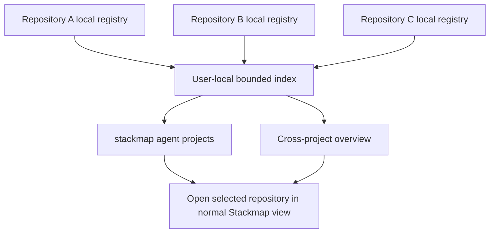

# feat: Add a cross-project agent overview

## Overview

Add a bounded, user-local index that answers “what are all my agents working on across projects?” without scanning every directory, scraping agent processes, or replacing each repository's authoritative Stackmap activity registry.

This is a separate follow-up. The repository-local provider-neutral contract in the main agent-coordination plan must stabilize first.

---

## Success Contract

The user can run one command or open one Stackmap overview and see every recently registered local repository with:

- Repository display name and canonical identity.
- Current root/worktree paths that are still accessible.
- Live, idle, stale, and recently handed-off Codex, Claude, and generic participants.
- Claimed branch/worktree and bounded reported phase/intent.
- Collisions, waiting/blockers, stale repositories, and Git evidence requiring attention.
- Freshness and provenance for every value.

The overview must not claim to discover an agent or repository that has never registered with Stackmap.

---

## Scope

### In scope

- A user-level index containing bounded pointers/summaries for repository-local registries.
- Automatic registration when Stackmap status, TUI, hook ingestion, or MCP is used in a repository.
- Optional reconciliation from documented provider-wide listings such as `claude agents --json --all`, with repository resolution and privacy filtering.
- Explicit register, unregister, list, prune, and inspect commands.
- A cross-project CLI summary and an optional Stackmap launch mode.
- Duplicate repository/common-directory detection.
- Missing paths, moved clones, removable drives, and stale-record handling.
- Local privacy, concurrency, resource, and corruption guarantees.

### Out of scope

- Cross-machine, team, or cloud synchronization.
- Filesystem-wide repository crawling.
- Process-table, terminal, transcript, private-database, editor, or window scraping.
- Repository mutation or automatic checkout switching.
- Aggregating uninstalled/unintegrated agent runtimes.
- Replacing repository-local records with one global source of truth.

---

## Architecture

Repository-local state remains authoritative. The global index stores:

- A versioned repository identity.
- Last-known canonical common-directory and worktree roots.
- Last registration/observation time.
- A bounded denormalized attention summary for fast listing.
- A pointer back to the local registry for fresh detail.

The index never copies prompts, transcripts, command/tool data, file contents, or unbounded intent/history.

---

## Key Decisions

| Decision | Rationale |
|---|---|
| Registration, not discovery scan | Predictable cost and no surprise filesystem access |
| Documented provider listings are supplemental | They can recover background sessions but never replace repository-local hook/registry truth |
| Repository-local truth, global pointers | Linked worktrees reconcile correctly and one corrupt global entry cannot rewrite local ownership |
| Stable identity plus multiple paths | Clones, moved directories, symlinks, and removable drives need explicit ambiguity handling |
| Bounded denormalized summary | “All projects” stays fast even when some paths are offline |
| Explicit offline/stale states | Missing repositories are not silently deleted or shown as live |
| Open into the normal repo view | Cross-project UI is an index/attention surface, not a second full topology renderer |

---

## Proposed Implementation Units

- [ ] X1. **Freeze the repository-local registration contract**

Depend on U2-U3 of the main plan. Define schema version, repository identity, canonical paths, attention summary, freshness, and writer provenance. Prove two linked worktrees register one repository while two clones remain distinguishable.

- [ ] X2. **Build an atomic user-level repository index**

Store independent per-repository files beneath the platform-appropriate Stackmap data directory. Use atomic replacement, strict size/count/string limits, an injected clock, and independent corruption handling. Avoid one shared mutable JSON file.

- [ ] X3. **Register from existing Stackmap entry points**

Refresh registration from TUI startup/reconciliation, `agent status`, hook ingestion, and MCP startup/calls. Registration is best-effort and must never block the repository-local operation. Explicit unregister/prune operations remain advisory and recoverable.

- [ ] X4. **Reconcile documented provider-wide listings**

Poll supported public provider surfaces such as `claude agents --json --all` with strict time/output/count bounds. Drop prompt-derived names and other sensitive fields, resolve each CWD through Git, merge by opaque provider/session identity, and prefer fresher repository-local hook evidence. Do not access private daemon, transcript, team, or job files. Providers without a documented listing remain registration-only.

- [ ] X5. **Add cross-project CLI queries**

Add `stackmap agent projects list`, `inspect`, `attention`, `prune`, and `open` semantics. Default output is human-readable; versioned JSON is available for agents. `inspect` re-reads the repository-local registry when accessible and clearly labels cached fallback.

- [ ] X6. **Add an optional cross-project overview**

Provide a compact project list ordered by attention then freshness. Show repository, live/idle/stale counts, provider mix, top bounded phase/intent, blockers/collisions, last seen, and offline state. Selecting a repository opens its normal topology view rather than duplicating branch rendering.

- [ ] X7. **Harden migration, privacy, and lifecycle**

Cover moved repositories, duplicate IDs, deleted clones, symlink changes, removable drives, permission loss, home-directory changes, schema upgrades, clock skew, excessive registrations, corrupt records, and uninstall cleanup. Apply the same privacy canaries as the repository-local feature.

- [ ] X8. **Validate real multi-project workflows**

Run real Codex and Claude sessions across at least three repositories and multiple worktrees. Confirm registration, attention ordering, collision summaries, offline transitions, pruning, and opening the correct repository. Measure startup/list latency with a deliberately large bounded index.

---

## Acceptance Examples

- Two linked worktrees for one repository produce one project row with two participant/worktree details.
- Two separate clones of the same remote do not merge solely because their remote URL matches.
- A Codex task in project A and Claude task in project B both appear with correct provider, phase, branch, and age.
- A generic agent appears only after registering through the provider-neutral contract.
- A disconnected removable drive shows an offline cached row rather than a live claim or silent deletion.
- One corrupt or oversized project entry does not hide other repositories.
- A stale global summary is visibly labelled and refreshes from local truth when the repository becomes accessible.
- A privacy canary present in provider hook input never appears in the user-level index or overview.

---

## Risks

| Risk | Mitigation |
|---|---|
| Global index becomes another authority | Store pointers/summaries only; local registry wins |
| Index grows without bound | Per-entry and total caps, expiry, explicit prune, deterministic eviction |
| Paths reveal sensitive project names | User-local permissions, bounded display, documented storage, optional unregister |
| Moved/duplicate repositories merge incorrectly | Stable identity plus canonical common-dir evidence and explicit ambiguity |
| Offline repositories slow startup | No broad scans; bounded parallel refresh; cached labelled fallback |
| Multiple processes corrupt the index | Independent per-repository atomic records |
| UI duplicates main topology complexity | Cross-project view is summary/navigation only |

---

## Dependency and Handoff

Do not implement this plan until the main plan freezes:

- Repository identity and status schema.
- Activity/attention DTOs and lifecycle leases.
- Privacy allowlist.
- Generic CLI/MCP semantics.

The main plan's U3 should leave a narrow registration callback boundary, but cross-project files, commands, and UI remain out of its delivery.
