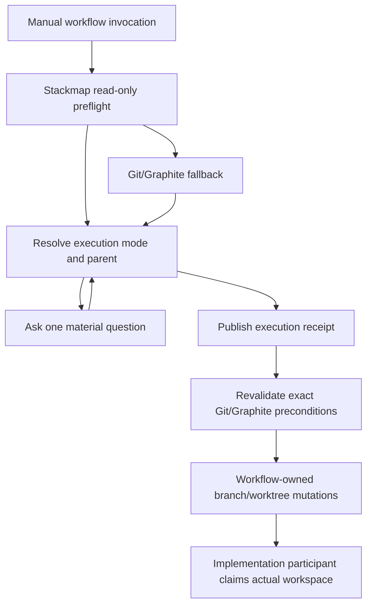
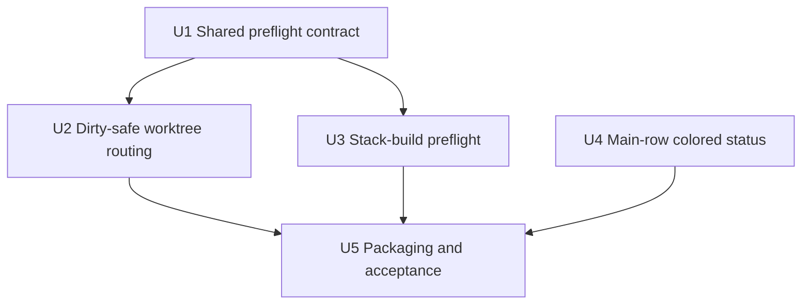

# feat: Add Stackmap-aware workflow preflight and dirty-safe worktree routing

## Overview

Keep `stack-build` and `worktree-rules` as explicit, manually selected workflows
while making each one begin with the same read-only Stackmap preflight. Replace
`worktree-rules`' blanket refusal on an ordinarily dirty primary checkout with a
committed-parent routing policy: never target the occupied checkout for mutation,
create isolated worktrees from an exact committed ref when ancestry is clear,
and ask only when the requested work may depend on uncommitted changes or when
multiple parents are materially plausible.

Also make live agent state persistently legible in Stackmap's ordinary branch
map. At responsive widths, a color-coded status field appears in the right-side
metadata rail immediately left of the commit timestamp; activity must no longer
replace or suppress the timestamp. The existing compact non-color activity badge
remains the narrow-width fallback.

**Target workspaces:**

- **Stackmap repository:** canonical shared preflight skill, TUI rendering,
  package verification, and public documentation.
- **Codex skills workspace (local pilot):** reversible updates to
  `worktree-rules/` and `stack-build/`, with paths below expressed relative to
  that workspace root. This iteration records backups, installed-file hashes,
  and rollback instructions; it does not claim these personal skills are
  distributed to other machines.

**Implementation baseline:** Stackmap-owned changes depend on
`codex/agent-coordination` at `16b04f9`, or a descendant containing that commit.
The currently active visual-feature checkout does not contain the integration
sources and must not be used as the implementation baseline by accident.

---

## Problem Frame

Stackmap can now show exact worktrees, cleanliness, active Codex/Claude/generic
participants, advisory claims, collisions, blockers, and handoffs. The manual
workflows do not yet consume that complete picture consistently:

- `worktree-rules` treats any dirty primary checkout as a blocker even though
  Git can safely create a new worktree from another committed ref—or from the
  current branch's committed `HEAD`—without importing staged, unstaged, or
  untracked changes.
- `worktree-rules` always pauses for parent confirmation, including cases where
  explicit direction, project policy, or clear continuation intent identifies
  exactly one safe parent.
- `stack-build` does not begin by checking whether another participant occupies
  the current worktree or stack, even though it intentionally remains an
  in-place, sequential, review-sized PR workflow.
- The main map currently reuses the timestamp area for agent disclosure and
  renders most provider/detail text in one cyan style. The operator wants a
  persistent, state-colored status beside—not instead of—the timestamp.

The workflows should gain better observation and routing without becoming
implicit automation. Stackmap remains advisory and read-only; the manually
invoked workflow remains the only owner of branch, Graphite, and worktree
mutations.

---

## Requirements Trace

- R1. `stack-build` and `worktree-rules` remain explicit manual invocations.
  Stackmap attention may recommend one, but never silently invokes either or
  changes execution mode.
- R2. Both workflows begin with the canonical shared collector's bounded
  `stackmap_status`, `stackmap_activity`, and `stackmap_attention` reads. If
  Stackmap is missing, incompatible, or degraded, the existing manual
  Git/Graphite discovery remains available as an explicitly labeled
  non-Stackmap fallback; no second repository collector is introduced.
- R3. `worktree-rules` treats the source and primary checkouts as read-only
  regardless of ordinary cleanliness. Dirty state does not block creation from
  a committed ref, but its staged, unstaged, and untracked changes are excluded
  and never copied, stashed, committed, patched, cleaned, or reset.
- R4. Parent routing is deterministic when intent is clear: explicit parent;
  current committed `HEAD` for continuations or sibling variants; `staging` for
  independent Factmachine work; `preview` only for explicit or established
  preview/deployment lineage; repository-defined trunk elsewhere.
- R5. The workflow asks one focused question before mutation when relevant work
  exists only in uncommitted state, multiple parents are materially plausible,
  a target branch already has worktree ownership, or an overlap requires a
  product decision. It does not infer dependency from filenames or contents:
  explicit alternate-parent/explicit-exclusion requests may proceed, while a
  dirty source plus current-HEAD continuation or variants asks whether to
  exclude the dirty state or wait for a commit unless the user already answered.
- R6. Every worktree batch resolves one parent ref to one exact OID, publishes
  an execution receipt, revalidates repository identity/ref/OID/ownership,
  destination availability, and Graphite topology at each mutation boundary,
  and verifies the primary checkout was preserved afterward. Concurrent
  source/primary edits refresh the observation and force a new ancestry
  decision only when they move the selected parent or reveal dependence on
  uncommitted work. `unavailable`, conflicted, unborn, or active Git operation
  states remain fail-closed.
- R7. `stack-build` remains an in-place Graphite workflow whose branches express
  small, coherent, independently reviewable PRs. Preflight discloses overlap
  and may recommend `worktree-rules`, but cannot invoke it automatically.
- R8. The Stackmap main map shows state-colored activity in a dedicated
  responsive metadata field immediately left of the timestamp. The timestamp,
  topology, committed diff, worktree, and PR evidence remain independently
  visible at their supported widths.
- R9. Status color is not the only cue. Provider/count/state text or glyphs
  remain meaningful under `NO_COLOR`, selection emphasis, narrow layouts, and
  stale/degraded activity.
- R10. Workflow and UI changes preserve the origin requirements' authority and
  privacy boundaries: Git proves repository state; agent reports describe
  advisory intent; neither proves authorship or completion.

This plan extends origin R2, R5-R7, R12-R17; it preserves the existing
provider-neutral registry, integration packaging, generic-adapter, and
real-surface requirements in origin R3-R4, R8-R11, and R18
(see origin: `docs/brainstorms/2026-07-28-agent-coordination-requirements.md`).

**Origin actors:** A1 (developer/operator), A2 (Codex agent), A3 (Claude agent),
A4 (generic agent), A5 (Stackmap TUI), A6 (agent consumer)

**Origin flows:** F1 (agent arrives), F2 (agent changes intent), F3 (Git changes
independently), F4 (agent stops or hands off), F5 (operator installs and
verifies an integration)

**Origin acceptance examples:** AE1 (worktree/cleanliness mapping), AE2
(advisory collisions), AE3 (reported phase versus Git evidence), AE4
(idle/stale/handoff lifecycle), AE5-AE6 (Codex/Claude/generic packaging
regression), AE7 (responsive disclosure), AE8 (privacy regression)

---

## Scope Boundaries

- No automatic invocation of `stack-build` or `worktree-rules`.
- No Stackmap MCP tool for branch, Graphite, worktree, checkout, restack, push,
  or PR mutation.
- No automatic stash, commit, checkpoint, patch copy, clean, reset, or transfer
  of uncommitted changes.
- No assumption that a Stackmap claim is a lock, parent relation, review verdict,
  or mutation authorization.
- No file-level ownership or semantic-overlap inference.
- No automatic restacking of unrelated features or design variants.
- No change to `stack-build`'s manual, stream-of-consciousness creation of
  review-sized Graphite branches.
- No cross-project or cross-host aggregation.

### Deferred to Follow-Up Work

- A source-controlled canonical home and general distribution mechanism for the
  personal Codex workflow skills. U2-U3 are a reversible local pilot, not a
  claim that those skills ship with Stackmap.
- Automatic cross-project scheduling based on the separately planned repository
  index.

---

## Context & Research

### Relevant Code and Patterns

- `integrations/shared/skills/stackmap-preflight/SKILL.md` already composes
  status, activity, and attention, but currently publishes intent before an
  orchestrated future worktree necessarily exists.
- `integrations/shared/skills/stackmap-coordinate/SKILL.md` correctly limits
  claims to the workspace actually in use and keeps capability material private.
- `worktree-rules/SKILL.md` already preserves the primary checkout, detects
  Graphite parentage, assigns one worktree per independent plan, revalidates
  ancestry, and defers all implementation to fresh agents. Its blanket dirty
  refusal and unconditional parent confirmation are the narrow policies being
  superseded.
- `stack-build/SKILL.md` already asks about a parent only when the wrong choice
  would materially matter, stays in the active checkout by default, and defers
  location authority to `worktree-rules` when both are explicitly requested.
- `src/ui/tree/activity.rs` already derives state glyphs and a semantic palette:
  active cyan; waiting/collision/unconfirmed yellow; blocked red; ready handoff
  green; idle/stale/historical handoff dark gray.
- `src/ui/layout.rs` owns fixed right-side metadata geometry. A dedicated status
  range belongs there so every row remains aligned and activity cannot move
  connector cells.
- `src/ui/tree.rs` currently allows activity rendering to suppress timestamp and
  PR fields. The new field must stop suppressing time while preserving existing
  diff/worktree/PR priorities.
- `src/integration_tests/tui_rendering.rs` already covers 40/64/80/90/119/120/180
  widths, sidebar body widths, `NO_COLOR`, collisions, phases, handoffs, and
  topology invariance.
- `scripts/verify-codex-plugin.sh` and
  `scripts/verify-claude-plugin.sh` validate the canonical five-skill package.

### Institutional Learnings

- No relevant `docs/solutions/` entries exist; `memory.md`, `changelog.md`, and
  prior plans are the durable record.
- `docs/plans/2026-07-21-002-feat-agent-status-cli-plan.md` originally required
  dirty-primary refusal. This plan supersedes only that blanket refusal while
  preserving supported-schema checks, fallback, ownership detection, exact-OID
  revalidation, and stale-precondition failure.
- Cleanliness belongs to a worktree, not globally to a branch or repository.
  `unavailable` must never be interpreted as clean.
- The Git common directory legitimately changes when a worktree is created.
  "Primary unchanged" therefore means branch, HEAD, index/staged state, tracked
  dirty bytes, and untracked path/content—not an unchanged common directory.
- A stopped agent is idle, not complete. A truly dependent task may wait for a
  committed handoff rather than guessing how to import dirty state.

### External References

- External research is intentionally omitted. Local Git characterization proved
  that staged and untracked primary changes remain untouched while clean
  worktrees are created from current committed `HEAD` and from another trunk.
  The installed Stackmap contract and local skill definitions are authoritative
  for this change.

---

## Key Technical Decisions

| Decision | Resolution | Rationale |
|---|---|---|
| Invocation | Keep both workflows manual | Selecting PR structure or parallel execution is user intent, not an inference from agent presence |
| Preflight | Automatic after manual invocation | Read-only context should be routine and low ceremony |
| Dirty checkout | Preserve and exclude ordinary dirty state | Git permits worktree creation from committed refs; the safety risk is importing or overwriting uncommitted work |
| Local skill delivery | Run U2-U3 as a reversible local pilot | This proves the workflow without expanding the plan into a general personal-skill distribution system |
| Parent routing | Resolve automatically only when one route is strongly supported | Correct ancestry matters more than avoiding one meaningful question |
| Claims | Advisory input only | Git worktree ownership and exact refs remain authoritative |
| Orchestrator claims | Do not claim a future implementation workspace | Child implementers claim only after their assigned worktree exists |
| Status placement | Dedicated metadata field left of timestamp | Activity should remain glanceable without erasing commit-age evidence |
| Status palette | Reuse existing activity-state mapping | Preserves learned semantics and avoids a second color vocabulary |

### Parent-routing matrix

| Intent/evidence | Selected parent | Behavior |
|---|---|---|
| Explicit parent | Named ref at exact OID | Proceed after policy and ownership validation |
| Continuation of current feature | Source checkout committed `HEAD` | Proceed when clean or dirty exclusion was already confirmed; otherwise use the dirty-source question below |
| Multiple design variants | One captured source `HEAD` OID | After the same cleanliness/exclusion gate, create sibling branches/worktrees from one OID |
| Independent Factmachine work | `staging` | Create sibling feature stacks |
| Explicit/established preview lineage | `preview` | Use only when deployment lineage—not frontend file type alone—supports it |
| Other independent repository work | Repository-defined trunk | Use the configured/default trunk |
| Relevant state only uncommitted | None yet | Ask whether to wait for a committed handoff or proceed without it |
| Dirty source plus current-HEAD continuation/variants | None until confirmed | Ask whether to exclude dirty state or wait for a commit, unless already answered |
| Multiple materially plausible parents | None yet | Ask one ancestry question before mutation |

---

## Open Questions

### Resolved During Planning

- **Should Stackmap automatically invoke a workflow?** No. It provides automatic
  preflight only after the user manually selects a workflow.
- **Does an ordinary dirty checkout block worktree creation?** No. It is
  preserved read-only and excluded from any committed parent.
- **Does `unavailable` cleanliness also proceed?** No. Missing trustworthy
  evidence, conflicts, active Git operations, and unborn branches remain
  fail-closed.
- **Does touching frontend code imply `preview`?** No. Preview requires explicit
  deployment intent, established lineage, or repository guidance.
- **Should status replace timestamp?** No. It receives a distinct responsive
  field immediately to the timestamp's left.

### Deferred to Implementation

- Exact compact/full status field widths and abbreviations, after existing
  renderer geometry tests establish the smallest non-wrapping allocation.
- Whether the status style helper remains in `src/ui/tree/activity.rs` or moves
  to `src/ui/theme.rs`; preserve one semantic mapping either way.
- A source-controlled distribution home for the personal workflow skills after
  the local pilot demonstrates the policy.

---

## High-Level Technical Design

> *This illustrates the intended approach and is directional guidance for
> review, not implementation specification. The implementing agent should treat
> it as context, not code to reproduce.*



The main-view rendering path stays independent:

```text
Activity snapshot
      |
      v
derive state/provider/count
      |
      +-- narrow: existing compact glyph in bounded metadata
      |
      +-- responsive: colored status field | timestamp | diff | WT | PR
```

---

## Implementation Units



- [ ] U1. **Clarify the shared Stackmap preflight composition contract**

**Goal:** Make the canonical preflight safe to compose with both manual
workflows and establish a repeatable local verification seam.

**Requirements:** R1, R2, R10; origin R14-R17

**Dependencies:** `codex/agent-coordination` at `16b04f9` or descendant

**Files:**
- Modify: `integrations/shared/skills/stackmap-preflight/SKILL.md`
- Create: `scripts/verify-agent-workflow-skills.sh`
- Test: `scripts/verify-agent-workflow-skills.sh`
- Verify unchanged contract: `scripts/verify-codex-plugin.sh`
- Verify unchanged contract: `scripts/verify-claude-plugin.sh`

**Approach:**
- Keep status/activity/attention reads bounded, read-only, provider-neutral, and
  fail-open for visibility.
- State that Stackmap may recommend a workflow but never silently invokes
  `stack-build` or `worktree-rules`.
- Defer intent publication and claims until the actual execution workspace is
  selected. An orchestrator planning future worktrees must not claim the source
  checkout as implementation ownership.
- Add a verifier that validates the canonical skill package and the locally
  installed workflow skills from an explicitly supplied skills root. Require a
  YAML-capable validator runtime and fail visibly rather than silently skipping
  full skill validation.

**Patterns to follow:**
- `integrations/shared/skills/stackmap-coordinate/SKILL.md`
- `scripts/verify-codex-plugin.sh`
- `scripts/verify-claude-plugin.sh`

**Test scenarios:**
- Happy path: a manually invoked workflow receives coherent status, activity,
  and attention and proceeds to its own routing stage without publishing a
  premature source-worktree claim.
- Fallback: missing, incompatible, timed-out, or degraded Stackmap labels
  activity unavailable and returns to Git/Graphite discovery.
- Boundary: detecting attention outside a manual workflow recommends an
  explicit workflow but performs no branch/worktree mutation.
- Privacy: receipts and validation output never include participant
  capabilities, prompt text, or tool payloads.

**Verification:**
- Both plugin package verifiers include one identical canonical preflight skill.
- The local workflow verifier distinguishes canonical Stackmap results from the
  labeled non-Stackmap fallback and does not reimplement the shared collector.

- [ ] U2. **Make `worktree-rules` dirty-safe and parent-aware**

**Goal:** Permit isolated work from trustworthy committed refs while preserving
the source and primary checkouts and asking only about material ancestry or
uncommitted dependencies.

**Requirements:** R1-R6, R10; origin R2, R5, R14-R17

**Dependencies:** U1

**Files (Codex skills workspace):**
- Modify: `worktree-rules/SKILL.md`
- Modify if activation copy changes: `worktree-rules/agents/openai.yaml`
- Test (Stackmap repository): `scripts/verify-agent-workflow-skills.sh`

**Approach:**
- Distinguish source checkout, Git primary checkout, selected parent ref/OID,
  and future implementation worktrees.
- Run orchestrator preflight before planning/dispatch, but do not claim future
  work. Each fresh implementation agent revalidates and claims only after
  entering its assigned worktree.
- Replace ordinary-dirty refusal with exclusion semantics. Preserve branch,
  HEAD, index entries/staged state, tracked dirty bytes, and untracked
  path/content from workflow commands; concurrent user edits may continue and
  are observed rather than treated as workflow mutations. Never require the
  shared common Git directory to remain unchanged.
- Use a deterministic dirty-dependency boundary rather than inspecting filenames
  or contents. Explicit alternate-parent work or an explicit instruction to
  exclude dirty state may proceed. Dirty current-HEAD continuations or variants
  ask whether to exclude the uncommitted state or wait for a commit unless the
  user already answered that exact question.
- Encode the parent-routing matrix and publish a receipt containing mode,
  source/primary identities, parent ref/OID and reason, dirty exclusions,
  sibling/dependent topology, and Stackmap/fallback attention.
- Revalidate immediately before every batch creation. Abort/reroute on parent
  ref/OID movement, repository-identity drift, changed ownership, branch-name
  race, occupied destination, or Graphite topology change. Treat concurrent
  source/primary content or index edits as expected external activity: refresh
  the receipt and proceed when the committed parent and dependency decision are
  unchanged; ask again or stop when the edit moves the selected ancestry or
  makes uncommitted content relevant.
- If the intended target branch is already checked out, ask one focused
  question naming its owning path and offering only the meaningful choices:
  resume in that workspace, choose a new branch, or stop. Make no mutation
  before the answer.
- Keep unavailable cleanliness, active merge/rebase/cherry-pick/bisect,
  conflicted index, unborn state, and unexpectedly untracked feature parents
  fail-closed for the affected route. Resolve and inspect the per-worktree Git
  directories for the source, primary, selected-parent owner when checked out,
  and each target after creation. An operation in an unrelated linked worktree
  does not block a demonstrably independent committed parent.
- Retain partially created worktrees on later failure and publish a blocker or
  handoff rather than deleting potentially useful state.
- Make the orchestrator-task batch receipt idempotent: record a batch ID, exact
  parent OID, intended branch/path pairs, and per-member
  creation/verification state in the task transcript and blocker/handoff
  summary. On retry within that task, adopt only a receipt-matching clean,
  unmodified member; otherwise retain it and ask before selecting a replacement
  branch/path. Cross-task durable batch storage remains out of scope.
- Before the local pilot edits either installed skill, create a recoverable
  backup outside the live skill directory. Record before/after file hashes,
  validation results, and exact rollback instructions in the execution receipt.

**Patterns to follow:**
- Existing primary-preservation and fresh-implementation-agent boundaries in
  `worktree-rules/SKILL.md`
- Prior exact-OID safety contract in
  `docs/plans/2026-07-21-002-feat-agent-status-cli-plan.md`

**Test scenarios:**
- Dirty primary plus explicit `staging` creates a clean isolated worktree and
  leaves branch, HEAD, index, tracked dirty bytes, and untracked contents exact.
- Dirty source plus current-HEAD variants creates distinct siblings from one
  captured OID only after the user confirms exclusion (or a prior answer is
  present), and states that all uncommitted changes were excluded.
- A task plausibly depending on dirty files asks whether to wait for a committed
  handoff or proceed without them; no mutation occurs first.
- Two independent Factmachine features choose sibling stacks from one exact
  `staging` OID.
- Explicit alternate trunk wins; generic frontend file scope alone does not
  select `preview`.
- Parent ref movement before any member of a batch aborts rather than mixing
  bases.
- Concurrent source edits that leave the exact selected parent and dependency
  decision unchanged refresh the receipt and do not starve worktree creation.
- Source edits that move the selected parent or reveal reliance on uncommitted
  work stop before the next mutation and require a new ancestry decision.
- Destination occupation, branch-name races, target ownership changes, and
  Graphite topology drift are independently injected between planning and
  creation; each stops before its affected mutation while preserving any
  already-created worktrees for recovery.
- A parent branch checked out elsewhere can serve as a base for a new branch;
  a target branch checked out elsewhere produces the focused resume/new
  branch/stop question, names its owning path, and is not duplicated.
- Stackmap collision is disclosed but does not block an intentionally isolated
  scope; Git ownership still wins when evidence disagrees.
- Unavailable cleanliness, conflict state, active Git operation, or unborn
  parent blocks safely.
- Active operations and conflicted indexes in source, primary, selected-parent
  owner, and created targets are detected through their per-worktree Git
  directories. A blocked parent route does not prohibit an unrelated committed
  parent whose relevant worktrees are healthy.
- Stackmap failure uses fallback discovery without weakening any exact-ref,
  ownership, Graphite, or preservation check.
- A post-creation verification failure retains recoverable state and reports a
  blocker/handoff.
- A failure after the first batch member records partial state; an exact clean
  retry resumes it, while a drifted or newly claimed partial member is retained
  and triggers one replacement/adoption question.

**Verification:**
- Representative fresh-agent transcripts choose the expected parent or ask the
  expected single question for every routing row.
- Disposable Git verification, owned by this unit, proves workflow
  non-interference with the primary checkout,
  clean child worktrees at exact selected OIDs, expected concurrent-edit
  handling, per-worktree operation scoping, and idempotent partial-batch resume
  without touching the live repository.
- The local pilot receipt proves the installed skills can be restored exactly
  to their pre-pilot hashes.

- [ ] U3. **Add recommendation-only Stackmap preflight to `stack-build`**

**Goal:** Give the manual review-sized PR workflow live overlap awareness without
changing its in-place, sequential Graphite identity.

**Requirements:** R1, R2, R7, R10; origin R5-R7, R14-R17

**Dependencies:** U1

**Files (Codex skills workspace):**
- Modify: `stack-build/SKILL.md`
- Modify if activation copy changes: `stack-build/agents/openai.yaml`
- Test (Stackmap repository): `scripts/verify-agent-workflow-skills.sh`

**Approach:**
- Run one preflight in the active checkout before branch-unit planning and show
  workspace path, branch/HEAD, cleanliness, Graphite base, participants,
  claims, and attention.
- Preserve small, coherent, independently reviewable branches as the reason for
  the skill; Stackmap state does not determine branch splitting.
- Continue in the active checkout when ownership is clear, including dirty
  changes that clearly belong to the requested stack.
- When external overlap or ambiguous pre-existing changes matter, explain the
  conflict and recommend explicit `worktree-rules`; never invoke it
  automatically.
- When already inside a worktree supplied by `worktree-rules`, keep that
  workflow authoritative for location, primary preservation, and cleanup.
- Refresh the advisory claim as the checked-out stack branch changes, without
  treating the claim as Graphite ancestry.

**Patterns to follow:**
- Existing base-selection and branch-ownership checks in `stack-build/SKILL.md`
- `integrations/shared/skills/stackmap-preflight/SKILL.md`

**Test scenarios:**
- Clear manual invocation prints an in-place receipt and creates no worktree.
- A participant collision produces a focused continue-or-isolate choice and
  does not invoke `worktree-rules`.
- Dirty changes clearly owned by the requested stack may proceed; unrelated or
  ambiguous changes pause before a branch claims them.
- Invocation inside an assigned worktree preserves `worktree-rules` authority.
- Stackmap unavailable falls back to existing repository/Graphite inspection.
- Branch units remain driven by coherent PR review boundaries, not lifecycle
  phases, claims, or participant counts.

**Verification:**
- Fresh-agent transcripts preserve manual activation and produce the expected
  in-place receipt, recommendation, or focused question.
- Existing Graphite ancestry and cumulative verification requirements remain
  present and unchanged.

- [ ] U4. **Add a persistent color-coded activity status beside the timestamp**

**Goal:** Make agent state glanceable from the ordinary branch map without
opening detail and without sacrificing commit-age evidence.

**Requirements:** R8-R10; origin R6, R7, R12, R13, AE3, AE7

**Dependencies:** `codex/agent-coordination` at `16b04f9` or descendant; may
proceed independently of U1-U3

**Files:**
- Modify: `src/ui/layout.rs`
- Modify: `src/ui/tree/activity.rs`
- Modify: `src/ui/tree.rs`
- Modify if semantic styling is centralized: `src/ui/theme.rs`
- Test: `src/integration_tests/tui_rendering.rs`
- Test: `src/ui/tree/activity.rs`

**Approach:**
- Add an optional fixed activity-status range in `RenderGeometry` immediately
  left of the existing time range at widths that can support both. Reserve at
  least one blank cell between status and timestamp and preserve the existing
  minimum branch-name and topology budgets.
- Keep branch-row columns globally aligned: rows without activity leave the
  status range blank rather than reclaiming it and shifting names or metadata.
- Render a bounded provider/count plus phase or attention token using the
  existing state palette. Prefer attention states such as collision, blocked,
  waiting, ready, and stale over a lower-urgency reported phase.
- Contract by discrete semantic tiers rather than arbitrary partial-provider
  truncation: full provider set/count plus state text; deterministic aggregate
  provider marker/count plus state; then state glyph/count only. Within a tier,
  retain the state glyph first, then provider/count, then attention/phase text.
- Stop setting `suppress_time` for active rows. Timestamp continues to render in
  its existing range; diff, worktree, and PR evidence retain explicit responsive
  priority.
- Retain the compact badge for widths that cannot afford a dedicated status
  range. Keep provider, count, phase, and state discoverable through text/glyphs
  when color is disabled or selection styling overrides foreground color.
- Treat state glyph/text as the authoritative cue when `NO_COLOR`, selection,
  or current-row emphasis suppresses semantic foreground color. Route the
  palette through the existing no-color-aware theme seam; selected rows use the
  established high-contrast foreground, and dim states must not combine a
  low-contrast foreground with `DIM`.
- Preserve the wide intent disclosure and `d` detail sidebar/modal as deeper
  evidence. Opening detail preserves selection and branch identity, retains at
  least the compact inline cue when geometry permits, and always shows full
  state/provider/count evidence in the sidebar or modal when the dedicated
  field contracts.

**Patterns to follow:**
- `badge_style`, `state_glyph`, `phase_or_attention`, and provider aggregation
  in `src/ui/tree/activity.rs`
- Fixed metadata geometry in `src/ui/layout.rs`
- Selected/current/no-color emphasis in `src/ui/tree.rs` and `src/ui/theme.rs`

**Test scenarios:**
- Covers AE3 / AE7. Active, testing, reviewing, waiting, blocked, live
  collision, idle, stale,
  ready handoff, and historical handoff render the expected token and semantic
  style.
- An activity row retains the exact same timestamp as its no-activity baseline.
- The status range ends before the timestamp and never overlaps diff, worktree,
  PR, branch-name, or topology cells.
- Every supported dedicated-field layout retains a one-cell
  status-to-timestamp gutter and the existing minimum branch-name/topology
  budgets; contraction never cuts through a provider token.
- Rows with no activity remain aligned with active rows and show no invented
  status.
- Widths 40, 56, 64, 72, 80, 90, 119, 120, and 180 remain one line with stable
  topology; disclosure contracts predictably when the dedicated field is absent.
- Opening the wide detail sidebar recomputes body geometry without moving
  connectors or losing the timestamp; selection remains stable and the selected
  branch exposes equivalent or fuller status evidence after contraction.
- `NO_COLOR` retains state/provider/count text or glyphs and every activity
  status cell uses `Color::Reset`.
- Normal, selected, current, context-dimmed, and `NO_COLOR` modes have
  style-level assertions for every semantic state; selected/current rows retain
  established high-contrast foregrounds and non-color state identity.
- Codex-only, Claude-only, generic-only, and mixed-provider collisions use
  bounded deterministic formats at every contraction tier.

**Verification:**
- Agent status is visible on the main page immediately left of timestamp where
  supported, while timestamp and all Git evidence remain independently visible.
- Existing rendering, geometry, and responsiveness suites remain green.

- [ ] U5. **Package, document, and prove the complete workflow**

**Goal:** Complete two independently landable delivery gates—manual workflow
preflight/routing and main-row rendering—then run one combined smoke test.
Stackmap's canonical preflight ships to installed Codex/Claude plugins; the
personal `stack-build` and `worktree-rules` changes remain a reversible local
pilot with durable acceptance evidence.

**Requirements:** R1-R10; origin R14-R18

**Dependencies:** U2, U3, U4

**Files:**
- Modify: `README.md`
- Modify: `docs/features.md`
- Modify: `integrations/codex/README.md`
- Modify: `integrations/claude/README.md`
- Modify: `memory.md`
- Modify: `changelog.md`
- Verify/package: `scripts/verify-codex-plugin.sh`
- Verify/package: `scripts/verify-claude-plugin.sh`
- Verify: `scripts/verify-agent-workflow-skills.sh`

**Approach:**
- Gate A (U1-U3) documents and validates manual preflight/routing independent of
  renderer completion. Gate B (U4) documents and validates status rendering
  independent of the local workflow pilot. Either gate may land while the other
  is repaired; one final smoke test proves their combined experience.
- Document the manual invocation boundary, automatic preflight, parent-routing
  matrix, dirty exclusion semantics, execution receipts, and wait/handoff path.
- Document the main-row color/status placement and non-color semantics.
- Validate the canonical skill package and both local workflow skills with a
  validator runtime that supports YAML; do not silently accept a skipped
  validator.
- Repackage/reinstall Codex and Claude integrations so fresh tasks receive the
  updated canonical preflight skill and renderer-compatible Stackmap binary.
  Do not imply that Claude receives the personal Codex workflow skills.
- Install U2-U3 only as the reversible local pilot: retain pre-edit backups,
  record exact before/after hashes and validator output, and prove the documented
  rollback restores the original hashes.
- Exercise one fresh Codex task and one fresh Claude task in separate disposable
  worktrees, including a visible collision/attention state and colored main-row
  status.
- Exercise the local manual skills with clear current-HEAD continuation,
  explicit alternate trunk, independent `staging`, ordinary dirty exclusion,
  ambiguous dirty dependence, and Stackmap fallback transcripts.

**Patterns to follow:**
- Existing plugin packaging and exact-binary verification scripts
- Changed-surface origin examples AE1-AE4 and AE7; run existing privacy and
  lifecycle suites as regression checks, and retain AE5-AE6 package plus AE8
  privacy coverage without re-certifying every original acceptance surface

**Test scenarios:**
- Covers AE1. End-to-end: dirty occupied primary plus an independent manually invoked
  `worktree-rules` task creates a clean `staging`-based worktree, preserves the
  primary, registers the implementation participant, and displays its colored
  status beside timestamp.
- Variants: two manual worktree variants use one exact current-HEAD OID, appear
  as sibling branches, and do not import dirty source changes.
- Manual boundary: an ordinary task that notices Stackmap attention recommends
  but does not invoke either workflow.
- Stack-build: manual invocation produces a review-sized Graphite plan and
  in-place receipt without creating a worktree.
- Failure: unsupported Stackmap schema labels visibility unavailable and falls
  back without weakening Git/Graphite validation.
- Covers AE8. Privacy: no receipt, package output, registry record, or rendering contains
  capabilities, prompts, transcripts, tool output, or source contents.

**Verification:**
- Gate A passes plugin package checks, workflow validation, disposable Git
  characterization, and fresh-task workflow acceptance without depending on
  U4.
- Gate B passes formatting, strict lint, renderer/unit/integration suites,
  release build, and visual operator acceptance without depending on U2-U3.
- The combined smoke test shows a newly created participant in its isolated
  worktree and the matching colored main-row state beside an unchanged
  timestamp.
- Installed Codex and Claude packages expose the updated canonical preflight;
  locally piloted `stack-build` and `worktree-rules` retain explicit manual
  activation and a tested rollback receipt.

---

## System-Wide Impact

- **Interaction graph:** Manual skill invocation starts Stackmap preflight;
  preflight informs workflow routing; `worktree-rules` owns worktree/Graphite
  mutation; fresh implementers claim actual workspaces; activity snapshots feed
  the main-row status renderer and detail view.
- **Error propagation:** Stackmap visibility failure degrades to existing
  discovery; unavailable Git identity/cleanliness, active operations, parent
  drift, ownership conflicts, and Graphite inconsistency remain blocking.
- **State lifecycle risks:** The source checkout may change during planning;
  parent refs may move during a batch; branch names and paths may race; partially
  created worktrees must remain recoverable.
- **API surface parity:** Codex and Claude packages share one canonical preflight
  skill. Generic MCP tools remain provider-neutral and read-only except for
  advisory coordination records.
- **Integration coverage:** Disposable real-Git worktrees must prove exclusion
  and primary preservation; renderer tests must prove status/timestamp
  coexistence; fresh installed tasks must prove lifecycle visibility.
- **Unchanged invariants:** Claims do not lock work; Stackmap does not mutate
  Git; `stack-build` remains in-place and review-unit driven;
  `worktree-rules` never mutates the primary checkout; Graphite remains
  authoritative for stack parentage and restacking.

---

## Risks & Dependencies

| Risk | Mitigation |
|---|---|
| Agent interprets dirty exclusion as permission to lose work | Prohibit workflow commands from targeting the occupied checkout, disclose exclusion, and prohibit automatic stash/commit/copy/clean |
| Agent chooses the wrong parent autonomously | Use deterministic routing and ask when multiple parents materially fit |
| A batch creates variants from different moving bases | Resolve one exact OID and revalidate the parent ref before each creation |
| A partial batch is retried without its original task receipt | Retain discovered branches/worktrees, refuse automatic adoption, and ask before choosing replacement names; cross-task receipt storage is follow-up work |
| Stackmap claim is mistaken for Git ownership | Keep claims advisory and revalidate `git worktree` ownership |
| Orchestrator claims a workspace it will not edit | Delay claims until fresh implementers enter created worktrees |
| Status field crowds existing metadata | Allocate fixed responsive geometry and retain the narrow compact badge |
| Status color conflicts with selection or `NO_COLOR` | Preserve state glyph/text and test selected/current/no-color paths |
| Current checkout lacks integration sources | Base implementation on `16b04f9` or descendant |
| Personal skills are not source-controlled here | Validate explicit installed paths and defer distribution/source strategy |
| Default validator lacks PyYAML | Use a known compatible runtime and fail visibly if full skill validation cannot run |

---

## Documentation / Operational Notes

- Update the tutorial language so users understand that manual workflow
  selection remains intentional while preflight is automatic within it.
- Include example receipts for current-HEAD variants, independent `staging`
  work, explicit `preview`, and dirty-dependency waiting.
- Explain that ordinary dirty state is compatible with worktree creation but is
  never inherited without a commit.
- Document the status palette and the distinction between colored agent state,
  agent-reported intent, and Git-observed timestamp/diff/cleanliness.
- Fresh tasks are required after plugin updates; already-open tasks need not
  hot-load revised skills or hooks.

---

## Sources & References

- **Origin document:** `docs/brainstorms/2026-07-28-agent-coordination-requirements.md`
- Prior status/workflow plan: `docs/plans/2026-07-21-002-feat-agent-status-cli-plan.md`
- Agent-coordination implementation plan: `docs/plans/2026-07-28-001-feat-agent-coordination-integrations-plan.md`
- Stackmap workflow skills: `integrations/shared/skills/stackmap-preflight/SKILL.md`,
  `integrations/shared/skills/stackmap-coordinate/SKILL.md`
- Stackmap UI: `src/ui/layout.rs`, `src/ui/tree/activity.rs`,
  `src/ui/tree.rs`, `src/integration_tests/tui_rendering.rs`
- Codex skills workspace: `worktree-rules/SKILL.md`, `stack-build/SKILL.md`
- Project record: `memory.md`, `changelog.md`
