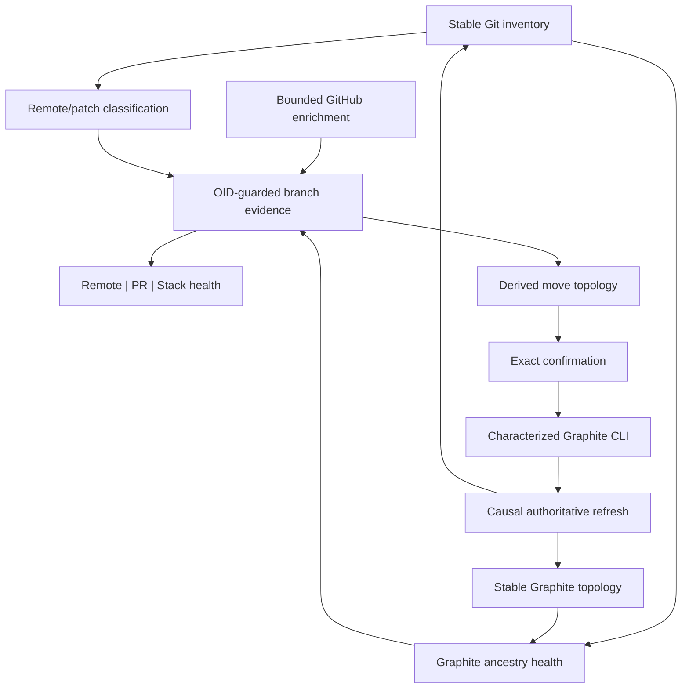
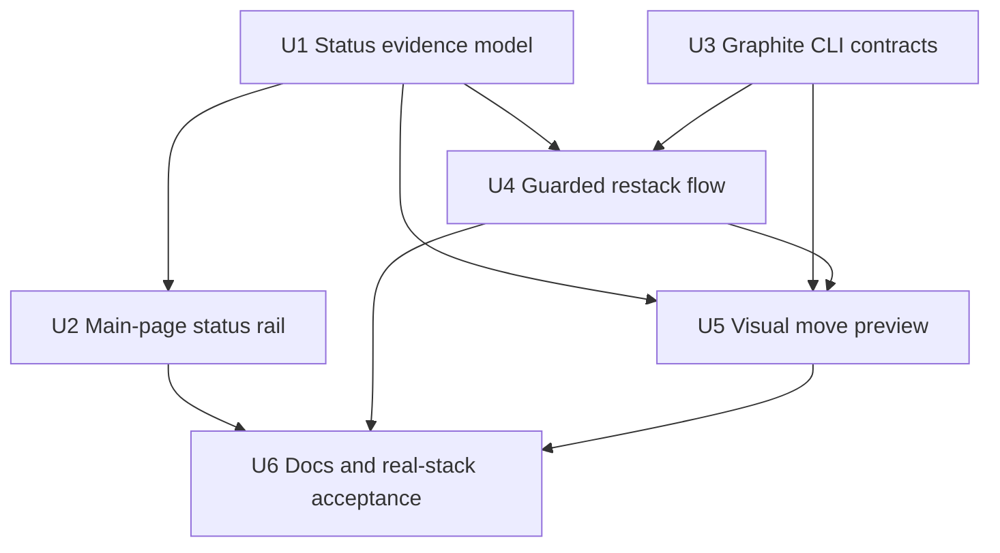

# feat: Clarify branch safety status and add guarded Graphite stack actions

## Overview

Turn the right side of Stackmap's main page into three independent, glanceable
answers:

| Field | Question answered | Representative states |
|---|---|---|
| Remote | Is this exact local tip represented in locally known remote refs? | `✓ pushed`, `↑3 ahead`, `≈ rewritten`, `! diverged`, `○ local tip` |
| Pull request | What review state is associated with this branch name and tip? | `#4100`, `Approved #4100`, `Merged #4087`, `Closed #4087`, optional stale-tip `~` |
| Stack health | Does Graphite's recorded parent match Git ancestry? | `↻ restack`, `· healthy`, `? unavailable` |

This supersedes the ambiguous `↕42/42 div` presentation. Raw ahead/behind counts
remain available in details, but the main row distinguishes patch-equivalent
rewritten history from genuinely different patches. It also replaces `no remote`
with `local tip` when the exact tip is absent from locally known remote refs; it
must not claim a remote branch does not exist.

Add two deliberate Graphite actions:

- `r` confirms and runs a guarded restack for the selected branch and its
  affected upstack; `R` becomes full reconciliation.
- `m` opens an in-memory move preview. Navigation chooses a target parent,
  `Tab` toggles Graphite's default subtree move versus `--only`, Enter confirms,
  and Escape cancels. The preview reruns the ordinary topology projection so
  branches and connectors move together before any command is invoked.

Graphite remains the sole mutation authority. Stackmap characterizes and invokes
exact Graphite CLI contracts, revalidates repository identity, OIDs, topology,
and worktree safety immediately before execution, then discards the preview in
favor of an authoritative Git/Graphite refresh.

---

## Problem Frame

The current row can show `↕N/N div`, but equal raw counts after a rebase or
restack often describe patch-equivalent histories. In the representative
FactMachine stack, `42/42`, `41/41`, and adjacent values collapse to `0/0` under
patch-equivalence comparison. Calling those rows simply “diverged” makes branch
cleanup feel more dangerous without explaining what is actually different.

The current `○ no remote` label also overstates local evidence. Several
FactMachine branches with that label have live GitHub PRs because “no configured
upstream or cached containing ref” is not the same as “no remote branch.”

PR enrichment already knows open, approved, merged, and closed states, but it
accepts only exact branch-ID plus tip-OID matches. After a local restack, a live
or merged PR for the same branch name disappears from the map even though it is
important context. Conversely, a historical merged PR must never make a new
local tip look safely merged.

Finally, Stackmap can visualize Graphite topology but cannot yet help correct or
reorganize it. Running `gt restack` or `gt move` externally gives no preview of
the affected subtree. The TUI should make the consequences legible without
becoming a second Graphite metadata writer.

---

## Requirements Trace

- R1. Main-page rows expose remote-tip state, PR state/number, and Graphite stack
  health as three independent responsive fields at every supported width; full
  text contracts to fixed compact tokens, but no field disappears or
  impersonates another.
- R2. Remote state is local-only and no-fetch. Exact-tip containment renders
  `✓ pushed`; local commits render `↑N ahead`; remote commits render
  `↓N remote`; without a configured upstream, exact local remote-ref containment
  may still render `✓ pushed`, otherwise the exact unmatched tip renders
  `○ local tip`; a deleted configured upstream renders `× gone`; unavailable
  evidence renders `? unknown`.
- R3. A raw two-sided upstream comparison is patch-classified. Patch-equivalent
  rewritten histories render `≈ rewritten`; only non-equivalent two-sided
  histories render `! diverged`. Exact counts and reference names remain in the
  detail view.
- R4. PR rows retain the number in every lifecycle state. Open is yellow,
  approved is green, merged is purple, and closed is muted gray/red. Meaningful
  text/glyphs remain under `NO_COLOR`.
- R5. An exact branch-name and tip-OID PR match wins. If no exact match exists,
  Stackmap may show the deterministic primary name-matched PR with an explicit
  stale lifecycle label such as `Merged~ #4087` and detail text explaining that
  its head OID differs or is unavailable. A stale merged PR keeps purple on the
  PR identity for lifecycle recognition, while the `~` warning remains textual
  under `NO_COLOR`; it never proves the current tip is merged, pushed, or
  deletion-safe.
- R6. Stack health is computed only for Graphite-tracked branches from stable
  Graphite metadata plus Git ancestry. `↻ restack` means the recorded Graphite
  parent is not in the branch's Git history. Degraded or unavailable topology
  never becomes “healthy.”
- R7. `r` begins restack only on an eligible selected branch, displays a centered
  confirmation naming the source and affected descendant count, and invokes a
  characterized noninteractive `gt restack` contract only after confirmation.
  `R` performs the existing full reconciliation.
- R8. Restack impact is explicit: the preview/confirmation includes the selected
  branch and the validated upstack that Graphite may rewrite, even when not
  every descendant independently displays `↻ restack`.
- R9. `m` opens a visually distinct preview in which the selected source and,
  by default, all descendants move under a candidate parent. Ordinary
  navigation changes the target; topology rows and connectors update together.
- R10. `Tab` toggles default subtree behavior and branch-only `--only` behavior.
  `o` continues to open the selected PR. Enter confirms the exact displayed
  proposal; Escape cancels without changing Git, Graphite, or config.
- R11. Move preview rejects a trunk as source, the source itself, descendants
  that would create a cycle, degraded/untracked sources, missing targets,
  rewritten branches checked out in linked worktrees, dirty/non-ready startup
  worktrees, and stale source/target/topology evidence. Trunk-as-target support
  follows disposable `gt move --onto <trunk>` characterization.
- R12. Restack and move use allowlisted Graphite 1.8.6 command shapes, bounded
  output/time/process groups, typed requests/results, and one global mutation
  slot. Unknown CLI contracts fail closed.
- R13. Immediately before invoking Graphite, Stackmap revalidates repository ID
  and readiness, source/target OIDs, Graphite provenance and recorded parents,
  affected descendants, trunk/cycle constraints, and worktree safety. The
  startup worktree must be clean and ready; every rewritten affected branch
  checked out in another linked worktree is rejected because Stackmap cannot
  currently prove that worktree's cleanliness or operation state. A read-only
  target checked out elsewhere remains eligible if its OID revalidates.
- R14. After invocation, an authoritative structural refresh replaces all
  preview state. Causal request epochs prevent an older queued snapshot from
  completing reconciliation. Mixed or conflicted results remain visible,
  block further mutations, and are never auto-aborted.
- R15. Enrichment, preview, and rendering preserve the 40-column floor, bounded
  queues/caches/work, stable selection, Active/Archive behavior, and responsive
  non-wrapping rows.
- R16. Status badges are evidence, not mutation authorization. Archive/delete
  behavior remains separately guarded; no new action pushes, fetches,
  force-pushes, deletes remotes, closes PRs, directly updates refs, or writes
  Graphite SQLite/config files. Intended local ref rewrites occur only through
  the characterized, confirmed Graphite command.

---

## Scope Boundaries

- No automatic restack or move based on a badge.
- No direct ref updates, fetch, push, force-push, remote deletion, PR
  creation/closure, or merge; characterized Graphite commands may rewrite the
  confirmed local branch set.
- No direct write or migration of `.graphite_metadata.db` or
  `.graphite_repo_config`.
- No attempt to prove that a stale-tip PR contains the current local patch.
- No deletion-safety relaxation based on pushed, PR, merged, or restack state.
- No generic shell command entry; every Graphite invocation uses typed,
  option-safe arguments.
- No preview persistence. Refresh, cancellation, or command completion rebuilds
  from authoritative state.
- No Graphite action when topology is degraded, the repository has an active Git
  operation, or the installed CLI contract is uncharacterized.

### Deferred to Follow-Up Work

- Fetch-assisted remote discovery and synchronization.
- Displaying multiple historical PRs for one reused branch name at once.
- Interactive conflict resolution or automatic Graphite abort/continue.
- Drag-and-drop, arbitrary multi-selection, or batch moves.
- Remote Graphite service integration.

---

## Context & Research

### Representative FactMachine Evidence

- The installed Graphite CLI is `1.8.6`.
- `gt move` defaults to moving the source and restacking all descendants;
  `--only` moves only the selected branch and leaves descendants behind.
- `gt restack` supports `--branch`, `--upstack`, `--downstack`, and `--only`.
- The chain from `frontend/notifications/unread-badge-hover-ring` toward
  `preview` contains 63 entries in the inspected metadata. The selected branch
  has no descendants above it, demonstrating why impact must come from the
  actual selected subtree rather than a fixed assumption.
- Representative `N/N` rows reported `0/0` with `git rev-list --left-right
  --cherry-pick --count`, proving patch-equivalent rewritten histories.
- GitHub reported open PRs in `sevendwarves/factmachine-monorepo`, including
  `frontend/palette/red-and-green-tokens` PR #4100,
  `frontend/market-page/shared-badge-chrome` PR #4087, and
  `frontend/geometry/desktop-surfaces` PR #4067.
- Some of those branch rows rendered `○ no remote`, confirming that the current
  label describes missing local upstream evidence, not global remote absence.
- Refreshed `origin/staging` did not contain representative local tip patches,
  so the inspected examples were not treated as merged.

### Relevant Code and Patterns

- `src/model/branch.rs` owns `ConfiguredUpstream`, `RemoteRefEvidence`,
  `PullRequest`, `PullRequestStatus`, `GraphiteProvenance`, and branch OIDs and
  parents. It needs explicit patch-equivalence, PR match-quality, and stack
  health rather than encoding those meanings in strings.
- `src/refresh/builder.rs` already double-reads Git inventory and Graphite
  topology before accepting a stable structural snapshot. It is the correct
  seam to attach stable recorded-parent evidence; expensive ancestry work must
  remain bounded or move to an exact-OID enrichment coordinator.
- `src/refresh/upstream.rs` provides the one-active/latest-pending,
  exact-branch/OID/source-token, no-fetch coordinator pattern.
- `src/adapters/github.rs` already fetches all PR states and head OIDs.
  `src/app.rs::apply_prs` currently discards non-exact OIDs and preserves PRs
  across refresh only by ID plus OID.
- `src/ui/layout.rs::RenderGeometry` already gives remote and PR independent
  ranges at responsive widths. `src/ui/tree.rs` owns row text/color, and
  `src/ui/tree/details.rs` owns full evidence.
- `src/events.rs` currently ignores Tab. `src/app.rs::handle_normal_key` maps
  `r` to refresh and preserves `o`/`y` for PR actions.
- `src/app/state.rs`, `src/app/mutation.rs`, and `src/main.rs` provide the
  exclusive mutation state, centered confirmation, bounded worker, typed
  result, causal refresh, and blocked-postcondition patterns used by checkout
  and deletion.
- `src/adapters/git.rs` characterizes the installed Graphite deletion contract,
  revalidates exact live state, invokes typed arguments, and inspects Git plus
  raw Graphite metadata afterward. Restack/move should extend that architecture,
  not reuse deletion assumptions.
- `src/model/topology.rs::TopologyIndex` rebuilds rows and connectors from branch
  parentage and Graphite child order. A temporary relationship override can
  reuse the ordinary projector without mutating `App.snapshot`.
- `docs/graphite-compatibility.md` currently characterizes only read topology
  and tracked-leaf deletion. Restack and move require their own matrix entries
  and disposable-repository evidence.

### Institutional Learnings

- Structural state and independent enrichment publish separately; provider
  failure must not hide branches or roll back a newer snapshot.
- Enrichment results are generation/OID/token guarded and bounded. “Unknown”
  is never interpreted as safe.
- Overlay input is exclusive, live previews are reducer-owned, and Enter commits
  once while Escape rolls back.
- Mutation identity retains operation, exact targets/OIDs, causal epoch, and
  deadline until authoritative reconciliation proves the postcondition.
- Graphite remains authoritative for movement/restacking. Stackmap does not
  infer compatibility from private SQLite column similarities.
- Conflicts are recoverable provider state, not panic conditions; never
  auto-abort a user's Git operation.

External web research is unnecessary. The installed CLI help and disposable
local Git/Graphite characterization are the relevant implementation contracts.

---

## Key Technical Decisions

| Decision | Resolution | Rationale |
|---|---|---|
| Status composition | Three independently allocated fields | Remote, review, and topology answer different safety questions |
| `N/N` interpretation | Patch-classify before labeling | Raw counts after rebase/restack are visually alarming but often equivalent |
| Missing remote-tip evidence | `local tip`, not `no remote` | Locally known refs cannot prove global nonexistence |
| Historical PR | Show one deterministic stale match with `Merged~`-style text | Preserves useful lifecycle context without claiming exact-tip identity |
| Historical PR color | Keep lifecycle color; add `~` and explanatory details | Purple still means that PR merged, not that the current local OID merged |
| Restack detection | Recorded parent absent from Git ancestry | Mirrors Graphite's documented invariant |
| Restack scope | Selected branch plus validated upstack | Descendant refs may be rewritten even when only the source is unhealthy |
| Move default | Source subtree; `Tab` toggles `--only` | Matches characterized `gt move` semantics |
| Move rendering | Derived in-memory topology index | Gives an honest visual preview without shadow-writing Graphite |
| Mutation boundary | Exact preflight + characterized CLI + causal refresh | Preflight narrows races; exact postconditions detect external concurrent drift because Graphite has no expected-OID atomic flag |
| Conflict policy | Surface and block; never auto-abort | A conflict can leave valuable user state requiring deliberate resolution |

### Status precedence

Remote classification is deterministic:

1. A configured upstream is compared by exact OIDs and raw counts.
2. Two-sided history is patch-classified as `≈ rewritten` or `! diverged`.
3. Without a configured upstream, exact local remote-ref containment may prove
   `✓ pushed`; otherwise the row is `○ local tip`, `… checking`, or `? unknown`.
4. A gone configured tracking ref remains `× gone`.

PR selection is also deterministic:

1. Exact branch name plus head OID wins.
2. Otherwise choose the highest-numbered name match returned by the bounded
   all-state query and mark it stale with `~`. A missing historical head OID is
   retained as stale; only a present equal OID can be exact.
3. Exact and stale associations are replaced only by a newer authoritative
   GitHub result; structural refresh preserves them only while branch identity
   and the relevant OID/name guard remain valid.

### Responsive vocabulary

| State | Full row | Compact row | Detail |
|---|---|---|---|
| Exact remote tip | `✓ pushed` | `✓` | containing/upstream ref and checked time |
| Local commits | `↑3 ahead` | `↑3` | upstream ref and counts |
| Remote commits | `↓2 remote` | `↓2` | upstream ref and counts |
| Patch-equivalent rewrite | `≈ rewritten` | `≈` | raw counts plus patch-equivalent `0/0` |
| Genuine divergence | `! diverged` | `!` | raw and patch-distinct counts |
| Exact tip absent locally known remotes | `○ local tip` | `L` | no fetch; a remote branch or stale PR may exist |
| Restack needed | `↻ restack` | `↻` | recorded parent and failed ancestry check |

All widths reserve one compact token per field. PR absence uses `—`; healthy
stack state uses `·`; unavailable stack state uses `?`. The footer/help keeps a
persistent compact legend (`remote | PR | stack`) so glyphs do not require color
or memory. Compact stale PRs retain lifecycle and warning, for example
`M~4087`; compact remote tokens use text or conventional direction plus count
where possible (`P`, `↑3`, `↓2`, `RW`, `DIV`, `L`, `?`).

---

## Open Questions

### Resolved During Planning

- **Does `o` become move?** No. `o` remains Open PR; `m` owns move.
- **Which key refreshes?** Uppercase `R`; lowercase `r` begins restack.
- **What moves by default?** The selected branch and every validated
  descendant, matching `gt move`. `Tab` selects `--only`.
- **Should stale merged PRs be hidden?** No. They render `Merged~ #N`; purple is
  limited to the PR identity while the textual `~` and details deny current-tip
  merge proof.
- **Does `↕42/42` mean 42 commits are unsafe?** Not necessarily. The row is
  patch-classified; equivalent rewritten history receives `≈ rewritten`.
- **Can Stackmap write Graphite metadata directly for a smoother preview?** No.
  Preview is derived in memory; Graphite CLI is the mutation authority.

### Deferred to Implementation

- Exact responsive widths for the three fields after 40/64/72/80/90/120-column
  render fixtures establish the smallest readable allocation.
- Whether patch classification extends `src/refresh/upstream.rs` or gets a
  sibling coordinator. It must preserve the same bounds, tokens, and no-fetch
  contract either way.
- Whether Graphite action request/result types live beside Git mutations or in
  a focused `src/adapters/graphite_mutation.rs`; keep read-only SQLite access in
  `src/adapters/graphite.rs`.

---

## High-Level Technical Design



Move preview state retains the source ID/OID, original Graphite parent, affected
descendant IDs/OIDs, candidate target ID/OID, and mode. It derives a temporary
parent map and child order, rebuilds `TopologyIndex`, then projects with the
current filter/archive/scope/layout options. It never replaces the authoritative
snapshot:

```text
authoritative snapshot + preview relationship override
                         |
                         v
              temporary TopologyIndex
                         |
                         v
              ordinary projection/render
                         |
              Enter confirmation / Esc discard
```

For subtree mode, the source's parent changes and descendants retain their
internal relationships. For `--only`, preview behavior must match disposable
Graphite characterization: the source changes parent while its former direct
children remain behind according to the exact post-command topology Graphite
produces. This behavior is fixture-tested before the TUI claims it can preview
the command.

---

## Implementation Units



- [ ] U1. **Model exact remote, PR-match, and Graphite-health evidence**

**Goal:** Replace ambiguous display-time inference with typed, OID-guarded
evidence that independently answers remote, review, and stack-health questions.

**Requirements:** R1-R6, R12, R15-R16

**Dependencies:** None

**Files:**
- Modify: `src/model/branch.rs`
- Modify: `src/adapters/git.rs`
- Modify: `src/adapters/github.rs`
- Modify: `src/refresh/builder.rs`
- Modify: `src/refresh/upstream.rs`
- Modify: `src/refresh/mod.rs`
- Modify: `src/app.rs`
- Test: `src/integration_tests/repository_snapshot.rs`
- Test: `src/integration_tests/refresh_pipeline.rs`
- Test: `src/integration_tests/github_enrichment.rs`

**Approach:**
- Add typed patch relation (`EquivalentRewrite` versus `Diverged`) without
  discarding raw upstream counts or exact reference names.
- Use Git's patch-equivalence comparison only for raw two-sided histories.
  Schedule it through the existing bounded exact-OID/source-token enrichment
  pattern, cache by the relevant OID pair, and stop obsolete generations between
  tasks.
- Rename the semantic no-upstream state to `Untracked` while preserving
  `RemoteRefEvidence` containment as independent exact-tip evidence.
- Add `PullRequestMatch::{ExactTip, StaleTip}` (or an equivalent explicit
  field) and retain `head_oid: Option<Arc<str>>` for details and refresh
  validation. Only `Some(head_oid) == local_oid` is exact; missing historical
  OIDs remain stale name matches.
- Make GitHub association deterministic: exact OID first, otherwise the
  highest-numbered same-name result marked stale. Preserve typed provider
  failures and the current query/output limits.
- Add stack-health evidence with healthy, restack-needed, checking/unavailable,
  and inapplicable states. For tracked branches, compare the recorded Graphite
  parent OID against the branch tip's Git ancestry from one accepted stable
  topology/inventory generation.
- Do not perform subprocess work during rendering or once per frame. Bound and
  deduplicate ancestry work for identical OID pairs.
- Invalidate every evidence item on branch OID, recorded parent, topology token,
  or repository generation mismatch.

**Test Scenarios:**

1. Configured upstream equal/ahead/behind/gone keeps existing exact behavior and
   full reference details.
2. A two-sided rebase with patch-equivalent commits becomes `EquivalentRewrite`
   while preserving raw `42/42`-style counts in details.
3. A two-sided history with distinct patches becomes `Diverged` with exact
   patch-distinct counts.
4. No configured upstream plus exact local remote containment is pushed; without
   containment the exact tip is locally unmatched, not globally “no remote.”
5. Loading, command failure, truncation, cancellation, and stale source tokens
   never become locally unmatched, healthy, or pushed.
6. Exact PR OID wins over newer stale history; absent an exact match, the
   highest-numbered same-name PR is marked stale.
7. Open, approved, merged, and closed stale PRs retain state and number,
   including merged/closed PRs whose deleted head ref yields no OID; a
   structural OID change never upgrades stale to exact.
8. A Graphite parent in Git ancestry is healthy; a recorded parent outside
   ancestry needs restack; untracked/degraded/missing-parent cases remain
   inapplicable or unavailable.
9. Repeated identical OID pairs deduplicate work; obsolete generations stop
   scheduling and cannot overwrite newer evidence.

**Verification:**
- `cargo test --all-targets --all-features github_enrichment`
- `cargo test --all-targets --all-features repository_snapshot`
- `cargo test --all-targets --all-features refresh_pipeline`

- [ ] U2. **Render the independent responsive status rail**

**Goal:** Make the main page answer remote, PR, and stack-health questions at a
glance without topology shifts or color-only meaning.

**Requirements:** R1-R6, R15-R16

**Dependencies:** U1

**Files:**
- Modify: `src/ui/layout.rs`
- Modify: `src/ui/tree.rs`
- Modify: `src/ui/tree/details.rs`
- Modify: `src/ui/panels.rs`
- Modify: `src/ui/theme.rs`
- Test: `src/integration_tests/tui_rendering.rs`
- Test: `src/integration_tests/terminal_interaction.rs`

**Approach:**
- Allocate separate remote, PR, and stack-health ranges in
  `RenderGeometry`. Contract each to a fixed compact token as width decreases;
  keep all three slots present even at 40 columns and never concatenate their
  meanings into one ambiguous badge.
- Replace `↕N/N div` with `≈ rewritten` or `! diverged`; move exact raw counts to
  details. Replace `○ no remote` with `○ local tip`.
- Include PR number in every state and append `~` for stale-tip associations.
  Centralize state colors in `src/ui/theme.rs`: open yellow, approved green,
  merged purple, closed muted gray/red.
- Give restack warning a distinct warning style that remains recognizable under
  selected-row background and `NO_COLOR`.
- Explain stale PR semantics, patch equivalence, recorded Graphite parent, and
  exact remote evidence in the detail sidebar/footer.
- Preserve diff green/red, worktree markers, timestamp, branch/title colors,
  connectors, and fixed-row alignment.

**Test Scenarios:**

1. Full-width rows show three aligned independent fields for representative
   combinations, including pushed + merged + restack-needed.
2. Responsive fixtures at 40, 64, 72, 80, 90, 120, and 180 columns never wrap
   and retain three fixed status slots, contracting each independently.
3. `≈ rewritten` and `! diverged` are visually and textually distinct.
4. Every PR state includes its number; stale states include `~`; merged is
   purple and approved green.
5. `NO_COLOR` output remains understandable from compact tokens plus the
   persistent field legend.
6. Selected, current, archived, focused, named-stack, and visual-section rows
   retain their established contrast and topology geometry.
7. Detail text explicitly states that stale merged PR and local-tip remote
   evidence are not deletion proof.

**Verification:**
- `cargo test --all-targets --all-features tui_rendering`
- `cargo test --all-targets --all-features terminal_interaction`

- [ ] U3. **Characterize typed Graphite restack and move contracts**

**Goal:** Establish fail-closed, bounded Graphite 1.8.6 mutation adapters before
the TUI exposes either action.

**Requirements:** R7-R14, R16

**Dependencies:** None

**Files:**
- Modify: `src/adapters/git.rs`
- Modify: `src/adapters/git/mutation.rs`
- Create or modify: `src/adapters/graphite_mutation.rs`
- Modify: `src/adapters/mod.rs`
- Modify: `tests/fixtures/graphite/README.md`
- Modify: `docs/graphite-compatibility.md`
- Test: focused unit tests beside the adapter
- Test: `src/integration_tests/repository_snapshot.rs`

**Approach:**
- In disposable repositories, capture `gt --version`, exact help/options, normal
  results, invalid targets, subtree movement, `--only`, restack scope, conflict,
  and partial-postcondition behavior for Graphite 1.8.6.
- Define typed `RestackRequest` and `MoveRequest` values containing repository
  ID, exact source/target OIDs, recorded parents, affected branch/OID set, mode,
  and topology token/generation.
- Allowlist exact noninteractive argv shapes:
  `gt restack --branch <source> --upstack --no-interactive` and
  `gt move --source <source> --onto <target> [--only] --no-interactive`, adjusted
  only if disposable characterization proves the installed ordering/options.
- Reject option-shaped names before invoking Graphite even when arguments are
  separately passed.
- Re-read Git and raw Graphite metadata immediately before the command. Reject
  identity/OID/topology drift, cycles, a trunk source, degraded provenance,
  active Git operations, a dirty startup worktree, and every rewritten affected
  branch checked out in another linked worktree. A read-only target may be
  checked out elsewhere if its OID still matches.
- Re-read Git and raw metadata immediately afterward and classify success,
  refusal, command failure with unchanged state, conflict/operation in progress,
  and mixed/inconsistent post-state. Subtree move success requires source parent
  equal to target, unchanged internal descendant metadata edges, and valid Git
  ancestry for every edge. `--only` additionally requires former direct children
  to match the characterized reparenting. Persist the pre-command edge/OID set
  in the request for comparison.
- Treat the final preflight as best-effort against external terminals, hooks,
  IDEs, and Graphite processes. The app mutation slot coordinates Stackmap only;
  concurrent external drift is detected as inconsistent recovery state by exact
  postconditions rather than claimed to be atomically prevented.
- Use bounded subprocess output, timeout, process-group termination, and typed
  errors. Never invoke a shell and never auto-abort a conflict.

**Test Scenarios:**

1. Supported 1.8.6 help contracts enable only the characterized operations;
   missing, slow, malformed, option-mismatched, and unknown versions disable
   them.
2. Restack rewrites exactly the characterized selected/upstack set and produces
   parent-in-ancestry postconditions.
3. Default move relocates source plus descendants; `--only` matches Graphite's
   observed child topology.
4. Exact source/target OID, recorded-parent, descendant, repository-ID, or
   worktree drift refuses before command invocation.
5. Trunk source, self, descendant/cycle, degraded source, missing target, and
   option-shaped branch names are rejected; trunk-as-target behavior matches its
   separately characterized result.
6. Timeout kills the process group; oversized output is typed and rejected.
7. Conflict leaves `RepositoryState::OperationInProgress`, preserves user state,
   and blocks another mutation.
8. Mixed Git/metadata postconditions are inconsistent and fail closed.

**Verification:**
- Run focused adapter tests with fake command/post-state readers.
- Run disposable real Git/Graphite 1.8.6 integration on linear and forked stacks.
- `cargo test --all-targets --all-features repository_snapshot`

- [ ] U4. **Add the guarded restack confirmation and reconciliation flow**

**Goal:** Let `r` restack an eligible selected branch with visible impact and
the same mutation safety lifecycle as checkout/deletion.

**Requirements:** R6-R8, R11-R16

**Dependencies:** U1, U3

**Files:**
- Modify: `src/app/state.rs`
- Modify: `src/app/mutation.rs`
- Modify: `src/app.rs`
- Modify: `src/main.rs`
- Modify: `src/ui/mod.rs`
- Modify: `src/ui/panels.rs`
- Test: `src/integration_tests/navigation_checkout.rs`
- Test: `src/integration_tests/refresh_pipeline.rs`
- Test: `src/integration_tests/tui_rendering.rs`

**Approach:**
- Rebind uppercase `R` to `Action::Refresh`. Lowercase `r` on a
  restack-needed, tracked branch snapshots the source and affected upstack into
  a typed confirmation.
- Render a centered popup:
  `Restack <source> · N descendants may move` with Enter/Escape actions and the
  recorded parent named when space permits.
- Healthy, untracked, degraded, stale, occupied-unsafe, or operation-in-progress
  selections show a precise non-mutating refusal.
- Add confirming, running, reconciling, and blocked result states to the one
  global mutation lifecycle. Repeated keys and ordinary actions cannot start a
  second operation.
- Main owns one bounded result channel/worker. On completion, request structural
  refresh with a causal epoch and retain mutation identity until an authoritative
  snapshot proves or disproves postconditions.
- If Graphite stops in conflict or produces mixed state, clear the preview,
  surface recovery guidance, and block new mutations without attempting abort.
- Keep `R` available while blocked. A later authoritative refresh clears the
  block only when Git is `Ready`, operation markers are absent, and Git plus
  Graphite topology are internally consistent; otherwise the block persists.
- Defer ordinary quit while a Graphite command or immediate post-state
  inspection is running. Once the worker returns and authoritative recovery
  state is recorded, quit is available again; Stackmap does not kill a live
  Graphite mutation merely to exit.

**Test Scenarios:**

1. `R` requests reconciliation; `r` never refreshes and opens confirmation only
   for eligible selected branches.
2. Confirmation names source and exact affected count; Escape is a no-op and
   Enter emits one typed request despite key repeat.
3. Selection/topology/OID changes before confirmation cancel visibly.
4. A descendant not independently unhealthy is still counted when Graphite may
   rewrite it.
5. Pre-mutation snapshots cannot complete reconciliation; matching causal
   refresh does.
6. Command refusal, unchanged failure, conflict, timeout, and inconsistent
   post-state render distinct messages and preserve authoritative data.
7. Popup remains legible at 40 columns and under `NO_COLOR`.
8. `R` clears a conflict block after an external resolve/abort only when a
   ready, consistent snapshot proves recovery; persistent conflict stays blocked.
9. Quit during a live Graphite worker is deferred until command and post-state
   inspection finish, then exits normally without a detached worker.

**Verification:**
- `cargo test --all-targets --all-features navigation_checkout`
- `cargo test --all-targets --all-features refresh_pipeline`
- `cargo test --all-targets --all-features tui_rendering`

- [ ] U5. **Add visual `gt move` preview, mode toggle, and guarded execution**

**Goal:** Preview the exact branch/subtree movement and connectors before
running `gt move`.

**Requirements:** R9-R16

**Dependencies:** U1, U3, U4

**Files:**
- Modify: `src/events.rs`
- Modify: `src/app/state.rs`
- Modify: `src/app/mutation.rs`
- Modify: `src/app.rs`
- Modify: `src/main.rs`
- Modify: `src/model/topology.rs`
- Modify: `src/ui/mod.rs`
- Modify: `src/ui/tree.rs`
- Modify: `src/ui/panels.rs`
- Test: `src/integration_tests/topology_layout.rs`
- Test: `src/integration_tests/navigation_checkout.rs`
- Test: `src/integration_tests/terminal_interaction.rs`
- Test: `src/integration_tests/tui_rendering.rs`

**Approach:**
- Map `KeyCode::Tab` to a real `Key::Tab`. Preserve `o` for PR opening.
- `m` snapshots an eligible source, affected descendant OIDs, original parent,
  and initial mode. Keep source identity fixed while Up/Down and existing jump
  navigation choose a candidate target.
- Mark preview explicitly in the header/footer and distinguish source, affected
  descendants, and candidate parent without relying only on color.
- Build a temporary parent/child-order override and rerun the normal topology
  index/projection. Do not modify `App.snapshot`, persisted config, archive
  membership, or Graphite files.
- In subtree mode, move the source relationship while preserving internal
  descendant relationships. In `--only` mode, mirror the characterized
  Graphite post-topology, including how former direct children remain behind.
- Reject self, source descendants, a trunk source, invisible/missing/degraded
  targets, cycles, and any target that fails current scope requirements.
  Characterize trunk-as-target explicitly. Reject cross-trunk moves in v1 unless
  characterization proves them and preview derives temporary `parent`, `trunk`,
  child order, and affected component membership. Keep target navigation
  predictable across filter, focus, Archive, and named rows.
- `Tab` toggles `Move subtree (N branches)` and `Move branch only`; rebuild the
  preview immediately.
- Enter opens a centered second-stage confirmation:
  `Move <source> onto <target> · N descendants follow`. Confirm emits the exact
  request. Escape from confirmation returns to the move preview; Escape from
  move preview restores the unchanged authoritative map. Each footer names the
  current Escape action.
- Use the U3 adapter and U4 causal reconciliation lifecycle. Authoritative
  refresh always replaces preview; stale source/target/topology cancels.

**Test Scenarios:**

1. `m` on a tracked non-trunk creates preview only; Git refs and Graphite files
   remain byte-for-byte unchanged until confirmation.
2. Source subtree moves beneath each valid candidate with correct row order,
   rails, junction colors, stack IDs, roots, and navigation indexes.
3. Descendant/self/trunk/degraded/missing targets are skipped or visibly
   refused and cannot produce a command.
4. `Tab` changes both label/count and projected topology to the characterized
   `--only` behavior.
5. `o` still opens PR, Tab is exclusive to move preview, and key repeat cannot
   execute move.
6. Enter confirmation names source, target, mode, and affected count; Escape
   restores the exact authoritative projection and selection.
7. Structural refresh, filtering, archiving, or disappearing source/target
   cancels or revalidates preview without stale rows.
8. Successful, refused, conflicted, timed-out, and mixed-poststate commands
   reconcile through authoritative snapshots.
9. Wide, narrow, selected, focused, Archive, named-stack, and `NO_COLOR`
   rendering make preview state unmistakable without wrapping.

**Verification:**
- `cargo test --all-targets --all-features topology_layout`
- `cargo test --all-targets --all-features navigation_checkout`
- `cargo test --all-targets --all-features terminal_interaction`
- `cargo test --all-targets --all-features tui_rendering`

- [ ] U6. **Document, verify, and exercise the complete workflow**

**Goal:** Prove the new semantics and mutation boundaries in disposable and
representative real stacks before installation.

**Requirements:** R1-R16

**Dependencies:** U2, U4, U5

**Files:**
- Modify: `README.md`
- Modify: `docs/features.md`
- Modify: `docs/support.md`
- Modify: `docs/graphite-compatibility.md`
- Modify: `docs/invariants.md` only if a new programmer invariant is introduced
- Modify: `memory.md`
- Modify: `changelog.md`

**Approach:**
- Update key help and docs for `r`, `R`, `m`, `Tab`, independent status fields,
  stale PR `~`, `≈ rewritten`, `! diverged`, and `○ local tip`.
- State clearly that all evidence is local/no-fetch unless GitHub enrichment is
  available, and no badge alone makes archive/delete safe.
- Record the characterized Graphite version, exact command shapes, unsupported
  behavior, conflict policy, and disposable fixture procedure.
- Exercise a disposable linear stack, fork, `--only` move, restack, conflict,
  stale preview, and unsupported CLI contract.
- Run Stackmap against the representative FactMachine chain in observation mode
  first. Confirm known PR numbers/states, rewritten-versus-diverged labels, and
  restack impact counts. Perform real mutations only on disposable branches
  created for acceptance, never on active feature work.
- Build and install only after the full verification matrix passes.

**Test Scenarios:**

1. Help, README, feature docs, and compatibility matrix agree with runtime keys,
   labels, colors, and safety boundaries.
2. Representative FactMachine PR #4100/#4087/#4067 association remains visible
   with exact or explicit stale-tip quality as appropriate.
3. Representative patch-equivalent rows no longer show raw `N/N div` on the
   main page.
4. Disposable real Graphite restack, subtree move, and `--only` move match both
   preview and post-refresh topology.
5. Unsupported Graphite or unauthenticated GitHub degrades visibly while the
   branch map remains navigable and non-mutating.

**Verification:**
- `cargo fmt --all -- --check`
- `cargo clippy --offline --all-targets --all-features -- -D warnings`
- `cargo test --offline --all-targets --all-features`
- `cargo build --offline --release`
- Run disposable real Git/Graphite 1.8.6 integration and PTY smoke tests.
- Compare installed binary SHA-256 with `target/release/stackmap`, then run
  startup/quit smoke testing in a disposable repository.

---

## System-Wide Impact

### Interaction Graph

- Git inventory supplies authoritative refs, OIDs, worktrees, repository state,
  and raw upstream counts.
- Graphite read metadata supplies recorded parents, descendants, child order,
  and provenance; it never receives direct writes.
- Bounded ancestry/patch enrichment supplies semantic health without blocking
  rendering.
- GitHub supplies PR lifecycle and head OID; same-name stale association remains
  advisory.
- The reducer owns exclusive preview/confirmation/mutation state.
- The main runtime owns bounded workers and causal refresh.
- The topology projector renders both authoritative and temporary relationships.
- Responsive UI geometry gives each evidence class its own field.

### Error and Recovery Propagation

- Provider errors remain typed and visible while the last valid structural map
  remains navigable.
- Stale enrichment is discarded by generation/OID/token guards.
- Invalid preview targets are refused before confirmation.
- Preflight drift is a non-invocation result, not a best-effort command.
- Command failure with unchanged state returns to authoritative view.
- Conflict or mixed post-state triggers structural refresh, exposes the active
  Git operation/inconsistency, and blocks further mutations. Stackmap never
  auto-aborts.

### State Lifecycle

- Status evidence is ephemeral and recomputed/preserved only under exact guards.
- Move preview exists only in memory and has no config persistence path.
- Mutation state remains active until a matching causal structural refresh
  verifies success or exposes failure.
- Quit restores the terminal and does not leave a detached background mutation
  worker. While Graphite is running or its immediate post-state is being read,
  quit is visibly deferred; it becomes available after the worker reports and
  recovery state is recorded.

### Compatibility

- Graphite read-only behavior remains available on compatible metadata even when
  restack/move mutation contracts are disabled.
- GitHub absence does not suppress remote or Graphite status.
- `o`/`y`, checkout, archive, deletion, naming, sections, filtering, focus, and
  ordering preserve their established behavior.
- Terminal mappings retain portable navigation; Tab is newly decoded only for
  move mode.

### Performance

- No per-frame Git/GitHub/Graphite subprocesses.
- Patch/ancestry work is bounded, cached, deduplicated by OID pairs, cancellable,
  and limited to the eligible visible/working set.
- Move preview rebuilds topology from in-memory data only and must retain current
  500/5,000-branch projection characteristics within test tolerance.
- Queues remain bounded with at most one active plus latest pending work item.

---

## Risks and Mitigations

| Risk | Mitigation |
|---|---|
| Stale merged PR implies current tip merged | Preserve head OID, mark `~`, explain in details, never feed deletion authorization |
| Patch equivalence is mistaken for Graphite health | Keep remote `≈ rewritten` and stack `↻ restack` as separate typed fields |
| Preview differs from real `gt move --only` | Characterize in disposable repos before implementing projection semantics |
| Graphite changes between preview and Enter | Revalidate exact repository/OIDs/parents/descendants immediately before invocation |
| Conflict leaves repository mid-rebase | Never auto-abort; refresh, surface operation, and block further mutation |
| Unknown Graphite version appears compatible | Exact allowlisted help/version contract; fail closed for mutations |
| Wide status rail squeezes branch names | Independent responsive geometry and fixed-width render fixtures down to 40 columns |
| New ancestry work harms responsiveness | Bounded coordinator, OID-pair dedupe/cache, obsolete-generation cancellation |
| Key rebinding surprises users | Update footer/help/README together; keep `o` unchanged and make `R` explicit |
| Selection/filter changes produce stale preview | Preview owns exact IDs/OIDs and cancels or rebuilds on structural/view changes |

---

## Documentation

- Update `README.md` key table, remote/PR/status examples, and safety wording.
- Update in-app help in `src/ui/panels.rs`.
- Update `docs/features.md` with independent status evidence and preview flow.
- Update `docs/support.md` with optional GitHub and characterized Graphite
  mutation behavior.
- Expand `docs/graphite-compatibility.md` only after disposable characterization.
- Update `memory.md` and `changelog.md` after implementation and verified install.

---

## Completion Criteria

- The main page no longer renders `↕N/N div` or `○ no remote`.
- Remote, PR, and stack-health meanings remain independently legible at supported
  widths and under `NO_COLOR`.
- Exact and stale-tip PRs are distinguishable; every PR state shows its number;
  merged is purple.
- `r` provides guarded restack confirmation and `R` refreshes.
- `m` previews Graphite-accurate subtree/`--only` movement; `o` still opens PR.
- Restack/move commands are unavailable outside a characterized Graphite
  contract or on stale/unsafe repository state.
- Success, refusal, conflict, timeout, and mixed results reconcile through an
  authoritative causal refresh.
- Formatting, strict offline Clippy, all tests, offline release build,
  disposable real Graphite coverage, and PTY smoke tests pass before install.
