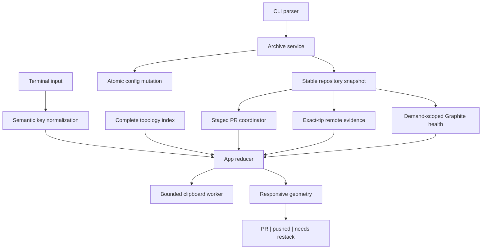
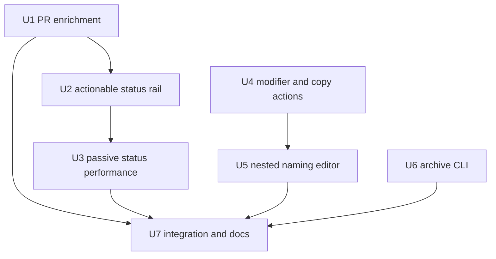

# feat: Make Stackmap agent-friendly and status-efficient

## Overview

Make Stackmap easier to operate with coding agents while reducing the optional
status work that currently makes large repositories feel sluggish.

| Surface | Intended outcome |
|---|---|
| Archive CLI | An agent can safely dry-run and archive explicit old branches without driving the TUI or changing Git. |
| Copy shortcuts | The user can copy one branch, the active visual section, or the complete real stack as deterministic agent context. |
| Section naming | Every nested visual section can be named or renamed from any branch inside its indent. |
| Main-row status | PR and exact-tip pushed evidence receive priority; Graphite appears only when a branch needs restacking. |
| Optional status work | Remote and Graphite checks stop running snapshot-wide; hidden status columns reclaim width and suspend lower-priority work. |
| GitHub PR enrichment | Large repositories load useful PR evidence incrementally instead of timing out on a capped full-history scan. |

This is a deep plan because it changes a public CLI contract, TUI key semantics,
topology-derived copy/name behavior, three asynchronous enrichment paths, and
responsive row geometry. Implementation must preserve the valuable in-progress
Graphite action work already present in the dirty worktree.

---

## Problem Frame

Stackmap currently exposes branch archive only through interactive keys, so an
agent cannot perform the normal reversible cleanup workflow without driving a
terminal UI. The TUI also lacks a concise way to copy the exact branch context a
user wants to hand to an agent.

Visual-section interaction is inconsistent: color commands target the deepest
effective section from anywhere inside an indent, but naming checks only the
exact boundary branch. Modifier information is discarded for character keys,
so Command-based copy chords collide with `c`/`C`, and the terminal's Ctrl-U
encoding for Shift-Backspace becomes printable `u` inside the editor.

The blank PR column has a confirmed transport cause. Stackmap runs one
`gh pr list --state all --limit 1000` process with a three-second timeout. The
same read-only query in the FactMachine repository took about fifteen seconds
and returned exactly 1,000 results. Stackmap therefore times out before applying
any results, and even an uncapped timeout would retain a 1,000-result coverage
ceiling. The row currently renders the same empty-looking state for "no PR" and
"GitHub lookup failed," hiding the distinction visible only in Help.

Status enrichment also does more work than the primary workflow needs. Every
structural snapshot schedules up to 512 Graphite ancestry checks, while remote
enrichment may run a separate patch-equivalence Git command for every raw
diverged branch. The user primarily needs three actionable answers: whether a PR
exists and its lifecycle, whether the exact local tip is pushed, and whether
Graphite needs restacking.

---

## Requirements Trace

- R1. Add the unambiguous command
  `stackmap archive [--repo PATH] [--dry-run] BRANCH...` without changing legacy
  `stackmap [--current] [REPOSITORY]` TUI behavior.
- R2. Archive is a reversible repository-local config mutation only. It never
  changes Git refs, Graphite metadata, worktrees, remotes, or pull requests.
- R3. Archive validates and deduplicates the complete batch before one atomic
  write. Missing branches, the current branch, configured/local trunks,
  malformed config, unsafe topology evidence, or source-token drift observed
  through the final stable pre-transaction validation refuse the whole batch
  with no partial persistence. Because Stackmap does not lock Git refs, a
  current/trunk change after that validation remains possible and is handled by
  the existing TUI reconciliation/pruning invariant.
- R4. `--dry-run` performs the same discovery and validation, reports each
  target deterministically, and creates or modifies no config file. Already
  archived valid targets are idempotent success.
- R5. Command+C copies the selected branch ID. Command+Shift+C copies the
  deepest active visual section's authoritative anchor-to-tip suffix, including
  nested subsections. Command+Option+Shift+C copies the complete real topology
  group, excluding trunks and child/side stacks.
- R6. Multi-branch clipboard output is newline-delimited, deterministic
  base-to-tip, captured at keypress time, and independent of filter, focus,
  archive visibility, or later refresh.
- R7. Modifier-aware copy keys never trigger plain `c`/`C` color actions,
  Ctrl-C remains quit, and overlapping async open/copy actions remain visibly
  bounded by the existing single-flight platform slot.
- R8. Pressing `n` on any branch inside a visual indent opens the deepest active
  section's editor whether its label is missing or already named. Outside a
  visual section it edits the real stack name. Enter on a selected label remains
  supported.
- R9. Shift-Backspace and the terminal Ctrl-U equivalent clear the complete
  name draft without persisting until Enter. Plain Backspace, Delete, cursor
  movement, Unicode editing, Escape restoration, and the name length bound are
  unchanged.
- R10. Lowercase `s` hides or shows all right-side status geometry and reclaims
  its gutters. Uppercase `S` retains the existing stack-separator toggle.
- R11. PR enrichment continues while status columns are hidden because `o` and
  `y` consume it. Hiding status cancels/suppresses lower-priority remote and
  Graphite enrichment without clearing last-known evidence; showing status
  schedules one bounded refresh.
- R12. GitHub lookup uses a bounded staged strategy rather than scanning the
  repository's entire PR history: a fast open-PR sweep followed by serialized,
  cached exact-head and/or exact-OID lookups for unresolved relevant branches.
- R13. PR matching keeps exact branch plus head OID as highest priority, then a
  deterministic same-name stale match. Open, approved, merged, and closed
  lifecycle states remain visible; stale matches retain `~` and never prove the
  current tip pushed, merged, or deletion-safe.
- R14. PR state distinguishes not requested, checking, confirmed no match,
  ready, and unavailable. Partial and failed results merge without clearing
  last-known PRs; delayed old-generation or old-OID results are rejected.
- R15. Main rows prioritize PR first, exact-tip pushed second, and actionable
  `needs restack` third. Checking, healthy, not-tracked, and unavailable
  Graphite states are blank in the row but remain explicit in details/provider
  diagnostics. No-match and provider failure must remain distinguishable.
- R16. "Pushed" requires exact tip equality from a configured upstream,
  locally known remote tip, or exact GitHub PR head OID. Commit containment,
  stale PRs, and raw ahead/behind arithmetic do not qualify. Raw
  ahead/behind/diverged/gone evidence remains available in details.
- R17. Automatic patch-equivalence classification leaves the hot path.
  Graphite ancestry checks are cached by immutable parent/tip pair and limited
  to current/changed or explicitly demanded stacks; scroll, filter, archive,
  and ordinary cursor movement launch no provider subprocesses.
- R18. All new work remains bounded, cancellable, no-fetch, non-wrapping at the
  40-column minimum, compatible with Rust 1.88, and independently degradable.

---

## Scope Boundaries

- No automatic selection of "old" branches by age; the invoking agent supplies
  exact branch names after its own review.
- No restore CLI in this delivery. Restore remains available through Archive
  view and `x`; a symmetric command can follow if real agent usage warrants it.
- No Git fetch, push, force-push, ref deletion, remote deletion, PR mutation, or
  direct Graphite metadata write.
- No claim that local remote-tracking evidence is current server truth.
- No use of pushed, PR, merged, or restack status to relax existing deletion or
  Graphite mutation guards.
- No unbounded per-branch GitHub fan-out, full-history polling loop, or
  snapshot-wide Graphite retry loop.
- No clipboard payload decoration, prose, or inferred task description; copied
  content is exact branch IDs only.
- No replacement of the detail sidebar's diagnostic evidence. The main row is
  simplified; details remain explicit.

---

## Context & Research

### Relevant Code and Patterns

- `src/main.rs` owns the hand-written `OsString` CLI parser and dispatches
  meta/actions before terminal setup. Archive should exit through this seam
  without starting TUI refresh workers.
- `src/config.rs` already provides the bounded cross-process lock,
  latest-on-disk merge, validation, synced temporary file, and atomic rename
  needed for one batch archive mutation.
- `src/app.rs` contains the authoritative current/trunk archive refusal,
  effective-section color targeting, name editor, status request flags, and
  generation/OID guards.
- `src/model/topology.rs` computes complete real topology groups and cumulative
  visual-section membership before filter/archive/focus projection. Narrow
  query helpers should expose copy scopes instead of reconstructing them from
  visible rows.
- `src/events.rs` currently drops modifiers for character/backspace events;
  semantic copy and clear-draft keys must be resolved before generic character
  handling.
- `src/adapters/platform.rs` and the platform worker in `src/main.rs` provide
  bounded asynchronous clipboard behavior that can be generalized beyond PR
  URLs.
- `src/adapters/github.rs` currently performs the capped global PR scan.
  `src/refresh/upstream.rs` and `src/refresh/graphite_health.rs` provide useful
  one-active/latest-request, bounded cache, cancellation, and result-queue
  patterns for a dedicated PR coordinator.
- `src/ui/layout.rs`, `src/ui/tree.rs`, `src/ui/tree/details.rs`, and
  `src/ui/panels.rs` jointly own responsive status geometry, row semantics,
  diagnostics, and key help.

### Institutional Learnings

- Archive is intentionally name-keyed, reversible, repository-local
  presentation state. It must preserve current/trunk protections and merge with
  concurrent color/name/section writes.
- Visual-section membership comes from complete topology before visibility
  projection. Branch-only actions must not accidentally treat a semantic label
  as an ordinary branch selection.
- Enhanced keyboard reporting exists, but terminals may intercept or translate
  modifiers. Input normalization requires exact event tests plus a real
  Terminal.app PTY characterization.
- Git, Graphite, GitHub, platform, and config failures remain typed and
  independent. Optional-provider failure must never hide local branches or
  block normal navigation.
- Passive monitoring has an established 0%-settled-CPU/no-index-lock target.
  Rendering and navigation must never spawn provider work directly.
- The earlier read-only agent-status plans deferred mutation. This explicit
  request deliberately supersedes that boundary only for reversible local
  archive config, with dry-run and optimistic source-token revalidation.

### External References

- GitHub CLI documents that `gh pr list --limit` is a maximum result count and
  that `--head` accepts a branch but not `owner:branch`:
  https://cli.github.com/manual/gh_pr_list
- GitHub recommends filtering pull requests by exact `head=OWNER:BRANCH`, using
  conditional requests/caching, serializing requests, and avoiding unnecessary
  polling:
  https://docs.github.com/en/rest/using-the-rest-api/best-practices-for-using-the-rest-api
- GitHub's pulls endpoint supports exact head filtering and pagination:
  https://docs.github.com/en/rest/pulls/pulls#list-pull-requests
- GitHub's commit endpoint can return PRs associated with an exact commit SHA:
  https://docs.github.com/en/rest/commits/commits#list-pull-requests-associated-with-a-commit
- GitHub API pagination and rate-limit behavior constrain batch size, request
  serialization, and retry/backoff:
  https://docs.github.com/en/rest/using-the-rest-api/using-pagination-in-the-rest-api
  and https://docs.github.com/en/rest/using-the-rest-api/rate-limits-for-the-rest-api

---

## Key Technical Decisions

| Decision | Rationale |
|---|---|
| Treat `archive` as a top-level command with `--repo` | It is concise for agents and unambiguous inside command mode. A repository path literally named `archive` remains accessible through legacy option termination, documented and tested. |
| Extract an archive service behind the narrow runtime seam | The binary should not duplicate config/topology/current/trunk rules or mutate config directly. |
| Use whole-batch optimistic validation plus one config mutation | Archive is reversible but must not partially apply or race knowingly against changed current/trunk state. |
| Derive copy scopes from complete topology | Filtered or archived rows are a presentation, not the authoritative definition of a section or real stack. |
| Add semantic modifier keys at the event boundary | This prevents Command chords from falling through to color actions and prevents Ctrl-U text injection. |
| Replace global PR history scan with staged lookup and target states | A larger timeout alone still loses PRs beyond the 1,000-result cap and makes failures indistinguishable from no match. |
| Keep PR enrichment alive when status is hidden | PR data powers `o`/`y`; hiding presentation should only suspend lower-priority remote/Graphite work. |
| Make pushed an exact-tip predicate | Reachability, stale PRs, and raw divergence do not prove that the current branch tip exists remotely. |
| Render only actionable Graphite health | Healthy/checking/not-tracked noise consumes width and subprocess work without changing the user's next action. |
| Make Graphite checks demand-scoped, not cursor-scoped | Current/changed pairs and explicit `R`/`r`/`m`/detail demand provide useful evidence without turning navigation into Git work. |

---

## Open Questions

### Resolved During Planning

- **What does section copy include?** The selected branch's deepest active
  visual section, from its anchor through the real group tip, including deeper
  nested sections.
- **What does full-stack copy include?** The selected real topology group's own
  branches only, base-to-tip; no trunk and no child/side groups.
- **What happens on semantic labels?** Branch copy uses the label's anchor
  branch; section and stack copy use the label's represented identity.
- **Does Shift-Backspace remove one character or the full draft?** It clears the
  complete draft, matching the explicit request; Ctrl-U is normalized to the
  same editor-only action.
- **What stays active when status is hidden?** PR enrichment remains active for
  `o`/`y`; remote and Graphite workers cancel/suspend and preserve cache.
- **How is unavailable PR evidence shown?** The PR field uses a non-color `…`
  while checking and `?` when unavailable; `—` is reserved for a confirmed
  successful no-match. Details provide the reason.
- **Does a stale PR prove pushed?** No. Only exact local-tip equality qualifies.

### Deferred to Implementation

- **Exact GitHub batch size and TTL values:** Choose from measured FactMachine
  latency/rate behavior while retaining hard request, queue, output, and total
  sweep budgets.
- **Head-owner candidate ordering for fork PRs:** Resolve from repository and
  configured remote ownership, with exact commit-associated PR lookup as the
  fallback. Final helper boundaries depend on the current `gh` response shape.
- **Whether to retain the internal `ConfiguredUpstream::Rewritten` variant:** It
  may remain for compatibility/detail history even after automatic
  patch-equivalence classification leaves the hot path.
- **Exact PTY bytes for the user's terminal's Shift-Backspace chord:** Capture
  during implementation and map alongside the already understood Ctrl-U form.

---

## High-Level Technical Design

> *This illustrates the intended approach and is directional guidance for
> review, not implementation specification. The implementing agent should treat
> it as context, not code to reproduce.*

The enrichment coordinators publish scoped deltas keyed by repository
generation, branch ID, and local OID. The reducer merges applicable deltas and
preserves last-known evidence on partial or failed work. Rendering consumes
only in-memory state.

---

## Implementation Units

- [x] U1. **Replace the capped PR scan with staged, retained enrichment**

**Goal:** Make PR lifecycle evidence load reliably in large repositories while
distinguishing no match from unavailable data and retaining useful cached
results through partial failures.

**Requirements:** R12, R13, R14, R18

**Dependencies:** None

**Files:**
- Modify: `src/adapters/github.rs`
- Modify: `src/refresh/mod.rs`
- Create or modify: `src/refresh/github.rs`
- Modify: `src/model/branch.rs`
- Modify: `src/app.rs`
- Modify: `src/app/state.rs`
- Modify: `src/main.rs`
- Modify: `src/ui/tree.rs`
- Modify: `src/ui/tree/details.rs`
- Modify: `src/ui/panels.rs`
- Test: `src/integration_tests/github_enrichment.rs`
- Test: `src/integration_tests/refresh_pipeline.rs`

**Approach:**
- Add a bounded latest-request PR coordinator/cache rather than launching an
  ad-hoc global thread after every eligible structural event.
- Stage a repository-wide open-PR fast path, then serialize targeted historical
  lookups for unresolved relevant branches. Prefer exact head owner/name when
  known and exact commit-associated PR lookup when owner/ref evidence is
  missing or deleted.
- Invoke targeted REST lookups through fixed `gh api --method GET` argv with
  owner, branch, OID, pagination, and output bounds supplied as separate
  arguments. Never interpolate provider data into a shell command or let a
  branch name change HTTP method or option parsing.
- Prioritize current/selected stack targets before remaining branches, coalesce
  duplicates, cap queued targets/pages/output/total sweep time, and respect
  GitHub rate-limit/backoff responses.
- Model per-branch lookup state so not requested, checking, confirmed no match,
  ready, and unavailable are distinct in state, row/detail rendering, and
  provider diagnostics. Treat a response at its configured result limit as
  partial, never as proof of absence.
- Merge scoped deltas. Clear or establish no-match only after successful
  coverage of that exact branch/name/OID target. For fork candidates, no-match
  requires exhausting every authoritative owner/name candidate derived from
  repository/remotes plus a successful exact-current-OID lookup; incomplete
  owner coverage remains not requested or unavailable. Preserve cached PRs on
  timeout, nonzero exit, malformed output, saturation, or partial completion.
- Keep exact head OID matching first, followed by deterministic newest
  same-name stale matching with existing lifecycle and `~` semantics. Specify a
  total tie-break for multiple exact matches: exact current OID, lifecycle
  priority, newest `updatedAt`, then PR number, so provider response order never
  changes the selected PR.

**Execution note:** Begin with characterization tests that reproduce the
three-second timeout/1,000-result saturation and current destructive clearing
behavior before replacing the provider path.

**Patterns to follow:**
- Latest-request/cancellation/cache/result bounds in
  `src/refresh/upstream.rs` and `src/refresh/graphite_health.rs`.
- Branch-ID plus OID guards and immutable snapshot replacement in `src/app.rs`.
- Typed provider errors in `src/adapters/github.rs`.

**Test scenarios:**
- Happy path: an open or approved PR from the fast sweep appears on the matching
  local branch and remains available to `o`/`y`.
- Happy path: a merged or closed PR absent from the open sweep is found by the
  targeted fallback and retains its lifecycle/number.
- Matching: an exact OID PR wins over a newer same-name historical PR; without
  an exact match, the deterministic newest same-name PR renders stale `~`.
- Matching: permuting multiple exact-match responses produces the same selected
  PR under the documented total tie-break.
- Edge case: a PR with a deleted head ref or unavailable head OID can be shown
  only as explicitly stale.
- Coverage: a result count equal to a configured limit is marked partial and
  does not establish no-match for omitted targets.
- Failure: timeout, nonzero exit, malformed JSON, truncation, rate limiting, and
  partial batches preserve last-known PRs and expose unavailable state.
- Race: delayed results for an old generation or old local OID do not overwrite
  newer evidence.
- Cache: positive, negative, and error entries obey bounds/TTLs; repeated
  structural snapshots do not restart a complete sweep.
- Integration: a repository with more than 1,000 historical PRs can resolve
  current/selected branches without scanning the full history.
- Contract: hostile branch names remain separate encoded GET parameters and
  cannot introduce flags, shell syntax, or a mutating HTTP method.

**Verification:**
- FactMachine rows with known PRs populate without a full-history timeout.
- The PR rail shows `…`, `?`, `—`, or lifecycle evidence truthfully.
- UI drawing and local branch inventory remain responsive while GitHub is slow
  or unavailable.

---

- [x] U2. **Reframe the main status rail around actionable evidence**

**Goal:** Prioritize PR, exact-tip pushed, and needs-restack evidence while
allowing the user to reclaim all status width with lowercase `s`.

**Requirements:** R10, R11, R15, R16, R18

**Dependencies:** U1

**Files:**
- Modify: `src/app.rs`
- Modify: `src/app/state.rs`
- Modify: `src/ui/layout.rs`
- Modify: `src/ui/tree.rs`
- Modify: `src/ui/tree/details.rs`
- Modify: `src/ui/panels.rs`
- Test: `src/integration_tests/tui_rendering.rs`
- Test: `src/integration_tests/navigation_checkout.rs`

**Approach:**
- Add session-only status visibility, default on. Lowercase `s` toggles the
  status rail; uppercase `S` toggles separator rows.
- When hidden, return no remote/PR/Graphite ranges from geometry and reclaim all
  related widths and gutters instead of painting spaces.
- Order visible status as PR, pushed, then restack. Reserve Graphite row space
  only for actionable needs-restack evidence; healthy/checking/not-tracked and
  unavailable remain blank with detail diagnostics.
- Define pushed as exact-tip equality from configured upstream, exact local
  remote tip, or exact PR head OID. Keep stale PR and raw containment from
  satisfying the predicate.
- Retain raw ahead/behind/diverged/gone/provider health in the detail sidebar
  without allowing it to dominate the main row.
- Update footer/help text and messages so `s`/`S` behavior and hidden status are
  discoverable without color.

**Patterns to follow:**
- Width-mode geometry and minimum-name calculations in `src/ui/layout.rs`.
- Existing non-color status tokens and detail disclosure in `src/ui/tree.rs`
  and `src/ui/tree/details.rs`.

**Test scenarios:**
- Geometry: hiding status removes every status range/gutter and expands branch
  width at 40, 99, 100, 120, and wide-detail layouts without wrapping.
- Key behavior: `s` changes only status visibility; `S` changes only separator
  projection.
- Rendering: PR lifecycle appears before pushed; only NeedsRestack produces a
  Graphite row badge; all other Graphite states remain explicit in details.
- Truth: configured-upstream equality and exact remote-tip equality render
  pushed; ancestor containment, stale PR, ahead, behind, and diverged do not.
- Provider states: checking and unavailable PR evidence remain visibly distinct
  from a successful no-match with and without `NO_COLOR`.
- Integration: `o`/`y` continue using retained PR data while status is hidden.

**Verification:**
- The screenshot's ambiguous `— ·` state is replaced by truthful PR provider
  state and actionable-only Graphite output.
- Hiding the rail materially returns width to branch names at every supported
  mode.

---

- [x] U3. **Remove non-actionable remote and Graphite work from the hot path**

**Goal:** Eliminate snapshot-wide retry churn while preserving exact pushed and
needs-restack evidence where it changes the user's next action.

**Requirements:** R11, R15, R16, R17, R18

**Dependencies:** U2

**Files:**
- Modify: `src/adapters/git.rs`
- Modify: `src/refresh/builder.rs`
- Modify: `src/refresh/mod.rs`
- Modify: `src/refresh/upstream.rs`
- Modify: `src/refresh/graphite_health.rs`
- Modify: `src/app.rs`
- Modify: `src/model/branch.rs`
- Test: `src/integration_tests/refresh_pipeline.rs`
- Test: `src/integration_tests/repository_snapshot.rs`
- Test: `src/integration_tests/terminal_interaction.rs`

**Approach:**
- Replace remote commit-containment classification with one bounded exact
  remote-tip OID map when status is visible. Keep configured-upstream facts from
  structural inventory; remove automatic per-diverged-branch patch-equivalence
  subprocesses.
- Introduce a not-requested Graphite health state so a blank badge does not
  imply an active check.
- Reuse cached immutable parent/tip results. Automatically consider only the
  current stack and parent/tip pairs whose identity changed; allow explicit
  `R`, `r`, `m`, or detail demand to request the selected stack.
- Do not schedule Graphite work from scrolling, filter edits, Archive toggles,
  ordinary cursor movement, or rendering. Do not retry an unchanged unavailable
  pair on every structural generation.
- On status hide, submit cooperative cancel commands and invalidate queued
  revisions. On show, request one bounded refresh without discarding cache.
- Preserve live mutation preflight for restack/move even when presentation
  health is hidden or not requested.

**Execution note:** Keep call-count and bounded-work characterization tests in
place before changing scheduling; wall-clock-only assertions are insufficient.

**Patterns to follow:**
- Immutable OID-pair cache keys and cooperative cancellation in current refresh
  coordinators.
- Passive Git commands with optional locks disabled in `src/adapters/git.rs`.

**Test scenarios:**
- Remote: exact remote-tip equality is found in one bounded batch; mere
  containment does not become pushed; automatic patch-equivalence call count is
  zero.
- Scheduling: initial/current and changed pairs can run; unchanged cached pairs
  do not rerun across generations.
- Demand: explicit reconciliation/action/detail can request a selected stack;
  ordinary scrolling/navigation/filter/archive changes launch no subprocesses.
- Failure: unchanged unavailable pairs do not create a retry storm.
- Cancellation: hiding status prevents additional queued work, preserves
  existing cache, and showing status schedules one bounded request.
- Boundaries: target, worker, cache, result queue, output, and deadline limits
  remain enforced under 500- and 5,000-branch fixtures.
- Integration: settled FactMachine smoke behavior returns to negligible CPU,
  creates no `index.lock`, and leaves no Git/Graphite child after quit.

**Verification:**
- Main navigation and structural refresh remain responsive in a large monorepo.
- Provider work is attributable to initial/current/changed or explicit demand,
  never continuous background rotation.

---

- [x] U4. **Add modifier-aware copy actions over authoritative topology**

**Goal:** Copy exact branch context for agents without colliding with existing
color or quit bindings.

**Requirements:** R5, R6, R7, R18

**Dependencies:** None

**Files:**
- Modify: `src/events.rs`
- Modify: `src/model/topology.rs`
- Modify: `src/model/topology/projection.rs`
- Modify: `src/app.rs`
- Modify: `src/app/state.rs`
- Modify: `src/main.rs`
- Modify: `src/adapters/platform.rs`
- Test: `src/integration_tests/terminal_interaction.rs`
- Test: `src/integration_tests/topology_layout.rs`
- Test: `src/integration_tests/navigation_checkout.rs`

**Approach:**
- Normalize exact Command+C, Command+Shift+C, and
  Command+Option+Shift+C chords into distinct semantic keys before generic
  character mapping. Accept terminals reporting shifted `c` as either case;
  preserve plain `c`, plain `C`, and Ctrl-C.
- Add narrow topology queries for real-group branch order and cumulative
  visual-section anchor-to-tip membership. Do not expose internal group maps or
  reconstruct scope from visible entries.
- Capture the branch-name payload synchronously from the current immutable
  snapshot when the key is pressed, then hand it to the existing async
  clipboard worker.
- Generalize copy action/result messages so branch, section, stack, and PR URL
  copies report accurate labels/counts while sharing one bounded platform slot.
- Treat selected labels as their semantic anchor/identity; nonselectable context
  rows remain ineligible.

**Execution note:** Characterize the three real Terminal.app chords in a PTY
before finalizing normalization fallbacks.

**Patterns to follow:**
- Existing enhanced keyboard flags and navigation modifier tests.
- Named-stack group membership/count semantics in `src/model/topology.rs`.
- Bounded platform subprocess behavior in `src/adapters/platform.rs`.

**Test scenarios:**
- Input: exact modifier combinations map to three copy actions; plain `c`/`C`
  retain color behavior and Ctrl-C remains quit.
- Branch: Command+C copies the selected branch or selected label anchor exactly.
- Section: Command+Shift+C copies the deepest section anchor through group tip,
  including nested subsections, in base-to-tip order.
- Stack: Command+Option+Shift+C copies the complete real group but excludes its
  trunk and child/side groups.
- Visibility: copy output is identical under filter, focused, Active, and
  Archive projections.
- Race: a structural refresh after keypress cannot alter the captured payload.
- Failure: an overlapping copy/open action is rejected visibly; clipboard spawn,
  timeout, nonzero exit, and oversized input remain bounded.
- Feedback: success and rejection messages render the copied scope/count or the
  bounded failure reason without corrupting the tree layout.

**Verification:**
- Each shortcut places exact newline-delimited branch IDs on the clipboard and
  reports the correct scope/count.
- Existing color, PR URL, quit, and navigation bindings remain intact.

---

- [x] U5. **Make every nested visual section independently nameable**

**Goal:** Align naming with effective-section color behavior and fix complete
draft deletion across terminal encodings.

**Requirements:** R8, R9, R18

**Dependencies:** U4

**Files:**
- Modify: `src/events.rs`
- Modify: `src/app.rs`
- Modify: `src/app/state.rs`
- Modify: `src/model/topology.rs`
- Modify: `src/ui/tree.rs`
- Test: `src/integration_tests/navigation_checkout.rs`
- Test: `src/integration_tests/tui_rendering.rs`
- Test: `src/integration_tests/terminal_interaction.rs`
- Test: `src/integration_tests/refresh_pipeline.rs`

**Approach:**
- Resolve `n` from the selected row's deepest effective visual-section anchor,
  falling back to the real stack only outside all visual sections.
- Open existing section/stack names directly rather than requiring the user to
  navigate to the rendered label first. Preserve Enter-on-label as an alternate
  path and keep branch-only mutations disabled on labels.
- Add an editor-only clear-draft semantic key for Shift-Backspace and Ctrl-U.
  Clear the draft and reset its character cursor; Enter persists an empty name
  as label removal, while Escape restores prior state.
- Preserve atomic/coalesced visual-section mutations, refresh revalidation,
  absent-anchor pruning, Unicode cursor safety, and the 80-character bound.

**Patterns to follow:**
- Effective-section targeting already used by color commands in `src/app.rs`.
- Exclusive editor input precedence before global keys and repeat filtering.

**Test scenarios:**
- Naming: `n` from an interior branch of an unnamed section creates that
  section's label; from a named section it opens that section for rename.
- Nesting: branches inside multiple cumulative indents target the deepest
  active anchor, while branches outside sections target the real stack.
- Labels: Enter edits selected stack/section labels and branch-only actions stay
  inert on labels.
- Editing: Shift-Backspace and Ctrl-U clear a Unicode draft at any cursor;
  plain Backspace/Delete still remove one character in the correct direction.
- Lifecycle: Escape after clear/rename restores the persisted name; empty Enter
  removes only that label; refresh invalidation closes an invalid editor safely.
- Persistence: concurrent section rename, color, archive, and stack-name writes
  preserve unrelated config fields.

**Verification:**
- Every nested indentation range can be created, named, renamed, and cleared
  from an ordinary branch row.
- The observed printable `u` failure no longer occurs.

---

- [x] U6. **Add the batch-atomic archive CLI**

**Goal:** Let agents perform explicit reversible cleanup through a safe,
scriptable command without starting the TUI.

**Requirements:** R1, R2, R3, R4, R18

**Dependencies:** None

**Files:**
- Create: `src/commands/archive.rs`
- Create or modify: `src/commands/mod.rs`
- Modify: `src/lib.rs`
- Modify: `src/main.rs`
- Modify: `src/config.rs`
- Modify: `src/refresh/builder.rs`
- Test: `src/main.rs`
- Test: `src/integration_tests/archive_workflow.rs`
- Test: `src/integration_tests/repository_snapshot.rs`

**Approach:**
- Extend the hand parser with archive command mode, `--repo`, `--dry-run`,
  option termination, exact branch arguments, deterministic usage errors, and
  a documented escape for a legacy repository path literally named `archive`.
- Route command execution before terminal/watcher/provider setup into a narrow
  archive service that reuses synchronous stable snapshot and config primitives.
- Deduplicate inputs while preserving first-seen reporting order. Load config
  fail-closed, classify already archived targets as unchanged, and validate all
  targets before constructing one mutation.
- Add a strict locked config transaction for CLI mutation: acquire the existing
  cross-process lock, load the latest config without fallback, validate and
  apply the archive mutation, then atomically save. Keep any TUI recovery
  fallback outside this strict path so malformed or newly corrupted config can
  never be replaced by CLI defaults.
- Refuse non-ready repositories, missing targets, current branch, configured or
  locally represented trunks, globally unreadable topology, or degraded target
  evidence. Ordinary Git-only repositories with definitely-untracked branches
  remain supported.
- Re-read the authoritative source token/current/trunks immediately before
  persistence and abort on drift. Document that this is optimistic safety
  without taking a Git lock; subsequent TUI reconciliation still prunes a
  branch that externally becomes current/trunk after the write.
- Persist one `ConfigMutation` through the existing cross-process lock/merge and
  output deterministic changed/unchanged or dry-run lines. Usage, validation,
  topology, config, and persistence failures are nonzero and explicitly state
  that nothing changed.

**Execution note:** Start with parser and real-Git/config characterization tests
before extracting or extending runtime seams.

**Patterns to follow:**
- Current `v` range archive whole-batch validation in `src/app.rs`.
- Stable inventory retries in `src/refresh/builder.rs`.
- Atomic config mutation and concurrent field merge in `src/config.rs`.

**Test scenarios:**
- Parser: legacy TUI help/version/current/path/`--` behavior remains unchanged;
  archive accepts repo/dry-run/multiple targets and rejects missing targets,
  duplicate/unknown flags, and invalid option placement.
- Happy path: multiple valid branches persist through one mutation in the
  shared common Git directory and appear in Archive view.
- Idempotence: duplicate arguments collapse; already archived targets succeed
  unchanged; mixed unchanged/new targets apply only the new entries atomically.
- Refusal: one missing/current/trunk/degraded target leaves every requested
  branch unchanged.
- Git-only: a repository with no Graphite metadata archives an ordinary branch.
- Dry-run: full validation/reporting occurs without creating a config directory,
  lock, temporary file, or archive entry.
- Config failure: malformed config refuses rather than replacing it with a
  fallback.
- Config race: corruption introduced after discovery but before the locked
  transaction refuses the whole batch without replacing the file.
- Race: current/trunk/source-token drift between initial read and commit refuses
  with no write when observed through final stable pre-transaction validation;
  a post-validation Git-ref race remains subject to reconciliation/pruning.
- Concurrency: a simultaneous unrelated color/name/section mutation is merged,
  not overwritten.
- Safety: Git refs, HEAD, worktrees, Graphite files, remotes, and PRs are byte/
  OID unchanged after success and failure.

**Verification:**
- An agent can dry-run, review, and archive an explicit batch with deterministic
  output and no TUI process.
- Archive state is identical to the existing TUI's repository-local format and
  can be restored with Archive view `x`.

---

- [x] U7. **Integrate, document, and characterize the complete workflow**

**Goal:** Land the cross-cutting behavior without regressing the dirty Graphite
action work, terminal support, minimum layout, or release guarantees.

**Requirements:** R1-R18

**Dependencies:** U1, U2, U3, U4, U5, U6

**Files:**
- Modify: `README.md`
- Modify: `docs/features.md`
- Modify: `docs/support.md`
- Modify: `docs/invariants.md`
- Modify: `memory.md`
- Modify: `changelog.md`
- Test: `src/integration_tests/github_enrichment.rs`
- Test: `src/integration_tests/refresh_pipeline.rs`
- Test: `src/integration_tests/terminal_interaction.rs`
- Test: `src/integration_tests/tui_rendering.rs`
- Test: `src/integration_tests/archive_workflow.rs`

**Approach:**
- Update command grammar, archive safety/output, all key bindings, copy payload
  semantics, nested naming, PR provider states, exact pushed definition, status
  visibility, and demand-scoped Graphite behavior in user/support docs.
- Preserve all unrelated dirty-worktree changes; review only the new diff slices
  for accidental overwrite of Graphite restack/move and linked-worktree work.
- Run a code-simplifier review limited to newly generated code after behavior is
  covered, then verify functionality remains unchanged.
- Characterize real FactMachine PR resolution, settled CPU/child processes,
  no-index-lock behavior, and Terminal.app modifier input in addition to the
  automated suite.

**Test scenarios:**
- End-to-end: known FactMachine branches show PR lifecycle, exact pushed state,
  and only actionable restack warnings while remaining navigable during slow
  GitHub responses.
- Cross-feature: PR lookup remains live while status is hidden; archived or
  filtered branch evidence remains cached; authoritative section/stack copy
  still includes hidden members.
- Cross-writer: TUI and CLI archive/name/color/section persistence do not clobber
  one another or active Graphite-action config state.
- Terminal: real Command copy chords and Shift-Backspace/Ctrl-U behave as
  documented; portable existing navigation fallbacks remain intact.
- Responsive layout: 40/64/90/120/180-column fixtures do not wrap, and
  `NO_COLOR` retains every meaningful state distinction.
- Release: formatting, strict all-target/all-feature lint, complete tests,
  doctests, benchmarks, offline release build, and packaged smoke behavior all
  remain green on Rust 1.88.

**Verification:**
- Automated and manual evidence demonstrates the requested workflow in the
  representative large repository and terminal.
- `memory.md` and `changelog.md` capture final behavior, test evidence, and any
  corrected assumptions with `[LEARN]` where appropriate.

---

## System-Wide Impact

- **Interaction graph:** CLI parsing gains a non-TUI path into snapshot/config
  services; TUI input gains semantic modifier actions; topology supplies copy
  and naming scope; three enrichment coordinators publish reducer deltas;
  geometry/rendering consumes the simplified evidence policy.
- **Error propagation:** Archive errors terminate the command before persistence.
  GitHub/remote/Graphite/platform errors remain typed optional-provider state
  and never hide local topology or block navigation.
- **State lifecycle risks:** Scoped PR results must not clear unrelated cache;
  status hide/show must cancel revisions without losing evidence; source-token
  drift must abort CLI archive; clipboard payloads must not follow later
  selection changes.
- **API surface parity:** Help, README, support docs, TUI footer, event decoding,
  action/result messages, CLI usage, and the installed release binary must
  describe the same command/key contracts.
- **Integration coverage:** Real Git/common-dir persistence, real `gh` latency,
  terminal modifier delivery, large-topology provider bounds, and concurrent
  TUI/CLI config writes cannot be proven by isolated unit tests alone.
- **Unchanged invariants:** Git refs remain authoritative; Graphite remains the
  mutation authority for restack/move; archive remains reversible config;
  deletion stays uppercase/exact/local/non-force; no fetch occurs; queues,
  caches, subprocess output, deadlines, and rendering remain bounded.

---

## Alternative Approaches Considered

- **Raise the global PR timeout and result limit:** Rejected as the durable fix.
  It would make the observed query complete but still scans irrelevant history,
  remains saturation-prone, and delays all evidence behind one response.
- **Run one PR request for every local branch concurrently:** Rejected because it
  creates rate-limit/secondary-limit pressure and unbounded large-repo fan-out.
  Staged, prioritized, serial, cached lookup gives earlier useful results.
- **Keep snapshot-wide Graphite health but hide healthy dots:** Rejected because
  it reduces visual noise without addressing the subprocess lag.
- **Infer pushed from remote containment or any PR:** Rejected because an
  ancestor or stale PR does not prove the exact local tip exists remotely.
- **Build copy lists from currently visible rows:** Rejected because filter,
  focus, archive, and context projection would silently omit authoritative
  section/stack members.
- **Write archive config directly from `main.rs`:** Rejected because it would
  duplicate safety rules and risk bypassing concurrent merge/validation logic.

---

## Success Metrics

- Known open/approved/merged/closed PRs for current FactMachine branches appear
  without a three-second global timeout or 1,000-result history blind spot.
- A GitHub failure is distinguishable from confirmed no PR in the main row and
  details, while last-known evidence remains usable.
- Settled Stackmap CPU returns to negligible levels and optional status work
  leaves no continuing Git/Graphite child-process churn.
- Status hiding reclaims measurable branch-name width and suspends remote/
  Graphite work without breaking PR open/copy.
- All three copy shortcuts produce exact deterministic payloads in the real
  terminal, and every nested visual section can be renamed.
- Archive dry-run and batch application are deterministic, whole-batch safe,
  config-only, and compatible with concurrent TUI writes.

---

## Implementation Sequence

### Sequence 1 — Restore trustworthy, responsive status

- U1, U2, and U3: fix PR coverage/retention, simplify the rail, and remove
  non-actionable provider churn first because this addresses the visible bug
  and lag independently of the new agent controls.

### Sequence 2 — Add agent handoff ergonomics

- U4 and U5: establish semantic modifier input, authoritative copy scopes, and
  consistent nested naming.

### Sequence 3 — Add reversible agent mutation and release proof

- U6 and U7: land archive CLI safety, integrate documentation, simplify only
  new code, and complete real-repository/terminal/release verification.

---

## Risks & Dependencies

| Risk | Mitigation |
|---|---|
| Top-level `archive` steals a legacy repository path token | Preserve and document legacy `--` path disambiguation; add parser compatibility tests. |
| Branch becomes current/trunk around CLI persistence | Stable snapshot plus immediate source-token/current/trunk revalidation; whole-batch abort on drift; retain TUI pruning as last defense. |
| Malformed config gets overwritten | CLI loads fail-closed and uses no fallback for mutation. |
| Targeted PR lookup still fans out in a huge repository | Fast open sweep, relevance priority, serial bounded queue, cache/TTL, pagination/total budgets, cancellation, and rate-limit backoff. |
| Fork or deleted-head PRs are missed | Use owner-qualified head candidates where known and exact commit-associated PR fallback; retain stale disclosure. |
| Partial provider results erase good evidence | Merge target-scoped deltas and clear only after successful exact coverage. |
| Command copy chords are intercepted or misreported | Enhanced protocol plus exact event tests, Terminal.app PTY characterization, and documented terminal limitations. |
| Copy scope changes under visibility modes | Resolve from complete topology before projection and test filter/focus/archive parity. |
| Shift-Backspace still arrives as terminal-specific text | Normalize Shift-Backspace and Ctrl-U at the event boundary; capture the real sequence during implementation. |
| Hidden status only hides paint while workers keep running | Couple visibility transition to explicit remote/Graphite cancel/resume commands and call-count tests. |
| Needs-restack evidence becomes too stale after scoping | Cache by immutable pair, check changed/current pairs, and provide explicit demand through reconciliation/action/detail paths. |
| Existing dirty Graphite work is overwritten | Implement atop the dirty tree, inspect overlapping diffs per unit, avoid broad rewrites, and verify restack/move suites after every dependent unit. |

---

## Documentation / Operational Notes

- README usage must show dry-run before mutation, exact multi-branch arguments,
  output/exit behavior, repository-path disambiguation, and restore through the
  Archive view.
- Help/footer/support docs must show `s` versus `S`, all Command copy chords,
  section/stack copy scope, editor clear behavior, and terminal modifier caveats.
- Status documentation must define exact pushed evidence, PR target states,
  stale matching, actionable-only Graphite rows, no-fetch limitations, and
  manual/demand-scoped refresh behavior.
- Release notes should call out the deliberate revision of the earlier
  independent full remote/PR/Graphite rail contract and the removed automatic
  patch-equivalence classification.

---

## Sources & References

- Related archive design: `docs/plans/2026-07-19-001-feat-stable-stackmap-workflow-plan.md`
- Related visual-section design: `docs/plans/2026-07-21-001-feat-visual-feature-sections-plan.md`
- Related agent CLI boundary: `docs/plans/2026-07-21-002-feat-agent-status-cli-plan.md`
- Related status design being revised: `docs/plans/2026-07-29-002-feat-graphite-status-and-stack-actions-plan.md`
- Repository constraints and verified behavior: `memory.md`, `changelog.md`, `docs/invariants.md`
- GitHub CLI PR list: https://cli.github.com/manual/gh_pr_list
- GitHub REST best practices: https://docs.github.com/en/rest/using-the-rest-api/best-practices-for-using-the-rest-api
- GitHub pull request listing: https://docs.github.com/en/rest/pulls/pulls#list-pull-requests
- GitHub commit-associated PRs: https://docs.github.com/en/rest/commits/commits#list-pull-requests-associated-with-a-commit
- GitHub REST pagination: https://docs.github.com/en/rest/using-the-rest-api/using-pagination-in-the-rest-api
- GitHub REST rate limits: https://docs.github.com/en/rest/using-the-rest-api/rate-limits-for-the-rest-api
